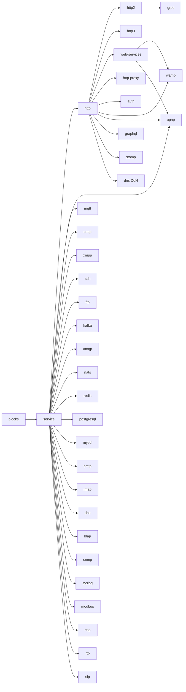

# Lego Flow — Composable Data Processing Framework

[](https://www.oracle.com/java/)
[](https://maven.apache.org/)
[](LICENSE)
[]()
[]()

A composable data processing framework for Java built on JDK 25, providing layered abstractions from low-level data blocks to high-level protocol implementations.

## Table of Contents

- [Architecture](#architecture)
- [Modules](#modules)
- [JDK 25 Features](#jdk-25-features)
- [Dual API Design](#dual-api-design)
- [Quick Start](#quick-start)
- [Building & Running](#building-and-running)
- [Testing](#testing)
- [Documentation](#documentation)
- [Roadmap](#roadmap)
- [License](#license)
- [Authors](#authors)

---

<a id="architecture"></a>
## Architecture

```mermaid
graph TD
    subgraph "Web Protocols (web/)"
        ws["web-services"]
        http["http<br/><small>RFC 2616, SSL, WebSocket</small>"]
        http2["http2<br/><small>RFC 9113, HPACK</small>"]
        http3["http3<br/><small>RFC 9114, QUIC, QPACK</small>"]
        proxy["http-proxy<br/><small>forward/reverse/caching</small>"]
        auth["auth<br/><small>Basic, Digest, OAuth, SSO, SPNEGO</small>"]
    end

    subgraph "Messaging (messaging/)"
        wamp["wamp<br/><small>WAMP: RPC + Pub/Sub</small>"]
        mqtt["mqtt<br/><small>MQTT v3.1.1/v5.0</small>"]
        xmpp["xmpp<br/><small>XMPP RFC 6120/6121</small>"]
        kafka["kafka<br/><small>Apache Kafka</small>"]
        amqp["amqp<br/><small>AMQP 1.0</small>"]
        stomp["stomp<br/><small>STOMP 1.2</small>"]
        nats["nats<br/><small>NATS + JetStream</small>"]
    end

    subgraph "RPC (rpc/)"
        grpc["grpc<br/><small>HTTP/2 + protobuf</small>"]
        graphql["graphql<br/><small>Query language</small>"]
    end

    subgraph "Database (database/)"
        redis["redis<br/><small>RESP2/RESP3</small>"]
        postgresql["postgresql<br/><small>v3 wire protocol</small>"]
        mysql["mysql<br/><small>client/server</small>"]
    end

    subgraph "Email (email/)"
        smtp["smtp<br/><small>RFC 5321</small>"]
        imap["imap<br/><small>IMAP4rev2</small>"]
    end

    subgraph "Network (network/)"
        dns["dns<br/><small>RFC 1034/1035 + DNSSEC</small>"]
        ldap["ldap<br/><small>LDAP v3</small>"]
        snmp["snmp<br/><small>SNMP v3</small>"]
        syslog["syslog<br/><small>RFC 5424</small>"]
        modbus["modbus<br/><small>Modbus TCP</small>"]
        ssh["ssh<br/><small>SSH-2 RFC 4251-4256</small>"]
        ftp["ftp<br/><small>FTP/FTPS RFC 959</small>"]
    end

    subgraph "IoT (iot/)"
        upnp["upnp<br/><small>UPnP/DLNA</small>"]
        coap["coap<br/><small>CoAP RFC 7252</small>"]
    end

    subgraph "Media (media/)"
        rtsp["rtsp<br/><small>RTSP 2.0</small>"]
        rtp["rtp<br/><small>RTP/RTCP</small>"]
        sip["sip<br/><small>SIP RFC 3261</small>"]
    end

    subgraph "Service Layer"
        service["service<br/><small>lifecycle, scopes, users, roles, channels, UDP</small>"]
    end

    subgraph "Foundation"
        blocks["blocks<br/><small>DP&lt;I,O&gt;, DF&lt;T&gt;, Context, State, Statistics</small>"]
    end

    wamp --> ws
    wamp --> http
    upnp --> ws
    upnp --> http
    ws --> http
    http2 --> http
    http3 --> http
    proxy --> http
    auth --> http
    grpc --> http2
    graphql --> http
    stomp --> http
    dns --> http
    http --> service
    mqtt --> service
    coap --> service
    xmpp --> service
    ssh --> service
    ftp --> service
    service --> blocks
```



### Dependency Graph



---

<a id="modules"></a>
## Modules

| Category | Module | Artifact | Description |
|----------|--------|----------|-------------|
| **core** | blocks | lego-flow-blocks | Core data processing: `DP<I,O>` processors, `DF<T>` filters, Context, State, Statistics |
| **core** | service | lego-flow-service | Service-oriented framework: lifecycle, scoped contexts, users/roles, channel management |
| **web** | http | lego-flow-http | HTTP/1.1 (RFC 2616): pluggable features, SSL/HSTS, WebSocket, response caching, static content |
| **web** | http2 | lego-flow-http2 | HTTP/2 (RFC 9113): binary framing, HPACK, stream multiplexing, flow control, server push |
| **web** | http3 | lego-flow-http3 | HTTP/3 (RFC 9114): QUIC transport (RFC 9000), QPACK compression, 0-RTT, connection migration |
| **web** | web-services | lego-flow-web-services | Web service endpoints: routing, content negotiation, request/response mapping |
| **web** | http-proxy | lego-flow-http-proxy | HTTP forward/reverse/caching proxy (RFC 7230 §5.7): CONNECT, load balancing, health checks |
| **iot** | upnp | lego-flow-upnp | UPnP/DLNA: SSDP discovery, SOAP control, GENA eventing, media server/renderer, control point |
| **iot** | coap | lego-flow-coap | CoAP (RFC 7252): constrained REST, observe (RFC 7641), blockwise transfer (RFC 7959) |
| **auth** | gssapi | lego-flow-gssapi | GSS-API / Kerberos V5 / SPNEGO primitives (RFC 2743, RFC 4178) |
| **auth** | http-auth | lego-flow-http-auth-* | HTTP authentication: core, Basic/Digest, OAuth 2.0/OIDC, SSO/SAML, SPNEGO |
| **messaging** | kafka | lego-flow-kafka | Apache Kafka wire protocol: produce, fetch, consumer groups, exactly-once |
| **messaging** | amqp | lego-flow-amqp | AMQP 1.0 (ISO 19464): frames, sessions, links, delivery semantics |
| **messaging** | stomp | lego-flow-stomp | STOMP 1.2: text messaging over TCP/WebSocket |
| **messaging** | nats | lego-flow-nats | NATS: pub/sub, request/reply, JetStream persistent streaming |
| **messaging** | mqtt | lego-flow-mqtt | MQTT v3.1.1/v5.0: pub/sub, QoS 0/1/2, topic wildcards, broker + client |
| **messaging** | xmpp | lego-flow-xmpp | XMPP (RFC 6120/6121): presence, messaging, roster + IoT extensions |
| **messaging** | wamp | lego-flow-wamp | WAMP: invariant core (RPC + Pub/Sub) + WebSocket adapter |
| **rpc** | grpc | lego-flow-grpc | gRPC: HTTP/2 transport, protobuf wire format, 4 streaming modes |
| **rpc** | graphql | lego-flow-graphql | GraphQL: schema, query/mutation/subscription, validation, introspection |
| **database** | redis | lego-flow-redis | Redis RESP2/RESP3: commands, pub/sub, streams, pipelining, cluster |
| **database** | postgresql | lego-flow-postgresql | PostgreSQL v3: extended query protocol, COPY, LISTEN/NOTIFY |
| **database** | mysql | lego-flow-mysql | MySQL: client/server protocol, prepared statements, auth plugins |
| **email** | smtp | lego-flow-smtp | SMTP (RFC 5321): AUTH, STARTTLS, MIME, pipelining, DSN |
| **email** | imap | lego-flow-imap | IMAP4rev2 (RFC 9051): FETCH, SEARCH, IDLE, CONDSTORE |
| **network** | dns | lego-flow-dns | DNS (RFC 1034/1035): all record types, DNSSEC, DoH, DoT |
| **network** | ldap | lego-flow-ldap | LDAP v3 (RFC 4511): BER codec, search, bind, STARTTLS |
| **network** | snmp | lego-flow-snmp | SNMP v3 (RFC 3411-3418): USM security, traps, bulk operations |
| **network** | syslog | lego-flow-syslog | Syslog (RFC 5424): structured messages, UDP/TCP/TLS transport |
| **network** | modbus | lego-flow-modbus | Modbus TCP: function codes, MBAP framing, client + server |
| **network** | ssh | lego-flow-ssh | SSH-2 (RFC 4251-4256): transport, auth, channels, SFTP, SCP |
| **network** | ftp | lego-flow-ftp | FTP/FTPS (RFC 959, RFC 4217): client + server, TLS |
| **media** | rtsp | lego-flow-rtsp | RTSP 2.0 (RFC 7826): streaming control, SDP negotiation |
| **media** | rtp | lego-flow-rtp | RTP/RTCP (RFC 3550): real-time transport, jitter buffer, SSRC management |
| **media** | sip | lego-flow-sip | SIP (RFC 3261): VoIP signaling, dialog state machine, registration |

---

<a id="jdk-25-features"></a>
## JDK 25 Features

Lego Flow targets JDK 25 and leverages all stable features from JDK 21–25:

| JDK | Feature | Usage in Lego Flow |
|-----|---------|-------------------|
| 21 | **Virtual Threads** (JEP 444) | SelectableChannelManager uses virtual threads for connection/processing pools; all Service thread pools default to virtual threads |
| 21 | **Record Patterns** (JEP 440) | Pattern matching on HttpRequest, WampMessage, Scope records in switch expressions |
| 21 | **Pattern Matching for switch** (JEP 441) | Message type dispatch (WampMessageType switch), HttpMethod routing, ProcessorState transitions |
| 21 | **Sequenced Collections** (JEP 431) | Filter chains (SequencedCollection<DataFilter>), header ordering, service dependency lists |
| 22 | **Unnamed Variables** (JEP 456) | `var _ = ...` in lambda expressions, catch blocks, and pattern matches where value unused |
| 22 | **Statements before super()** (JEP 447) | Validation in AbstractDataProcessor/AbstractService constructors before super() call |
| 23 | **Primitive Types in Patterns** (JEP 455) | Switch over int status codes, byte opcodes in WebSocket frames |
| 23 | **Structured Concurrency** (JEP 480) | ServicesManager.startAll() uses StructuredTaskScope for parallel service startup with dependency ordering |
| 23 | **Scoped Values** (JEP 481) | ServiceContext scope propagation (SiteScope, SessionScope, RequestScope) across virtual threads — replaces ThreadLocal |
| 24 | **Stream Gatherers** (JEP 485) | Custom stream operations for filter chains, statistics aggregation, message routing |
| 24 | **Flexible Constructor Bodies** (JEP 482) | Validation and computation before super() in deep hierarchies (AbstractService, HttpServer) |
| 25 | **Compact Source Files / Module Import** (JEP 494) | `import module java.base;` for cleaner imports across all modules |
| 25 | **Enhanced Pattern Matching** | Exhaustive switch over sealed interfaces (WampMessage, HttpMethod) with compiler-verified completeness |
| 25 | **Stable Foreign Function & Memory API** (JEP 454→) | Potential zero-copy buffer handling in DataProcessor for high-performance I/O |

---

<a id="dual-api-design"></a>
## Dual API Design

Starting from the **service** module upward, all public APIs expose both synchronous and asynchronous variants in procedural and functional styles:

### Sync vs Async (wrapper pattern)
```java
// Procedural sync
service.consume(ctx, data);

// Procedural async (lightweight wrapper, runs on virtual thread)
CompletableFuture<Void> f = asyncService.consume(ctx, data);
```

### Procedural vs Functional (combined in same interfaces)
```java
// Procedural
service.consume(ctx, data);
manager.start("myService");

// Functional (lambda-friendly, composable)
pipeline.map(transform).filter(predicate).forEach(handler);
router.route("/api/users").method(GET).handle(ctx -> respond(ctx));

// Service defined entirely with lambdas
var svc = ServiceBuilder.<String, Integer>create("parser")
    .onConsume((ctx, data) -> Integer.parseInt(data))
    .onSubmit((ctx, num) -> String.valueOf(num))
    .build();
```

---

<a id="quick-start"></a>
## Quick Start

### Prerequisites
- **Java 25+**
- **Maven 3.9+** or **Gradle 9.5+** (wrapper included)

### Build with Maven
```bash
mvn clean install
```

> **Tip:** Use `-T 1C` for parallel builds (one thread per CPU core):
> ```bash
> mvn -T 1C clean install
> ```


### Build Profiles

The project supports Maven profiles for targeted builds. This speeds up development
when you only need to work on specific protocol categories:

```bash
# Build all modules (default)
mvn clean install

# Build only web protocols (HTTP/1.1, HTTP/2, HTTP/3, Web Services, HTTP Proxy)
mvn -Pweb-only clean install

# Build only messaging protocols (Kafka, AMQP, MQTT, STOMP, NATS, XMPP, WAMP)
mvn -Pmessaging-only clean install

# Build only network protocols (DNS, LDAP, SNMP, SSH, FTP, Syslog, Modbus)
mvn -Pnetwork-only clean install

# Build only authentication modules (GSSAPI, HTTP Auth, SSO, SPNEGO, OAuth)
mvn -Pauth-only clean install

# Build only database protocols (PostgreSQL, Redis, MySQL)
mvn -Pdatabase-only clean install

# Minimal build — core blocks and service framework only (fastest)
mvn -Pminimal clean install
```

All profiles include the required `blocks` and `service` dependencies.

### Build with Gradle
```bash
./gradlew build
```

Gradle builds with parallel execution (up to 10 workers) and build caching enabled by default.

### Build a specific module
```bash
# Maven
mvn compile -pl blocks -am

# Gradle
./gradlew :blocks:build
```

---

<a id="building-and-running"></a>
## Building & Running

### Maven
```bash
# Build all modules
mvn clean install

# Parallel build (one thread per CPU core)
mvn -T 1C clean install

# Run all tests
mvn test

# Build specific module with dependencies
mvn compile -pl service -am

# Run tests for a specific module
mvn test -pl blocks
```

### Gradle
```bash
# Build all modules (parallel, up to 10 workers)
./gradlew build

# Run all tests
./gradlew test

# Build specific module
./gradlew :service:build

# Run tests for a specific module
./gradlew :blocks:test
```

---

<a id="testing"></a>
## Testing

Each module includes:
- **Unit tests** for individual components
- **Functional demo tests** exercising real usage patterns from simplest to complex
- **API style tests** covering procedural sync, procedural async, functional sync, functional async

Current test count: **8136** across 42 leaf modules in 9 categories

---

<a id="roadmap"></a>
## Roadmap

- [x] v1.0.0 — Project structure, root POM, documentation framework
- [x] v1.1.0 — blocks module: DP<I,O>, DF<T>, Context, State, Statistics
- [x] v1.2.0 — service module: Service, AsyncService, Scopes, Users, Manager
- [x] v1.3.0 — http module: HTTP/1.1, features, SSL, WebSocket
- [x] v1.4.0 — web-services module: endpoints, content negotiation
- [x] v1.5.0 — wamp module: WAMP core + WebSocket adapter
- [x] v1.6.0 — http2 module: HTTP/2, HPACK, stream multiplexing, server push; service module: UDP transport
- [x] v1.7.0 — http3 module: HTTP/3, QUIC, QPACK
- [x] v1.8.0 — upnp module: UPnP/DLNA, SSDP, SOAP, media server/renderer/control point
- [x] v1.9.0 — IoT protocol modules: MQTT (pub/sub, QoS, broker/client), CoAP (constrained REST, observe, blockwise), XMPP (presence, messaging, IoT extensions)
- [x] v2.0.0 — Protocol add-on modules: 22 new leaf modules (messaging, rpc, database, email, network, media) + module reorganization into 9 categories (web, iot, auth, messaging, rpc, database, email, network, media)

---

<a id="documentation"></a>
## Documentation

> Root documentation: [Code Overview](doc/CODE_OVERVIEW.md) | [Architecture](doc/ARCHITECTURE.md) | [Requirements](doc/REQUIREMENTS.md)

### Module Documentation

#### Core
- **blocks/** — [README](blocks/README.md) | [Code Overview](blocks/doc/CODE_OVERVIEW.md) | [Architecture](blocks/doc/ARCHITECTURE.md) | [Requirements](blocks/doc/REQUIREMENTS.md)
- **service/** — [README](service/README.md) | [Code Overview](service/doc/CODE_OVERVIEW.md) | [Architecture](service/doc/ARCHITECTURE.md) | [Requirements](service/doc/REQUIREMENTS.md)

#### Web (web/)
- **http/** — [README](web/http/README.md) | [Architecture](web/http/doc/ARCHITECTURE.md) | [Requirements](web/http/doc/REQUIREMENTS.md) | [Compliance](web/http/doc/COMPLIANCE.md)
- **http2/** — [README](web/http2/README.md) | [Architecture](web/http2/doc/ARCHITECTURE.md) | [Requirements](web/http2/doc/REQUIREMENTS.md) | [Compliance](web/http2/doc/COMPLIANCE.md)
- **http3/** — [README](web/http3/README.md) | [Architecture](web/http3/doc/ARCHITECTURE.md) | [Requirements](web/http3/doc/REQUIREMENTS.md) | [Compliance](web/http3/doc/COMPLIANCE.md)
- **web-services/** — [README](web/web-services/README.md) | [Architecture](web/web-services/doc/ARCHITECTURE.md) | [Requirements](web/web-services/doc/REQUIREMENTS.md)
- **http-proxy/** — [README](web/http-proxy/README.md) | [Architecture](web/http-proxy/doc/ARCHITECTURE.md) | [Requirements](web/http-proxy/doc/REQUIREMENTS.md) | [Compliance](web/http-proxy/doc/COMPLIANCE.md)

#### IoT (iot/)
- **upnp/** — [README](iot/upnp/README.md) | [Architecture](iot/upnp/doc/ARCHITECTURE.md) | [Requirements](iot/upnp/doc/REQUIREMENTS.md) | [Compliance](iot/upnp/doc/COMPLIANCE.md)
- **coap/** — [README](iot/coap/README.md) | [Architecture](iot/coap/doc/ARCHITECTURE.md) | [Requirements](iot/coap/doc/REQUIREMENTS.md) | [Compliance](iot/coap/doc/COMPLIANCE.md)

#### Auth (auth/)
- **gssapi/** — [README](auth/gssapi/README.md) | [Architecture](auth/gssapi/doc/ARCHITECTURE.md) | [Requirements](auth/gssapi/doc/REQUIREMENTS.md) | [Compliance](auth/gssapi/doc/COMPLIANCE.md)
- **http-auth/**
  - **core/** — [README](auth/http-auth/core/README.md) | [Architecture](auth/http-auth/core/doc/ARCHITECTURE.md) | [Requirements](auth/http-auth/core/doc/REQUIREMENTS.md) | [Compliance](auth/http-auth/core/doc/COMPLIANCE.md)
  - **basic-digest/** — [README](auth/http-auth/basic-digest/README.md) | [Architecture](auth/http-auth/basic-digest/doc/ARCHITECTURE.md) | [Requirements](auth/http-auth/basic-digest/doc/REQUIREMENTS.md) | [Compliance](auth/http-auth/basic-digest/doc/COMPLIANCE.md)
  - **oauth/** — [README](auth/http-auth/oauth/README.md) | [Architecture](auth/http-auth/oauth/doc/ARCHITECTURE.md) | [Requirements](auth/http-auth/oauth/doc/REQUIREMENTS.md) | [Compliance](auth/http-auth/oauth/doc/COMPLIANCE.md)
  - **sso/** — [README](auth/http-auth/sso/README.md) | [Architecture](auth/http-auth/sso/doc/ARCHITECTURE.md) | [Requirements](auth/http-auth/sso/doc/REQUIREMENTS.md) | [Compliance](auth/http-auth/sso/doc/COMPLIANCE.md)
  - **spnego/** — [README](auth/http-auth/spnego/README.md) | [Architecture](auth/http-auth/spnego/doc/ARCHITECTURE.md) | [Requirements](auth/http-auth/spnego/doc/REQUIREMENTS.md) | [Compliance](auth/http-auth/spnego/doc/COMPLIANCE.md)

#### Messaging (messaging/)
- **kafka/** — [README](messaging/kafka/README.md) | [Architecture](messaging/kafka/doc/ARCHITECTURE.md) | [Requirements](messaging/kafka/doc/REQUIREMENTS.md) | [Compliance](messaging/kafka/COMPLIANCE.md)
- **amqp/** — [README](messaging/amqp/README.md) | [Architecture](messaging/amqp/doc/ARCHITECTURE.md) | [Requirements](messaging/amqp/doc/REQUIREMENTS.md)
- **stomp/** — [README](messaging/stomp/README.md) | [Architecture](messaging/stomp/doc/ARCHITECTURE.md) | [Requirements](messaging/stomp/doc/REQUIREMENTS.md) | [Compliance](messaging/stomp/COMPLIANCE.md)
- **nats/** — [README](messaging/nats/README.md) | [Architecture](messaging/nats/doc/ARCHITECTURE.md) | [Requirements](messaging/nats/doc/REQUIREMENTS.md)
- **mqtt/** — [README](messaging/mqtt/README.md) | [Architecture](messaging/mqtt/doc/ARCHITECTURE.md) | [Requirements](messaging/mqtt/doc/REQUIREMENTS.md) | [Compliance](messaging/mqtt/doc/COMPLIANCE.md)
- **xmpp/** — [README](messaging/xmpp/README.md) | [Architecture](messaging/xmpp/doc/ARCHITECTURE.md) | [Requirements](messaging/xmpp/doc/REQUIREMENTS.md) | [Compliance](messaging/xmpp/doc/COMPLIANCE.md)
- **wamp/** — [README](messaging/wamp/README.md) | [Architecture](messaging/wamp/doc/ARCHITECTURE.md) | [Requirements](messaging/wamp/doc/REQUIREMENTS.md) | [Compliance](messaging/wamp/doc/COMPLIANCE.md)

#### RPC (rpc/)
- **grpc/** — [README](rpc/grpc/README.md) | [Architecture](rpc/grpc/doc/ARCHITECTURE.md) | [Requirements](rpc/grpc/doc/REQUIREMENTS.md) | [Compliance](rpc/grpc/COMPLIANCE.md)
- **graphql/** — [README](rpc/graphql/README.md) | [Architecture](rpc/graphql/doc/ARCHITECTURE.md) | [Requirements](rpc/graphql/doc/REQUIREMENTS.md)

#### Database (database/)
- **redis/** — [README](database/redis/README.md) | [Architecture](database/redis/doc/ARCHITECTURE.md) | [Requirements](database/redis/doc/REQUIREMENTS.md)
- **postgresql/** — [README](database/postgresql/README.md) | [Architecture](database/postgresql/doc/ARCHITECTURE.md) | [Requirements](database/postgresql/doc/REQUIREMENTS.md)
- **mysql/** — [README](database/mysql/README.md) | [Architecture](database/mysql/doc/ARCHITECTURE.md) | [Requirements](database/mysql/doc/REQUIREMENTS.md)

#### Email (email/)
- **smtp/** — [README](email/smtp/README.md) | [Architecture](email/smtp/doc/ARCHITECTURE.md) | [Requirements](email/smtp/doc/REQUIREMENTS.md)
- **imap/** — [README](email/imap/README.md) | [Architecture](email/imap/doc/ARCHITECTURE.md) | [Requirements](email/imap/doc/REQUIREMENTS.md)

#### Network (network/)
- **dns/** — [README](network/dns/README.md) | [Architecture](network/dns/doc/ARCHITECTURE.md) | [Requirements](network/dns/doc/REQUIREMENTS.md)
- **ldap/** — [README](network/ldap/README.md) | [Architecture](network/ldap/doc/ARCHITECTURE.md) | [Requirements](network/ldap/doc/REQUIREMENTS.md)
- **snmp/** — [README](network/snmp/README.md) | [Architecture](network/snmp/doc/ARCHITECTURE.md) | [Requirements](network/snmp/doc/REQUIREMENTS.md)
- **syslog/** — [README](network/syslog/README.md) | [Architecture](network/syslog/doc/ARCHITECTURE.md) | [Requirements](network/syslog/doc/REQUIREMENTS.md) | [Compliance](network/syslog/COMPLIANCE.md)
- **modbus/** — [README](network/modbus/README.md) | [Architecture](network/modbus/doc/ARCHITECTURE.md) | [Requirements](network/modbus/doc/REQUIREMENTS.md)
- **ssh/** — [README](network/ssh/README.md) | [Architecture](network/ssh/doc/ARCHITECTURE.md) | [Requirements](network/ssh/doc/REQUIREMENTS.md) | [Compliance](network/ssh/doc/COMPLIANCE.md)
- **ftp/** — [README](network/ftp/README.md) | [Architecture](network/ftp/doc/ARCHITECTURE.md) | [Requirements](network/ftp/doc/REQUIREMENTS.md) | [Compliance](network/ftp/doc/COMPLIANCE.md)

#### Media (media/)
- **rtsp/** — [README](media/rtsp/README.md) | [Architecture](media/rtsp/doc/ARCHITECTURE.md) | [Requirements](media/rtsp/doc/REQUIREMENTS.md)
- **rtp/** — [README](media/rtp/README.md) | [Architecture](media/rtp/doc/ARCHITECTURE.md) | [Requirements](media/rtp/doc/REQUIREMENTS.md)
- **sip/** — [README](media/sip/README.md) | [Architecture](media/sip/doc/ARCHITECTURE.md) | [Requirements](media/sip/doc/REQUIREMENTS.md)

---

<a id="license"></a>
## License

MIT

---

<a id="authors"></a>
## Authors

- **Sergey Sidorov** — [000ssg@gmail.com](mailto:000ssg@gmail.com)
- **AI assistant** — AI pair programmer
