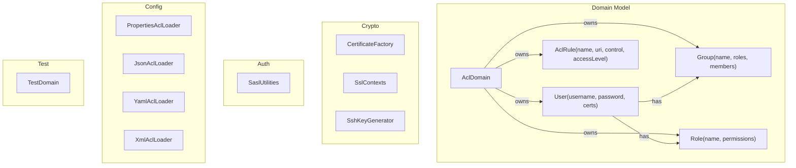

# ACL — Access Control & Certificate Management

Generic ACL engine for Lego Flow. Domain-scoped users, groups, roles, named access rules, certificates, and authentication utilities.

**Foundation module** — zero protocol dependencies (only `slf4j-api`). Designed to be depended on by all protocol modules for testing authentication, authorization, TLS, and cryptographic operations.

## Protocol Test Coverage

This module provides test utilities for **every** Lego Flow protocol that requires authentication, encryption, or access control:

| Protocol | Auth/Cert Needs | ACL Module Provides |
|----------|----------------|---------------------|
| **AMQP 1.0** | SASL PLAIN, SASL EXTERNAL, SCRAM-SHA-256, TLS | `SaslUtilities.saslPlainInitial()`, `saslExternalInitial()`, `scramSha256*`, `SslContexts`, `CertificateFactory` |
| **MQTT 5.0** | TLS, username/password, certificate auth | `MqttTlsConfig` → `SslContexts`, `CertificateFactory`, `User.checkPassword()` |
| **SSH** | RSA/Ed25519/ECDSA keys, authorized_keys, known_hosts, password auth | `SshKeyGenerator`, `SshKeyPair.publicKeyOpenSsh()`, `User.checkPassword()` |
| **XMPP** | SASL PLAIN, SCRAM-SHA-1, SCRAM-SHA-256, STARTTLS | `SaslUtilities.scramSha*()`, `saslPlainInitial()`, `SslContexts` |
| **Kafka** | SASL PLAIN, SCRAM-SHA-256, TLS | `SaslUtilities.saslPlainInitial()`, `scramSha256*`, `SslContexts` |
| **HTTP/HTTPS** | TLS, client certificates, Basic/Digest auth | `SslContexts`, `CertificateFactory`, `SaslUtilities.digestMd5Response()` |
| **HTTP/3 (QUIC)** | TLS 1.3, certificates | `SslContexts`, `CertificateFactory` |
| **NATS** | Token auth, user/pass, TLS | `User.checkPassword()`, `SslContexts` |
| **WAMP** | WAMP-CRA, Cryptosign (Ed25519), ticket auth | `SaslUtilities.wampCraResponse()`, `wampCryptosignResponse()` |
| **STOMP** | TLS, plain login/passcode | `SslContexts`, `User.checkPassword()` |
| **LDAP** | Simple bind, SASL (GSSAPI, EXTERNAL, DIGEST-MD5), StartTLS | `SaslUtilities.digestMd5Response()`, `saslPlainInitial()`, `saslExternalInitial()`, `SslContexts` |
| **FTP/FTPS** | TLS, password auth | `SslContexts`, `User.checkPassword()` |
| **Syslog (TLS)** | TLS transport | `SslContexts`, `CertificateFactory` |
| **PostgreSQL** | MD5, SCRAM-SHA-256 auth | `SaslUtilities.postgresMd5Password()`, `scramSha256*` |
| **MySQL** | native_password, caching_sha2_password | `SaslUtilities.mysqlNativePassword()`, `mysqlCachingSha2Response()` |
| **gRPC** | TLS transport security | `SslContexts`, `CertificateFactory` |
| **OAuth2/OIDC** | Bearer tokens, client credentials | `SaslUtilities.oauth2Bearer()` |
| **DNS (TSIG)** | HMAC authentication | `SaslUtilities` HMAC helpers |

## Quick Start

```java
// Pre-built test domain
var domain = TestDomain.INSTANCE;
var admin = domain.user("admin").get();
boolean allowed = domain.isAllowed(admin, "/anything", AclRule.AccessLevel.ALL); // true

// TLS context from domain certs
var cert = admin.certificates().iterator().next();
var sslCtx = SslContexts.serverContext(cert, domain.certificates(), "changeit".toCharArray());

// SSH key pair
var sshKey = SshKeyGenerator.generate("RSA");
String pubKey = sshKey.publicKeyOpenSsh(); // ready for authorized_keys

// SASL PLAIN (AMQP)
byte[] saslPlain = SaslUtilities.saslPlainInitial("user", "pass");

// SCRAM-SHA-256 (Kafka, AMQP)
var scramFirst = SaslUtilities.scramSha256ClientFirst("user", "nonce");
```

## Architecture



See [doc/ARCHITECTURE.md](doc/ARCHITECTURE.md) | [Requirements](doc/REQUIREMENTS.md)
