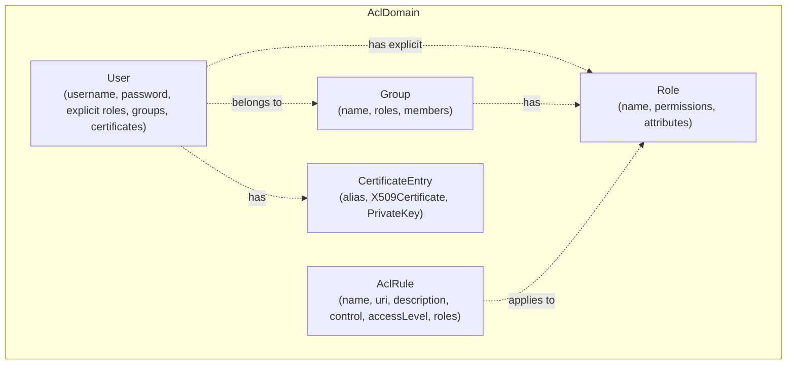

# ACL Module Architecture

## Purpose

The ACL module provides a generic, domain-scoped access control and certificate management engine for the Lego Flow framework. It is a **foundation module** — not a protocol implementation — and has no dependencies on `service`, `blocks`, or other Lego Flow modules beyond `slf4j-api`.

## Domain Model

## Role Resolution

Effective roles for a user = explicit roles ∪ (union of all roles assigned to groups the user belongs to). This allows fine-grained access control: a user can have direct roles and inherit additional roles through group membership.

## ACL Rules

An `AclRule` is a named access control entry:
- **name** — unique within the domain
- **uri** — resource path pattern (supports `**` wildcards)
- **description** — optional
- **control** — `ALLOW` or `DENY` (DENY takes precedence)
- **accessLevel** — `LIST`, `READ`, `WRITE`, `DELETE`, `EXECUTE`, `ALL`
- **roles** — which roles this rule applies to

Authorization check: `domain.isAllowed(user, uri, accessLevel)` evaluates all matching rules, DENY wins.

## Certificate Generation

`CertificateFactory` provides:
- Self-signed certificates (for testing)
- CA-signed certificates (issuer signs the subject)
- `DomainCerts` generation (CA + N signed certificates in one call)
- PKCS12 keystore and truststore generation
- All keys use RSA with F4 padding

## Configuration

Four loaders support declarative domain configuration:
- `PropertiesAclLoader` — `.properties` files
- `JsonAclLoader` — `.json` files
- `YamlAclLoader` — `.yaml`/`.yml` files
- `XmlAclLoader` — `.xml` files

All loaders use `AclDomainBuilder` internally. No external JSON/YAML/XML libraries — parsers are minimal JDK-only implementations.

## TestDomain

Pre-built domain with 10-year certificates, 4 roles, 4 groups, 9 users. Accessible via `TestDomain.INSTANCE`. Designed to be reused by any protocol module's unit tests for TLS, SASL, and authentication scenarios.
