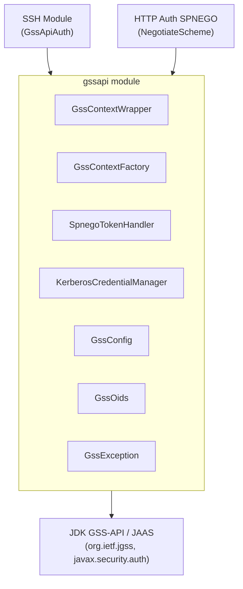

# GSSAPI Module Architecture

## Overview

The GSSAPI module provides a shared authentication layer abstracting the JDK's GSS-API (`org.ietf.jgss`) and JAAS (`javax.security.auth`) APIs. It serves as a foundation for both SSH gssapi-with-mic (RFC 4462) and HTTP Negotiate/SPNEGO (RFC 4178) authentication.

## Component Diagram

## Key Abstractions

### GssContextWrapper
Central class wrapping `GSSContext`. Provides:
- Client-side context initiation (`initSecContext`)
- Server-side context acceptance (`acceptSecContext`)
- Message protection (`wrap`/`unwrap`)
- Integrity verification (`getMIC`/`verifyMIC`)
- AutoCloseable for proper resource cleanup

### GssContextFactory
Static factory methods for creating GSSContext instances:
- `createClientContext(config, targetPrincipal)` -- Kerberos V5 mechanism
- `createServerContext(config)` -- server-side accept context
- `createSpnegoClientContext(config, targetPrincipal)` -- SPNEGO mechanism

### SpnegoTokenHandler
Handles SPNEGO token processing using hand-coded ASN.1 DER encoding:
- Creates NegTokenInit (Application [0] + SPNEGO OID + SEQUENCE)
- Creates NegTokenResp (context [1] + negResult + mechToken)
- Extracts inner mechanism tokens from SPNEGO wrappers
- Detects SPNEGO tokens via OID pattern matching

### KerberosCredentialManager
JAAS-based credential lifecycle management:
- Uses `Krb5LoginModule` for keytab and password authentication
- Programmatic JAAS configuration (no external jaas.conf file)
- Credential validation and renewal

## Design Patterns

- **Utility Class**: GssOids, GssContextFactory, SpnegoTokenHandler, KerberosCredentialManager use private constructors
- **Builder**: GssConfig uses a fluent builder with required field validation
- **Wrapper**: GssContextWrapper delegates to GSSContext with exception translation
- **AutoCloseable**: GssContextWrapper ensures proper GSS context disposal

## Thread Safety

- GssConfig is immutable after construction
- GssOids constants are initialized in a static block (thread-safe)
- GssContextWrapper wraps a single GSSContext (not thread-safe -- one wrapper per thread/connection)
- SpnegoTokenHandler methods are stateless and thread-safe
- KerberosCredentialManager methods are stateless and thread-safe

---

## Related Documentation

- [Module README](../README.md) | [Requirements](REQUIREMENTS.md) | [Compliance](COMPLIANCE.md)
- [Root Architecture](../../../doc/ARCHITECTURE.md) | [Root README](../../../README.md)

---

**Last Updated**: 2026-06-26
