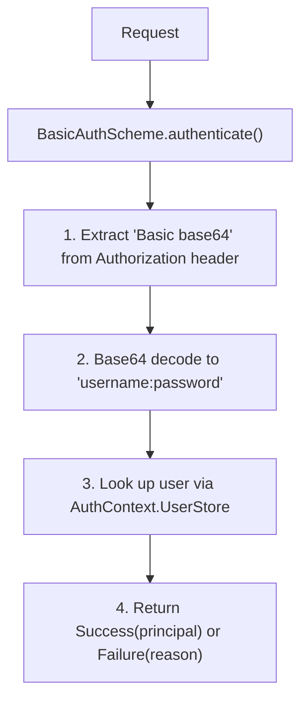
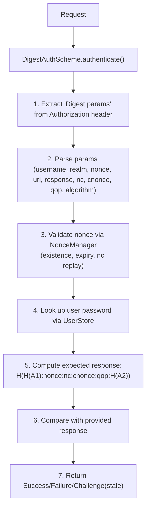

# HTTP Auth Basic/Digest — Architecture

## Basic Auth Flow

## Digest Auth Flow

## Password Storage

- `InMemoryUserStore`: Plain-text, suitable for testing
- `HashedPasswordStore`: SHA-256 + per-user random salt, hex-encoded storage

## Thread Safety

- NonceManager: ConcurrentHashMap for nonce tracking
- InMemoryUserStore: ConcurrentHashMap
- HashedPasswordStore: ConcurrentHashMap

## Related Documentation

- [Module README](../README.md) | [Requirements](REQUIREMENTS.md) | [Compliance](COMPLIANCE.md)
- [Root Architecture](../../../../doc/ARCHITECTURE.md) | [Root README](../../../../README.md)
