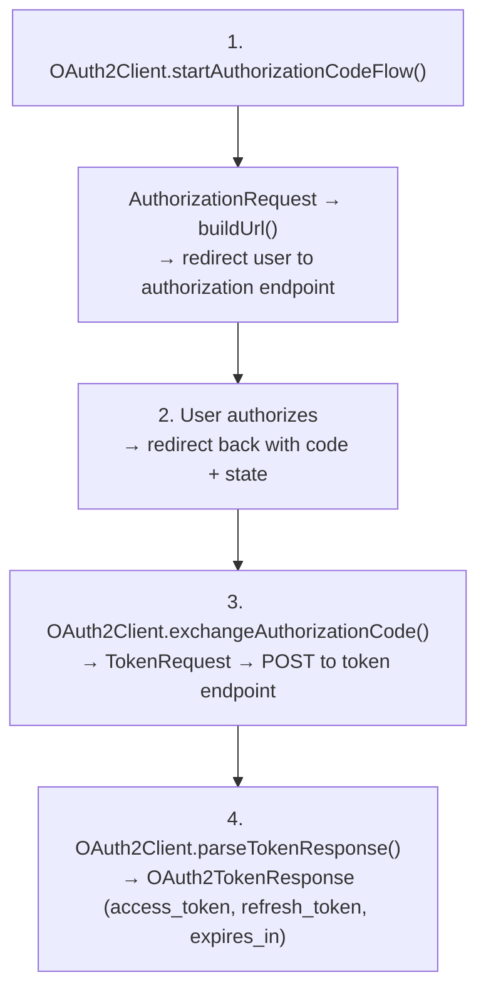
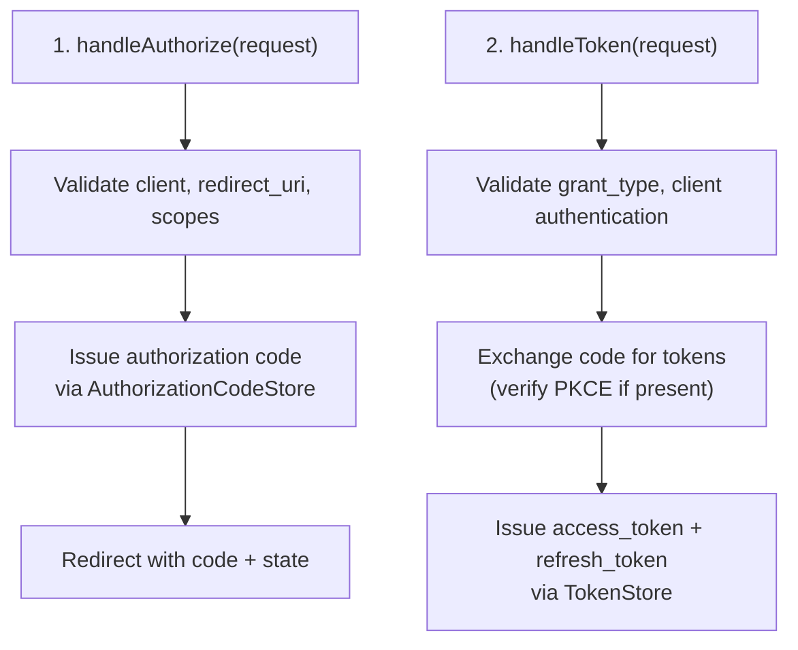

# HTTP Auth OAuth — Architecture

## OAuth 2.0 Client Flow

## OAuth 2.0 Server Flow

## Bearer Authentication

BearerAuthScheme supports two validation strategies:
1. JWT validation via JwtTokenProvider (signature + expiry + issuer)
2. Token store introspection via TokenStore
3. Fallback: try JWT first, fall back to token store

## OIDC Layer

OpenIdConnectClient wraps OAuth2Client adding:
- Nonce generation for ID token binding
- ID token parsing (JWT without verification) and validation
- UserInfo response parsing
- Discovery URL construction

## Provider Architecture

OAuthProvider (abstract) provides template with:
- authorizationEndpoint(), tokenEndpoint(), userInfoEndpoint(), revocationEndpoint()
- defaultScopes()
- buildConfig() factory method

Concrete providers: GoogleOAuth, GitHubOAuth, MicrosoftOAuth (configurable tenant), FacebookOAuth, TwitterOAuth, AppleOAuth, GenericOAuth.

## Related Documentation

- [Module README](../README.md) | [Requirements](REQUIREMENTS.md) | [Compliance](COMPLIANCE.md)
- [Root Architecture](../../../../doc/ARCHITECTURE.md) | [Root README](../../../../README.md)
