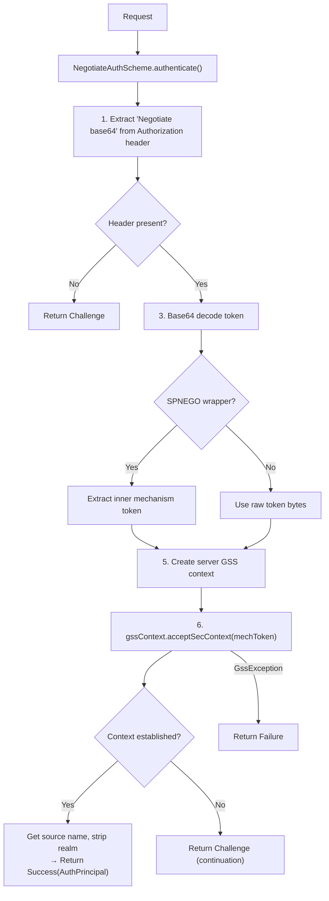
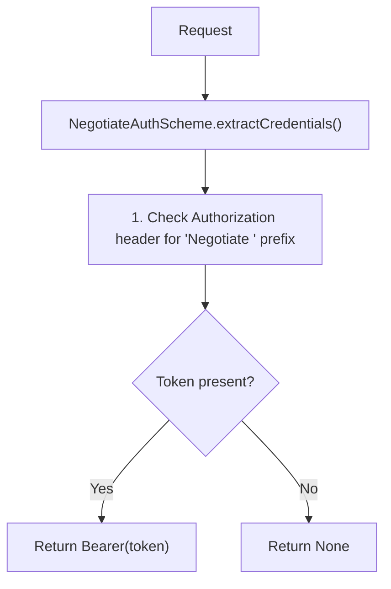
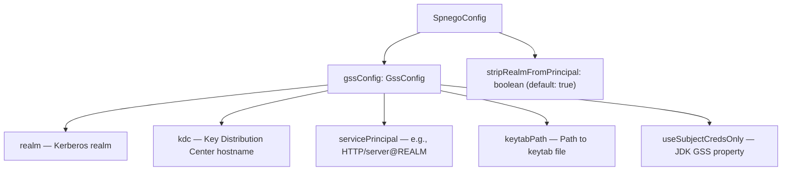

# HTTP Auth SPNEGO — Architecture

## SPNEGO Authentication Flow

## Credential Extraction Flow

## Configuration Structure

## Thread Safety

- NegotiateAuthScheme: immutable after construction, safe for concurrent use
- SpnegoConfig: immutable, safe for concurrent use
- GssContextWrapper: created per-request via try-with-resources, not shared between threads

## Related Documentation

- [Module README](../README.md) | [Requirements](REQUIREMENTS.md) | [Compliance](COMPLIANCE.md)
- [Root Architecture](../../../../doc/ARCHITECTURE.md) | [Root README](../../../../README.md)
