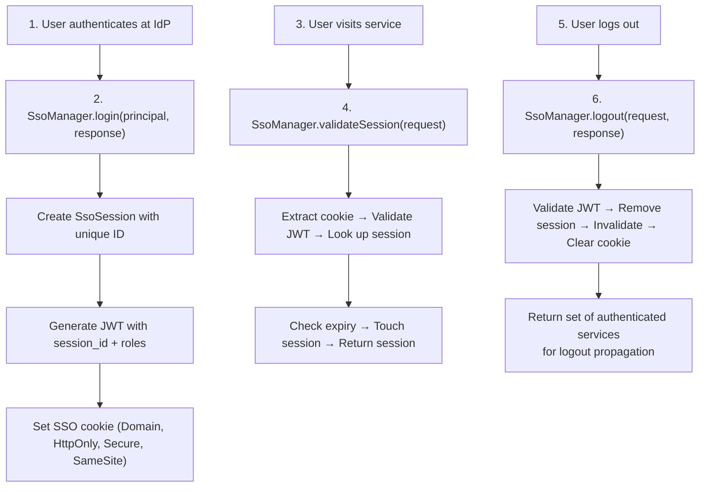
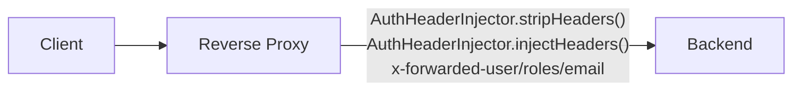
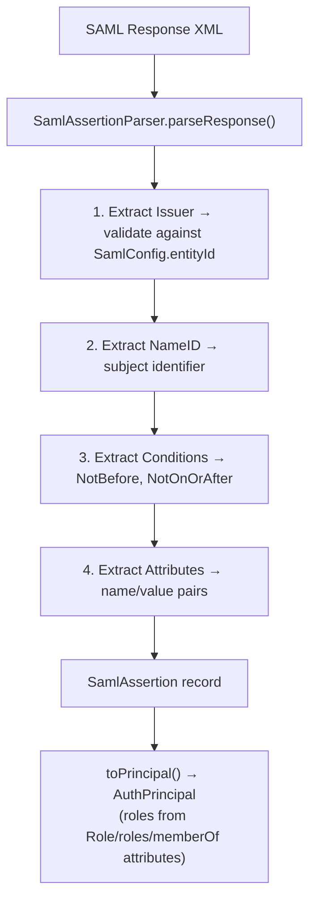

# HTTP Auth SSO — Architecture

## SSO Federation Flow

## Reverse Proxy SSO Flow

## SAML Assertion Parsing

## Thread Safety

- SsoSession: ConcurrentHashMap for attributes, ConcurrentHashMap.newKeySet() for services, volatile for lastAccessedAt and invalidated
- SsoManager: ConcurrentHashMap for sessions

## Related Documentation

- [Module README](../README.md) | [Requirements](REQUIREMENTS.md) | [Compliance](COMPLIANCE.md)
- [Root Architecture](../../../../doc/ARCHITECTURE.md) | [Root README](../../../../README.md)
