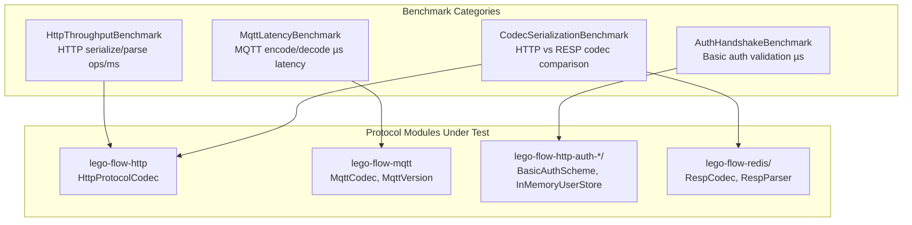

# Benchmarks Module — Architecture

## Module Purpose

The **benchmarks** module provides JMH-based microbenchmarks for the Lego Flow protocol implementations. It measures serialization throughput, message latency, authentication overhead, and codec performance across the framework's core protocols.

## Key Abstractions



## Design Patterns

### JMH Benchmark Pattern
All benchmarks follow the standard JMH conventions:
- `@BenchmarkMode` — Throughput or AverageTime measurement
- `@Warmup(iterations=3, time=2)` — 6 seconds of warmup per benchmark
- `@Measurement(iterations=5, time=3)` — 15 seconds of measurement per benchmark
- `@Fork(value=1, jvmArgsAppend=[...])` — Isolated JVM with controlled heap
- `Blackhole.consume()` — Prevents dead-code elimination

### Benchmark Setup Pattern
```java
@Setup(Level.Iteration)
public void setup() {
    // Create codec instances, test payloads, user stores
    // Fresh per iteration to measure realistic allocation costs
}

@Benchmark
public void benchmarkMethod(Blackhole bh) {
    // Perform the operation under test
    // Consume results through Blackhole
}
```

## Data Flow

1. **JMH framework** invokes `@Setup` before each measurement iteration
2. **Protocol codecs** are instantiated with fresh state (HTTP codec, MQTT codec versions)
3. **Test payloads** are created at realistic sizes (128B telemetry → 64KB image chunks)
4. **Benchmark methods** perform encode/decode/serialize/parse operations
5. **Blackhole** consumes results to prevent compiler optimization
6. **JMH reports** throughput (ops/ms) or latency (µs/op)

## Thread Safety Model

- Benchmarks run single-threaded per JMH fork (no contention)
- Protocol codecs are NOT shared across threads (fresh instance per iteration)
- User stores populated in setup, read-only during benchmark execution

## Extension Points

### Adding New Benchmarks
1. Create new class under `ssg/legoflow/benchmarks/<category>/`
2. Add JMH annotations following the established pattern
3. Include the protocol module as dependency in both Maven and Gradle configs
4. Document the benchmark in benchmarks/README.md

### Configuring Benchmark Parameters
- Payload sizes: Modify constants in the benchmark class (SMALL_PAYLOAD, MEDIUM_PAYLOAD, LARGE_PAYLOAD)
- Iteration counts: Adjust `@Warmup` and `@Measurement` annotations
- JVM settings: Update `jvmArgsAppend` in `@Fork` annotation

## Dependencies

| Module | Purpose |
|--------|---------|
| lego-flow-http | HTTP protocol codec for serialization benchmarks |
| lego-flow-mqtt | MQTT codec for packet encoding/decoding benchmarks |
| lego-flow-http-auth-core | Auth framework primitives (AuthContext, AuthResult) |
| lego-flow-http-auth-basic-digest | Basic auth scheme and user store |
| lego-flow-redis | RESP codec for serialization comparison benchmarks |
| org.openjdk.jmh:jmh-core | JMH benchmarking framework |

## CI Integration

Benchmarks run as non-blocking CI gates:
- Results published as artifacts in GitHub Actions
- Regressions generate warnings but do not fail the build
- Comparison dashboard can be built from artifact history
