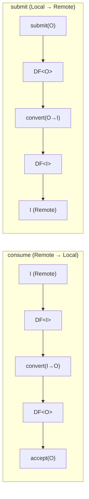
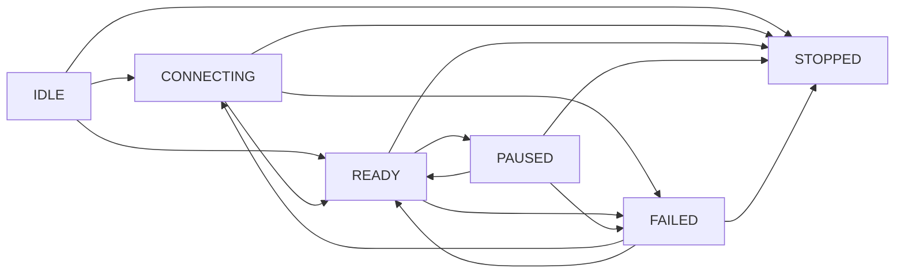

# Blocks Module — Architecture

## Module Purpose

The blocks module provides the foundational data processing abstractions for the entire Lego Flow framework. All higher-level modules (service, http, websocket, wamp) build on these primitives.

## Key Abstractions

### DataProcessor<I,O> (DP)
Bidirectional data processing unit with two type parameters:
- **I** — remote/external type (consumed from and produced to the outside)
- **O** — local/internal type (accepted and submitted internally)

### Data Flow

Filter application order (matches `AbstractDataProcessor`):
- **`consume()`**: inputFilters → convertToOutput → outputFilters → accept
- **`submit()`**: outputFilters → convertToInput → inputFilters → produce

### DataFilter<T> (DF)
Positioned at type boundaries:
- **DF<I>** — at remote boundary (consume entry, produce exit)
- **DF<O>** — at local boundary (after I→O conversion, before O→I conversion)

Filters are chained (SequencedCollection). Each filter can transform, validate, or reject data.

## Design Patterns

- **Template Method** — AbstractDataProcessor: subclasses implement convertToOutput/convertToInput; base wires filter chains and statistics
- **Observer** — StateListener for state transitions (AbstractDataProcessor only; AbstractDataFilter updates state but has no listener mechanism)
- **Chain of Responsibility** — filter chains

## State Machine

Valid transitions (from `ProcessorState.VALID_TRANSITIONS`):

| From       | To                              |
|------------|---------------------------------|
| IDLE       | CONNECTING, **READY**, STOPPED  |
| CONNECTING | READY, FAILED, STOPPED          |
| READY      | PAUSED, FAILED, STOPPED         |
| PAUSED     | READY, FAILED, STOPPED          |
| FAILED     | CONNECTING, READY, STOPPED      |
| STOPPED    | *(none — terminal)*             |

STOPPED is terminal — no transitions out.

## Thread Safety

- AtomicReference for state (both AbstractDataProcessor and AbstractDataFilter)
- ConcurrentHashMap + AtomicLong for statistics
- CopyOnWriteArrayList for filter chains (inputFilters, outputFilters) and StateListeners — in AbstractDataProcessor only; AbstractDataFilter uses no concurrent collections

## Extension Points

- Custom DataProcessor<I,O> implementations (extend AbstractDataProcessor)
- Custom DataFilter<T> implementations (extend AbstractDataFilter)
- Custom Context implementations (implement Context interface)

---

## Related Documentation

- [Module README](../README.md) | [Requirements](REQUIREMENTS.md)
- [Root Architecture](../../doc/ARCHITECTURE.md) | [Root README](../../README.md)

---

**Last Updated**: 2026-06-16
