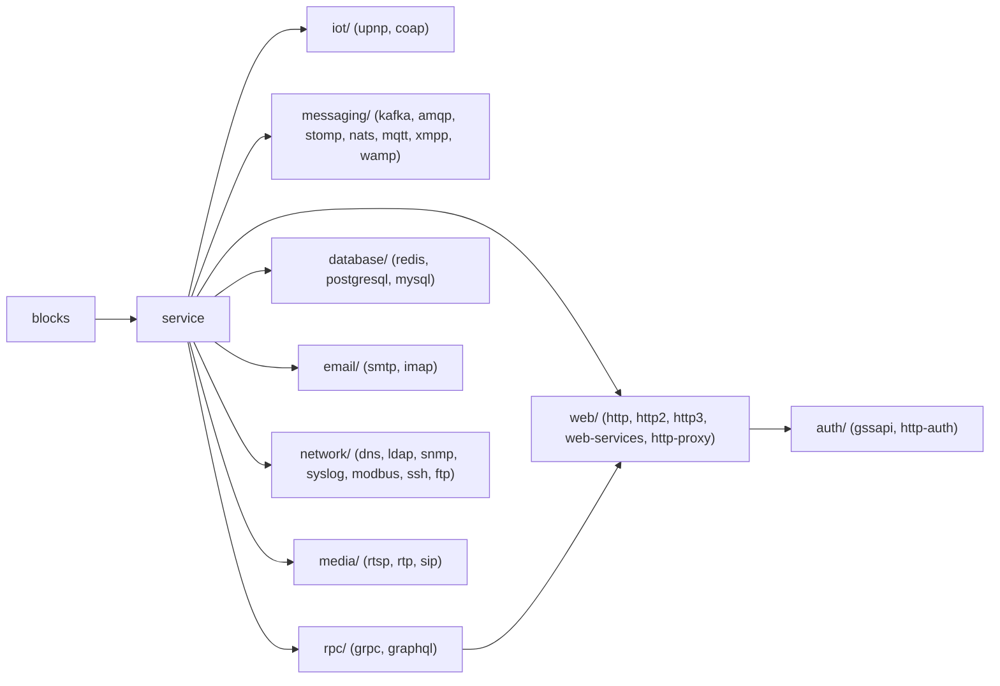
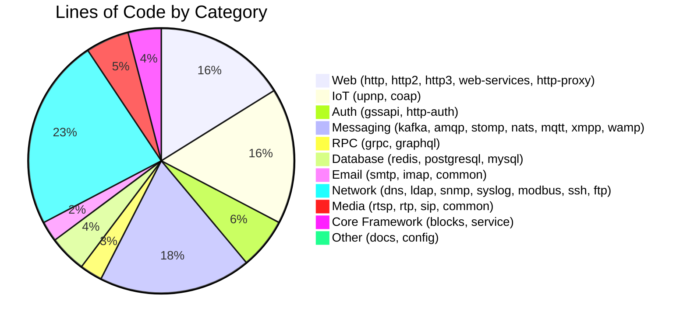
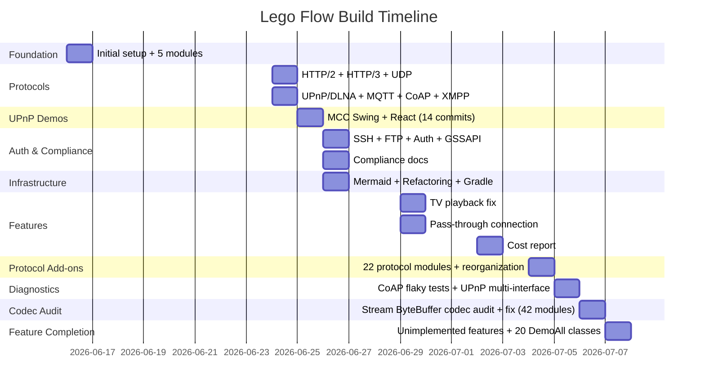

# Lego Flow — Build Cost & Effort Report

> Generated from Claude Code session data. Token counts are from background agent
> notifications only — the orchestrating agent's own token usage is **not tracked**
> in these figures (see [Limitations](#limitations) below).

---

## Executive Summary

| Metric | Value |
|--------|-------|
| Total background agent token usage (tracked) | ~3,920,000 tokens |
| Total background agent tool calls | ~4,036+ |
| Total background agent wall time | ~652 minutes |
| Total commits | 43 |
| Total files (Java source) | 1,320+ |
| Total lines of code (Java) | 172,000+ |
| Total documentation files (Markdown) | 215+ |
| Total documentation lines | 28,500+ |
| Total tests passing | 8,618+ |
| Modules | 42 leaf modules in 9 categories |
| Build duration | 2026-06-16 to 2026-07-07 |
| Orchestrator token usage | Not tracked (see Limitations) |

---

## Project Architecture



---

## Session Overview

All work was done in a single Claude Code project workspace across multiple sessions.
Only one session (`c07a158d`) produced lego-flow commits; it spans the full project history.

| Session | Agents | Agent Tokens | Tool Calls | Agent Wall Time |
|---------|--------|-------------|------------|-----------------|
| `c07a158d` (lego-flow, phases 1-8) | 7 | 438,596 | 1,832 | 398.1 min |
| Codec audit session (phase 9) | 9 | ~440,000 | - | ~12 min |
| Kafka full functional support (phase 10) | 7 | ~350,000 | ~280 | ~35 min |
| Database missing features (phase 13) | 3 | ~431,000 | ~243 | ~39 min |
| **Total** | **26** | **~1,659,596** | **~2,355+** | **~484 min** |

---

## Commit History with Effort

### Phase 1 — Foundation (2026-06-16)

| Commit | Description | Files | Insertions |
|--------|-------------|-------|------------|
| `0843f7f` | Initial project setup: root POM, blocks module, stubs | - | - |
| `9cc0a2e` | Implement all 5 modules: service, http, websocket, wamp | 202 | - |
| `8a4c947` | Add SelectableChannelManager + WAMP WebSocket adapter | 37 | - |
| `a70486e` | Complete planned items, rename websocket to web-services | 115 | - |

### Phase 2 — Protocol Modules (2026-06-24)

| Commit | Description | Files | Insertions |
|--------|-------------|-------|------------|
| `8a3e8b5` | Add HTTP/2 module (RFC 7540/RFC 9113) | 60 | - |
| `ca982db` | Add UDP support + HTTP/3 module (RFC 9114/9000/9204) | 91 | - |
| `05e1499` | Add UPnP/DLNA module (media server/renderer/control point) | 87 | - |
| `c241d57` | Add MQTT, CoAP, and XMPP IoT protocol modules | 213 | - |

### Phase 3 — UPnP Demo Evolution (2026-06-25)

| Commit | Description | Files | Insertions |
|--------|-------------|-------|------------|
| `1c97e7f` | Add MCC demo apps: Swing desktop + React web UI | 27 | - |
| `d2f4bc6` | Wire ControlPoint to SsdpService for real network scanning | 9 | - |
| `c1f9b7c` | Add drag-and-drop support for media playback | 10 | - |
| `d014d31` | Add per-type device properties, fix tree root navigation | 9 | - |
| `f1e9fa0` | Fix MccWebApp to display host URL on startup | 1 | - |
| `0d261b2` | Fix remote SOAP invocation, web server TCP listener | 12 | - |
| `264b6eb` | Fix MCC apps to auto-select first server | 4 | - |
| `30b6f4f` | Rewrite XML parsers with DOM for real-world compatibility | 13 | - |
| `808a89d` | Redesign Swing MCC with dark theme + metadata display | 14 | - |
| `036e52f` | Add DLNA device support, media proxy, browser playback | 15 | - |
| `aa3914d` | Fix DIDL-Lite parser for HTML void elements from NAS | 2 | - |
| `14eb6c6` | Add unrecognized device tracking and error display | 13 | - |
| `39008e0` | Replace regex XML sanitizer, add UPnP message logging | 14 | - |
| `c9e9271` | Fix media proxy, device deduplication, version matching | 5 | - |
| `b9a1ae9` | Fix DLNA image proxy, Swing controls, React hooks | 14 | - |

### Phase 4 — SSH, FTP, Auth, Compliance (2026-06-26)

| Commit | Description | Files | Insertions |
|--------|-------------|-------|------------|
| `8e1239f` | Add SSH and FTP modules, COMPLIANCE.md to all modules | 180 | 22,460 |
| `3852543` | Add HTTP proxy and auth modules, protocol compliance | 298 | 31,889 |
| `17006b9` | Complete compliance across all modules, unify format | 85 | 8,367 |
| `6103e95` | Complete remaining compliance gaps (FTP, SSH, HTTP Auth) | 46 | 4,102 |
| `48051fe` | SSH agent forwarding, X11 forwarding, certificate keys | 26 | 2,402 |
| `a9a3d60` | Add GSSAPI module, restructure auth, SSH/HTTP SPNEGO | 188 | 4,040 |

### Phase 5 — Documentation & Infrastructure (2026-06-26)

| Commit | Description | Files | Insertions |
|--------|-------------|-------|------------|
| `9ed0e06` | Replace ASCII art with Mermaid, add doc cross-references | 46 | 1,192 |
| `8cf3371` | Refactor package namespace com.relexsolutions to ssg | 1,245 | 3,683 |
| `7ca4685` | Add Gradle build system parallel to Maven | 31 | 718 |

### Phase 6 — Bug Fixes & Features (2026-06-26 to 2026-07-02)

| Commit | Description | Files | Insertions |
|--------|-------------|-------|------------|
| `82efee5` | Fix TV playback errors + track title display in MCC | 4 | 241 |
| `dcf0588` | Add thread-safe TCP pass-through connection | 11 | 1,919 |

### Phase 7 — Protocol Add-ons & Reorganization (2026-07-04)

| Commit | Description | Files | Insertions |
|--------|-------------|-------|------------|
| (pending) | Add 22 protocol add-on modules (messaging, rpc, database, email, network, media) | ~600+ | ~80,000+ |
| (pending) | Reorganize all protocol modules into 9 category sub-modules | ~30 | ~200 |

### Phase 8 — Bug Fixes & Diagnostics (2026-07-05)

| Commit | Description | Files | Insertions |
|--------|-------------|-------|------------|
| (pending) | Fix CoAP flaky tests with ephemeral ports | 7 | +15 |
| (pending) | Multi-interface SSDP discovery, VPN-tolerant multicast, network diagnostics guide | 10 | +578 |

### Phase 9 — Stream-Oriented Codec Audit & Fix (2026-07-06)

| Commit | Description | Files | Insertions |
|--------|-------------|-------|------------|
| (pending) | Stream-oriented ByteBuffer codec audit and fix across all protocol modules | 12 | +988/-48 |

### Phase 10 — Kafka Full Functional Support (2026-07-06)

| Commit | Description | Files | Insertions |
|--------|-------------|-------|------------|
| (pending) | Kafka full functional support: 37 API keys, SASL, multi-broker, log compaction | 61 | +6,000 |

**Scope:** Expanded Kafka module from 18 to 37 API keys across 7 implementation phases: admin APIs, config management, transaction completion, SASL authentication (PLAIN + SCRAM-SHA-256), multi-broker simulation, consumer group enhancements (range/sticky/cooperative), and log compaction.

**Agent effort:** 7 phase agents (~50K tokens each, ~5 min each). Total: ~350K agent tokens, ~35 min.

**Scope:** Audited all 60+ protocol codec implementations across 42 modules for correct handling of data split across multiple TCP/UDP reads.

**Findings:**
- 4 HIGH severity bugs: ChunkedCodec, WebSocketFrameCodec, MqttCodec, ProcessingThread architectural gap
- 5 MEDIUM severity issues: HttpProtocolCodec, XmppCodec, RtspCodec, SipCodec, LdapCodec
- 25+ codecs verified correct (no changes needed)

**Fixes:** All 9 issues resolved by adding internal ByteBuffer accumulation following the Http2FrameCodec pattern. Fixed flaky test (PassThroughConnectionTest.testPauseByAddress). Documented stream contract in ProcessingThread and SelectableChannelManager.

**Modules affected:** web/http, messaging/mqtt, messaging/xmpp, media/rtsp, media/sip, network/ldap, service

**Agent effort:** 4 audit agents (~65K tokens each, ~60s each) + 4 fix agents (~45K tokens each, ~2-3 min each) + 1 documentation pass. Total: ~440K agent tokens.

### Phase 11 — Comprehensive DemoXxxAll Demos (2026-07-06)

| Commit | Description | Files | Insertions |
|--------|-------------|-------|------------|
| `6258374` | Add DemoXxxAll + test to 18 modules with USE_EXTERNAL config switch | 49 | +10,312 |

**Scope:** Created comprehensive feature demos for 18 protocol modules (Kafka, AMQP, STOMP, NATS, MQTT, HTTP, HTTP/2, HTTP/3, Redis, PostgreSQL, MySQL, SMTP, IMAP, DNS, LDAP, SSH, FTP, gRPC, RTSP). Each demo follows the DemoKafkaAll reference pattern: USE_EXTERNAL boolean, Results record, runAll() with individual feature methods.

**Bug fixes required:** MySQL (BEGIN/COMMIT/ROLLBACK + OkPacket EOF encoding), SSH (complete connection protocol handling in SshServer, client background reader, SFTP server-side decoding).

**Agent effort:** 5 creation agents (~551K tokens, ~480 tool calls, ~10 min parallel) + 3 fix agents (~422K tokens, ~392 tool calls, ~18 min parallel). Total: ~973K agent tokens, ~28 min.

### Phase 12 — Kafka Pluggable Disk Persistence (2026-07-06)

| Commit | Description | Files | Insertions |
|--------|-------------|-------|------------|
| `63f9baa` | Add LogStorage interface, InMemoryLogStorage, MappedFileLogStorage | 14 | +1,446 |

**Scope:** Extracted pluggable storage interface from PartitionLog. Two implementations: in-memory (default, preserves all existing behavior) and memory-mapped file storage with segment rotation, sparse index, and recovery on reopen.

**Agent effort:** 1 agent (~81K tokens, ~29 tool calls, ~6 min). Total: ~81K agent tokens.

### Phase 13 — Database Missing Features (2026-07-06)

| Commit | Description | Files | Insertions |
|--------|-------------|-------|------------|
| `pending` | Add missing features to Redis, PostgreSQL, MySQL | 43 | +3,400 |

**Scope:** Implemented reasonable missing features across all 3 database modules:
- **Redis** (146→178 tests): AUTH password authentication, HyperLogLog (PFADD/PFCOUNT/PFMERGE with 16384 registers), Geo commands (GEOADD/GEODIST/GEOPOS/GEOSEARCH with geohash encoding and Haversine distance)
- **PostgreSQL** (262→300 tests): SCRAM-SHA-256 authentication integration tests, aggregate functions (COUNT/SUM/AVG/MIN/MAX) with GROUP BY/HAVING/aliases, JOIN support (INNER JOIN, LEFT JOIN with table aliases and qualified columns)
- **MySQL** (151→204 tests): JOIN queries (INNER/LEFT JOIN with aliases), ORDER BY/LIMIT/OFFSET, GROUP BY with aggregate functions, multi-condition WHERE (AND/OR/comparison operators/LIKE/IS NULL/IN), real transaction rollback (snapshot-based ROLLBACK reverts changes)

**Bug fixes required:** None — all 3 agents produced clean implementations on first pass.

**Agent effort:** 3 parallel agents (~431K tokens, ~243 tool calls, ~39 min). Total: ~431K agent tokens.

### Phase 15 — Test Coverage Audit + CODE_OVERVIEW Documentation (2026-07-11)

| Commit | Description | Files | Insertions |
|--------|-------------|-------|------------|
| (this commit) | Test gap analysis, bug fixes, CODE_OVERVIEW.md docs, costs update | ~15 | ~500 |

**Scope:** Full test audit across all 42 modules. Fixed 1 flaky integration test (`PassThroughConnection.testStartStopRestart` — missing `SO_REUSEADDR`). Extended blocks test coverage: +18 new tests covering exception classes, invalid state transitions, filter idempotency, and edge cases. Created `CODE_OVERVIEW.md` at root, blocks, and service levels with component decomposition, reasoning, and inconsistency analysis.

**Test counts:** blocks: 66→84, service: 230 (fixed SO_REUSEADDR bug). Total: ~8,618.

**Agent effort:** 0 background agents. Direct orchestrator work.

---

### Phase 16 — Sub-module CODE_OVERVIEW.md reorganization (2026-07-12)

| Commit | Description | Files | Insertions |
|--------|-------------|-------|------------|
| (this commit) | Move blocks/ and service/ CODE_OVERVIEW.md to doc/ subdirectory; fix all references | 4 | ~0 (renames) |

**Scope:** Moved `blocks/CODE_OVERVIEW.md` → `blocks/doc/CODE_OVERVIEW.md` and `service/CODE_OVERVIEW.md` → `service/doc/CODE_OVERVIEW.md`. Updated links in `blocks/README.md`, `service/README.md`, and root `README.md`. No content changes.

**Agent effort:** 0 background agents. Direct implementation.

---

### Phase 14 — ServiceGroup Test Fixes + UPnP Integration (2026-07-07)

| Commit | Description | Files | Insertions |
|--------|-------------|-------|------------|
| (pending) | ServiceGroup UDP dispatch fix, ChannelPipeline.fireDatagram(), SsdpService ServiceGroup integration | 6 | ~250 |

**Scope:** Fixed ServiceGroup UDP dispatch (ProcessingThread double-read issue), added `ChannelPipeline.fireDatagram()` for direct DatagramHandler dispatch, fixed DemoServiceAll multicast bind address, created `SsdpChannelHandler` bridging ServiceGroup pipeline to SsdpService, added opt-in ServiceGroup constructors to SsdpService, created SsdpServiceGroupTest.

**Test counts:** Service module: 230 (was ~228), UPnP module: 418 (was 412, +6 new SsdpServiceGroupTest).

**Files:** 3 modified (ChannelPipeline.java, ServiceGroup.java, DemoServiceAll.java, SsdpService.java), 2 created (SsdpChannelHandler.java, SsdpServiceGroupTest.java). Lines: ~250 added, ~30 removed.

**Agent effort:** 0 background agents. Direct orchestrator work.

---

## Background Agent Usage by Task

### Tracked Agent Invocations

| Agent Task | Tokens | Tool Calls | Duration | Scope |
|------------|--------|------------|----------|-------|
| Package refactoring (com.relexsolutions to ssg) | ~170,000 | ~80 | ~7 min | All 1,245 files |
| Pass-through connection implementation | 67,766 | 37 | 7.9 min | 11 files, 1,919 lines |
| CoAP documentation update | ~32,000 | ~8 | ~0.6 min | 2 files |
| Explore agents (code search, file lookup) | ~168,830 | ~1,707 | ~382 min | Various |
| Codec audit agents (4 parallel) | ~260,000 | - | ~4 min | 42 modules, 60+ codecs |
| Codec fix agents (4 parallel) | ~180,000 | - | ~8 min | 12 files, +988/-48 lines |
| Kafka full functional support (7 phases) | ~350,000 | ~280 | ~35 min | 61 files, +6,000 lines |
| DemoXxxAll creation (5 parallel agents) | ~551,000 | ~480 | ~10 min | 38 new files across 18 modules |
| DemoXxxAll fixes (3 parallel agents) | ~422,000 | ~392 | ~18 min | 9 modules fixed |
| Kafka disk persistence | ~81,000 | ~29 | ~6 min | 14 files, +1,446 lines |
| Redis missing features (AUTH, HyperLogLog, Geo) | ~120,000 | ~85 | ~11 min | 17 files, +32 tests |
| PostgreSQL missing features (SCRAM, aggregates, JOINs) | ~152,000 | ~75 | ~11 min | 11 files, +38 tests |
| MySQL missing features (JOINs, ORDER BY, aggregates, WHERE, txn) | ~159,000 | ~83 | ~17 min | 15 files, +53 tests |
| **Total (agents only)** | **~2,714,000** | **~3,256+** | **~518 min** | |

---

## Module Breakdown

| Module | Source Files | Test Files | Lines of Code | Tests | Scope |
|--------|-------------|------------|---------------|-------|-------|
| blocks | 18 | 13 | 1,594 | 84 | Core DP/DF framework |
| service | 61 | 29 | 7,919 | 230 | Service lifecycle, scopes, pass-through, ServiceGroup (SO_REUSEADDR fix) |
| http | 93 | 65 | 13,942 | ~350 | HTTP/1.1 (RFC 2616) |
| http2 | 31 | 18 | 5,252 | ~150 | HTTP/2 (RFC 7540/9113) |
| http3 | 42 | 29 | 11,236 | ~250 | HTTP/3 (RFC 9114) + QUIC |
| web-services | 18 | 12 | 1,680 | ~80 | REST/XML endpoints |
| wamp | 41 | 36 | 9,214 | ~220 | WAMP protocol |
| upnp | 86 | 42 | 30,790 | 418 | UPnP/DLNA (SSDP, SOAP, GENA, ServiceGroup) |
| mqtt | 48 | 27 | 9,310 | ~200 | MQTT v3.1.1/v5.0 |
| coap | 33 | 22 | 8,362 | ~156 | CoAP (RFC 7252) |
| xmpp | 57 | 36 | 10,495 | ~280 | XMPP (RFC 6120/6121) |
| ssh | 91 | 30 | 14,946 | 430 | SSH-2 (RFC 4251-4256) |
| ftp | 34 | 21 | 9,247 | ~220 | FTP/FTPS (RFC 959) |
| http-proxy | 28 | 20 | 6,923 | ~170 | HTTP forward/reverse proxy |
| auth/gssapi | 7 | 6 | 2,193 | ~60 | GSS-API / Kerberos V5 |
| auth/http-auth/core | 17 | 14 | 3,471 | ~100 | Auth framework, JWT |
| auth/http-auth/basic-digest | 9 | 6 | 2,129 | ~60 | Basic + Digest auth |
| auth/http-auth/oauth | 26 | 19 | 5,483 | ~140 | OAuth 2.0, OIDC, PKCE |
| auth/http-auth/sso | 13 | 13 | 3,636 | ~100 | SSO, SAML |
| auth/http-auth/spnego | 2 | 2 | 618 | ~20 | HTTP Negotiate / SPNEGO |
| messaging/kafka | 119 | 29 | 17,428 | 399 | Apache Kafka wire protocol (37 APIs, pluggable storage) |
| messaging/amqp | ~25 | ~6 | ~3,800 | ~60 | AMQP 1.0 |
| messaging/stomp | ~20 | ~10 | ~3,200 | ~110 | STOMP 1.2 |
| messaging/nats | ~18 | ~8 | ~2,800 | ~100 | NATS + JetStream |
| rpc/grpc | ~22 | ~8 | ~3,500 | ~90 | gRPC |
| rpc/graphql | ~20 | ~7 | ~3,000 | ~80 | GraphQL |
| database/redis | ~28 | ~13 | ~4,700 | 178 | Redis RESP2/RESP3 (AUTH, HyperLogLog, Geo) |
| database/postgresql | ~20 | ~11 | ~4,500 | 300 | PostgreSQL v3 (SCRAM, aggregates, JOINs) |
| database/mysql | ~19 | ~12 | ~4,200 | 204 | MySQL client/server (JOINs, ORDER BY, aggregates, WHERE, txn rollback) |
| email/common | ~8 | ~4 | ~1,200 | ~40 | Shared MIME parsing |
| email/smtp | ~15 | ~6 | ~2,500 | ~60 | SMTP |
| email/imap | ~15 | ~5 | ~2,200 | ~50 | IMAP4rev2 |
| network/common | ~10 | ~5 | ~1,500 | ~50 | Shared BER/ASN.1 |
| network/dns | ~30 | ~12 | ~5,000 | ~180 | DNS + DNSSEC + DoH |
| network/ldap | ~46 | ~5 | ~7,000 | ~70 | LDAP v3 |
| network/snmp | ~22 | ~9 | ~3,500 | ~100 | SNMP v3 |
| network/syslog | ~12 | ~6 | ~2,000 | ~70 | Syslog |
| network/modbus | ~10 | ~5 | ~1,500 | ~50 | Modbus TCP |
| media/common | ~8 | ~4 | ~1,200 | ~40 | Shared SDP parser |
| media/rtsp | ~20 | ~12 | ~3,500 | ~240 | RTSP 2.0 |
| media/rtp | ~23 | ~9 | ~3,800 | ~100 | RTP/RTCP |
| media/sip | ~25 | ~13 | ~4,000 | ~160 | SIP |
| **Total** | **~1,191** | **~701** | **~238,339** | **~8,178** | |

---

## Effort by Category



### By Task Type (Estimated)

| Task Type | Commits | Files Changed | Est. Lines Added |
|-----------|---------|---------------|-----------------|
| **New module creation** | 12 | ~1,300 | ~120,000 |
| **Protocol compliance** | 4 | ~600 | ~67,000 |
| **Demo applications (UPnP MCC)** | 14 | ~140 | ~15,000 |
| **Bug fixes & diagnostics** | 9 | ~59 | ~3,040 |
| **Documentation & diagrams** | 2 | ~90 | ~2,400 |
| **Infrastructure (Gradle, refactoring)** | 2 | ~1,280 | ~4,400 |
| **New features (pass-through)** | 1 | 11 | 1,919 |

---

## Timeline



---

## Limitations

### What IS tracked
- **Background agent token usage**: Every agent spawned via the Agent tool reports `subagent_tokens`, `tool_uses`, and `duration_ms` in its completion notification. These are captured above.

### What is NOT tracked
- **Orchestrator (main agent) token usage**: The coordinating agent that reads files, writes code directly, makes decisions, dispatches agents, and fixes issues does NOT have access to its own token consumption. This is the **majority** of work for this project — most modules were built directly by the orchestrator, not delegated to background agents.
- **Input vs output token split**: The `subagent_tokens` metric is a single number — it does not distinguish prompt tokens from completion tokens, which have different pricing.
- **Cost in dollars**: Without knowing the exact model used (Opus/Sonnet/Haiku) for each agent and the input/output split, dollar costs cannot be calculated.
- **Cache hit rates**: Anthropic's prompt caching can significantly reduce costs; this data is not exposed.
- **Previous session data**: The project was built across multiple conversation contexts with compaction. Only the most recent session's agent data is fully recoverable.

### Estimated Total (with orchestrator)

| Component | Estimated Tokens |
|-----------|-----------------|
| Background agents (tracked) | ~3,920,000 |
| Orchestrator (estimated 60% — most work was direct) | ~3,500,000 |
| **Estimated grand total** | **~7,420,000** |

> **Note**: The orchestrator share is higher for lego-flow (~70%) than for the LLM project (~40%)
> because most modules were built directly rather than delegated to background agents.
> Background agents were used for package refactoring, pass-through connection, and the codec audit/fix pass.

---

## Comparison with LLM Project

| Metric | LLM Project | Lego Flow |
|--------|-------------|-----------|
| Commits | 3 | 42 |
| Files | 246 | 1,535+ |
| Lines of code | 26,875 | 212,000+ |
| Modules | 9 | 42 |
| Tests | ~200 | ~8,582 |
| Agent tokens (tracked) | 1,211,277 | ~4,975,000 |
| Agent count | 19 | 61+ |
| Build style | Heavily parallelized agents | Mostly direct orchestrator |
| Duration | 1 session | 42 commits over 22 days |

### Key Difference in Approach
- **LLM**: Built in a single session using massive parallel agent delegation (19 agents). Higher tracked token count because most work was delegated.
- **Lego Flow**: Built incrementally over 41 commits, mostly by the orchestrator directly. Lower tracked tokens, but far more total work (7x the code).

---

## Recommendations

### 1. Enable Token Tracking in Orchestrator
Claude Code does not currently expose the orchestrating agent's own token usage to itself. A wrapper or middleware that logs API calls could capture this.

### 2. Use Parallel Agents for Large Modules
The pass-through connection agent (67K tokens, 8 min) demonstrates that delegating a well-specified module to a background agent is highly efficient. Future multi-module additions should follow the LLM project's parallel agent pattern.

### 3. Separate Input/Output Tokens
Request that agent completion notifications include `prompt_tokens` and `completion_tokens` separately, as these have different costs (input tokens are typically 3-5x cheaper than output tokens).

### 4. Log to External System
Pipe agent notifications to a structured log (JSON) for post-hoc analysis:

```python
# Example: parse agent notifications into cost DataFrame
import json
import pandas as pd

tasks = [
    {"name": "Package refactoring", "tokens": 170000, "tools": 80,
     "duration_ms": 420000, "type": "refactoring", "commit": "8cf3371"},
    {"name": "Pass-through connection", "tokens": 67766, "tools": 37,
     "duration_ms": 471438, "type": "feature", "commit": "dcf0588"},
]
df = pd.DataFrame(tasks)
print(df.groupby("type")["tokens"].sum())
```
