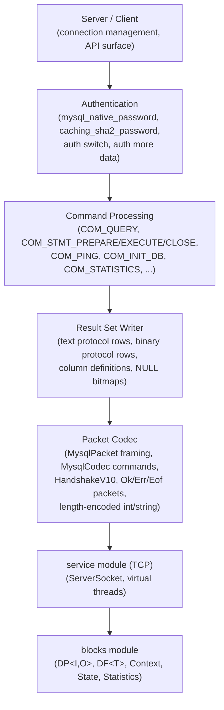
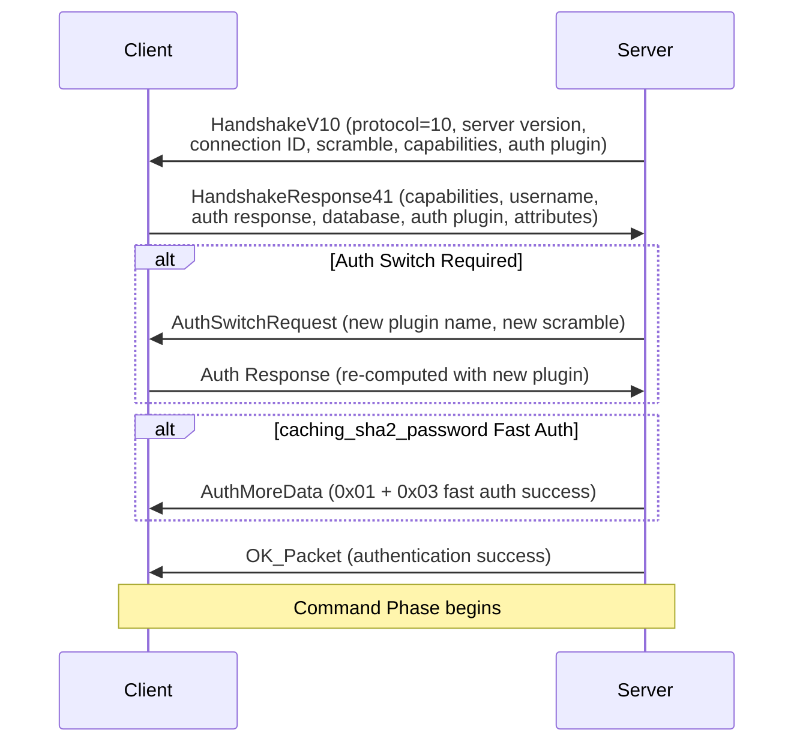
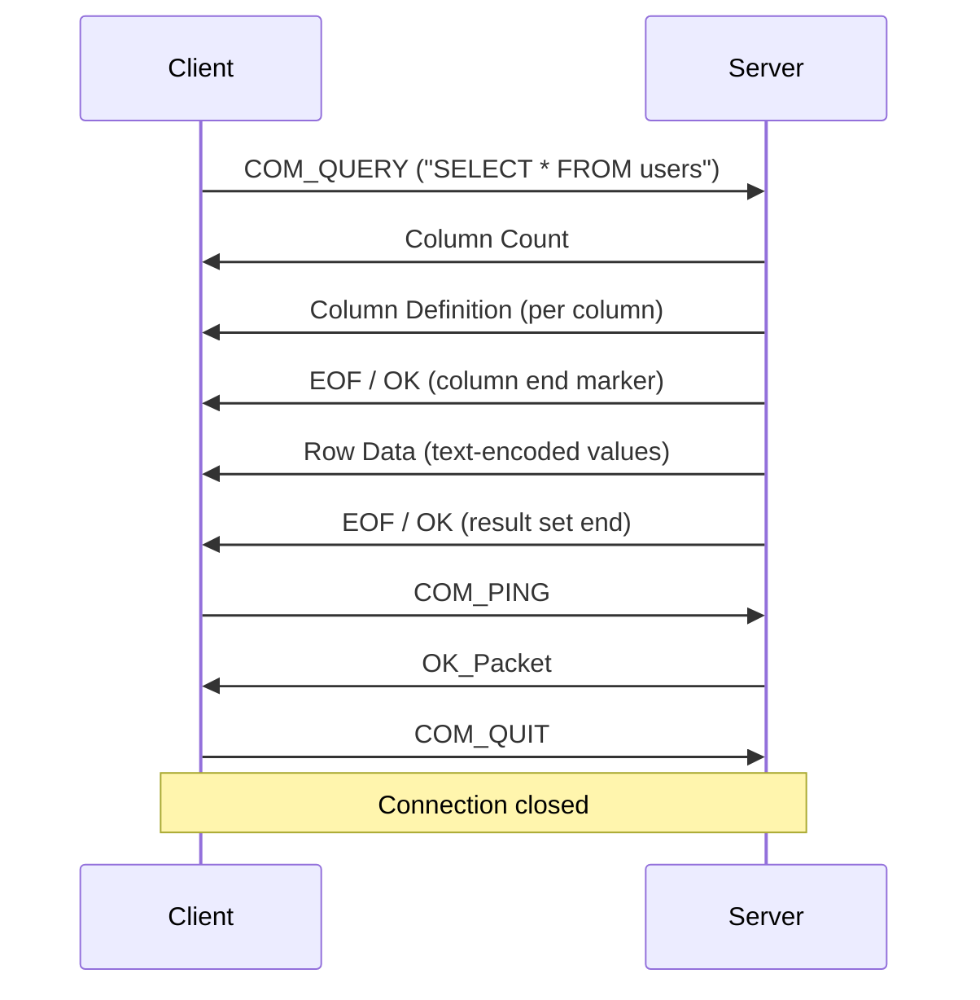
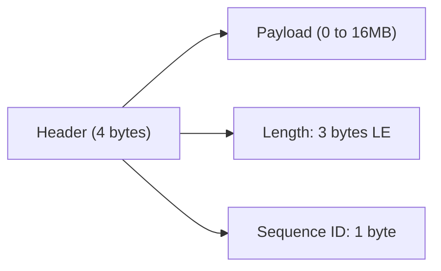
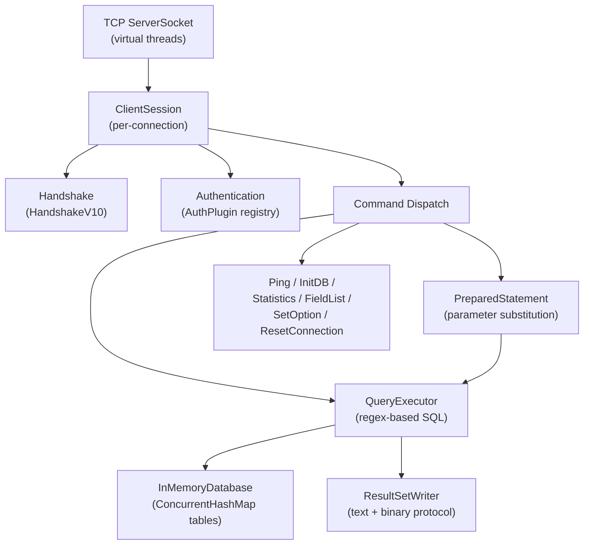
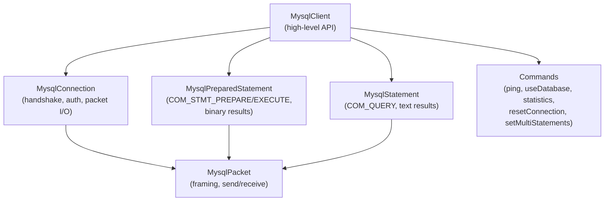
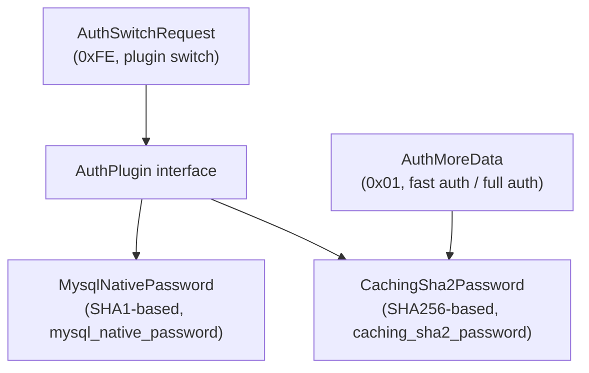
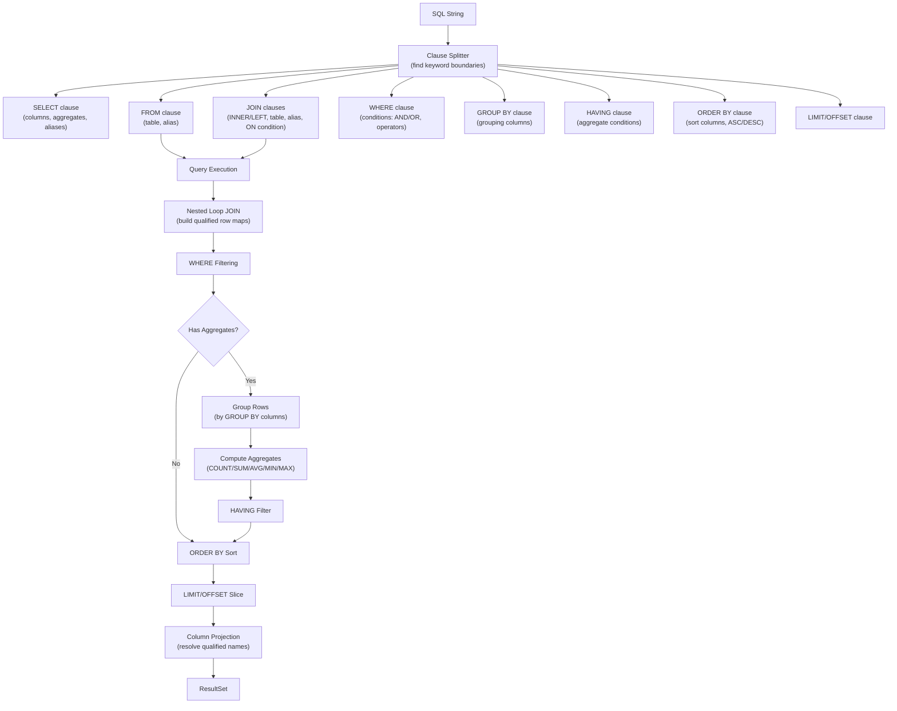
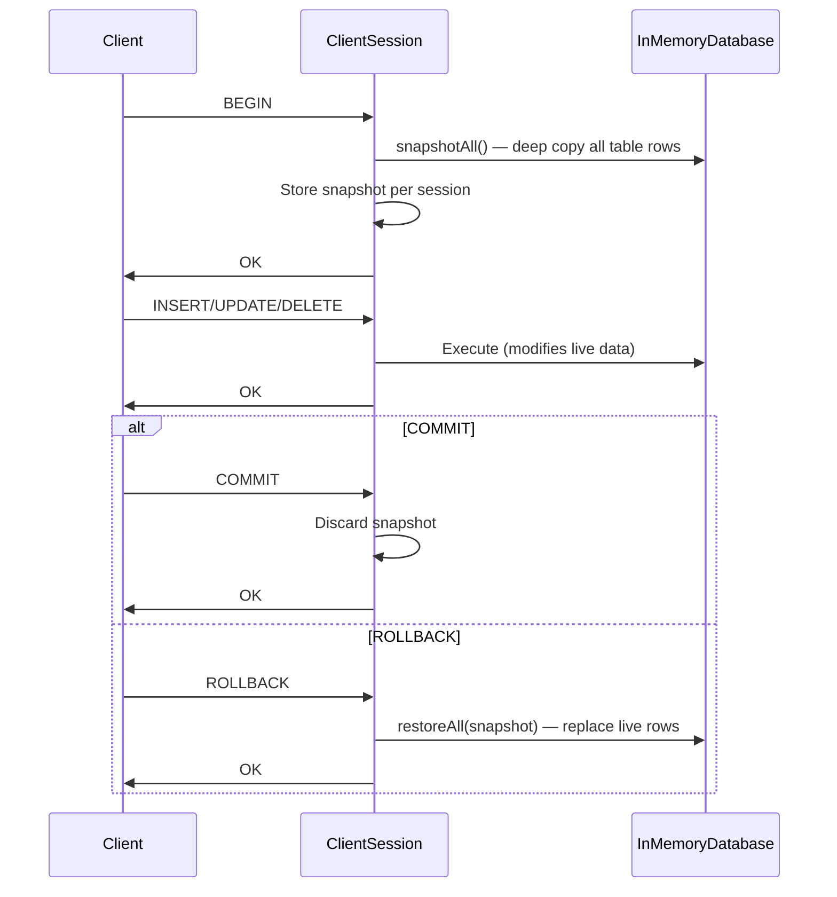

# MySQL Module — Architecture

This document describes the architectural decisions for the MySQL module.

---

## Protocol Overview

The MySQL client/server protocol is a binary protocol over TCP used for communication between MySQL clients and servers. It handles connection setup (handshake + authentication), command execution (queries, prepared statements), and result set transmission. The Lego Flow implementation provides both server and client sides of this protocol.

## Layered Architecture

## Connection Lifecycle

### Handshake Sequence

### Command Phase

## Packet Framing

Every MySQL packet has a 4-byte header followed by the payload:

- Maximum payload per packet: 16,777,215 bytes (2^24 - 1)
- Payloads exceeding the maximum are automatically split into multiple packets with incrementing sequence IDs
- A payload of exactly the maximum size is followed by an empty terminator packet
- Multi-packet reads reassemble the full payload transparently via `MysqlPacket.readFullFrom()`

## Server Architecture

- **MysqlServer**: binds a TCP ServerSocket, creates a virtual thread per connection via `Executors.newVirtualThreadPerTaskExecutor()`
- **ClientSession**: runs in its own virtual thread, handles handshake, authentication, and command processing loop
- **QueryExecutor**: clause-based SQL parser supporting CREATE TABLE, INSERT, SELECT (with JOIN, WHERE, GROUP BY, HAVING, ORDER BY, LIMIT, aggregates), UPDATE, DELETE, DROP TABLE, SHOW TABLES/DATABASES, SELECT VERSION()/DATABASE()
- **InMemoryDatabase**: thread-safe storage with `ConcurrentHashMap` for tables and `CopyOnWriteArrayList` for rows
- **ResultSetWriter**: encodes text and binary result sets with proper column definitions, NULL bitmaps, and EOF/OK terminators
- **PreparedStatement**: server-side state holding the SQL template, parameter count, long data buffers, and parameter substitution logic

## Client Architecture

- **MysqlClient**: factory method `connect()` opens a TCP socket, performs handshake, returns a ready client
- **MysqlConnection**: manages the full handshake and auth flow including auth switch and AuthMoreData handling
- **MysqlStatement**: sends COM_QUERY, reads OK/ERR/result-set responses, decodes text protocol rows
- **MysqlPreparedStatement**: sends COM_STMT_PREPARE, receives PrepareOK + column/param definitions, sends COM_STMT_EXECUTE with typed parameters and NULL bitmap, reads binary protocol results
- **MysqlResult**: cursor-based result set accessor with `next()`, `getString()`, `getInt()`, `getLong()`, `getDouble()`, `isNull()`

## Authentication Architecture

- **mysql_native_password**: `SHA1(password) XOR SHA1(scramble + SHA1(SHA1(password)))`, stored hash is `SHA1(SHA1(password))`
- **caching_sha2_password**: `SHA256(password) XOR SHA256(SHA256(SHA256(password)) + scramble)`, stored hash is `SHA256(SHA256(password))`
- Both plugins implement `generateAuthResponse()` (client-side) and `verify()` (server-side)
- Server maintains a registry of auth plugins and stored password hashes per user

## Length-Encoded Types

Length-encoded integers and strings are used throughout the protocol:

| Byte Range | Encoding |
|------------|----------|
| 0-250 | 1 byte (value itself) |
| 0xFB (251) | NULL marker |
| 0xFC + 2 bytes LE | Values up to 2^16 - 1 |
| 0xFD + 3 bytes LE | Values up to 2^24 - 1 |
| 0xFE + 8 bytes LE | Values up to 2^64 - 1 |

Strings use a length-encoded integer prefix followed by that many bytes of UTF-8 data. Null-terminated strings are used in specific contexts (HandshakeV10 server version, username, auth plugin name).

## Capability Negotiation

Capabilities are a 32-bit bitmask negotiated during the handshake:

- Server advertises capabilities in HandshakeV10 (split across two 16-bit words)
- Client responds with desired capabilities in HandshakeResponse41
- Negotiated = client AND server capabilities
- Key behavioral switches:
  - `CLIENT_PROTOCOL_41`: enables 4.1 protocol features (status flags, warnings in OK/EOF)
  - `CLIENT_DEPRECATE_EOF`: replaces EOF packets with OK packets in result sets
  - `CLIENT_PLUGIN_AUTH`: enables auth plugin negotiation
  - `CLIENT_SESSION_TRACK`: enables session state tracking in OK packets
  - `CLIENT_CONNECT_ATTRS`: enables connection attribute transmission

## SQL Parser Architecture

The QueryExecutor uses a clause-based parsing approach for SELECT queries:

Key design decisions:
- **Keyword boundary detection**: `findKeyword()` checks both letter/digit AND underscore boundaries to avoid matching SQL keywords inside table names (e.g., "WHERE" inside "demo_where")
- **Qualified column names**: JOIN rows store values with both qualified (`alias.col`) and unqualified (`col`) keys for flexible resolution
- **Numeric comparison**: `compareValues()` attempts Double.parseDouble before falling back to String comparison
- **LIKE implementation**: Converts SQL LIKE patterns (`%`, `_`) to Java regex for matching

## Transaction Architecture

- Snapshots are per-ClientSession (per-connection), stored as `Map<String, Map<String, List<Map<String, String>>>>` (database -> table -> rows)
- Each row is deep-copied via `new LinkedHashMap<>(row)` to avoid shared references
- ROLLBACK calls `table.restoreSnapshot()` which clears `CopyOnWriteArrayList` and repopulates from snapshot

## Thread Safety Model

- **MysqlServer**: `ConcurrentHashMap` for databases, user hashes, and auth plugins; `AtomicInteger` for connection counter and active connection count
- **ClientSession**: each session runs in its own virtual thread with isolated state
- **InMemoryDatabase**: `ConcurrentHashMap` for tables; `CopyOnWriteArrayList` for rows within each table; `AtomicLong` for auto-increment IDs
- **PreparedStatement**: per-session, no shared state

## Integration with Lego Flow

| Lego Flow Module | Usage in MySQL |
|------------------|----------------|
| `blocks` | DP<I,O> for packet processing pipeline, Statistics for metrics |
| `service` | TCP socket transport, virtual thread pools, lifecycle management |

---

## Related Documentation

- [Module README](../README.md) | [Requirements](REQUIREMENTS.md) | [Compliance](COMPLIANCE.md)
- [Root Architecture](../../doc/ARCHITECTURE.md) | [Root README](../../README.md)

---

**Last Updated**: 2026-07-06
