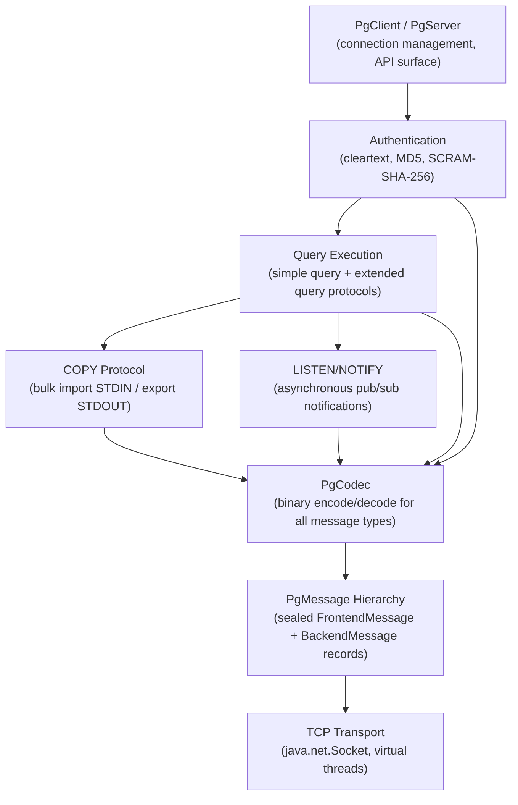
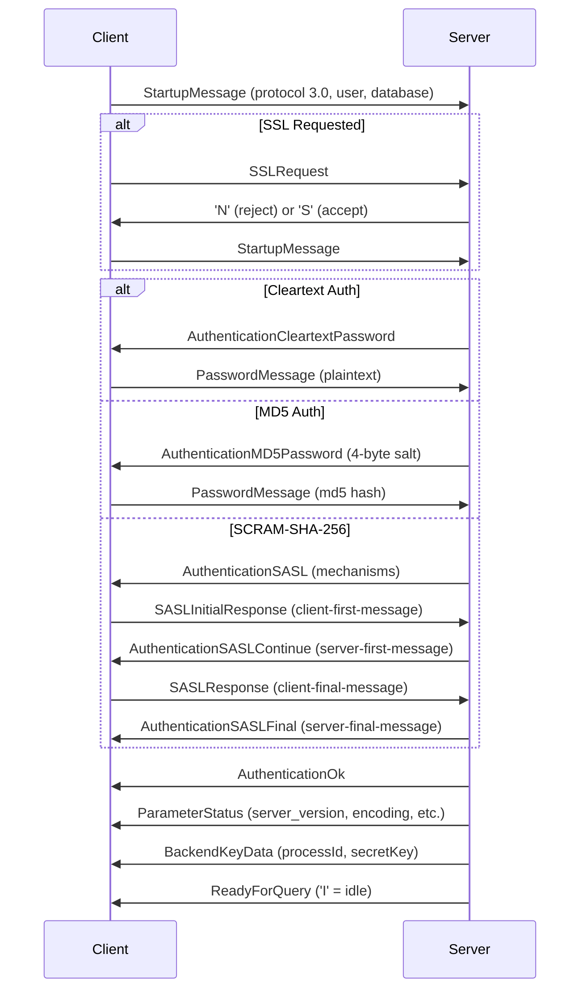
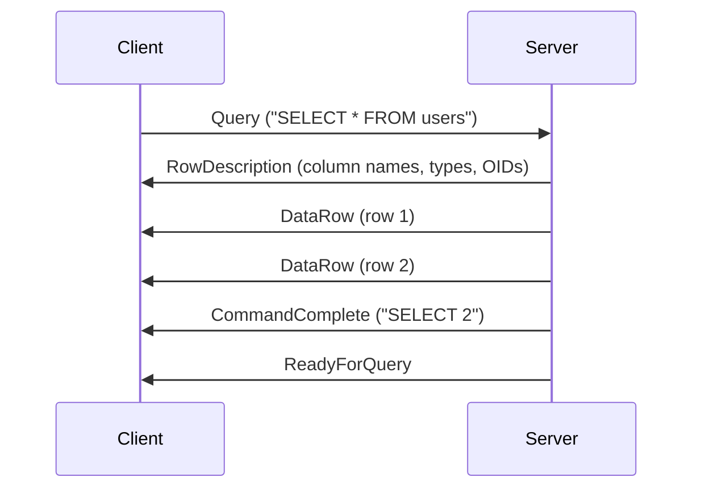
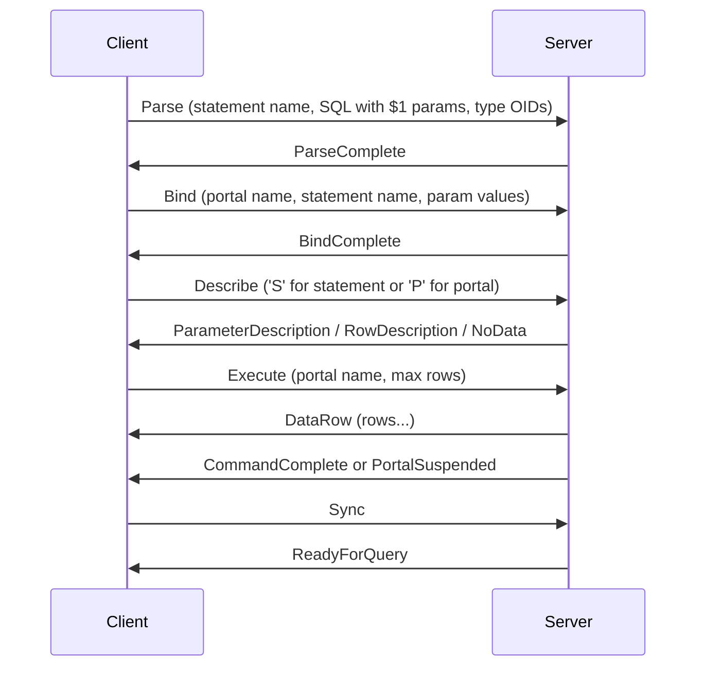
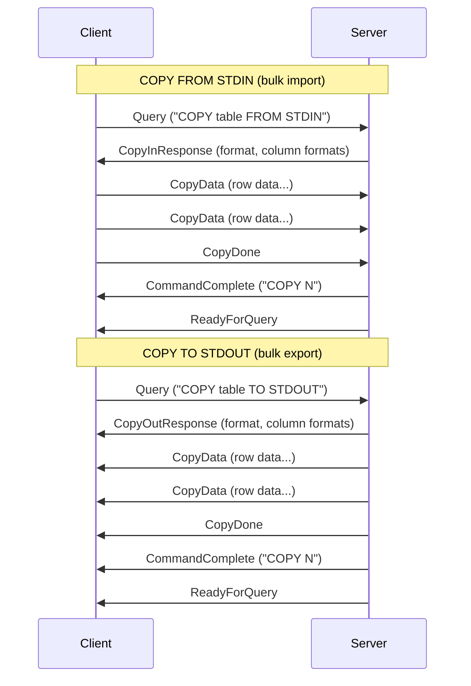
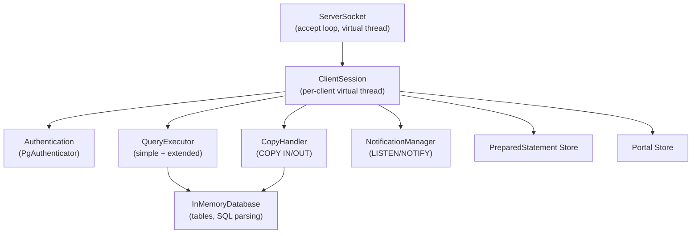
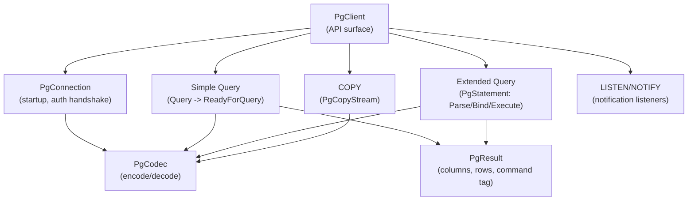
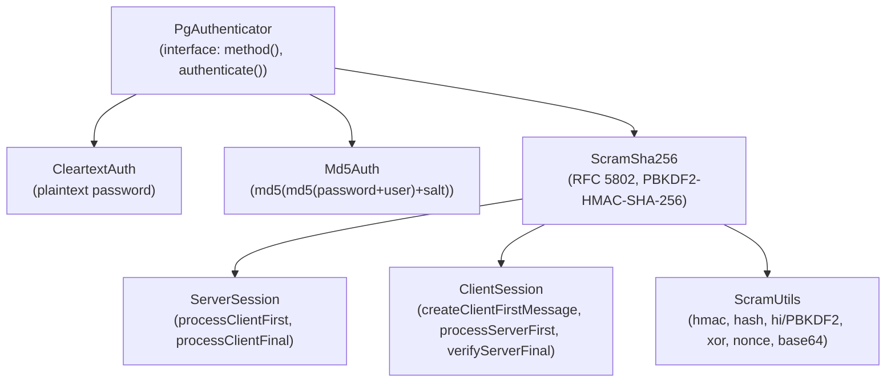
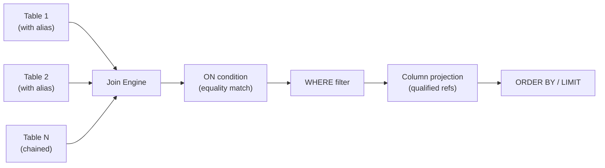

# PostgreSQL Module — Architecture

This document describes the architectural decisions for the PostgreSQL wire protocol module.

---

## Protocol Overview

PostgreSQL uses a message-based protocol (v3) over TCP where the client (frontend) and server (backend) exchange typed messages. Each message (except startup-phase untyped messages) consists of a 1-byte type identifier, a 4-byte length, and a payload. The module implements the full frontend/backend message set including authentication, simple query, extended query, COPY, and LISTEN/NOTIFY protocols.

## Layered Architecture

## Message Type Hierarchy

The wire protocol messages use Java sealed interfaces and records for type safety:

```mermaid
graph TD
    PM["PgMessage<br/>(sealed interface)<br/>byte type()"]
    FM["FrontendMessage<br/>(sealed interface)<br/>client-to-server"]
    BM["BackendMessage<br/>(sealed interface)<br/>server-to-client"]

    PM --> FM
    PM --> BM

    FM --> SM["StartupMessage (untyped)"]
    FM --> SSL["SSLRequest (untyped)"]
    FM --> CR["CancelRequest (untyped)"]
    FM --> PWD["PasswordMessage ('p')"]
    FM --> SASL1["SASLInitialResponse ('p')"]
    FM --> SASL2["SASLResponse ('p')"]
    FM --> Q["Query ('Q')"]
    FM --> P["Parse ('P')"]
    FM --> B["Bind ('B')"]
    FM --> D["Describe ('D')"]
    FM --> E["Execute ('E')"]
    FM --> SY["Sync ('S')"]
    FM --> FL["Flush ('H')"]
    FM --> CL["Close ('C')"]
    FM --> CD1["CopyData ('d')"]
    FM --> CDN1["CopyDone ('c')"]
    FM --> CF["CopyFail ('f')"]
    FM --> T["Terminate ('X')"]

    BM --> AO["AuthenticationOk ('R')"]
    BM --> ACP["AuthCleartextPassword ('R')"]
    BM --> AMD["AuthMD5Password ('R')"]
    BM --> ASASL["AuthSASL* ('R')"]
    BM --> PS["ParameterStatus ('S')"]
    BM --> BKD["BackendKeyData ('K')"]
    BM --> RFQ["ReadyForQuery ('Z')"]
    BM --> RD["RowDescription ('T')"]
    BM --> DR["DataRow ('D')"]
    BM --> CC["CommandComplete ('C')"]
    BM --> EQ["EmptyQueryResponse ('I')"]
    BM --> PC["ParseComplete ('1')"]
    BM --> BC["BindComplete ('2')"]
    BM --> CLC["CloseComplete ('3')"]
    BM --> ND["NoData ('n')"]
    BM --> PD["ParameterDescription ('t')"]
    BM --> PSU["PortalSuspended ('s')"]
    BM --> CIR["CopyInResponse ('G')"]
    BM --> COR["CopyOutResponse ('H')"]
    BM --> CBR["CopyBothResponse ('W')"]
    BM --> CD2["CopyData ('d')"]
    BM --> CDN2["CopyDone ('c')"]
    BM --> NR["NotificationResponse ('A')"]
    BM --> ER["ErrorResponse ('E')"]
    BM --> NTR["NoticeResponse ('N')"]
```

## Connection Lifecycle

### Startup and Authentication

### Simple Query Protocol

### Extended Query Protocol

### COPY Protocol

## Server Architecture

- **PgServer**: opens a `ServerSocket` on a configurable port, runs accept loop on a virtual thread, creates a `ClientSession` per connection
- **ClientSession**: handles the full per-client lifecycle (startup, authentication, query loop, termination), uses pattern matching on sealed `FrontendMessage` types
- **QueryExecutor**: translates SQL into `BackendMessage` sequences; supports simple query (multiple statements separated by `;`) and extended query (Portal execution with row limits)
- **InMemoryDatabase**: SQL engine supporting CREATE TABLE, INSERT, SELECT (with WHERE, ORDER BY, LIMIT, aggregate functions, GROUP BY, HAVING, INNER JOIN, LEFT JOIN), UPDATE, DELETE, DROP TABLE, BEGIN/COMMIT/ROLLBACK/SET
- **NotificationManager**: manages channel-to-listener mappings using `ConcurrentHashMap` and `CopyOnWriteArraySet`
- **CopyHandler**: processes tab-separated COPY IN data and generates COPY OUT data

## Client Architecture

- **PgClient**: main entry point with `connect()` factory method; exposes `query()`, `execute()`, `prepare()`, `copyIn()`, `copyOut()`, `listen()`, `notify()`
- **PgConnection**: manages socket, buffered I/O streams, startup handshake, authentication negotiation (cleartext, MD5, SCRAM-SHA-256)
- **PgStatement**: wraps a named prepared statement; supports `execute(params)` with automatic Bind/Execute/Sync cycle and `describe()` for parameter/column metadata
- **PgResult**: typed result accessor with `getString()`, `getInt()`, `getLong()`, `getBoolean()`, `isNull()`, `affectedRows()`, `allRows()`
- **PgCopyStream**: handles CopyData/CopyDone/CopyFail message exchange for both COPY IN and COPY OUT

## Authentication Architecture

All authenticators store credentials in `ConcurrentHashMap` for thread safety. SCRAM-SHA-256 stores derived keys (StoredKey, ServerKey) rather than plaintext passwords after initial `addUser()` call.

## SQL Engine Enhancements

### Aggregate Functions

The in-memory database supports five aggregate functions: COUNT, SUM, AVG, MIN, MAX. These can be used with or without GROUP BY:

- **Without GROUP BY**: aggregates compute over the entire filtered result set, returning a single row
- **With GROUP BY**: rows are grouped by one or more columns, and aggregates compute per group
- **HAVING**: filters groups based on aggregate conditions (e.g., `HAVING COUNT(*) > 1`)
- **Column aliases**: `SELECT COUNT(*) AS cnt` names the result column

### JOIN Support

The SQL engine supports INNER JOIN and LEFT JOIN between multiple tables:

- **INNER JOIN**: only matching rows from both tables
- **LEFT JOIN**: all rows from the left table, NULL-filled for non-matching right rows
- **Table aliases**: `FROM orders o JOIN customers c ON o.customer_id = c.id`
- **Qualified columns**: `t1.col`, `alias.col`, or plain `col` (resolved by searching all tables)
- **Multiple JOINs**: chained in sequence (e.g., `t1 JOIN t2 ON ... JOIN t3 ON ...`)

## Type System

The `PgType` enum maps 22 PostgreSQL type names to their OIDs with size information:

| Category | Types |
|----------|-------|
| Boolean | bool (OID 16) |
| Integer | int2 (21), int4 (23), int8 (20) |
| Float | float4 (700), float8 (701), numeric (1700) |
| String | varchar (1043), char (1042), text (25) |
| Binary | bytea (17) |
| Date/Time | date (1082), time (1083), timestamp (1114), timestamptz (1184), interval (1186) |
| Structured | uuid (2950), json (114), jsonb (3802), xml (142) |
| System | oid (26), void (2278), unknown (705) |

## Thread Safety Model

- **PgServer**: uses `CopyOnWriteArrayList` for session tracking, `AtomicInteger` for process ID and secret key generation
- **ClientSession**: single-threaded per connection (one virtual thread per client), uses `ConcurrentHashMap` for prepared statement and portal stores
- **InMemoryDatabase**: `ConcurrentHashMap` for tables, `CopyOnWriteArrayList` for rows within each table
- **NotificationManager**: `ConcurrentHashMap<String, CopyOnWriteArraySet>` for channel listeners
- **Authentication stores**: all use `ConcurrentHashMap` for credential storage

---

## Related Documentation

- [Module README](../README.md) | [Requirements](REQUIREMENTS.md) | [Compliance](COMPLIANCE.md)
- [Root Architecture](../../doc/ARCHITECTURE.md) | [Root README](../../README.md)

---

**Last Updated**: 2026-07-06
