# Redis Module — Architecture

This document describes the architectural decisions for the Redis module.

---

## Protocol Overview

Redis uses the RESP (Redis Serialization Protocol) as its wire format. RESP2 (default since Redis 1.2) provides 5 types: Simple String, Error, Integer, Bulk String, and Array. RESP3 (introduced in Redis 6.0) adds 10 additional types: Null, Double, Boolean, Big Number, Blob Error, Verbatim String, Map, Set, Attribute, and Push. This implementation supports both protocol versions with runtime negotiation via the HELLO command.

## Layered Architecture

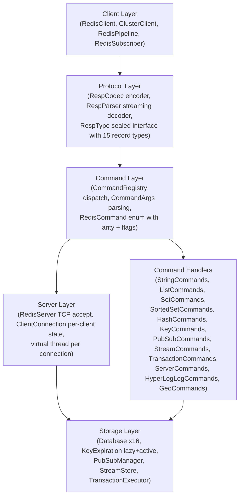

## RESP Type System

The `RespType` sealed interface models all 15 wire types as Java records:

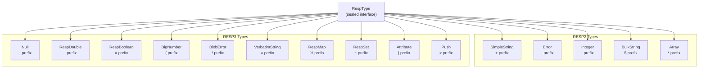

## Server Architecture

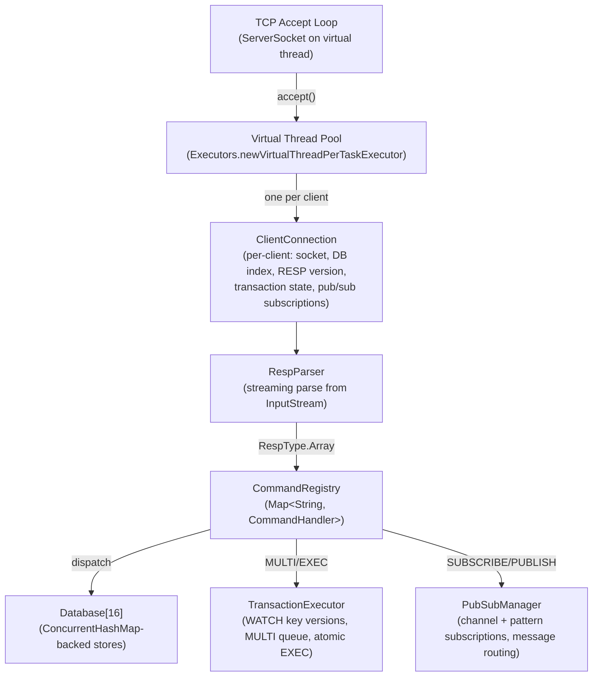

## Command Dispatch Flow

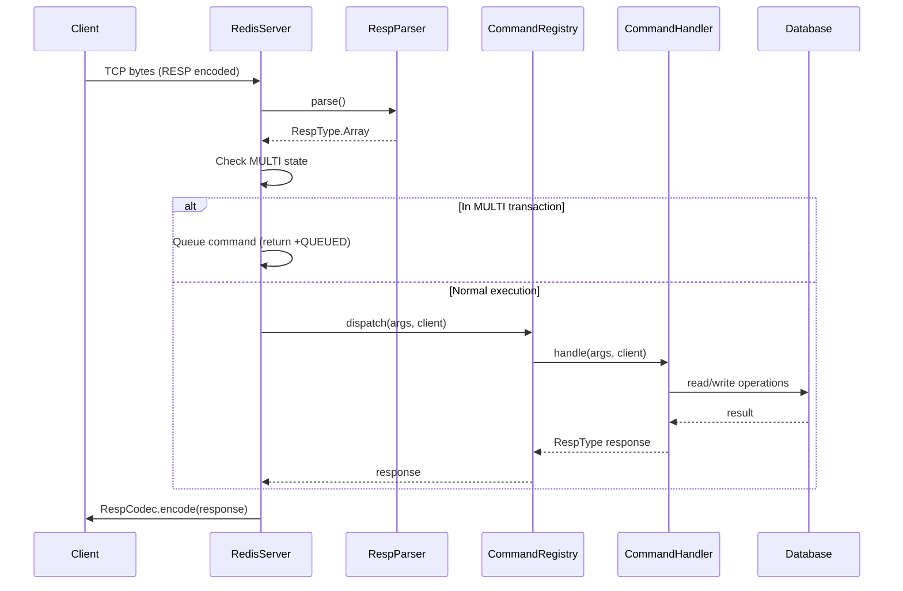

## Data Storage Model

Each of the 16 databases uses `ConcurrentHashMap` for thread-safe key-value storage:

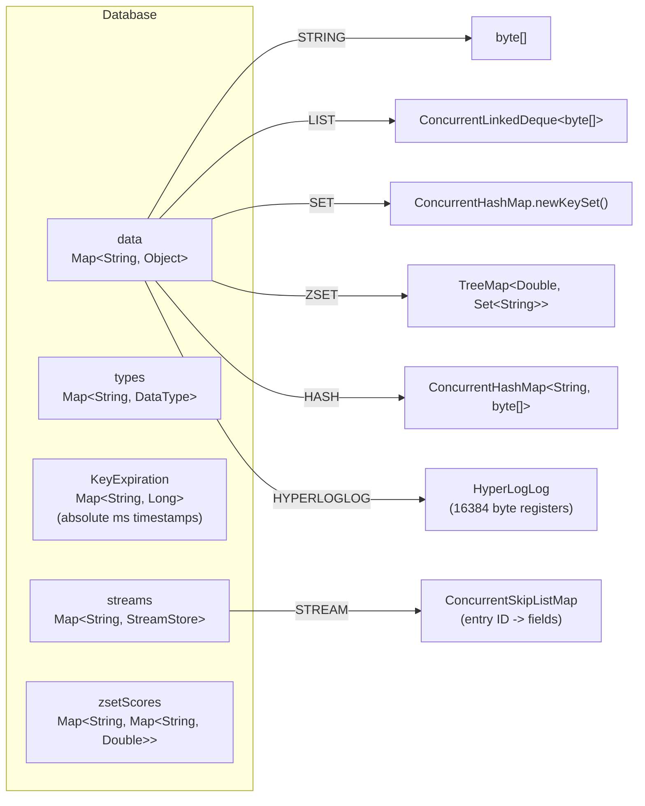

## Key Expiration

Two-tier expiration strategy:

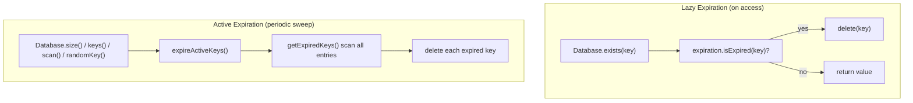

## Transaction Model (MULTI/EXEC with WATCH)

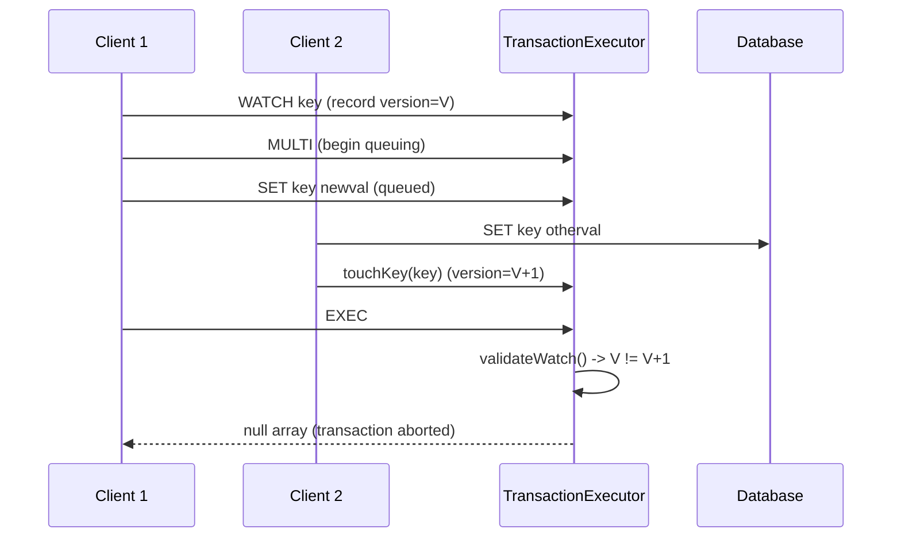

## Pub/Sub Architecture

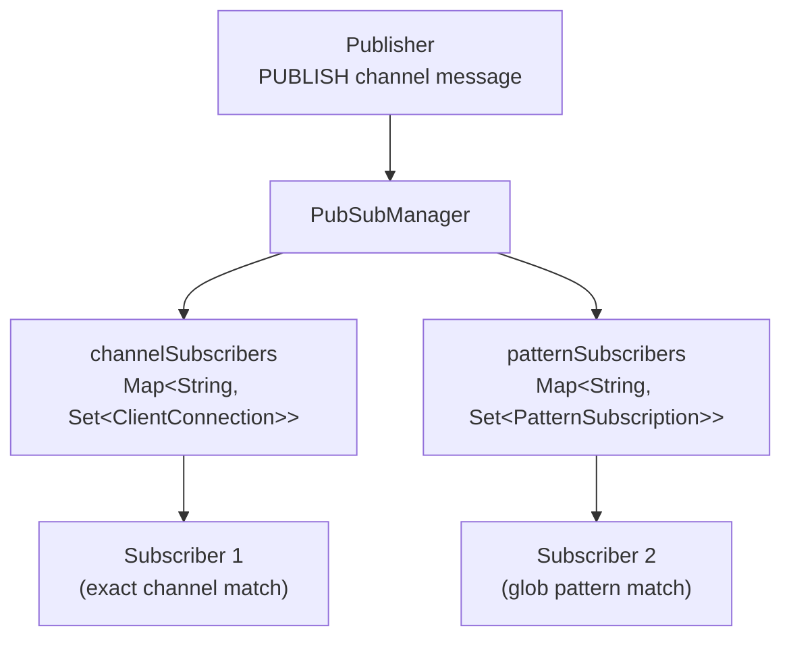

## Stream Store Architecture

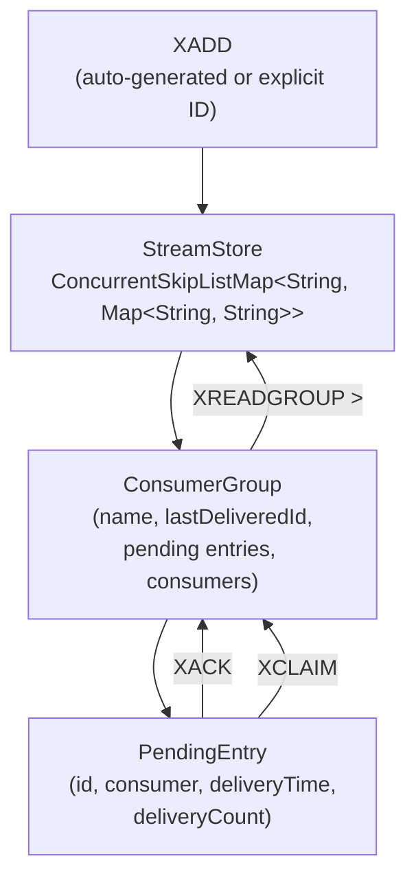

## Cluster Support

The module provides client-side cluster protocol support:

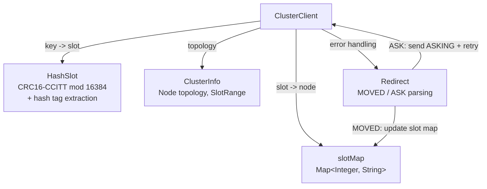

## Authentication (AUTH)

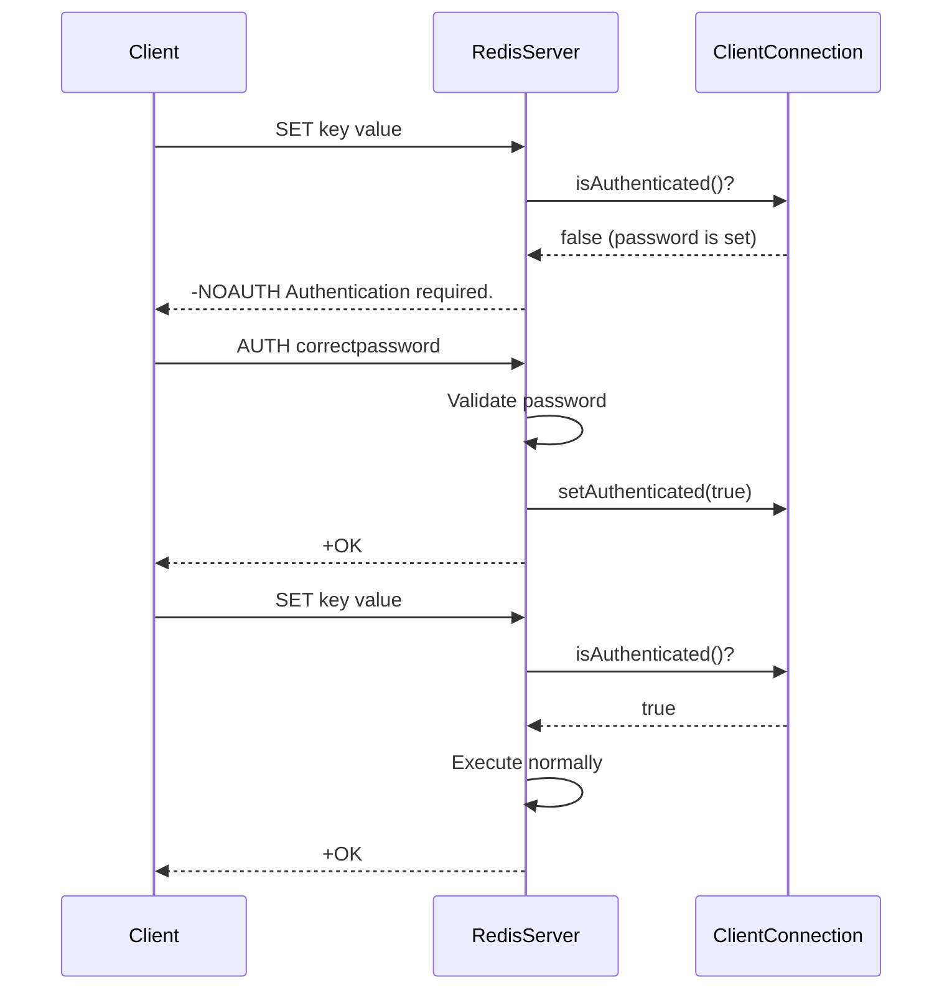

- `RedisServer(String password)` constructor enables authentication
- `ClientConnection.authenticated` tracks per-client auth state
- AUTH, PING, and QUIT bypass the auth check (AUTH_BYPASS set)
- When no password is configured, AUTH returns error "no password is set"

## HyperLogLog Architecture

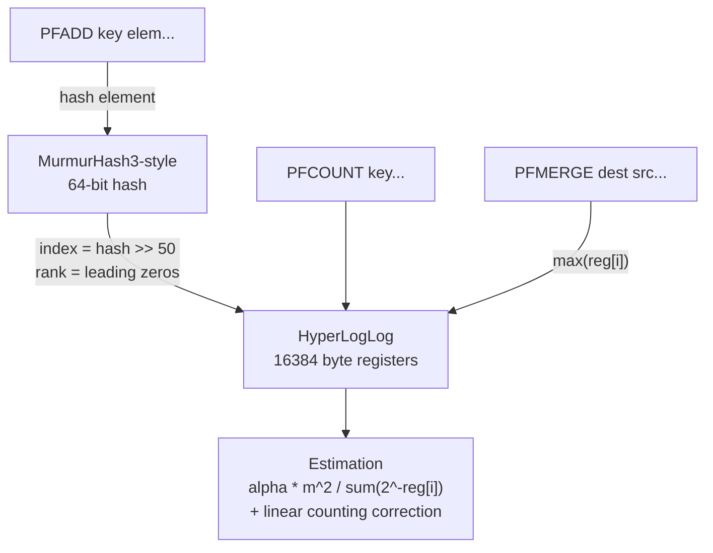

- Uses 2^14 = 16384 registers matching Redis standard
- MurmurHash3-style 64-bit hash for element distribution
- Harmonic mean formula with alpha bias correction
- Small range correction (linear counting) when many registers are zero
- Standard error ~0.81% for typical cardinalities

## Geospatial Architecture

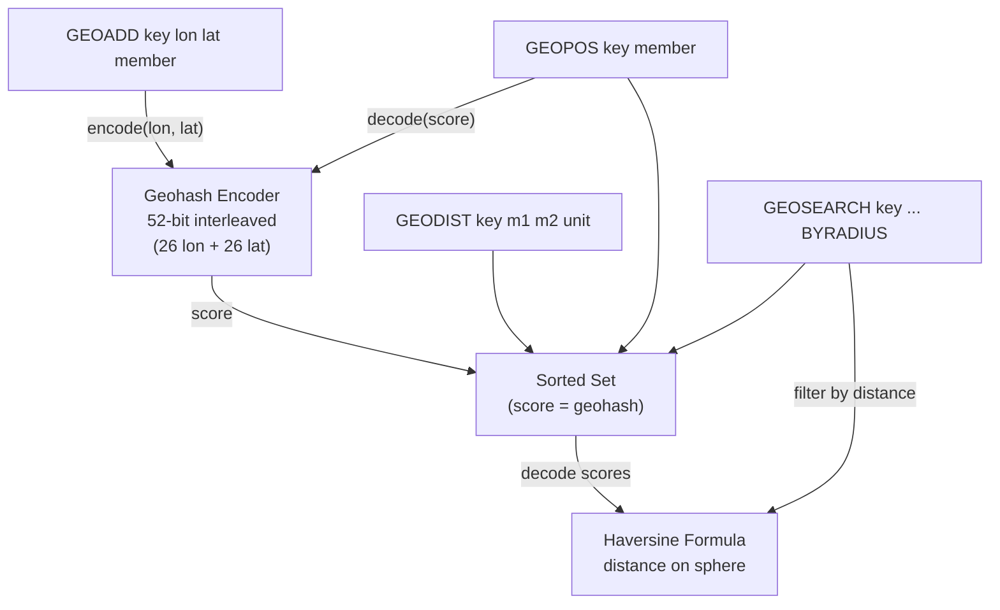

- Geo data stored in standard sorted sets with geohash as score (matching Redis approach)
- 52-bit geohash: 26 bits longitude (-180 to 180), 26 bits latitude (-90 to 90), interleaved
- Haversine formula for great-circle distance (Earth radius = 6,372,797.56 m)
- GEOSEARCH iterates all members and filters by Haversine distance
- Distance units: meters (m), kilometers (km), miles (mi), feet (ft)

## Thread Safety Model

- **Server**: `AtomicBoolean` for running state; `ConcurrentHashMap.newKeySet()` for client tracking
- **Database**: all internal maps are `ConcurrentHashMap`; sorted sets use `Collections.synchronizedNavigableMap`
- **ClientConnection**: output writes synchronized on the `OutputStream` object
- **KeyExpiration**: `ConcurrentHashMap<String, Long>` for atomic read/write of timestamps
- **PubSubManager**: `ConcurrentHashMap` for subscribers; `CopyOnWriteArraySet` for per-channel client sets
- **StreamStore**: `ConcurrentSkipListMap` for ordered entries; `AtomicLong` for ID generation
- **TransactionExecutor**: `ConcurrentHashMap` for global key versions; per-client `TransactionState` is single-threaded

## Extension Points

- **CommandHandler**: functional interface -- register custom commands via `CommandRegistry.register(name, handler)`
- **CommandRegistry**: add new command categories by following the static `register()` pattern
- **Database**: data type storage is extensible via the `DataType` enum and `ConcurrentHashMap<String, Object>` backing store

---

**Last Updated**: 2026-07-06
