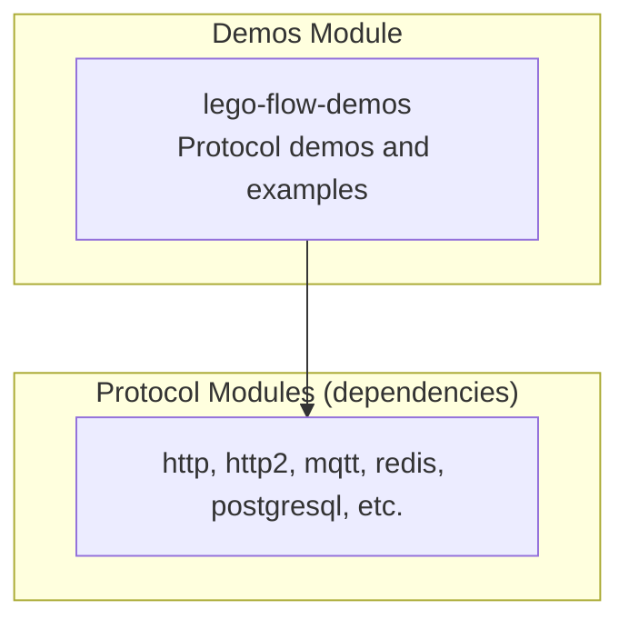

# Demos Module — Architecture

## Module Purpose

The **demos** module contains protocol demonstration code that exercises each Lego Flow protocol implementation. It is excluded from the install/deploy lifecycle and serves as reference implementations for developers.

## Key Abstractions

## Design Patterns

### Demo Progression Pattern
Demos follow the progression pattern documented in AGENTS.md:
- **Simplest** → Basic protocol operation (single request/response)
- **Average** → Typical production usage with authentication, content types
- **Complex** → Full feature set including SSL, caching, multiplexing

### Reference Implementation Convention
- Demo classes are NOT tests — they are reference code that developers can study or run
- Placed in `src/main/java/*/demo/` packages within the demos module
- May be exercised by test classes in protocol modules via demo imports

## Extension Points

### Adding New Demos
1. Create demo class under appropriate protocol package (e.g., `ssg/legoflow/demo/http/`)
2. Include the protocol module as dependency in both Maven and Gradle configs
3. Follow the simplest → average → complex progression pattern

## CI Integration

Demos are excluded from install/deploy lifecycle but included in compilation verification to ensure they remain valid reference implementations.
