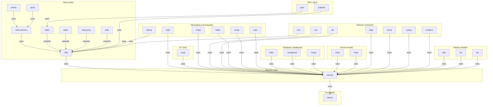
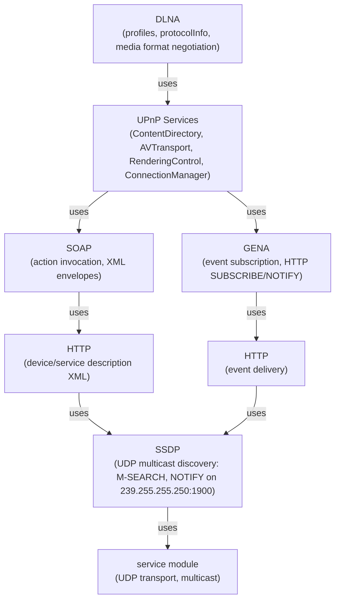
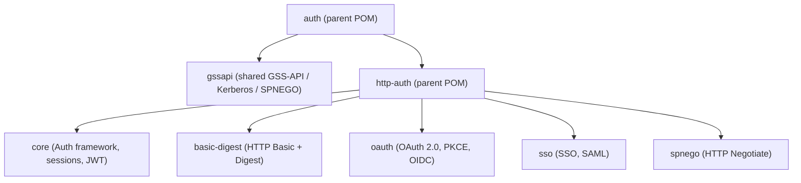
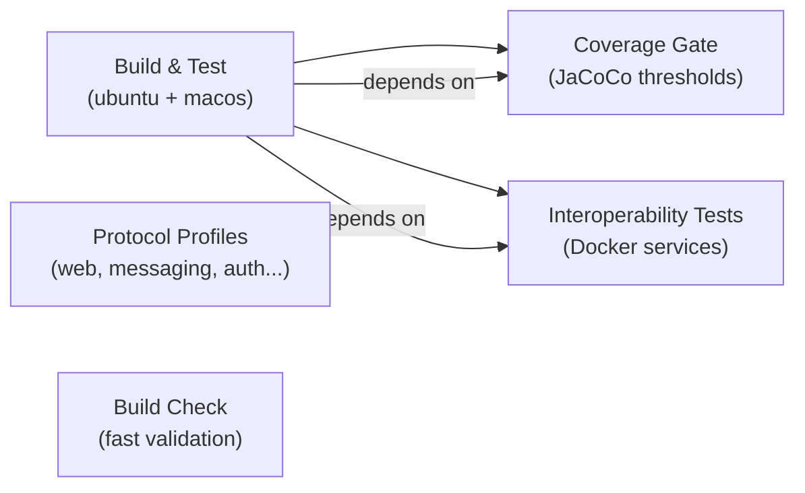

# Lego Flow Architecture

This document describes the current architectural decisions for the Lego Flow project. It is edited in place to always reflect the latest state.

---

## Project Purpose

Lego Flow is a composable data processing framework providing layered abstractions from low-level data blocks to high-level protocol implementations. The design philosophy is "building blocks" — small, composable units that snap together to form complex data processing pipelines and network services.

## Layered Architecture

Each layer depends only on layers below it. No circular dependencies.

## Key Abstractions

### DP<I,O> — Data Processor (blocks)
- Bidirectional data processing unit
- Remote boundary: consume(I) / produce(I)
- Local boundary: accept(O) / submit(O)
- Internal conversion: I↔O with filter chains at each boundary
- Closeable, stateful, statistics-tracking

### DF<T> — Data Filter (blocks)
- Positioned at boundaries: DF<I> at remote boundary, DF<O> at local boundary
- Can transform, validate, or reject data
- Chainable (SequencedCollection<DataFilter>)

### Context (blocks → extended in each layer)
- blocks: logging, statistics, error handling, attributes
- service: + scopes (Site, Application, Session, Request), users, roles
- http: + HTTP specifics (method, URI, headers)
- websocket: + endpoint specifics
- wamp: + WAMP session, realm

## Dual API Design (service and above)

### Approach: Wrapper Pattern
- **Core implementation is synchronous** (procedural)
- **Async variant is a lightweight wrapper** returning CompletableFuture, delegating to sync on virtual threads
- Single code path, no duplication

### Approach: Combined Procedural + Functional
- **Procedural methods** coexist with **functional-style default methods** in the same interfaces
- Functional package provides pipelines, builders, composers
- Consistent pattern across service, http, websocket, wamp

## Thread Safety Model

- **Virtual threads** (JDK 21) for all I/O-bound operations
- **Scoped Values** (JDK 23) for context propagation across virtual threads — replaces ThreadLocal
- **Structured Concurrency** (JDK 23) for parallel service startup/shutdown with dependency ordering
- **Concurrent collections** and **atomic counters** for shared state
- **Pattern matching on sealed interfaces** for compile-time exhaustive dispatch

## HTTP Feature System

Features divided into categories: CORE (always on), TRANSFER, CONTENT, CACHING, CONNECTION, ENTITY, METADATA, SECURITY, WEBSOCKET, STATIC, HTTP2, HTTP3. Each is a pluggable HttpFeature with enable/disable/configure. Standard profiles group features for common scenarios.

Server side: fully configurable (enable/disable any feature).
Client side: adaptive (config defines allowed features as upper bounds, client negotiates within limits).

## HTTP/2 Architecture

Full RFC 7540 / RFC 9113 implementation as a separate module (`http2`) that extends the `http` module's feature system via `HttpFeatureCategory.HTTP2`. Uses TCP transport with binary framing, HPACK header compression, stream multiplexing, flow control, server push, and H2c upgrade. The `Http2RequestAdapter` bridges HTTP/2 streams to the existing `HttpRouter` so handlers require no changes.

## HTTP/3 Architecture

Full RFC 9114 implementation as a separate module (`http3`) that extends the `http` module's feature system via `HttpFeatureCategory.HTTP3`. Built on QUIC transport (RFC 9000) which uses UDP instead of TCP, providing connection-level encryption, independent stream multiplexing without head-of-line blocking, 0-RTT connection establishment, and connection migration. QPACK (RFC 9204) provides header compression adapted for QUIC's out-of-order delivery.

**Why a separate module (not inline in http):** QUIC uses fundamentally different transport (UDP datagrams vs TCP byte streams). The connection lifecycle, loss recovery, congestion control, and stream multiplexing all operate at the transport layer rather than the application layer. This makes HTTP/3 architecturally distinct from HTTP/1.1 and HTTP/2 (both TCP-based), warranting its own module. The same pattern is used for http2.

## UDP Transport (service module)

The service module supports UDP-based communication alongside the existing TCP/NIO channel infrastructure:

- **UdpDataChannel** — DataChannel implementation for UDP datagrams, wrapping a `DatagramChannel`
- **DatagramHandler** — callback interface for datagram events (onReceive, onSend, onError)
- **MulticastDataChannel** — extends UdpDataChannel with multicast group management (join, leave, TTL)
- **MulticastConfig** — configuration record for multicast settings (group address, network interface, TTL)
- **DatagramPacketInfo** — metadata record carrying source/destination address and port for each datagram
- **UdpChannelManager** — manages UDP channels with virtual-thread receive loops, analogous to SelectableChannelManager for TCP

## WAMP Architecture

Two-layer design:
1. **Invariant base** (`wamp.core`) — pure WAMP protocol, transport-agnostic
2. **WebSocket adapter** (`wamp.adapter.websocket`) — bridges to HTTP module's WebSocket support

WampTransport is the SPI boundary. Core tests use in-memory transport. Future adapters (raw TCP, long-polling) don't touch core logic.

## UPnP/DLNA Architecture

The `upnp` module implements the UPnP Device Architecture (UDA) and DLNA guidelines, layered on top of the `http`, `service`, and `web-services` modules.

### Protocol Layers

### Device Model

- **Device types**: root devices, embedded devices, each with a UDN (Unique Device Name)
- **Service types**: each device exposes services with a Service Control Protocol Description (SCPD)
- **SCPDs**: XML documents listing actions and state variables per UPnP service
- Standard URNs: `urn:schemas-upnp-org:device:MediaServer:1`, `urn:schemas-upnp-org:service:ContentDirectory:1`, etc.

### Media Server Architecture

- **ContentDirectory**: Browse/Search actions returning DIDL-Lite XML with item/container metadata
- **ConnectionManager**: GetProtocolInfo, PrepareForConnection for media format negotiation
- Content is organized as a hierarchical tree (containers and items with parent IDs)

### Media Renderer Architecture

- **AVTransport**: state machine (STOPPED -> PLAYING -> PAUSED_PLAYBACK, with TRANSITIONING intermediary states)
- **RenderingControl**: volume (0-100) and mute per channel (Master, LF, RF)
- SetAVTransportURI loads content, Play/Pause/Stop/Seek control playback

### Control Point Architecture

1. **Discovery**: SSDP M-SEARCH to find devices, listen for NOTIFY advertisements
2. **Description fetch**: HTTP GET device/service XML descriptions
3. **Action invocation**: SOAP POST to service control URLs
4. **Event subscription**: GENA SUBSCRIBE to service event URLs, receive NOTIFY callbacks

### Integration with Lego Flow

- Uses `service` module UDP transport (UdpDataChannel, MulticastDataChannel) for SSDP
- Uses `http` module server for hosting device descriptions, SOAP endpoints, and GENA callbacks
- Uses `web-services` module for XML content negotiation and endpoint routing

## IoT Protocols Layer

The IoT protocol modules are now organized under their respective category directories: `coap` under `iot/`, and `mqtt`/`xmpp` under `messaging/`. They use `service` for lifecycle/transport and `blocks` for data processing primitives. Unlike the HTTP-based protocols, these modules operate independently of the `http` module, using their own transport mechanisms (TCP for MQTT/XMPP, UDP for CoAP).

### MQTT Architecture

MQTT v3.1.1/v5.0 publish/subscribe messaging built on TCP transport from the `service` module. The broker manages a topic tree for message routing with wildcard matching, session persistence for offline clients, and QoS message flow state machines. The client supports auto-reconnect, keep-alive ping, and ordered message delivery. All 15 MQTT control packet types are handled by a binary packet codec.

### CoAP Architecture

CoAP (RFC 7252) constrained RESTful protocol built on UDP transport from the `service` module. Uses a message layer (CON/NON/ACK/RST) with reliability via retransmission and deduplication, and a request/response layer mapping REST methods (GET/PUT/POST/DELETE) onto compact binary messages. Observe (RFC 7641) adds server-push notifications for resource changes. Blockwise transfer (RFC 7959) enables large payloads over constrained links. Resource discovery via /.well-known/core with CoRE Link Format (RFC 6690).

### XMPP Architecture

XMPP (RFC 6120/6121) XML stream protocol built on TCP transport from the `service` module. The connection lifecycle flows through TLS negotiation, SASL authentication, and resource binding before stanza exchange. Three stanza types (message, presence, iq) carry all application data. IoT extensions (XEP-0323 sensor data, XEP-0325 control, XEP-0347 discovery) provide machine-to-machine communication over the XMPP fabric. Stream management (XEP-0198) adds reliable delivery with acknowledgement and session resumption.

## HTTP Proxy Architecture

The `http-proxy` module provides three proxy types built on the `http` module:

- **Forward Proxy** — client-side HTTP proxy with CONNECT tunneling support, Via/X-Forwarded-For header injection, configurable access control (allowlist/denylist), and bidirectional byte relay via virtual threads
- **Reverse Proxy** — server-side proxy with path-based routing, backend selection via pluggable load balancers (round-robin, least-connections), periodic health checking, WebSocket upgrade forwarding, and streaming response piping
- **Caching Proxy** — HTTP caching layer with Cache-Control, ETag, Last-Modified conditional request handling, LRU eviction, configurable TTL, and path inclusion/exclusion rules

All proxy types integrate with the HTTP module's `HttpRequestHandler` for seamless router integration.

## Auth Module Architecture

The `auth` module is a parent POM grouping all authentication-related sub-modules under a unified hierarchy:

### GSSAPI Module (shared)

The `gssapi` module provides reusable GSS-API, Kerberos V5, and SPNEGO primitives consumed by multiple protocols:

- **SSH** — `GssApiAuth` uses `GssContextWrapper` for RFC 4462 "gssapi-with-mic" authentication
- **HTTP** — `NegotiateAuthScheme` (in `spnego`) uses `SpnegoTokenHandler` + `GssContextFactory` for RFC 4559 SPNEGO auth
- **XMPP** — future SASL GSSAPI mechanism
- **FTP** — future GSS-API authentication (RFC 2228)

Key classes: `GssOids` (OID constants), `GssConfig` (builder), `GssContextFactory`, `GssContextWrapper` (AutoCloseable wrapper around JDK `GSSContext`), `SpnegoTokenHandler` (ASN.1 DER encoding/decoding), `KerberosCredentialManager` (keytab/password login via `LoginContext`).

All crypto delegates to JDK's `org.ietf.jgss` and `javax.security.auth` — no third-party dependencies.

### HTTP Auth Sub-modules

- **core** — `AuthenticationScheme` SPI, `AuthSchemeRegistry`, `AuthFilter`/`AuthMiddleware` for HTTP pipeline integration, `SessionManager` with pluggable `SessionStore`, `JwtTokenProvider` (HS256/HS384/HS512/RS256 from scratch, no libraries)
- **basic-digest** — HTTP Basic (RFC 7617) with `BasicUserStore` SPI and hashed password storage, HTTP Digest (RFC 7616) with nonce management and replay protection
- **oauth** — OAuth 2.0 client (`OAuth2Client`) with PKCE (S256/plain), `OAuth2AuthorizationServer` with authorization code flow, OpenID Connect (`OpenIdConnectClient`, `IdToken`, `UserInfo`, `OidcDiscovery`), 7 provider templates (Google, GitHub, Microsoft, Facebook, Twitter, Apple, generic)
- **sso** — `SsoManager` for single sign-on with session bridging, `ReverseProxySso` for header-based authentication injection (X-Forwarded-User, X-Auth-Token), `SamlAssertionParser` for SAML 2.0 response/assertion XML parsing with signature and condition validation
- **spnego** — `NegotiateAuthScheme` implements `AuthenticationScheme` for HTTP Negotiate (RFC 4559), bridges to the shared `gssapi` module for SPNEGO token processing and GSS context establishment

The modular design allows consumers to depend on only the auth mechanisms they need (e.g., `http-auth-oauth` for OAuth without pulling in SAML/SSO/SPNEGO).

## Protocol Add-on Categories

### Messaging Category (messaging/)

Seven messaging protocol modules covering message brokers, event streaming, pub/sub, and real-time messaging:

- **Kafka** — Binary wire protocol with 60+ API keys, partition-based log, consumer groups, exactly-once semantics (idempotent + transactional), gzip compression
- **AMQP 1.0** — ISO 19464 framing (frames → sessions → links), type system encoding, delivery semantics (at-most-once, at-least-once, exactly-once), SASL
- **STOMP 1.2** — Simple text-based messaging with heartbeats, receipts, transactions, TCP + WebSocket adapters
- **NATS** — Cloud-native pub/sub with request/reply, queue groups, JetStream persistent streaming
- **MQTT** — (moved from root) IoT pub/sub with QoS 0/1/2, topic wildcards, retained messages
- **XMPP** — (moved from root) XML stream protocol with presence, messaging, IoT extensions
- **WAMP** — (moved from root) Invariant core (RPC + Pub/Sub) with WebSocket adapter

### RPC Category (rpc/)

- **gRPC** — HTTP/2 transport with protobuf binary wire format, 4 streaming modes (unary, server, client, bidi), deadlines, interceptors
- **GraphQL** — Schema/type system, query parsing, validation, execution engine, introspection, HTTP + WebSocket bindings

### Database Category (database/)

- **Redis** — RESP2/RESP3 protocol, all command categories (strings, lists, sets, sorted sets, hashes, streams), pub/sub, pipelining, transactions, cluster protocol
- **PostgreSQL** — Frontend/backend message protocol, authentication (MD5, SCRAM-SHA-256), simple/extended query protocol, prepared statements, COPY, LISTEN/NOTIFY
- **MySQL** — Handshake v10, auth plugins, COM_QUERY, COM_STMT_PREPARE, result sets, multi-resultset, SSL

### Email Category (email/)

- **SMTP** — EHLO, AUTH (PLAIN, LOGIN, CRAM-MD5), STARTTLS, MIME multipart (shared email/common), pipelining, DSN
- **IMAP** — FETCH, STORE, SEARCH, IDLE push notifications, CONDSTORE, COMPRESS, STARTTLS

### Network Category (network/)

Eight network protocol modules including shared BER/ASN.1 codec:

- **DNS** — Binary packet format, all record types, EDNS0, DNSSEC validation, DoH, DoT, recursive resolver + authoritative server
- **LDAP** — BER codec (shared network/common), bind, search with filter expressions, extended operations, STARTTLS
- **SNMP** — BER codec (shared network/common), PDU types, USM security, VACM, MIB OID tree
- **Syslog** — RFC 5424 structured messages, UDP/TCP/TLS transports
- **Modbus** — Function codes for coils/registers, MBAP header framing, TCP transport
- **SSH** — (moved from root) Transport, kex, ciphers, auth, channels, SFTP, SCP
- **FTP** — (moved from root) Client + server, TLS, REST, implicit FTPS

### Media Category (media/)

- **RTSP** — Streaming control (DESCRIBE, SETUP, PLAY, PAUSE, TEARDOWN), SDP negotiation (shared media/common), interleaved binary data
- **RTP/RTCP** — Real-time media transport with jitter buffer, RTCP interval calculation, SSRC collision detection
- **SIP** — VoIP signaling with dialog state machine, transaction layer, SDP offer/answer (shared media/common), registration

## TLS Strategy

TLS is implemented **per-module** using JDK's `javax.net.ssl.SSLEngine` — no shared TLS utilities module. Each protocol integrates TLS differently:

- **HTTP** — `SslFilter` as `DataFilter<byte[]>` wrapping entire connection
- **MQTT** — whole-connection TLS via `MqttTlsConfig` + SSLEngine handshake at connect
- **XMPP** — STARTTLS mid-stream upgrade via `TlsHandler` (stream restart after TLS)
- **FTP** — separate TLS for control channel (AUTH TLS) and data channels, CCC to clear control
- **HTTP/3** — `QuicTlsEngine` wrapping TLS 1.3 for QUIC CRYPTO frames with ALPN (h3)
- **SSH** — own key exchange and encryption (not TLS-based, per SSH-2 spec)

The integration points differ enough that a shared module would add coupling without reducing complexity.

## Extension Points

- **blocks**: custom DP<I,O> implementations, custom DF<T> filters
- **service**: custom Service implementations, custom Scope types, custom AccessControl, custom DataChannel (TCP/UDP), custom DatagramHandler
- **http**: HttpFeature interface for new feature categories, SecurityExtension / AppSecurityExtension for security
- **http2**: custom push policy, custom frame handler for extension frames, profile customization
- **http3**: custom QUIC configuration, connection migration policy, 0-RTT policy
- **websocket**: custom Endpoint handlers, custom ContentCodec
- **wamp**: WampTransport SPI for new transport bindings
- **upnp**: custom ContentDirectory providers, custom media renderer backends, custom device types, custom DLNA profiles
- **mqtt**: custom authenticator, custom topic filter, custom message interceptor, persistence backend SPI
- **coap**: custom resource handlers, custom content formats, custom observe policy, custom block size
- **xmpp**: custom stanza handlers, custom SASL mechanisms, custom XEP extensions, custom IoT data providers
- **http-proxy**: custom ProxyFilter, ProxyAccessControl, LoadBalancer, ProxyCacheStore, ProxyAuthenticator
- **gssapi**: custom GssConfig for different realms/KDCs, extensible for non-Kerberos GSS mechanisms
- **http-auth**: custom AuthenticationScheme, SessionStore, TokenProvider, OAuthProvider, BasicUserStore

## Module Documentation

> See also: [Root README](../README.md) | [Requirements](REQUIREMENTS.md)

### Architecture Documents by Module

#### Core
- [blocks](../blocks/doc/ARCHITECTURE.md)
- [service](../service/doc/ARCHITECTURE.md)

#### Web
- [http](../web/http/doc/ARCHITECTURE.md)
- [http2](../web/http2/doc/ARCHITECTURE.md)
- [http3](../web/http3/doc/ARCHITECTURE.md)
- [web-services](../web/web-services/doc/ARCHITECTURE.md)
- [http-proxy](../web/http-proxy/doc/ARCHITECTURE.md)

#### IoT
- [upnp](../iot/upnp/doc/ARCHITECTURE.md)
- [coap](../iot/coap/doc/ARCHITECTURE.md)

#### Auth
- [gssapi](../auth/gssapi/doc/ARCHITECTURE.md)
- [http-auth](../auth/http-auth/doc/ARCHITECTURE.md)
  - [core](../auth/http-auth/core/doc/ARCHITECTURE.md)
  - [basic-digest](../auth/http-auth/basic-digest/doc/ARCHITECTURE.md)
  - [oauth](../auth/http-auth/oauth/doc/ARCHITECTURE.md)
  - [sso](../auth/http-auth/sso/doc/ARCHITECTURE.md)
  - [spnego](../auth/http-auth/spnego/doc/ARCHITECTURE.md)

#### Messaging
- [kafka](../messaging/kafka/doc/ARCHITECTURE.md)
- [amqp](../messaging/amqp/doc/ARCHITECTURE.md)
- [stomp](../messaging/stomp/doc/ARCHITECTURE.md)
- [nats](../messaging/nats/doc/ARCHITECTURE.md)
- [mqtt](../messaging/mqtt/doc/ARCHITECTURE.md)
- [xmpp](../messaging/xmpp/doc/ARCHITECTURE.md)
- [wamp](../messaging/wamp/doc/ARCHITECTURE.md)

#### RPC
- [grpc](../rpc/grpc/doc/ARCHITECTURE.md)
- [graphql](../rpc/graphql/doc/ARCHITECTURE.md)

#### Database
- [redis](../database/redis/doc/ARCHITECTURE.md)
- [postgresql](../database/postgresql/doc/ARCHITECTURE.md)
- [mysql](../database/mysql/doc/ARCHITECTURE.md)

#### Email
- [smtp](../email/smtp/doc/ARCHITECTURE.md)
- [imap](../email/imap/doc/ARCHITECTURE.md)

#### Network
- [dns](../network/dns/doc/ARCHITECTURE.md)
- [ldap](../network/ldap/doc/ARCHITECTURE.md)
- [snmp](../network/snmp/doc/ARCHITECTURE.md)
- [syslog](../network/syslog/doc/ARCHITECTURE.md)
- [modbus](../network/modbus/doc/ARCHITECTURE.md)
- [ssh](../network/ssh/doc/ARCHITECTURE.md)
- [ftp](../network/ftp/doc/ARCHITECTURE.md)

#### Media
- [rtsp](../media/rtsp/doc/ARCHITECTURE.md)
- [rtp](../media/rtp/doc/ARCHITECTURE.md)
- [sip](../media/sip/doc/ARCHITECTURE.md)

---

**Last Updated**: 2026-07-04

## CI/CD Infrastructure

The project uses GitHub Actions for continuous integration with a multi-job pipeline that covers compilation, testing, coverage gating, protocol-specific test matrices, and interoperability validation.

### Pipeline Jobs

### Coverage Configuration

JaCoCo is configured as an optional profile (`jacoco-coverage`) to avoid blocking local builds when Maven Central is unavailable. In CI, the coverage gate job runs `mvn verify jacoco:check -P all,jacoco-coverage`.

### Protocol-Specific Test Profiles

| Profile | Modules Tested | Purpose |
|---------|---------------|---------|
| web-only | blocks, service, web/* | HTTP protocol changes only |
| messaging-only | blocks, service, messaging/* | MQTT/Kafka/AMQP changes only |
| network-only | blocks, service, network/* | DNS/SSH/LDAP changes only |
| auth-only | blocks, service, auth/* | OAuth/Basic/Digest changes only |
| database-only | blocks, service, database/* | Redis/PostgreSQL/MySQL changes only |

### Interoperability Test Infrastructure

Docker Compose provides reference server implementations:
- **nginx:alpine** — HTTP/1.1 reference server (port 8080)
- **eclipse-mosquitto** — MQTT broker (port 1883)
- **redis:7-alpine** — Redis in-memory store (port 6379)
- **postgres:17-alpine** — PostgreSQL database (port 5432)

Service health checks wait for container readiness before test execution. Environment variables passed to Maven/Gradle configure target addresses.

### Benchmark Infrastructure

The `benchmarks` module provides JMH-based microbenchmarks for protocol throughput, latency, and serialization performance. Benchmarks run as non-blocking CI gates that warn on regression without failing the build. Results are published as artifacts for trend analysis.

## Build System Dual Support (Maven + Gradle)

Both Maven (`pom.xml`) and Gradle (`build.gradle.kts` / `settings.gradle.kts`) are maintained in parallel with strict parity:

| Maven | Gradle | Purpose |
|-------|--------|---------|
| `mvn compile -P all -T 1C` | `./gradlew compileJava --parallel` | Compilation |
| `mvn test -pl benchmarks -am` | `./gradlew :benchmarks:test` | Testing |
| `java -jar benchmarks/target/...jar` | `./gradlew :benchmarks:runBenchmarks` | Benchmark execution |
| `-Dinterop.nginx.host=...` | `-Dinterop.nginx.host=...` or properties file | Interop config |

When project structure or dependencies change, both build systems must be updated simultaneously in the same commit.
