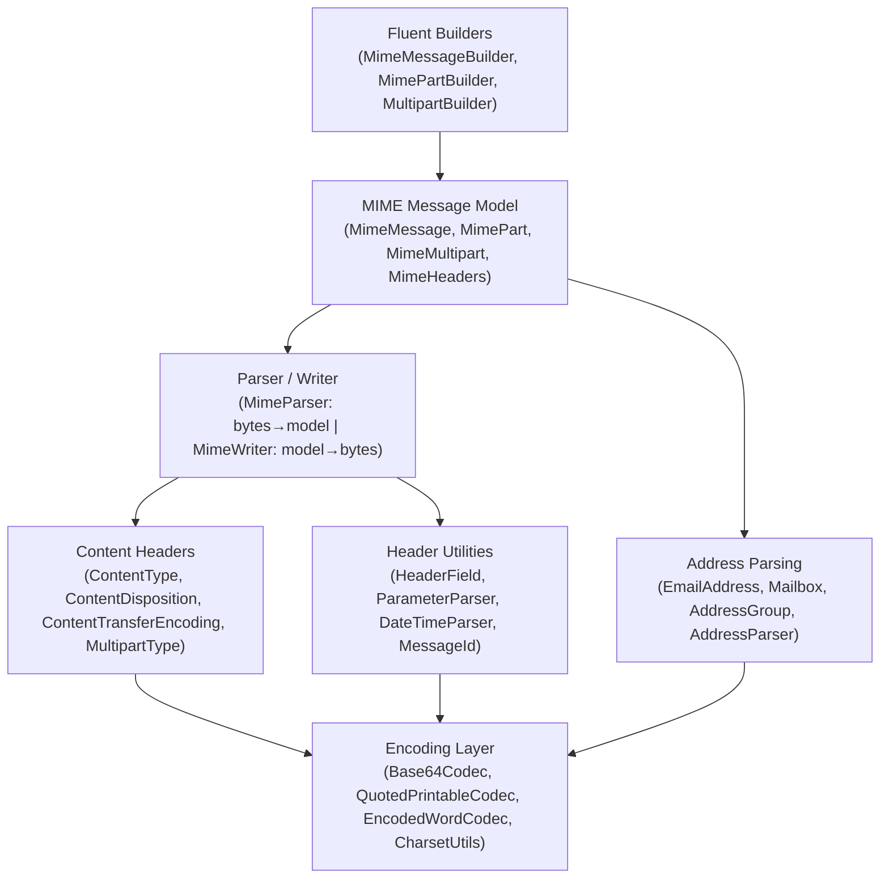
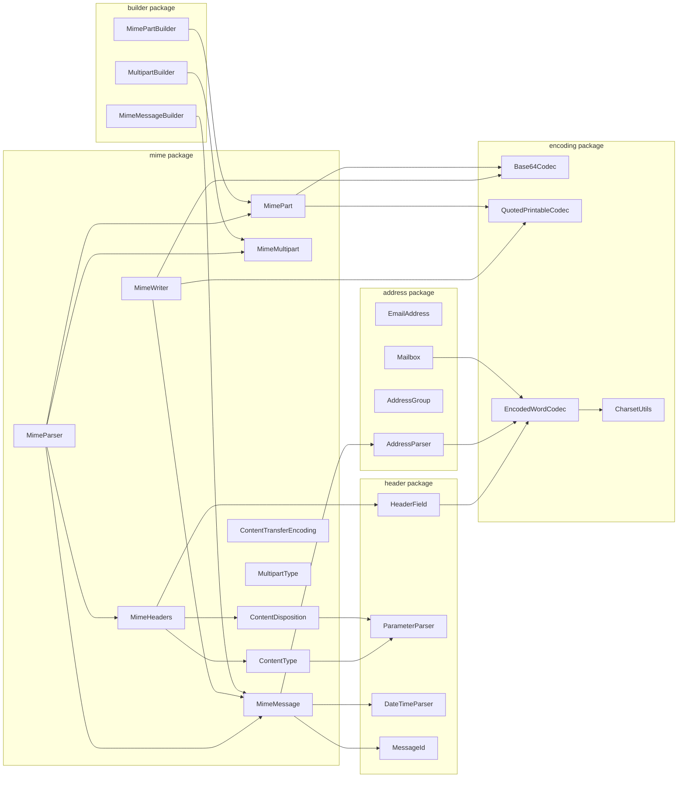
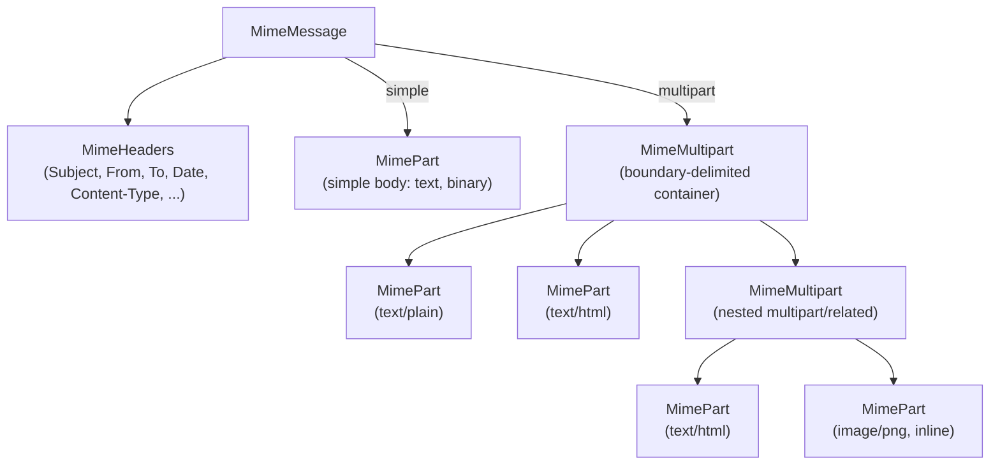
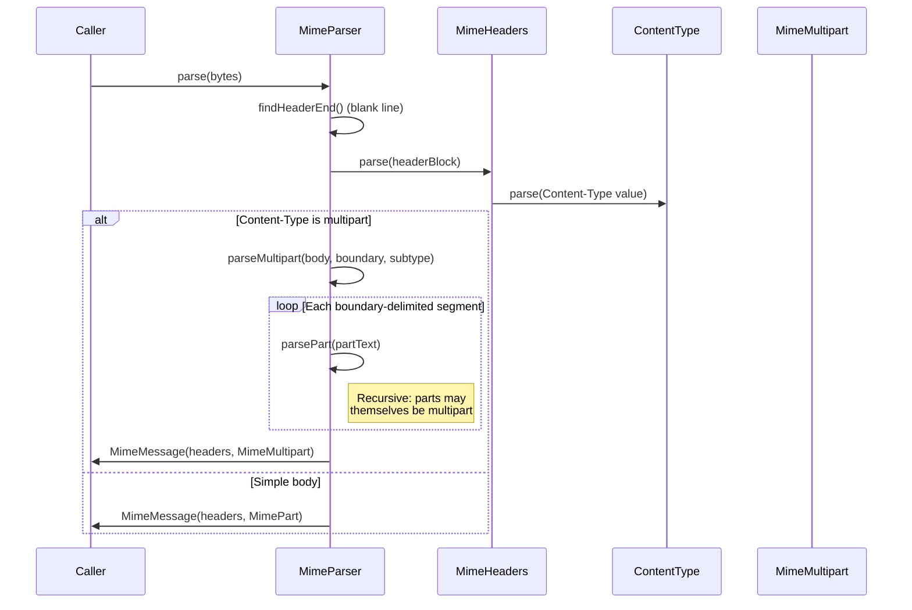
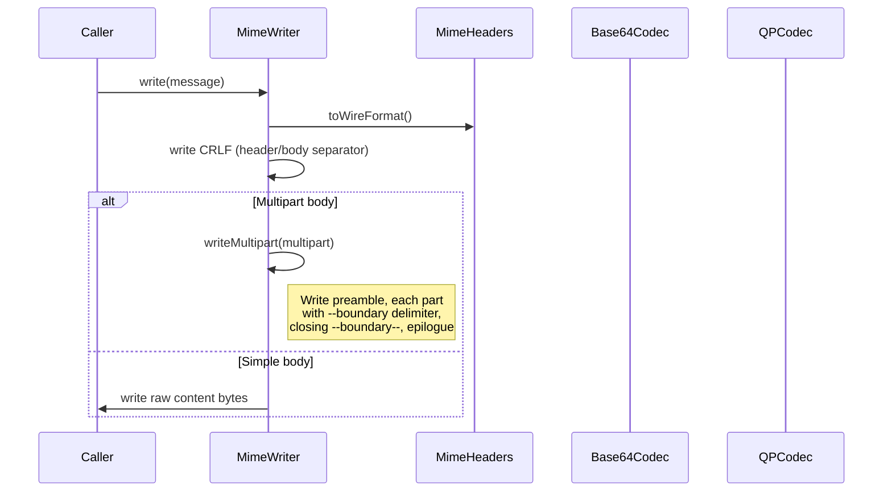
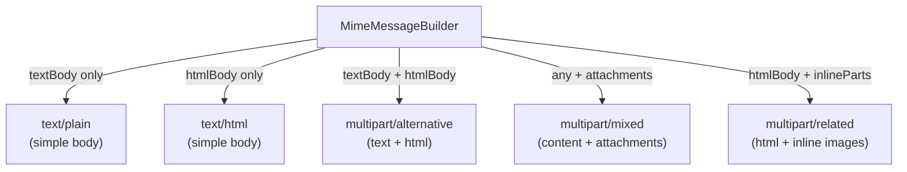
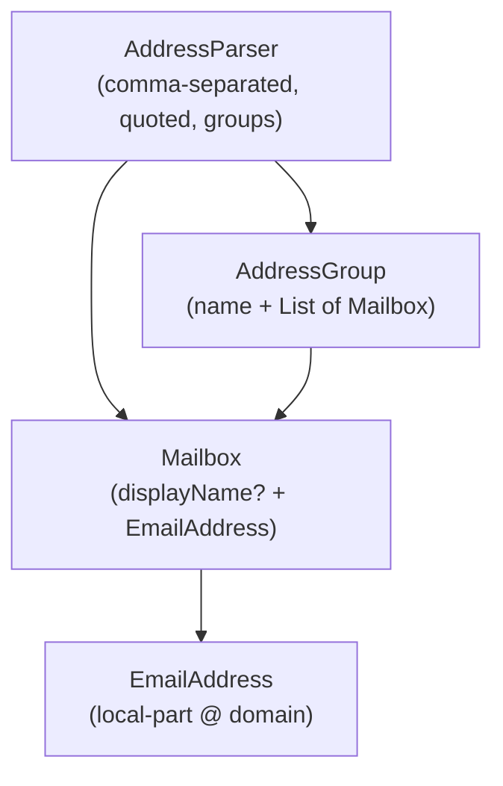

# Email Common Module — Architecture

This document describes the architectural decisions for the email/common MIME parsing module.

---

## Module Purpose

The email/common module is the shared foundation for all email protocol modules (SMTP, IMAP). It provides complete MIME message parsing, writing, and construction per RFC 2045-2049, with no external dependencies beyond the JDK.

## Layered Architecture



## Package Architecture



## MIME Message Model

A MIME message has two structural forms:



- **Simple message**: `MimeMessage` -> `MimeHeaders` + `MimePart` (body)
- **Multipart message**: `MimeMessage` -> `MimeHeaders` + `MimeMultipart` (parts list)
- **Nested multipart**: `MimeMultipart` can contain other `MimeMultipart` instances for structures like `multipart/mixed` containing `multipart/alternative`

## Parsing Flow



## Writing Flow



## Content-Transfer-Encoding

The encoding layer handles the transformation between raw content and wire-safe representations:

| Encoding | RFC 2045 Section | Line Limit | Use Case |
|----------|-----------------|------------|----------|
| 7bit (default) | 6.2 | 998 chars | ASCII-only text |
| 8bit | 6.3 | 998 chars | 8-bit text (requires 8BITMIME) |
| binary | 6.4 | None | Arbitrary binary (requires BINARYMIME) |
| quoted-printable | 6.7 | 76 chars | Mostly-ASCII text with some non-ASCII |
| base64 | 6.8 | 76 chars | Binary data (attachments, images) |

## Builder Architecture

The builder layer provides a fluent API for constructing MIME messages. `MimeMessageBuilder` automatically selects the appropriate message structure:



The builder automatically nests structures when needed. For example, a message with text + HTML + attachments produces:

```
multipart/mixed
  multipart/alternative
    text/plain
    text/html
  application/pdf (attachment)
```

## Address Model



- `EmailAddress`: `local-part@domain` with case-sensitive local-part and case-insensitive domain
- `Mailbox`: optional display name + email address, with RFC 2047 encoded display name support
- `AddressGroup`: named group of mailboxes (`group-name: addr1, addr2;`)
- `AddressParser`: handles all RFC 5322 address formats including nested quotes and angle brackets

## Header Processing

Headers use a two-layer model:

1. **Raw layer**: `HeaderField` stores name + raw value. `MimeHeaders` provides case-insensitive lookup with insertion-order preservation and support for duplicate names (e.g., multiple `Received` headers).
2. **Decoded layer**: `HeaderField.decodedValue()` applies RFC 2047 encoded-word decoding. Structured headers like `Content-Type` are parsed into domain objects by `ContentType.parse()`, `ContentDisposition.parse()`, etc.

Header folding (RFC 5322 section 2.1.1): lines exceeding 78 characters are folded at word boundaries with `CRLF + space`. Unfolding reverses this by removing `CRLF` followed by whitespace.

## RFC 2231 Parameter Handling

The `ParameterParser` supports RFC 2231 extensions for structured header parameters:

- **Continuations**: `filename*0="part1"; filename*1="part2"` assembled in order
- **Charset encoding**: `filename*=utf-8''%C3%A9tude.pdf` decoded with percent-encoding
- **Combined**: `filename*0*=utf-8''%C3%A9tude; filename*1*=.pdf`

This is critical for supporting non-ASCII filenames in `Content-Disposition` headers.

## Design Decisions

1. **Utility-class pattern**: `MimeParser`, `MimeWriter`, `AddressParser` are final classes with private constructors and static methods. No instances, no state.
2. **Immutable value objects**: `ContentType`, `ContentDisposition`, `EmailAddress`, `Mailbox`, `AddressGroup`, `MessageId`, `HeaderField` are all immutable.
3. **MimeHeaders is mutable**: allows incremental construction during parsing and building, but returns unmodifiable views from `fields()`.
4. **Raw content storage**: `MimePart` stores content in its encoded form. `decodedContent()` decodes on demand. This preserves the original encoding and avoids unnecessary decode/re-encode cycles.
5. **Lenient parsing**: the parser handles both CRLF and LF line endings, missing closing boundaries, and various address format deviations. Strict where required by the RFCs, lenient where real-world email varies.
6. **No external dependencies**: all encoding, parsing, and charset handling is implemented using JDK APIs only (`java.util.Base64`, `java.nio.charset`, `java.time`).

## Thread Safety

- All value objects (`ContentType`, `EmailAddress`, `Mailbox`, etc.) are immutable and thread-safe.
- `MimeParser` and `MimeWriter` are stateless utility classes -- thread-safe by design.
- `MimeHeaders` is mutable and not synchronized -- intended for single-threaded use during construction/parsing.
- Builders are single-threaded by design (create, configure, build, discard).

---

## Related Documentation

- [Module README](../README.md) | [Requirements](REQUIREMENTS.md) | [Compliance](COMPLIANCE.md)
- [Root Architecture](../../../doc/ARCHITECTURE.md) | [Root README](../../../README.md)

---

**Last Updated**: 2026-07-06
