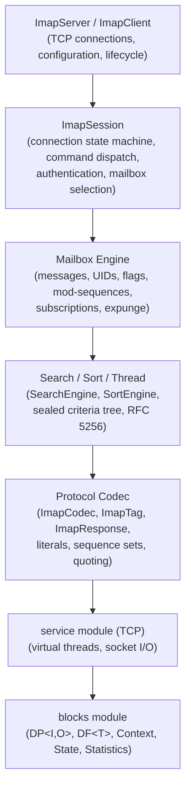
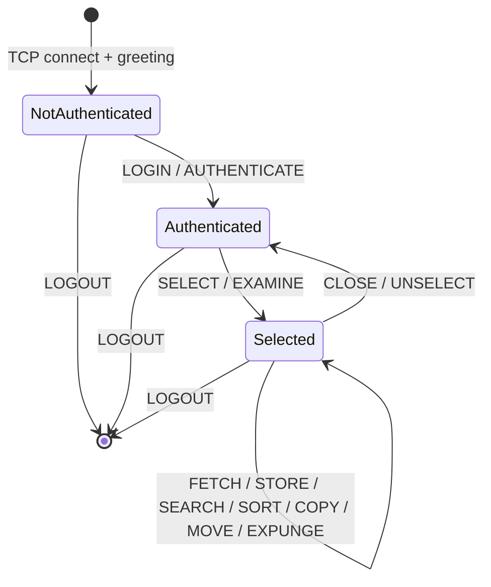
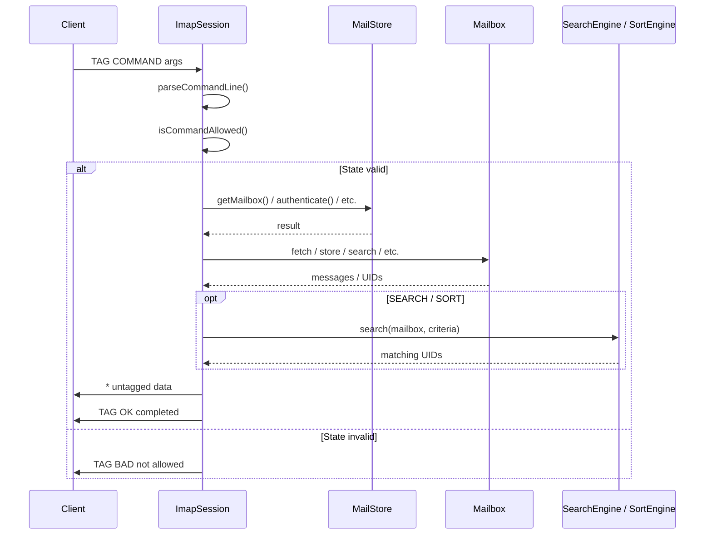
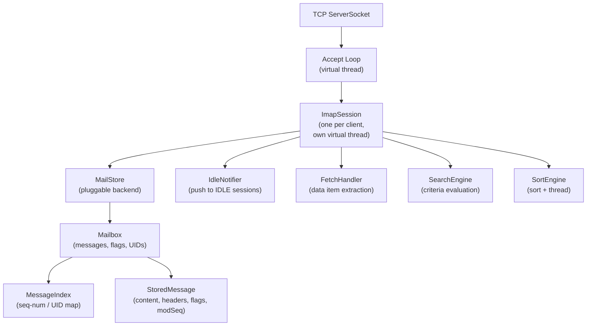
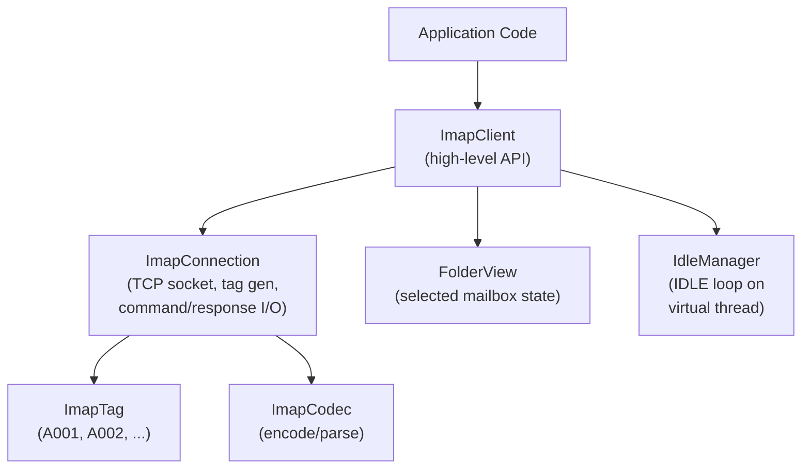
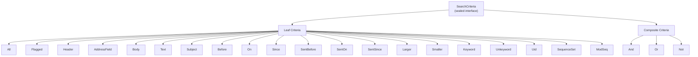
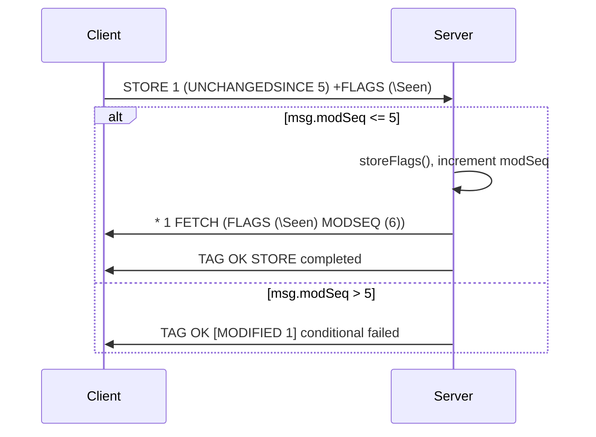

# IMAP Module -- Architecture

This document describes the architectural decisions for the IMAP module.

---

## Protocol Overview

IMAP4rev2 (RFC 9051) is a text-based protocol for accessing email mailboxes on a remote server. Unlike POP3, IMAP supports multiple simultaneous connections, server-side search and sort, fine-grained message access (headers, body sections, partial fetches), persistent flags, and push notifications via IDLE. The Lego Flow implementation provides both server and client over TCP transport.

## Layered Architecture

## Connection State Machine

IMAP sessions transition through four states, with each state defining which commands are valid:

State enforcement is built into the `ImapCommand` enum: each command declares its `ImapState` requirement, and `ImapSession.isCommandAllowed()` checks the current state before dispatch.

## Command Processing Flow

## Server Architecture

- **ImapServer**: binds TCP socket, runs accept loop on virtual thread executor, creates one `ImapSession` per client connection
- **ImapSession**: reads commands line-by-line, dispatches through `processCommand()` switch expression, manages state transitions
- **MailStore**: interface for storage backends; `InMemoryMailStore` provides thread-safe ConcurrentHashMap-based implementation
- **Mailbox**: contains messages keyed by UID, tracks mod-sequences for CONDSTORE, manages permanent/session flags
- **MessageIndex**: CopyOnWriteArrayList maintaining UID ordering for seq-num/UID bidirectional mapping
- **IdleNotifier**: ConcurrentHashMap of mailbox-name to listener lists; sessions register during IDLE, receive push notifications for EXISTS/EXPUNGE/FLAG changes

## Client Architecture

- **ImapClient**: wraps `ImapConnection`, provides typed methods for all IMAP operations, parses responses into domain objects (`FolderView`, `FetchResult`, search results)
- **ImapConnection**: manages Socket lifecycle, sends commands via `PrintWriter`, reads responses line-by-line via `BufferedReader`, tracks capabilities
- **ImapClientConfig**: fluent builder with host, port, credentials, TLS toggle, connect/read/idle timeouts
- **FolderView**: captures SELECT/EXAMINE response metadata (message count, UID validity/next, flags, highest mod-seq)
- **FetchResult**: parses `* N FETCH (...)` response lines into key-value data items
- **IdleManager**: runs IDLE/DONE loop on virtual thread, delivers untagged responses to a notification callback, re-issues IDLE after configurable timeout

## Search Criteria Architecture

The `SearchCriteria` sealed interface uses algebraic data types for type-safe, exhaustive search expression trees:

- Each variant is a record implementing `toWire()` for protocol serialization
- `SearchEngine.matches()` uses pattern matching switch on all sealed subtypes
- Factory methods on the interface provide fluent construction: `SearchCriteria.from("alice").and(SearchCriteria.unseen())`

## CONDSTORE Extension

- `ModSequence`: atomic counter per mailbox, incremented on every flag/message change
- `ConditionalStore.conditionalStore()`: compares message modSeq against UNCHANGEDSINCE threshold before applying flags
- `ConditionalStore.findModified()`: returns messages changed since a given mod-seq (used for QRESYNC-style sync)

## Thread Safety Model

| Component | Concurrency Strategy |
|-----------|---------------------|
| `ImapServer` | `AtomicBoolean` for running state, virtual thread executor |
| `ImapSession` | one session per thread, `volatile` state fields, `AtomicBoolean` running |
| `MailStore` / `InMemoryMailStore` | `ConcurrentHashMap` for mailboxes and users |
| `Mailbox` | `ConcurrentHashMap` for messages, `AtomicLong` for UID/modSeq counters |
| `StoredMessage` | `CopyOnWriteArraySet` for flags, `volatile` modSeq |
| `MessageIndex` | `CopyOnWriteArrayList` for UID list |
| `IdleNotifier` | `ConcurrentHashMap` + `CopyOnWriteArrayList` for listeners |
| `ImapTag` | `AtomicInteger` counter |

## Integration with Lego Flow

| Lego Flow Module | Usage in IMAP |
|------------------|---------------|
| `blocks` | DP<I,O> for message processing pipeline, DF<T> for filtering, Statistics for metrics |
| `service` | TCP socket connections, virtual thread pools for server accept loop and client sessions |
| `email-common` | Shared MIME parsing for body structure analysis and content type handling |

---

## Related Documentation

- [Module README](../README.md) | [Requirements](REQUIREMENTS.md) | [Compliance](COMPLIANCE.md)
- [Root Architecture](../../doc/ARCHITECTURE.md) | [Root README](../../README.md)

---

**Last Updated**: 2026-07-06
