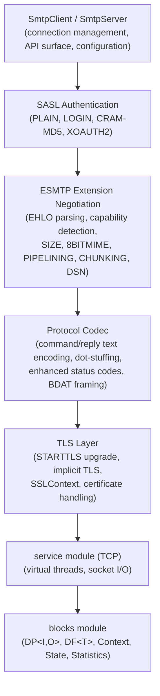
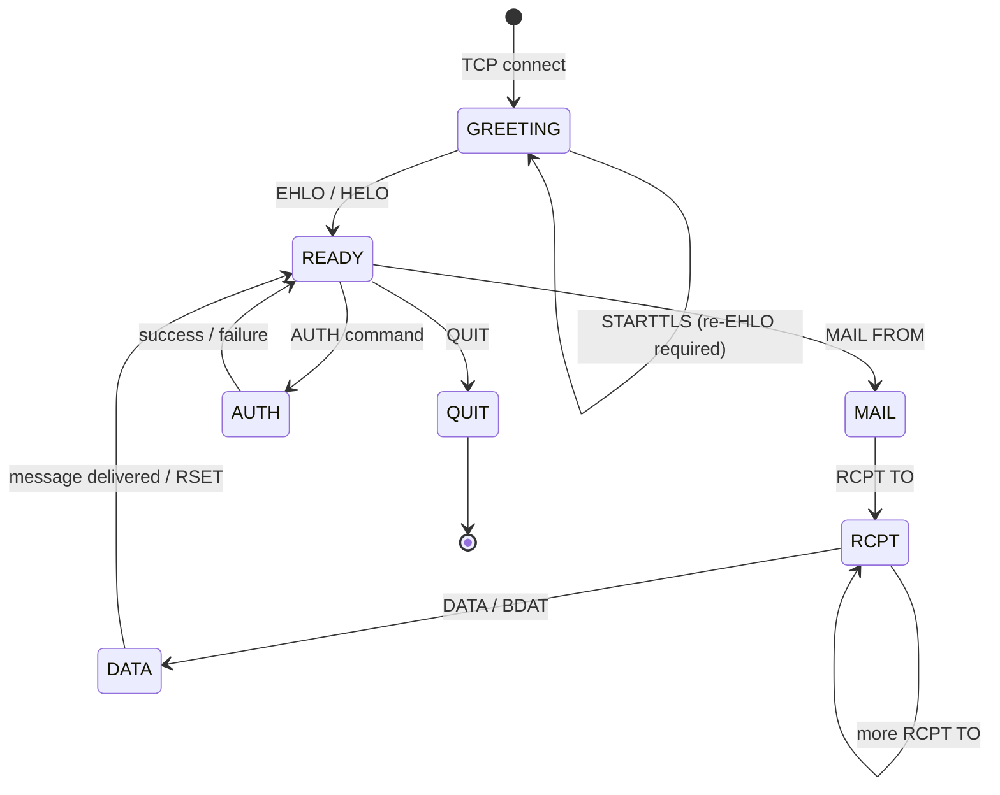
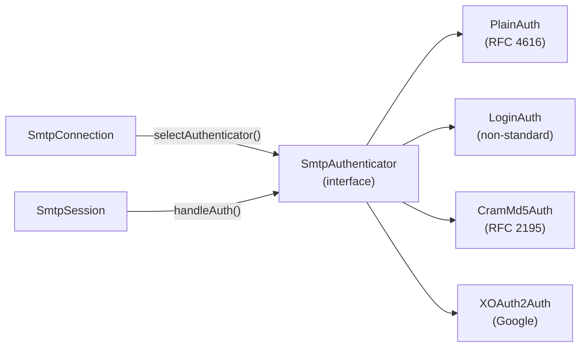
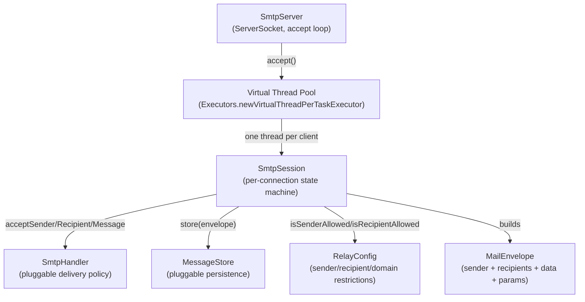
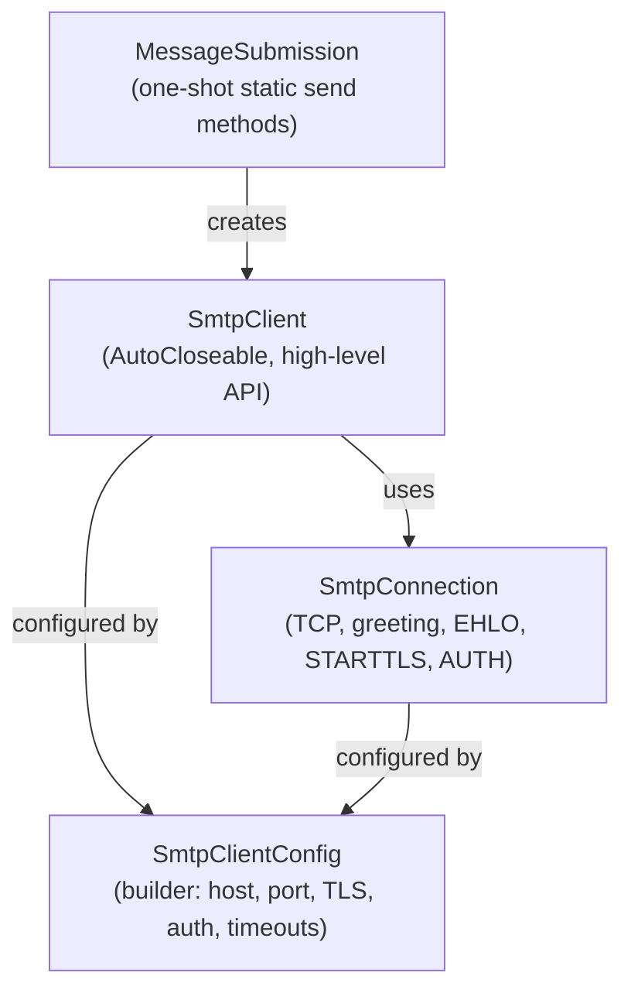
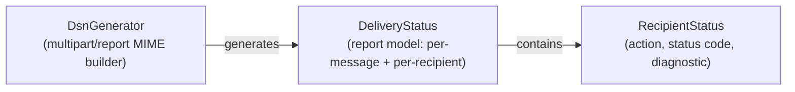

# SMTP Module -- Architecture

This document describes the architectural decisions for the SMTP module.

---

## Protocol Overview

SMTP (Simple Mail Transfer Protocol) is the standard protocol for email message transfer between mail servers and from clients to servers. The Lego Flow implementation covers RFC 5321 (core protocol) with ESMTP extensions for authentication, TLS, chunked transfer, and delivery status notifications. The module provides both client-side and server-side implementations.

## Layered Architecture



## Session State Machine

The server models each client connection as a state machine:



### State Descriptions

| State | Description | Valid Commands |
|-------|-------------|----------------|
| GREETING | Initial state after TCP connect | EHLO, HELO, STARTTLS |
| READY | Identified, ready for transactions | MAIL, AUTH, RSET, NOOP, VRFY, QUIT |
| MAIL | Sender accepted | RCPT |
| RCPT | At least one recipient accepted | RCPT, DATA, BDAT |
| DATA | Receiving message body | (dot-stuffed lines or BDAT chunks) |
| AUTH | Authentication exchange in progress | (challenge-response lines) |
| QUIT | Connection closing | -- |

## SMTP Transaction Flow

```mermaid
sequenceDiagram
    participant C as Client
    participant S as Server

    S->>C: 220 hostname ESMTP ready
    C->>S: EHLO client.example.com
    S->>C: 250-hostname Hello client.example.com<br/>250-SIZE 10485760<br/>250-AUTH PLAIN LOGIN CRAM-MD5<br/>250-STARTTLS<br/>250 PIPELINING

    Note over C,S: Optional: STARTTLS
    C->>S: STARTTLS
    S->>C: 220 Ready to start TLS
    Note over C,S: TLS handshake
    C->>S: EHLO client.example.com
    S->>C: 250 (extensions re-advertised)

    Note over C,S: Optional: Authentication
    C->>S: AUTH PLAIN dXNlcgBwYXNz
    S->>C: 235 Authentication successful

    Note over C,S: Mail transaction
    C->>S: MAIL FROM:&lt;sender@example.com&gt;
    S->>C: 250 Sender OK
    C->>S: RCPT TO:&lt;recipient@example.com&gt;
    S->>C: 250 Recipient OK
    C->>S: DATA
    S->>C: 354 Start mail input
    C->>S: (dot-stuffed message body)
    C->>S: .
    S->>C: 250 OK id=message-id

    C->>S: QUIT
    S->>C: 221 hostname closing connection
```

## Authentication Architecture



### Mechanism Details

| Mechanism | RFC | Initial Response | Challenge Steps | Security |
|-----------|-----|------------------|-----------------|----------|
| PLAIN | 4616 | Base64(authzid + NUL + authcid + NUL + passwd) | 0 | Cleartext (requires TLS) |
| LOGIN | -- | None | 2 (username, password) | Cleartext (requires TLS) |
| CRAM-MD5 | 2195 | None | 1 (HMAC-MD5 of challenge) | Challenge-response (no cleartext password) |
| XOAUTH2 | -- | Base64(user=email SOH auth=Bearer token SOH SOH) | 0 | OAuth 2.0 bearer token |

## Server Architecture



### Design Decisions

- **Virtual threads**: One virtual thread per client connection via `Executors.newVirtualThreadPerTaskExecutor()`. Simplifies session code as straight-line blocking I/O.
- **Pluggable handler**: `SmtpHandler` interface with default methods for sender/recipient/message acceptance and authentication. Factory methods: `acceptAll()`, `forDomains(...)`.
- **Pluggable store**: `MessageStore` interface decouples message persistence from protocol handling. `InMemoryMessageStore` provided for testing; production implementations can persist to disk or forward to another MTA.
- **Relay config**: `RelayConfig` with builder pattern controls allowed senders, recipient domains, auth requirements, and message size limits.
- **Session isolation**: Each `SmtpSession` holds its own reader/writer, state, and transaction data. Sessions are tracked in a `ConcurrentHashMap` for management and cleanup.

## Client Architecture



### Client Design

- **Two-level API**: `SmtpClient` for multiple transactions on one connection; `MessageSubmission` for fire-and-forget single sends.
- **Connection lifecycle**: `SmtpConnection` handles the full setup sequence (TCP -> greeting -> EHLO -> optional STARTTLS -> optional AUTH). After setup, the connection is reusable for multiple MAIL transactions.
- **Builder config**: `SmtpClientConfig.Builder` with fluent API for host, port, TLS mode, credentials, timeouts, and pipelining flag.
- **Auto-mechanism selection**: When no auth mechanism is explicitly configured, `SmtpConnection` picks the strongest available from the server's EHLO response (CRAM-MD5 > PLAIN > LOGIN).

## Protocol Codec

The SMTP protocol is text-based with CRLF line endings. The `SmtpCodec` utility class handles:

- **Command encoding**: `VERB SP parameters CRLF`
- **Reply decoding**: handles single-line (`code SP text`) and multi-line (`code-text ... code SP text`) replies
- **Enhanced status codes**: parses and strips `X.Y.Z` enhanced codes from reply text
- **Address extraction**: parses `MAIL FROM:<addr>` and `RCPT TO:<addr>` with extension parameters
- **BDAT framing**: encodes `BDAT size [LAST]` commands

### Dot-Stuffing (RFC 5321 section 4.5.2)

The `DotStuffing` utility handles the DATA command's transparency mechanism:
- **Sending**: lines starting with `.` get an extra `.` prepended
- **Receiving**: leading `.` removed; a line of just `.` marks end-of-data
- Both bulk (`stuff`/`unstuff`) and per-line (`stuffLine`/`unstuffLine`) methods provided

## DSN Architecture



DSN messages are multipart/report MIME messages (RFC 3464) with three parts:
1. Human-readable explanation (`text/plain`)
2. Machine-readable delivery status (`message/delivery-status`)
3. Original message or headers (`message/rfc822` or `text/rfc822-headers`)

## Thread Safety

- **SmtpServer**: `AtomicBoolean` for running state, `AtomicInteger` for connection count, `ConcurrentHashMap` for session tracking.
- **SmtpSession**: single-threaded per connection (one virtual thread owns the session).
- **InMemoryMessageStore**: `CopyOnWriteArrayList` for thread-safe message storage.
- **SmtpClient/Connection**: not thread-safe; designed for single-threaded use per connection.
- **Protocol classes**: `SmtpCodec`, `DotStuffing`, `EnhancedStatusCode` are stateless utility classes (thread-safe).

---

**Last Updated**: 2026-07-06
