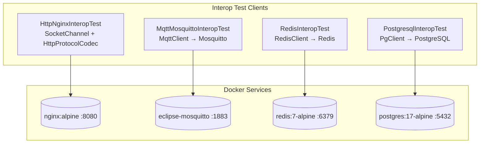
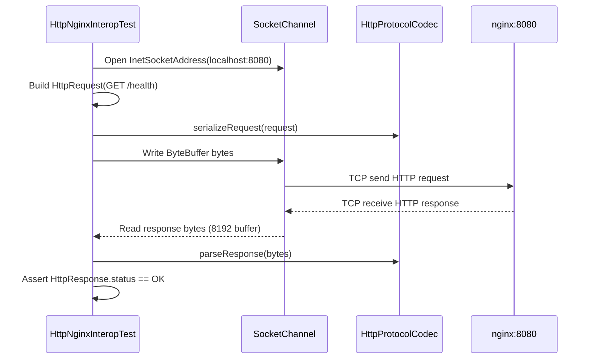
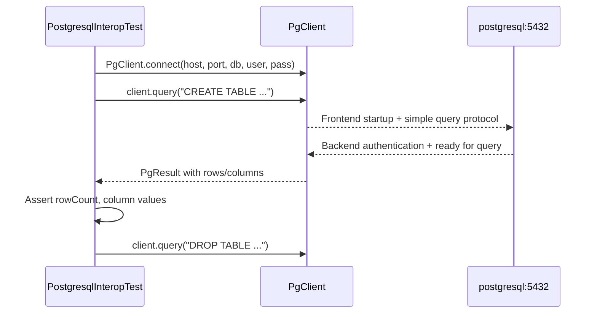

# Interop-Tests Module — Architecture

## Module Purpose

The **interop-tests** module validates Lego Flow protocol implementations against real reference server implementations. It provides confidence that the protocol codecs and client libraries work correctly with production-grade servers, not just in-process test doubles.

## Key Abstractions



## Docker Compose Infrastructure

### Service Configuration

| Service | Image | Port | Health Check | Purpose |
|---------|-------|------|-------------|---------|
| nginx | `nginx:alpine` | 8080 → 80 | `curl -f http://localhost:80/` | HTTP/1.1 reference server with custom endpoints |
| mosquitto | `eclipse-mosquitto:latest` | 1883 → 1883 | `pgrep mosquitto` | MQTT v3.1.1/v5.0 broker, anonymous auth |
| redis | `redis:7-alpine` | 6379 → 6379 | `redis-cli ping` | Redis in-memory store, no persistence |
| postgresql | `postgres:17-alpine` | 5432 → 5432 | `pg_isready -U legoflow` | PostgreSQL database with test schema |

### Custom Nginx Endpoints

```
GET  /health       → 200 OK (JSON status)
GET  /api/data     → 200 OK (JSON with "lego-flow-interop" content)
POST /echo         → 200 OK (reflects HTTP method and URI)
GET  /             → 200 OK (HTML page)
```

## Data Flow

1. **Docker Compose** starts all services with health checks
2. **JUnit @BeforeAll** establishes TCP connections to target services
3. **Test methods** execute protocol operations using Lego Flow client libraries
4. **AssertJ assertions** verify responses against expected values
5. **@AfterAll** closes connections and cleans up test artifacts

### HTTP Test Flow (SocketChannel-based)


### Database Test Flow (PgClient-based)


## Thread Safety Model

- Tests run single-threaded within each test method (no concurrent access to clients)
- Docker services may have multiple test methods running concurrently via Maven parallel execution
- Each PostgreSQL test creates and drops its own table (no cross-test contamination)

## Configuration System

### Maven Properties (via failsafe plugin)
```xml
<systemPropertyVariables>
    <interop.nginx.host>${INTEROP_NGINX_HOST:localhost}</interop.nginx.host>
    <interop.mosquitto.host>${INTEROP_MOSQUITTO_HOST:localhost}</interop.mosquitto.host>
    ...
</systemPropertyVariables>
```

### Gradle Properties (via systemProperty in Test task)
```kotlin
tasks.withType<Test> {
    systemProperty("interop.nginx.host", findProperty("interop.nginx.host") ?: "localhost")
    ...
}
```

## Extension Points

### Adding New Protocol Interop Tests
1. Add Docker service to `docker-compose.yml` with health check
2. Create new test class under `ssg/legoflow/interop/<protocol>/`
3. Include the protocol module as test dependency in both Maven and Gradle configs
4. Add system properties for configurable host/port
5. Document the test in interop-tests/README.md

### Configuring Docker Services
- Ports: Modify port mappings in `docker-compose.yml`
- Credentials: Update environment variables (POSTGRES_USER, POSTGRES_PASSWORD)
- Health checks: Adjust interval/retries per service

## CI Integration

In GitHub Actions:
- Services defined as `services:` in workflow YAML
- Health checks wait for container readiness before test execution
- Environment variables passed to Maven via workflow `env:` block
- Test results uploaded as JUnit XML artifacts
