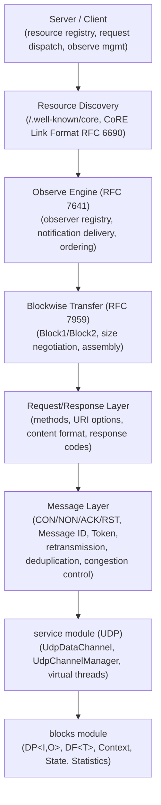
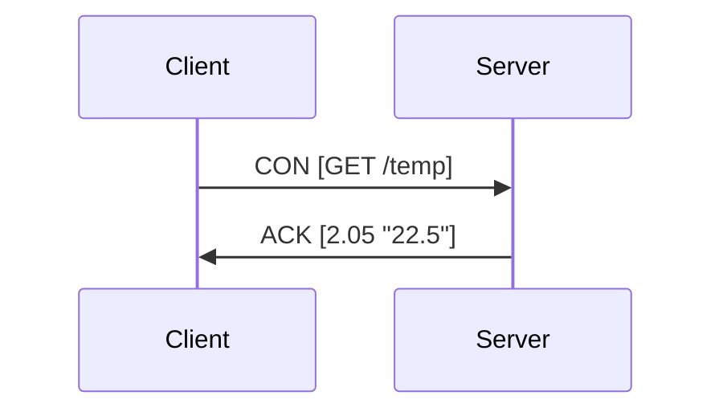
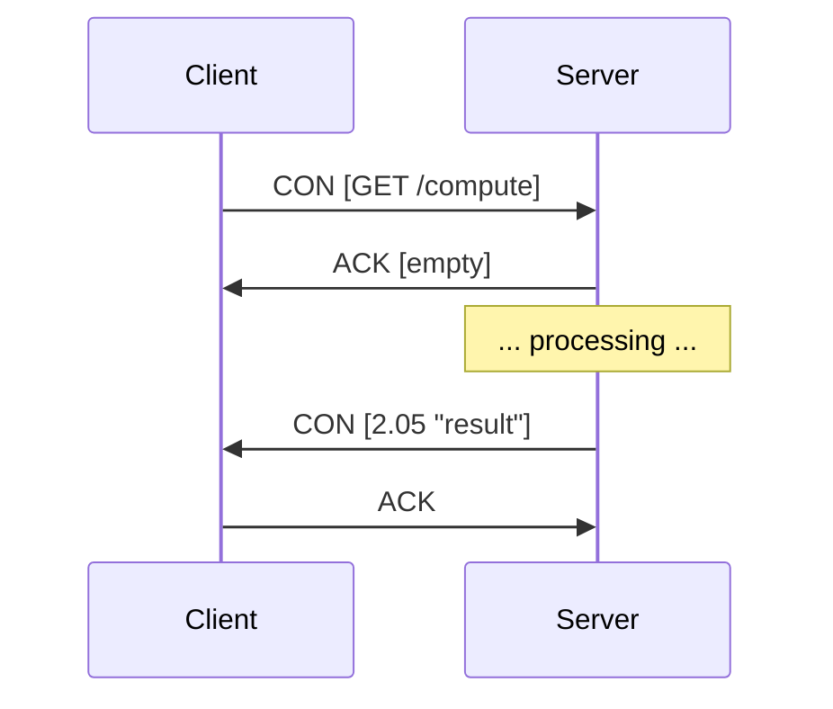
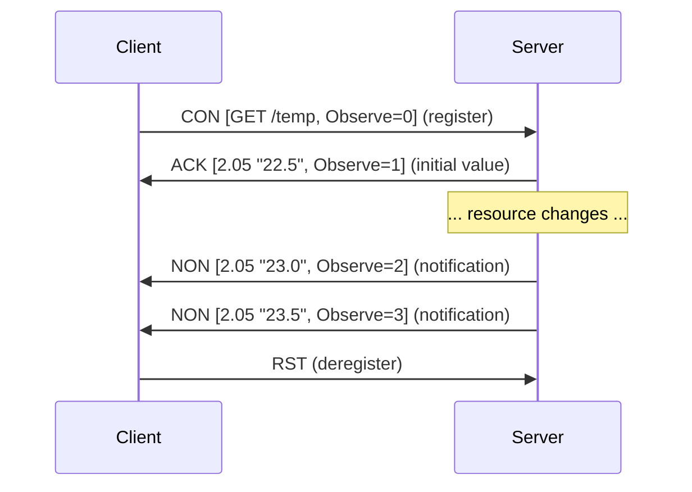
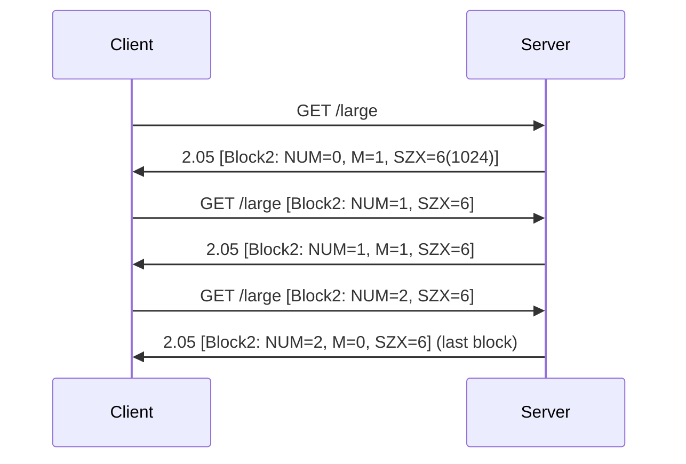
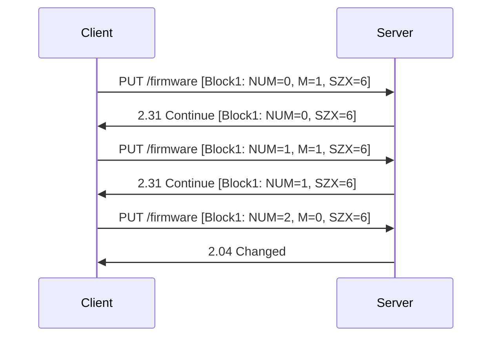

# CoAP Module — Architecture

This document describes the architectural decisions for the CoAP module.

---

## Protocol Overview

CoAP (Constrained Application Protocol, RFC 7252) is a specialized RESTful protocol for constrained devices and networks. It uses UDP transport with a compact binary format, reliability through confirmable messages, and REST semantics mapped to IoT resource interactions.

## Layered Architecture



## Message Format

```
 0                   1                   2                   3
 0 1 2 3 4 5 6 7 8 9 0 1 2 3 4 5 6 7 8 9 0 1 2 3 4 5 6 7 8 9 0 1
+-+-+-+-+-+-+-+-+-+-+-+-+-+-+-+-+-+-+-+-+-+-+-+-+-+-+-+-+-+-+-+-+
|Ver| T |  TKL  |      Code     |          Message ID           |
+-+-+-+-+-+-+-+-+-+-+-+-+-+-+-+-+-+-+-+-+-+-+-+-+-+-+-+-+-+-+-+-+
|   Token (if any, TKL bytes) ...
+-+-+-+-+-+-+-+-+-+-+-+-+-+-+-+-+-+-+-+-+-+-+-+-+-+-+-+-+-+-+-+-+
|   Options (if any) ...
+-+-+-+-+-+-+-+-+-+-+-+-+-+-+-+-+-+-+-+-+-+-+-+-+-+-+-+-+-+-+-+-+
|1 1 1 1 1 1 1 1|    Payload (if any) ...
+-+-+-+-+-+-+-+-+-+-+-+-+-+-+-+-+-+-+-+-+-+-+-+-+-+-+-+-+-+-+-+-+
```

- **Ver**: version (1)
- **T**: message type (CON=0, NON=1, ACK=2, RST=3)
- **TKL**: token length (0-8 bytes)
- **Code**: method (0.01-0.04) or response code (2.xx, 4.xx, 5.xx)
- **Message ID**: 16-bit identifier for deduplication and ACK matching

## Message Types and REST Model

### Message Types
| Type | Reliable | Response |
|------|----------|----------|
| CON (Confirmable) | Yes, retransmitted until ACK | Must be ACK'd or RST'd |
| NON (Non-confirmable) | No | May trigger response |
| ACK (Acknowledgement) | N/A | Confirms CON receipt |
| RST (Reset) | N/A | Rejects message |

### Request/Response Patterns

**Piggybacked Response** (fast resource):


**Separate Response** (slow resource):


## Observe Pattern (RFC 7641)



- Observe option with value 0 registers an observer
- Server assigns monotonically increasing sequence numbers
- Notifications delivered as NON (unreliable) or CON (reliable) per resource config
- Observer removed on: RST, explicit deregister (Observe=1), max-age expiry, delivery failure

## Blockwise Transfer (RFC 7959)

### Block2 (Response Payload)


### Block1 (Request Payload)


- SZX encodes block size: 2^(SZX+4) bytes (16 to 1024)
- M flag indicates more blocks follow
- Server may reduce block size during negotiation

## Resource Discovery

The `/.well-known/core` resource returns CoRE Link Format (RFC 6690):

```
</temperature>;rt="temperature-c";if="sensor";ct=0,
</humidity>;rt="humidity-pct";if="sensor";ct=0,
</led>;rt="light-ctrl";if="actuator";ct=0
```

- `rt` (resource type): semantic type of the resource
- `if` (interface): interaction model
- `ct` (content type): supported content format ID
- Filtering via query: `/.well-known/core?rt=temperature-c`

## Reliability and Congestion Control

### Retransmission
- CON messages retransmitted with exponential backoff
- Initial timeout: ACK_TIMEOUT (2 seconds) * random factor (1.0-1.5)
- Doubled on each retransmission up to MAX_RETRANSMIT (4) attempts
- Total span: MAX_TRANSMIT_SPAN (~45 seconds)

### Deduplication
- Received Message IDs cached for EXCHANGE_LIFETIME (247 seconds)
- Duplicate CON messages receive the same cached ACK
- Prevents duplicate processing of retransmitted requests

### Congestion Control
- NSTART (1): maximum concurrent outstanding interactions per endpoint
- Limits the rate of new CON messages to any single endpoint

## Integration with Lego Flow

| Lego Flow Module | Usage in CoAP |
|------------------|---------------|
| `blocks` | DP<I,O> for message processing pipeline, DF<T> for option filtering, Statistics for metrics |
| `service` | UdpDataChannel for datagram transport, UdpChannelManager for channel lifecycle, virtual threads |

The CoAP module follows the framework's dual API convention: server and client expose both sync and async (CompletableFuture) variants, with functional-style builders for resource registration and request construction.

---

## Test Port Allocation

All CoAP tests use **ephemeral ports** (`port = 0`) to avoid `BindException` when tests run in parallel across Maven modules. The OS assigns a unique port per test server instance. Test clients retrieve the actual bound port via `CoapServer.getPort()`, which reads the local address from the open `DatagramChannel`.

This approach is preferred over hardcoded ports (which conflict under `surefire-plugin` parallel execution) and over port-range allocation (which requires coordination between test classes).

---

## Related Documentation

- [Module README](../README.md) | [Requirements](REQUIREMENTS.md) | [Compliance](COMPLIANCE.md)
- [Root Architecture](../../doc/ARCHITECTURE.md) | [Root README](../../README.md)

---

**Last Updated**: 2026-07-05
