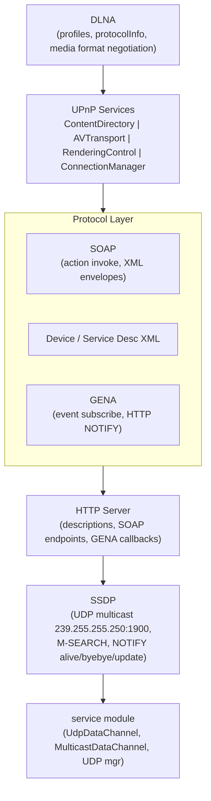
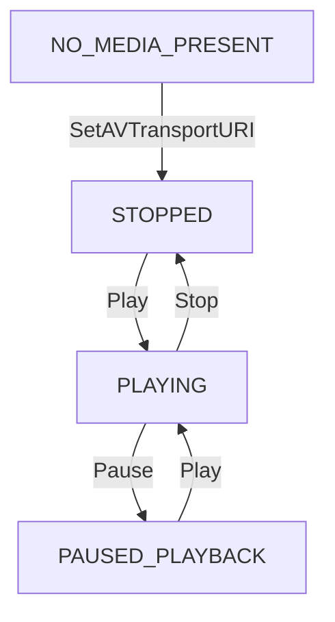
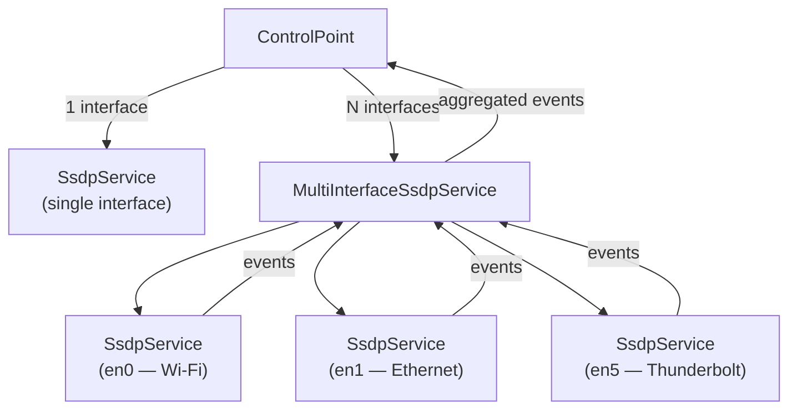
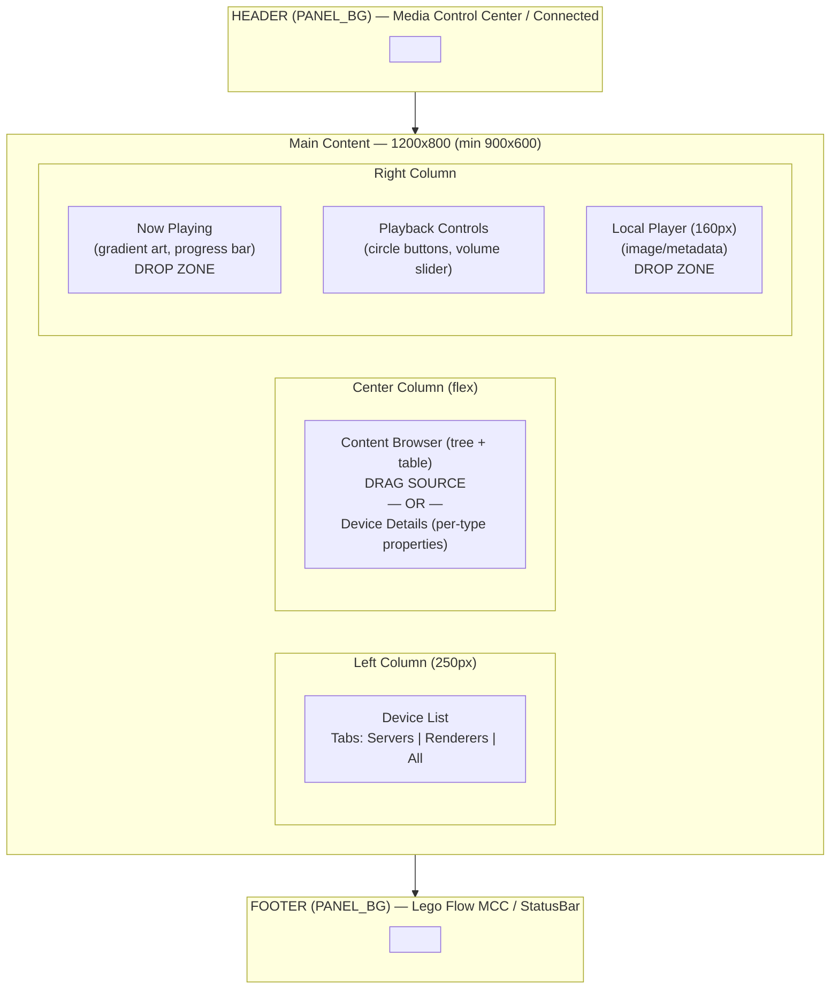
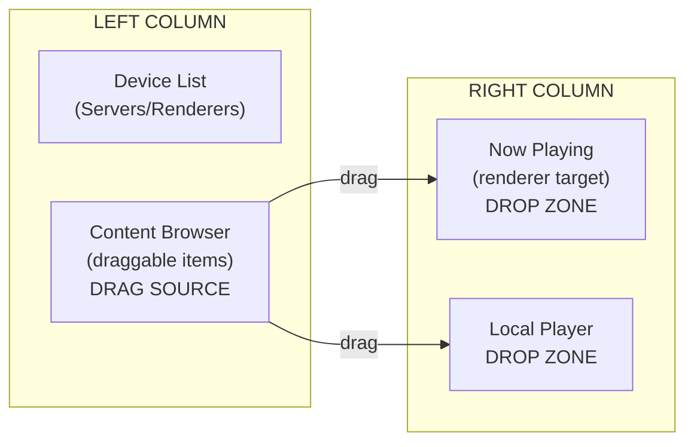
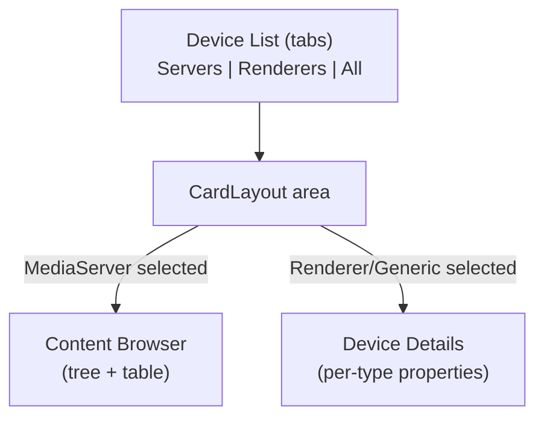
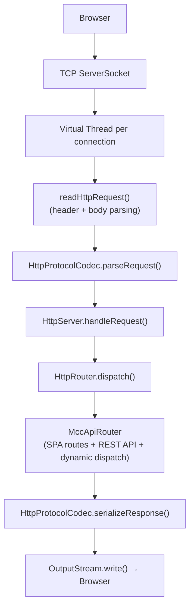
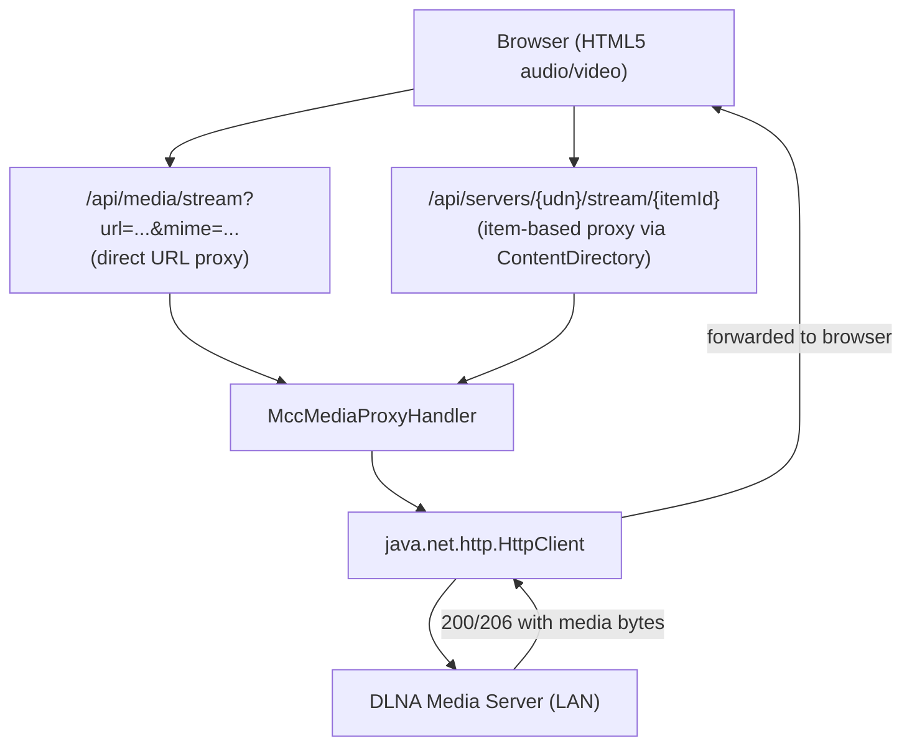
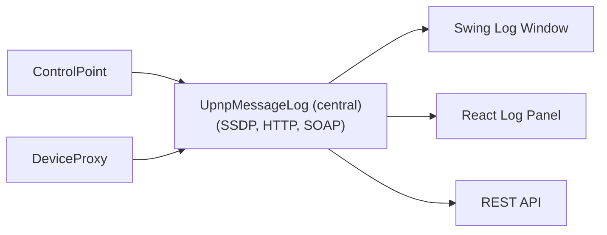
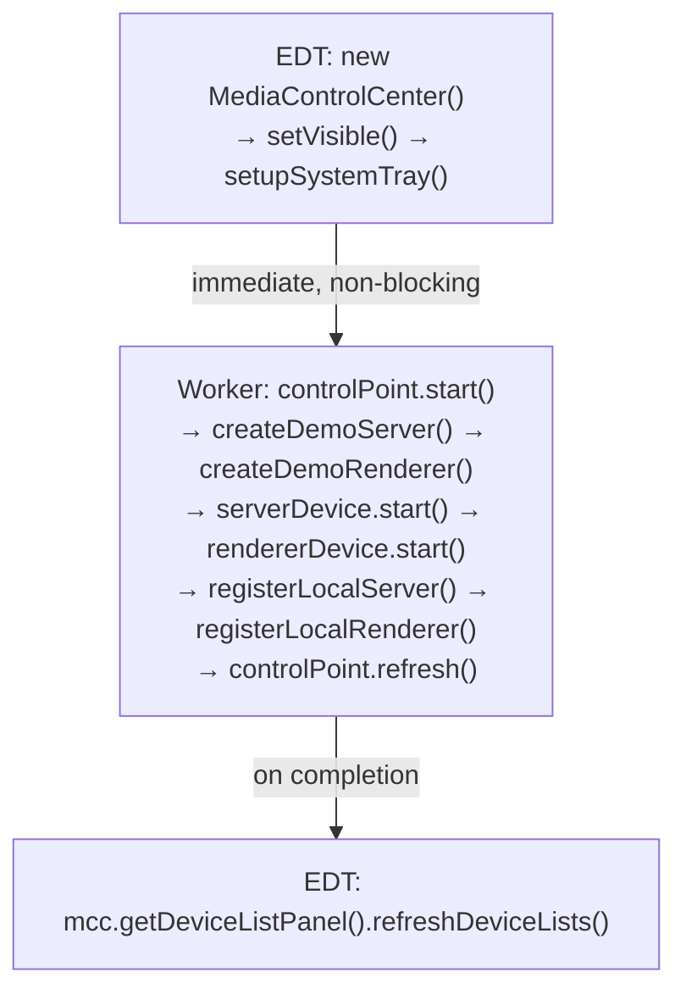

# UPnP/DLNA Module — Architecture

This document describes the architectural decisions for the UPnP/DLNA module.

---

## Protocol Layers



### SSDP Layer (UDP Multicast)

SSDP operates over raw UDP multicast on 239.255.255.250:1900. Uses the `service` module's `MulticastDataChannel` for group join/leave and datagram send/receive. Discovery is asynchronous: M-SEARCH sends a multicast query, devices respond with unicast replies containing their LOCATION URL. NOTIFY messages announce device arrival (ssdp:alive), departure (ssdp:byebye), and updates (ssdp:update). A device cache tracks known devices with TTL based on CACHE-CONTROL max-age.

### HTTP Layer (Descriptions, SOAP, GENA)

HTTP serves multiple roles:
- **Device/service description XML** — served at LOCATION URLs, fetched by control points
- **SOAP endpoints** — POST targets for action invocation on each service's control URL
- **GENA callbacks** — the control point hosts a callback HTTP server to receive event notifications

Uses the `http` module's server for hosting and the `web-services` module for XML content negotiation.

### SOAP Layer (Action Invocation)

SOAP 1.1 envelopes wrap UPnP action requests and responses. Each action has:
- A SOAPAction HTTP header: `"urn:schemas-upnp-org:service:ContentDirectory:1#Browse"`
- An XML body with action name and input arguments
- A response body with output arguments or a SOAP fault

**XML Parsing Strategy**: All SOAP parsing uses `javax.xml.parsers.DocumentBuilder` with namespace awareness enabled. This is critical because:
- Output arguments like `Result` contain XML-escaped DIDL-Lite (`&lt;DIDL-Lite...&gt;`); DOM's `getTextContent()` auto-unescapes entity references
- Some servers use CDATA sections for the `Result` argument; DOM handles both transparently
- Different servers use different namespace prefixes (`s:`, `SOAP-ENV:`, `soap:`, etc.); `getElementsByTagNameNS()` matches by namespace URI regardless of prefix
- All DOM parsers are configured to block external DTDs/entities (XXE prevention)

### GENA Layer (Event Subscription)

GENA extends HTTP with SUBSCRIBE, UNSUBSCRIBE, and NOTIFY methods:
- SUBSCRIBE sends CALLBACK URL and requested timeout
- Server returns SID (Subscription ID) and granted timeout
- NOTIFY delivers XML with changed state variable values to the callback URL
- Subscriptions must be renewed before timeout expiry

## Device Model

### Device Types
- Root devices have a UDN (uuid:...) and may contain embedded devices
- Standard device types: `urn:schemas-upnp-org:device:MediaServer:1`, `urn:schemas-upnp-org:device:MediaRenderer:1`
- Each device has: friendlyName, manufacturer, modelName, UDN, iconList, serviceList

### Service Types
- Each service has: serviceType, serviceId, SCPDURL, controlURL, eventSubURL
- Standard service types: ContentDirectory, AVTransport, RenderingControl, ConnectionManager
- SCPD (Service Control Protocol Description) XML defines available actions and state variables

## Media Server Architecture

### ContentDirectory Service
- Exposes content as a hierarchical tree of containers and items
- Root container ID is "0"
- Browse returns DIDL-Lite XML with `<container>` and `<item>` elements
- Search supports UPnP search criteria syntax (e.g., `upnp:class derivedfrom "object.item.audioItem"`)
- Items contain `<res>` elements with protocolInfo, size, duration, bitrate

### DIDL-Lite Parsing (DidlLiteParser)
- Uses namespace-aware DOM parser (`getElementsByTagNameNS`) for containers, items, dc:*, upnp:*, and res elements
- Handles all real-world namespace prefix variations (dc:, DC:, default namespace, etc.)
- Supports multiple `<res>` elements per item (uses first with valid URL)
- Falls back to local name matching when namespace declarations are missing
- Returns empty list (never throws) on malformed XML — logs warnings via SLF4J

### ContentItemType Mapping
- Supports all UPnP AV ContentDirectory:1/2/3/4 class hierarchies:
  - Containers: storageFolder, album.musicAlbum, album.photoAlbum, genre.musicGenre, genre.movieGenre, person.musicArtist, playlistContainer, channelGroup, epgContainer, storageSystem, storageVolume
  - Audio: musicTrack, audioBroadcast, audioBook, epgItem.audioProgram
  - Video: movie, videoBroadcast, musicVideoClip, epgItem.videoProgram
  - Image: photo
  - Text: textItem, bookmarkItem
  - Playlist: playlistItem
  - Generic: bare object.item, vendor-specific classes
- `fromUpnpClass()` never throws — always returns best-effort match with keyword-based fallback for vendor-specific classes

### ConnectionManager Service
- GetProtocolInfo returns source/sink protocol info strings
- PrepareForConnection negotiates connection parameters
- Protocol info format: `<protocol>:<network>:<contentFormat>:<additionalInfo>`
- Example: `http-get:*:audio/mpeg:DLNA.ORG_PN=MP3;DLNA.ORG_OP=01`

## Media Renderer Architecture

### AVTransport State Machine



- TRANSITIONING is an intermediary state during Play/Stop/Pause/Seek
- GetTransportInfo returns current state, status (OK, ERROR_OCCURRED), speed
- GetPositionInfo returns track duration, absolute/relative position

### RenderingControl
- Per-channel control: Master, LF (Left Front), RF (Right Front)
- Volume range: 0-100 (integer)
- Mute: boolean per channel
- LastChange XML event aggregates all state variable changes

## Control Point Architecture

The control point orchestrates the full UPnP interaction lifecycle:

1. **Discovery** — create SsdpService on a NetworkInterface, send M-SEARCH ssdp:all, listen for NOTIFY alive/byebye and search responses
2. **Description fetch** — HTTP GET device XML from LOCATION URL using java.net.http.HttpClient on virtual threads (5s timeout)
3. **Device classification** — parse DeviceDescription XML (namespace-aware DOM parser, tolerant of missing optional fields), classify by deviceType URN: MediaServer → MediaServerProxy, MediaRenderer → MediaRendererProxy, all others → DeviceProxy
4. **SCPD fetch** — HTTP GET service description XML, parse action/state variable definitions
5. **Action invocation** — construct SOAP envelope via `SoapClient`, POST to control URL (resolved from device description XML), parse response
6. **Event subscription** — SUBSCRIBE to event URL, host callback server, process NOTIFY events
7. **Lifecycle management** — renew subscriptions, handle device departure (SSDP byebye/cache expiry), clean up on shutdown

### SOAP Action Invocation (DeviceProxy)

`DeviceProxy.invokeAction()` implements remote SOAP action invocation for network-discovered devices:

1. **Service lookup** — lazily parses the device description XML to extract `ServiceDescription` entries (serviceType, serviceId, controlURL)
2. **Control URL resolution** — resolves relative controlURL against the device's baseURL to form the absolute POST target
3. **SOAP request** — delegates to `SoapClient.invoke()` which constructs the SOAP 1.1 envelope and sends HTTP POST
4. **Response handling** — on success, returns output arguments; on fault, throws RuntimeException with UPnP error code and description
5. **Caching** — service descriptions are parsed once and cached; `SoapClient` is created lazily and shared across invocations

### Device Classification

The ControlPoint handles ALL UPnP device types, not just media devices. Device type matching is **version-agnostic** — uses `startsWith()` prefix matching so both `:1`, `:2`, `:3` (etc.) variants are recognized. This handles real-world devices like LG TVs that advertise as MediaRenderer:2 or :3.

| Device Type URN Prefix | Proxy Class | Example Devices |
|------------------------|-------------|-----------------|
| `urn:schemas-upnp-org:device:MediaServer:` (any version) | `MediaServerProxy` | NAS, media library |
| `urn:schemas-upnp-org:device:MediaRenderer:` (any version) | `MediaRendererProxy` | Smart TV, LG TV, speaker |
| Any other URN | `DeviceProxy` | Router, WAP, printer, IoT gateway |

All devices appear in `getDevices()`; only classified media devices appear in `discoverMediaServers()` / `discoverMediaRenderers()`.

### Device Deduplication

SSDP fires 6+ events per physical device (one per service type: root device, MediaRenderer:1, AVTransport:1, RenderingControl:1, etc.), all sharing the same UDN extracted via `extractUdn(usn)`. Race conditions between concurrent virtual threads are handled with:

- **Atomic pending-fetch guard**: `Set<String> pendingFetches = ConcurrentHashMap.newKeySet()` — `pendingFetches.add(udn)` returns false if another thread is already fetching the same device
- **UDN alias registration**: when SSDP-extracted UDN differs from description XML UDN, proxy is registered under both keys in `deviceCache`
- **Identity-based removal**: `removeDevice()` removes ALL cache entries pointing to the same proxy object (handles alias entries)
- **LinkedHashSet deduplication**: `getDevices()` uses `LinkedHashSet` to deduplicate when the same proxy appears under multiple keys

### Media Streaming Proxy

Browsers cannot directly fetch media from DLNA devices (CORS). `MccMediaProxyHandler` acts as a same-origin reverse proxy:

- **Streaming, not buffering**: uses `BodyHandlers.ofInputStream()` — upstream response body is piped directly to the browser via `HttpMessage.setBodyStream(InputStream, long)` without loading entire file into memory
- **Range support**: forwards HTTP Range headers from browser to upstream for seeking
- **DLNA headers**: sets `transferMode.dlna.org: Streaming`
- **Dual-path response writing**: `MccWebServer.handleConnection()` detects `hasStreamBody()` — writes headers first via `serializeResponseHeaders()`, then pipes body stream; falls back to buffered serialization for regular responses

### Multi-Interface SSDP Discovery

The ControlPoint supports discovering devices on multiple network interfaces simultaneously, which is essential on multi-homed hosts (e.g., Wi-Fi + Ethernet, or when VPN tunnels interfere with multicast routing).



**Three constructor modes**:
| Constructor | Behavior |
|-------------|----------|
| `ControlPoint()` | Local-only mode — no SSDP, only in-process devices |
| `ControlPoint(NetworkInterface)` | Single interface — lightweight `SsdpService` directly |
| `ControlPoint(List<NetworkInterface>)` | Multi-interface — `MultiInterfaceSsdpService` managing one `SsdpService` per interface |

**Error-tolerant startup**: When using multi-interface mode, interfaces that fail to bind (e.g., VPN captured the multicast route) are logged and skipped. Discovery continues on the remaining interfaces. If ALL interfaces fail, the control point falls back to local-only mode.

### Network Interface Selection

Both MCC demo apps (Swing and Web) auto-detect ALL physical network interfaces via `findAllPhysicalInterfaces()`, which returns every interface that is up, non-loopback, multicast-capable, and has an IPv4 address. Physical interfaces are identified by name prefix:

| Prefix | Platform | Type |
|--------|----------|------|
| `en*` | macOS | Wi-Fi (`en0`), Ethernet (`en1`-`en9`), Thunderbolt |
| `eth*` | Linux | Ethernet |
| `wlan*` | Linux | Wi-Fi |
| `enp*`, `ens*` | Linux (systemd) | PCI/slot-based Ethernet |

Excluded interfaces: `utun*` (VPN tunnels), `awdl*`/`llw*` (Apple wireless direct), `bridge*`, `vmnet*` (VM adapters), `tun*`/`tap*` (generic tunnels).

If no physical interface is found, non-physical up interfaces are included as a fallback. The list is passed to `new ControlPoint(allInterfaces)` for multi-interface discovery.

### Device Auto-Selection

Both MCC demos auto-select the first server and renderer after device discovery:

- **Swing**: `DeviceListPanel.refreshDeviceLists()` remembers previous selections before clearing list models, then restores by matching UDN (or auto-selects first entry). This fires the `ListSelectionListener`, which triggers the content browser to load the root container.
- **Web React**: `loadDevices()` uses React state updaters to preserve existing selections or auto-select the first device from the freshly loaded server/renderer lists. The `BrowserPanel` component reacts to `selectedServer` changes and auto-browses root.
- **Selection preservation**: On SSDP refresh or manual Refresh button, the previously selected device is restored if it's still present; otherwise the first available device is selected. This prevents the content browser from going blank after a refresh.

## MCC Swing Application — Dark Theme & Layout

### DarkTheme Utility

`DarkTheme.java` is a centralized styling utility that matches the web variant's CSS design system:

| Constant | Hex | Usage |
|----------|-----|-------|
| BODY_BG | #0f172a | Main background (slate-900) |
| PANEL_BG | #1e293b | Panel/header/footer background (slate-800) |
| BORDER | #334155 | Borders and separators (slate-700) |
| TEXT | #e2e8f0 | Primary text (slate-200) |
| SECONDARY_TEXT | #94a3b8 | Labels, descriptions (slate-400) |
| MUTED_TEXT | #64748b | Disabled/tertiary text (slate-500) |
| ACCENT | #60a5fa | Interactive highlights, links (blue-400) |
| SUCCESS | #4ade80 | Playing state, connected (green-400) |
| WARNING | #fbbf24 | Paused state (amber-400) |
| ERROR | #ef4444 | Errors, disconnected (red-400) |

`DarkTheme.apply()` sets UIManager defaults for all standard Swing component types, ensuring consistent look without per-component styling. Factory methods provide:
- `createCircleButton()` / `createSmallCircleButton()` — anti-aliased round buttons (40x40 / 32x32)
- `createDropZone()` — panel with DropTarget and accent border highlight on drag-over
- `panelBorder()` — TitledBorder with themed colors
- `styleTable()` / `styleTree()` — dark-themed renderers with alternating rows

The application uses `UIManager.getCrossPlatformLookAndFeelClassName()` (Metal) instead of system LAF to ensure UIManager defaults apply consistently across platforms.

### Three-Column Flat Layout



The layout uses `GridBagLayout` with explicit 1px separator panels instead of JSplitPanes:
- **Left column**: DeviceListPanel (250px fixed) with DarkTabbedPaneUI (accent underline on active tab)
- **Center column**: CardLayout switching between ContentBrowserPanel and DeviceDetailsPanel (flex)
- **Right column**: GridBagLayout stack — NowPlayingPanel (flex) + PlaybackControlPanel (preferred) + LocalPlayer (160px fixed)

### LocalPlaybackEngine — Media Handling

| Media Type | Behavior |
|-----------|----------|
| Image (JPEG, PNG, GIF, BMP) | Real display: `ImageIO.read(URL)` → custom `paintComponent()` with bilinear interpolation, aspect-ratio preserving |
| Audio (WAV, AIFF) | Real playback: `javax.sound.sampled` Clip + metadata panel alongside |
| Audio (MP3, FLAC, etc.) | Metadata panel: emoji icon (🎵), title, artist, duration, format |
| Video (any) | Metadata panel: emoji icon (🎬), title, artist, duration, format |
| No media | Placeholder: 🎵 + "No Media" text |

## Drag-and-Drop Architecture (MCC Demos)

Both Swing and Web MCC demos support drag-and-drop for media playback control:

### Layout Design


### Swing DnD Implementation
- **ContentItemTransferable** — custom `Transferable` with `DataFlavor("application/x-upnp-content-item")` for type-safe inter-panel transfers
- **TransferHandler subclasses** — each panel has its own handler implementing `createTransferable()` (drag source) and `importData()` (drop target)
- **Visual feedback** — colored `LineBorder` applied during `canImport()`, removed after drop/exit
- **Cross-sync** — NowPlayingPanel ↔ LocalPlaybackEngine: dragging from one to the other plays the current item on the target

### React DnD Implementation
- **HTML5 Drag and Drop API** — `draggable="true"` on content rows, `onDragStart` serializes item to JSON via `dataTransfer.setData()`
- **Drop zones** — `onDragOver` (preventDefault to allow drop), `onDragEnter`/`onDragLeave` toggle `.drag-over` CSS class
- **LocalPlayerPanel** — new React component with drop target and drag source for cross-sync
- **Visual feedback** — CSS `.drop-zone` base style + `.drag-over` active state with colored borders

## Per-Type Device Properties (MCC Demos)

Both Swing and Web MCC demos show contextual device properties based on device type:

### Layout Switching (Left-Bottom Area)


### Device Detail Cards
| Device Type | Shown Content |
|-------------|--------------|
| MediaServer | Content browser (tree+table), protocol info |
| MediaRenderer | Device info, transport state/track/position, volume/mute |
| Generic (router, printer, etc.) | Device info, services table |

### Web API Enhancement
`GET /api/devices/{udn}` returns extended JSON with:
- Base fields: udn, friendlyName, deviceType, baseUrl, isServer, isRenderer
- Description fields: manufacturer, modelName, modelNumber, serialNumber
- Services array: [{serviceType, serviceId}, ...]
- Renderer-specific: transportState, trackUri, position, duration, rendererVolume, rendererMuted
- Server-specific: protocolInfo array [{protocol, network, contentFormat, additionalInfo}, ...]

## Web MCC Server Architecture

The Web MCC uses a real TCP server implemented in `MccWebServer`:

### Request Processing Pipeline


### Key Design Decisions
- **ServerSocket with virtual threads** — `ServerSocket.accept()` loop on a dedicated virtual thread; each connection handled by a new virtual thread via `Executors.newVirtualThreadPerTaskExecutor()`
- **Connection: close** — no keep-alive for simplicity; each request gets a fresh connection
- **Port 0 support** — tests use port 0 for auto-assignment; `getPort()` returns actual bound port
- **1MB request limit** — prevents DoS from oversized requests
- **30s read timeout** — prevents hanging connections from consuming threads

### Error Diagnostics
Both Swing and Web MCC demos surface errors to the user:
- **Swing**: `ContentBrowserPanel` shows `JOptionPane` warnings with unwrapped error messages on browse/search failures; `ContentTreeModel` logs warnings via SLF4J
- **Web**: REST handlers return JSON error responses with HTTP 500 status and descriptive messages
- **DeviceProxy**: SOAP invocation errors include the device name, action name, and UPnP error code/description

## Integration with Lego Flow

| Lego Flow Module | Usage in UPnP |
|------------------|---------------|
| `service` | MulticastDataChannel for SSDP UDP multicast; UdpChannelManager for datagram handling |
| `http` | HTTP server for device descriptions, SOAP control endpoints, GENA callback endpoints |
| `web-services` | XML content type handling, endpoint routing for SOAP and description URLs |

The UPnP module follows the framework's dual API convention: all public services (ControlPoint, ContentDirectory, AVTransport, RenderingControl) have both sync and async (CompletableFuture) variants, with functional-style builders for configuration.

## MCC Swing — Circular Button Design

Playback controls use custom-painted circular buttons (40×40 / 32×32) with:
- Anti-aliased `Graphics2D` oval fill on PANEL_BG / HOVER_BG backgrounds
- Unicode transport symbols: ⏮ ⏪ ▶ ⏸ ⏹ ⏩ ⏭ 🔊 🔇
- Mouse hover detection toggles background color
- No border, no content area fill — purely custom `paintComponent()`

## Complex Device Support (Smart TVs)

Smart TVs and similar devices expose multiple UPnP service types under a single device description. The `ControlPoint` handles this via:

1. **`registerAdditionalServices()`** — after fetching device description XML, checks all `<service>` elements regardless of declared `<deviceType>`. If a device has both `ContentDirectory` and `AVTransport` services, it gets registered in both `serverCache` and `rendererCache`.
2. **`registerEmbeddedDevices()`** — iterates `description.embeddedDevices()` (`<deviceList>` in UPnP XML) and classifies/registers each embedded device independently.

Both methods are wrapped in individual try-catch blocks so an exception in one does not prevent the device from being notified to listeners. This ensures that a Samsung/LG Smart TV advertising as `MediaRenderer:1` but also embedding a `ContentDirectory:1` service gets discovered as both a server and a renderer.

## Failed Device Tracking

Devices that fail during discovery (XML parsing errors, missing required fields, malformed descriptions) are tracked in a `failedDeviceCache` rather than silently discarded:

- **`ControlPoint.FailedDevice`** record stores: UDN, location URL, error message, raw response text, and timestamp
- Failed devices are skipped on subsequent SSDP announcements to avoid repeated failures
- `refresh()` clears the failed device cache, allowing retry
- `getFailedDevices()` exposes the list for UI display

### UI Integration
- **REST API**: `GET /api/devices/unrecognized` returns the failed device list as JSON
- **React Web**: "Unrecognized" tab (4th, after All) with amber warning styling; selecting shows `FailedDeviceDetailsPanel` with error box and raw response XML
- **Swing MCC**: "Unrecognized" tab with `FailedDeviceCellRenderer`; selecting shows `DeviceDetailsPanel` failed card with error and response text areas

### HTML Void Element Sanitization (XmlSanitizer)
Real-world UPnP devices (NAS units, Smart TVs) embed HTML void elements (``, `<br>`, etc.) in their XML responses. Both `DidlLiteParser` and `DeviceDescription` delegate to `XmlSanitizer.sanitize(xml)` before parsing.

The sanitizer uses a **character-level scanner** (not regex) because:
- Regex `[^>]*?` breaks on attributes containing `>` inside quotes (e.g., `alt="a > b"`)
- Case-insensitive matching is needed (``, `<Br>`, etc.)
- Already self-closed tags (`<br/>`) must be skipped

The scanner tracks single/double quote state when searching for tag end boundaries, handles all 14 HTML void elements case-insensitively, and converts `<tag ...>` to `<tag ... />`.

## Media Proxy Architecture (Web Playback)

Browser playback of DLNA content requires a proxy because:
- DLNA devices serve content on the LAN, which may not be directly accessible to the browser
- CORS headers are not present on DLNA media servers
- DLNA streaming requires specific HTTP headers (`transferMode.dlna.org: Streaming`)



### Key Design Decisions
- **Range forwarding** — browser's `Range` header is forwarded to upstream DLNA server; 206 responses are passed through with `Content-Range` and `Accept-Ranges: bytes`
- **Dual endpoint pattern** — `/api/media/stream` for direct URL streaming (requires url+mime params); `/api/servers/{udn}/stream/{itemId}` resolves item metadata via ContentDirectory first
- **Content-Type resolution** — multi-level fallback via `resolveEffectiveMime()`: (1) caller-supplied mime if real, (2) upstream response Content-Type, (3) inferred from URL extension (25+ formats), (4) `application/octet-stream`. Critical for browsers — wrong Content-Type prevents image rendering and disables video audio controls
- **Error isolation** — upstream fetch failures return 502 Bad Gateway; missing items return 404

## Audio Codec Support

Added javax.sound.sampled SPI providers as Maven dependencies:
- **mp3spi 1.9.5.4** + **tritonus-share 0.3.7.4** — MP3 decoding via SPI, auto-registers on classpath
- **jflac-codec 1.5.2** — FLAC decoding via SPI, auto-registers on classpath

On JDK 25, `ServiceLoader` does not auto-discover SPI providers from classpath jars for `javax.sound.sampled`. The engine uses explicit `Class.forName()` instantiation of MP3 and FLAC readers/converters stored as static fields, with a fallback chain: AudioSystem → explicit MP3 → explicit FLAC.

### Media Support Info

`LocalPlaybackEngine.describeMediaSupport(ContentItem)` returns human-readable strings describing which library provides playback support for each media type:
- Audio: "MP3 via mp3spi/JLayer", "FLAC via jflac-codec", "WAV via javax.sound.sampled (JDK built-in)"
- Image: "Image via javax.imageio (JDK built-in)"
- Video: "Video playback not supported (no video decoder library)"
- Unsupported audio: "MP3 requires mp3spi library (not loaded)", etc.

The `mediaSupportInfoListener` callback fires to `StatusBar.setMediaSupportInfo()` in Swing, and to the footer in the web UI.

## Web Browser Player Architecture

The `BrowserPlayerPanel` React component provides in-browser media playback with:
- **Expand/collapse** — absolute-positioned overlay fills the `app-main` area for video/images; collapse button restores original layout
- **Volume control** — local `volume`/`muted` state synced to HTML5 media element via `useRef`; slider + mute button
- **No autoPlay for video** — removed to comply with browser autoPlay policy (audio-with-video requires user gesture); kept `autoPlay` for `<audio>` since browsers allow it after prior interaction
- **Media support status** — computed support description shown in footer when browser playback mode is active

## MCC Swing — Tree Drag-and-Drop

The content tree (`JTree`) now supports drag-and-drop alongside the table:
- `ContentTreeNode` stores the full `ContentItem` reference (4-arg constructor)
- `TreeContentTransferHandler` creates `ContentItemTransferable` from selected non-container nodes
- Only leaf nodes with a `resourceUrl` are draggable
- Same `ContentItemTransferable` / `CONTENT_ITEM_FLAVOR` used by both tree and table DnD

## UPnP Message Logging (UpnpMessageLog)

Centralized protocol message capture for diagnostics and debugging:

### Architecture


- **UpnpMessageLog**: Thread-safe collector with `AtomicBoolean` enabled flag, `CopyOnWriteArrayList` for entries and listeners, max 2000 entries with auto-trim
- **LogEntry record**: `(timestamp, direction, protocol, summary, body)` — direction is `>>>` (outgoing) or `<<<` (incoming); protocol is `SSDP`, `HTTP`, or `SOAP`
- **ControlPoint integration**: Logs SSDP events (NOTIFY alive/byebye, M-SEARCH responses), HTTP GET for device descriptions (outgoing request + incoming XML)
- **DeviceProxy integration**: Logs SOAP action invocations (outgoing request with args, incoming success/fault/error), wired via package-private `setMessageLog()` setter

### UI Integration
- **Swing**: "Diagnostics" menu with JCheckBoxMenuItem toggle, floating JFrame log window with live updates via listener, Clear/Copy All buttons
- **React Web**: Header toggle button (green when active), collapsible bottom panel with color-coded entries (outgoing=amber, incoming=cyan), 2s polling via REST
- **REST API**: `GET /api/log` (returns JSON with enabled status + entries), `POST /api/log/enable`, `POST /api/log/disable`, `POST /api/log/clear`

## Swing Startup Threading

`MediaControlCenterApp.launch()` creates the UI on the EDT immediately, then runs all network I/O in a `SwingWorker` background thread:



This prevents the Swing app from hanging on startup when SSDP multicast socket binding and device creation take time.

---

## UPnP/SSDP Network Diagnostics

Multicast-based device discovery (SSDP) is sensitive to network configuration, especially on macOS with VPN, corporate security software, and multi-homed setups. This section documents common problems, diagnostic commands, and solutions.

### Problem: No Real Devices Discovered

**Symptoms**: Only simulated (in-process) devices appear; no network devices (TVs, NAS, routers).

**Diagnostic workflow**:

```bash
# 1. Check which interfaces are up and have IPv4 addresses
ifconfig 2>/dev/null | grep -E "^[a-z]|inet |status:" | grep -B1 -A1 "inet " | grep -v "^--$"

# 2. Check multicast routing table — the critical check
netstat -rn -f inet | grep 224

# Expected (working):
#   224.0.0/4     link#6     UmCS    en0
#
# Broken (VPN captured route):
#   224.0.0/4     link#15    UmCS    utun4
#
# Broken (rejected route — note the trailing !):
#   224.0.0/4     link#6     UmCS!   en0

# 3. List active network extensions that may interfere
systemextensionsctl list 2>/dev/null | grep -i "network\|endpoint"
# Known problematic: Microsoft Defender Network Extension, BeyondTrust Endpoint Security

# 4. Check if SSDP multicast port is reachable
# Send a manual M-SEARCH and look for responses:
echo -e "M-SEARCH * HTTP/1.1\r\nHOST: 239.255.255.250:1900\r\nMAN: \"ssdp:discover\"\r\nMX: 3\r\nST: ssdp:all\r\n\r\n" | \
  socat - UDP4-DATAGRAM:239.255.255.250:1900,so-broadcast,interface=en0

# 5. Listen for SSDP NOTIFY advertisements (devices announcing themselves)
socat UDP4-RECVFROM:1900,ip-add-membership=239.255.255.250:en0,fork -
```

### Problem: VPN Captures Multicast Route

**Root cause**: VPN software (e.g., Palo Alto GlobalProtect, Cisco AnyConnect) adds a routing rule that captures all multicast traffic (`224.0.0.0/4`) via the VPN tunnel interface. Even after VPN disconnection, the route may persist with a `!` (rejected) flag.

**Diagnosis**:
```bash
# Check the multicast route
netstat -rn -f inet | grep 224

# If it shows utun* or has ! flag:
#   224.0.0/4  link#15  UmCS  utun4        ← VPN captured
#   224.0.0/4  link#6   UmCS! en0          ← rejected (! flag)
```

**Fix**:
```bash
# Remove the broken multicast route
sudo route delete -net 224.0.0.0/4

# Re-add it pointing to your physical interface
sudo route add -net 224.0.0.0/4 -interface en0

# Verify — should show en0 without ! flag:
netstat -rn -f inet | grep 224
# Expected: 224.0.0/4  link#6  UmCS  en0
```

**Note**: On corporate-managed machines, VPN/security software may re-add the route immediately. In that case, the multi-interface approach in `ControlPoint` provides resilience — it tries all physical interfaces and gracefully handles `NoRouteToHostException` per interface.

### Problem: Interface Name Identification

On macOS, interface names follow a specific pattern:

| Interface | Type | Description |
|-----------|------|-------------|
| `en0` | Physical | Wi-Fi (most common) |
| `en1`–`en9` | Physical | Ethernet, Thunderbolt adapters |
| `utun0`–`utunN` | Virtual | VPN tunnels (IPSec, WireGuard, GlobalProtect) |
| `awdl0` | Virtual | Apple Wireless Direct Link (AirDrop) |
| `llw0` | Virtual | Low Latency WLAN (Apple) |
| `bridge0`–`bridgeN` | Virtual | Network bridges |
| `lo0` | Loopback | Localhost (127.0.0.1) |
| `gif0` | Virtual | Generic tunnel interface |

```bash
# List all interfaces with their types and addresses
ifconfig -a | grep -E "^[a-z]|inet |status:"

# Check which interface has the default route (likely your active connection)
route -n get default 2>/dev/null | grep interface
```

### Problem: DatagramChannel IP_MULTICAST_IF Does Not Override Routing

**Important**: Setting `IP_MULTICAST_IF` on a `DatagramChannel` tells the kernel which interface to use for _outgoing_ multicast packets, but **macOS routing table takes precedence**. If the routing table has a multicast route via `utun4`, packets are still routed there regardless of `IP_MULTICAST_IF`.

This is why the `sudo route` commands are necessary — the code alone cannot fix routing table issues.

### Built-in Diagnostics

The UPnP module provides built-in diagnostic tools:

1. **UPnP Message Logging** (`UpnpMessageLog`):
   - Enable via "Diagnostics" menu in Swing MCC or toggle button in Web MCC
   - Captures all SSDP, HTTP, and SOAP protocol messages with timestamps and direction
   - REST API: `POST /api/log/enable`, `GET /api/log`, `POST /api/log/clear`

2. **Failed Device Tracking** (`ControlPoint.getFailedDevices()`):
   - Devices that fail during discovery are tracked with error messages and raw XML
   - Visible in the "Unrecognized" tab in both MCC apps
   - REST API: `GET /api/devices/unrecognized`

3. **NoRouteToHostException Handling**:
   - `SsdpService` catches `NoRouteToHostException` separately from generic `IOException`
   - Logs the specific interface name and the `sudo route add` fix command
   - Multi-interface mode skips failed interfaces and continues on others

4. **Interface Selection Logging**:
   - `ControlPoint.start()` logs which interfaces SSDP is enabled on
   - Per-interface bind failures are logged at WARN level with the interface name

### Diagnostic Quick Reference

| Command | Purpose |
|---------|---------|
| `ifconfig \| grep -E "^[a-z]\|inet \|status:"` | List interfaces with IPs and status |
| `netstat -rn -f inet \| grep 224` | Check multicast route (most important) |
| `route -n get default \| grep interface` | Find active default interface |
| `sudo route delete -net 224.0.0.0/4` | Remove broken multicast route |
| `sudo route add -net 224.0.0.0/4 -interface en0` | Fix multicast route for Wi-Fi |
| `systemextensionsctl list` | Check for network security extensions |
| `networksetup -listallhardwareports` | Map interface names to hardware |
| `scutil --dns \| head -20` | Check DNS configuration |

---

## Related Documentation

- [Module README](../README.md) | [Requirements](REQUIREMENTS.md) | [Compliance](COMPLIANCE.md)
- [Root Architecture](../../doc/ARCHITECTURE.md) | [Root README](../../README.md)

---

**Last Updated**: 2026-07-05
