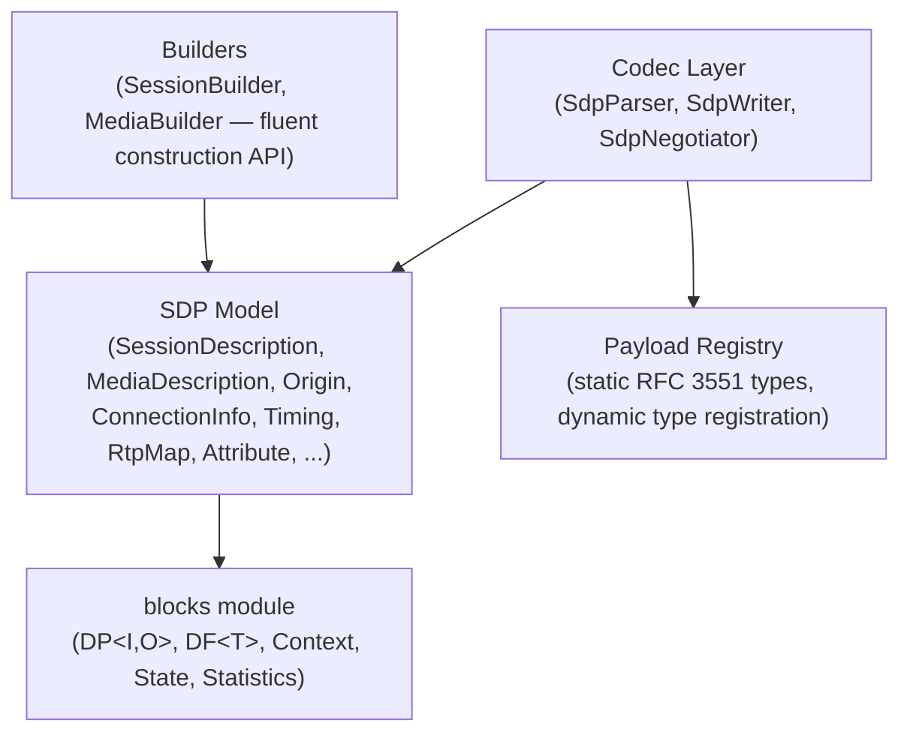
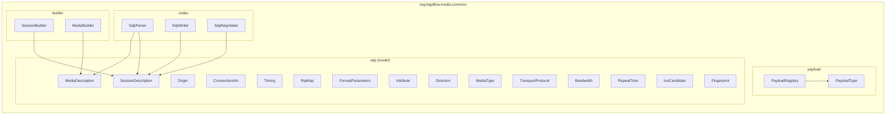
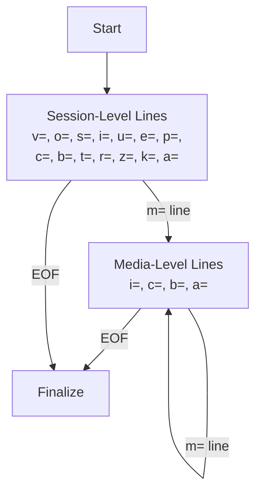
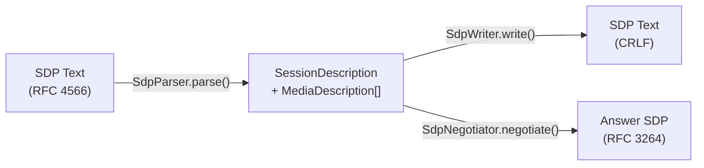
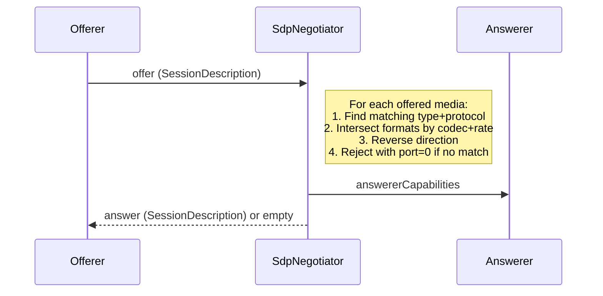
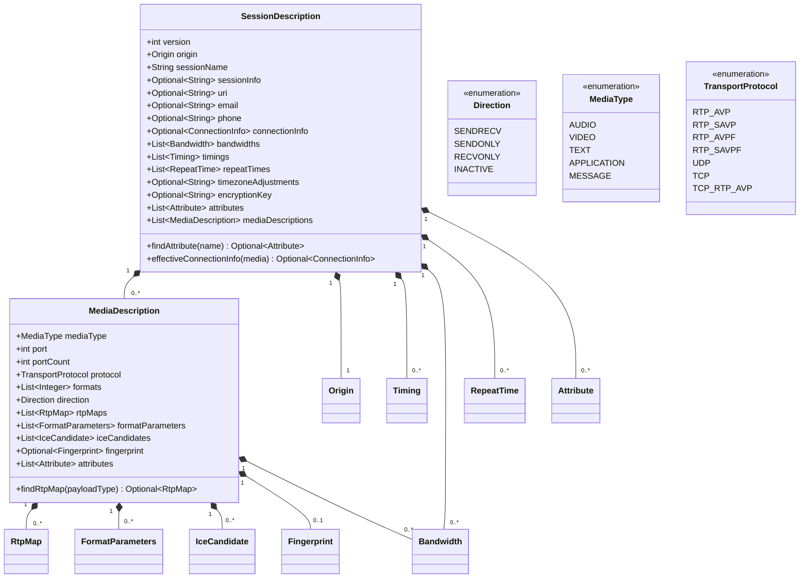
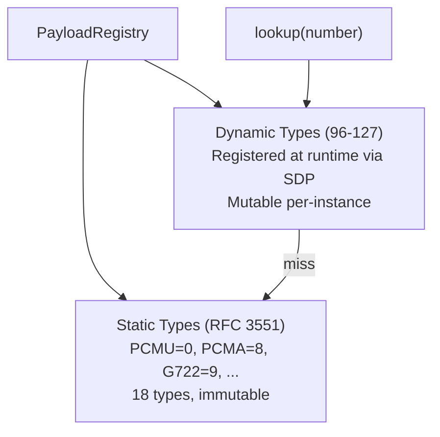

# Media Common Module -- Architecture

This document describes the architectural decisions for the media/common SDP module.

---

## Protocol Overview

SDP (Session Description Protocol, RFC 4566) is a text-based format for describing multimedia session parameters. It is used by signaling protocols (SIP, RTSP) to describe media sessions, negotiate codecs, and exchange transport addresses. This module provides the shared SDP infrastructure consumed by both the RTSP and SIP modules in Lego Flow.

## Layered Architecture

## Module Structure

## SDP Document Structure

An SDP document consists of session-level fields followed by zero or more media descriptions. The parser processes this as a state machine:

## Parse / Write Data Flow

## Offer/Answer Negotiation (RFC 3264)

## Model Class Hierarchy

## Payload Type Registry Architecture

## Design Decisions

### Immutable Model
All model classes produce immutable instances. `SessionDescription` and `MediaDescription` use `List.copyOf()` for all collection fields. Record types (`Origin`, `Timing`, etc.) are inherently immutable. This makes parsed SDP objects safe to share across threads without synchronization.

### Dual Representation of Attributes
Media-level attributes are stored both as typed objects (`rtpMaps`, `formatParameters`, `iceCandidates`, `fingerprint`, `direction`) and as generic `Attribute` instances in the `attributes` list. This dual representation allows:
- Type-safe access via dedicated getters (e.g., `findRtpMap(96)`)
- Lossless round-trip: the writer serializes from the generic `attributes` list, preserving original order and any unknown attributes

### Single-Pass Parser
The parser processes SDP text in a single pass, line by line. A state transition occurs on encountering an `m=` line, switching from session-level to media-level context. This keeps parsing simple, efficient, and memory-friendly for large SDP documents with many media sections.

### Static Utility Classes
`SdpParser`, `SdpWriter`, and `SdpNegotiator` are stateless utility classes with private constructors and static methods. No instance state is needed because SDP parsing and writing are pure transformations.

## Cross-Module Usage

| Consumer Module | Usage |
|----------------|-------|
| `media/rtsp` | Parses SDP from DESCRIBE responses, writes SDP for ANNOUNCE, uses negotiator for SETUP |
| `media/sip` | Parses SDP from INVITE/200 OK bodies, writes SDP offers/answers, negotiates codecs |

---

## Related Documentation

- [Module README](../README.md) | [Requirements](REQUIREMENTS.md) | [Compliance](COMPLIANCE.md)
- [Root Architecture](../../doc/ARCHITECTURE.md) | [Root README](../../README.md)

---

**Last Updated**: 2026-07-06
