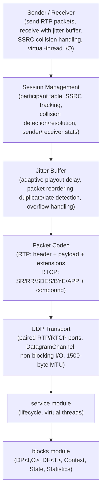
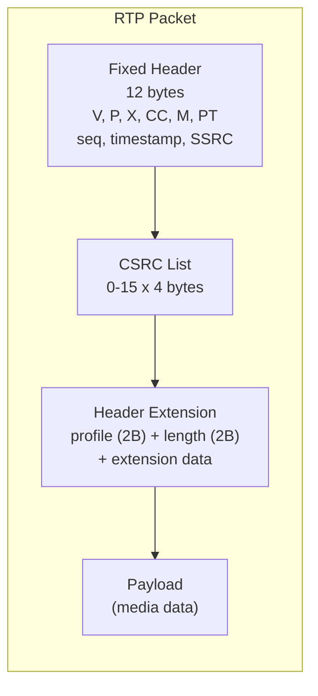
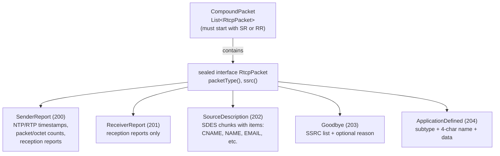
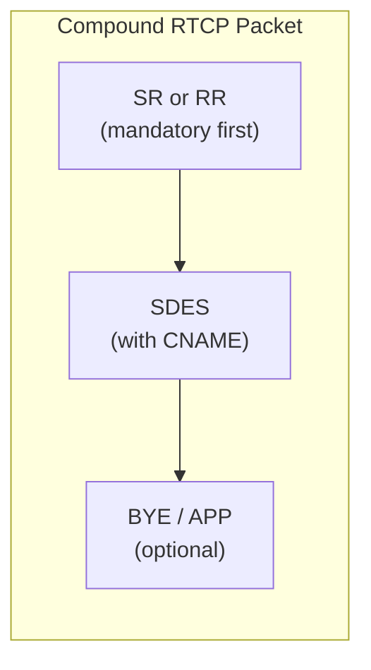
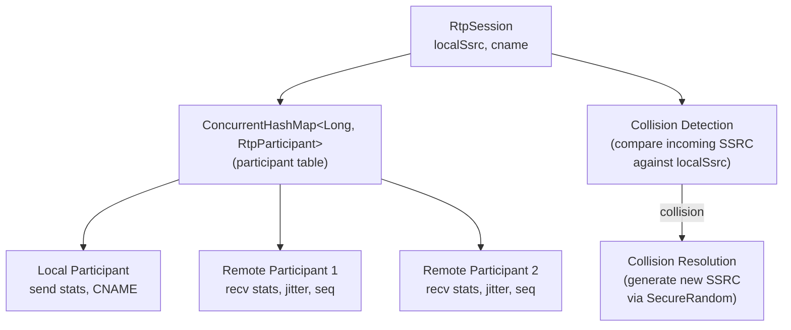
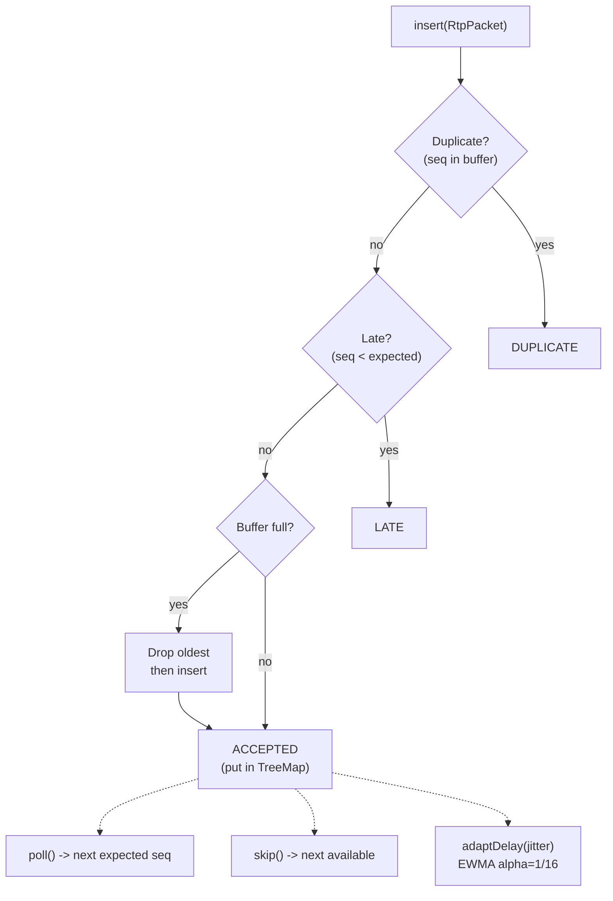
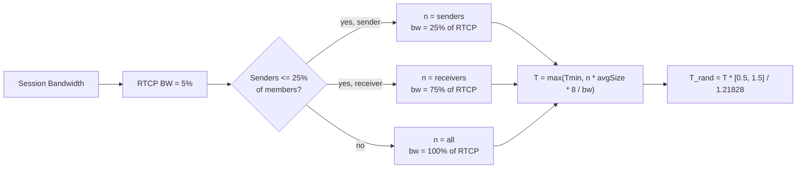
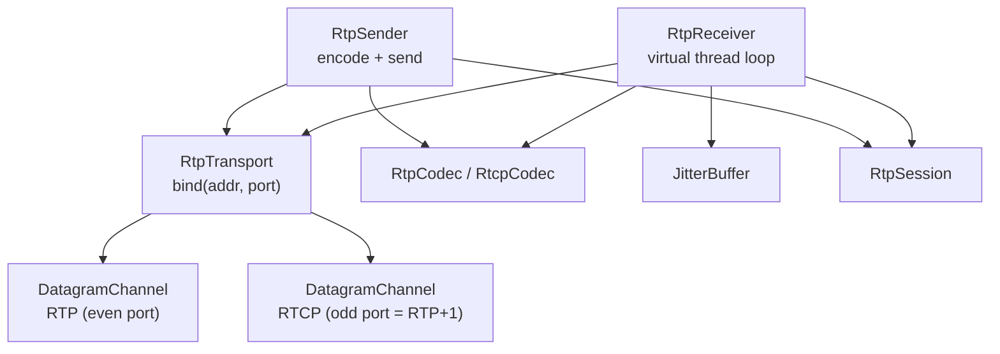
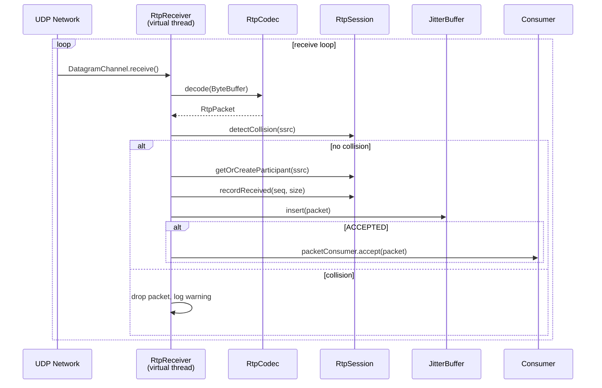

# RTP Module -- Architecture

This document describes the architectural decisions for the RTP/RTCP module.

---

## Protocol Overview

RTP (Real-time Transport Protocol) provides end-to-end delivery services for real-time media data such as audio and video. RTCP (RTP Control Protocol) provides out-of-band control information including sender/receiver statistics, source identification, and session membership. Both are defined in RFC 3550. The Lego Flow implementation provides packet-level encode/decode, session management, jitter buffering, and UDP transport.

## Layered Architecture

## RTP Packet Structure

The RTP packet consists of a fixed 12-byte header followed by optional CSRC list, optional header extension, and payload:

### Fixed Header Fields

| Field | Bits | Description |
|-------|------|-------------|
| Version (V) | 2 | Always 2 |
| Padding (P) | 1 | Packet contains padding octets |
| Extension (X) | 1 | Header extension present |
| CSRC Count (CC) | 4 | Number of CSRC identifiers (0-15) |
| Marker (M) | 1 | Profile-specific marker (e.g., frame boundary) |
| Payload Type (PT) | 7 | Media encoding identifier (0-127) |
| Sequence Number | 16 | Increments per packet (wrap at 65535) |
| Timestamp | 32 | Sampling instant of the first octet (unsigned) |
| SSRC | 32 | Synchronization source identifier (unsigned) |

## RTCP Packet Type Hierarchy

All RTCP types share a 4-byte common header: version (2 bits), padding (1 bit), count/subtype (5 bits), packet type (8 bits), length in 32-bit words (16 bits).

## RTCP Compound Packet Rules

RFC 3550 Section 6.1 requires RTCP packets to be sent as compound packets:

- First packet must be SR (if sender) or RR (if receiver only)
- SDES with at least CNAME should follow
- Additional packets (BYE, APP) may be appended

## Session Architecture

- **Participant Table**: `ConcurrentHashMap` keyed by SSRC for O(1) lookup
- **Local Participant**: created on session construction with CNAME
- **Collision Detection**: checks incoming SSRC against local SSRC (RFC 3550 Section 8.2)
- **SSRC Generation**: `SecureRandom` for random 32-bit unsigned values

## Jitter Buffer Architecture

- **Data Structure**: `TreeMap<Integer, RtpPacket>` with custom comparator for 16-bit sequence number wrap-around
- **Thread Safety**: `ReentrantLock` for concurrent producer (receiver) and single consumer (playout)
- **Sequence Wrap-Around**: comparator computes `(a - b) & 0xFFFF` and checks if delta < 0x8000
- **Adaptive Delay**: EWMA with alpha=1/16 per RFC 3550 Appendix A.8, clamped to [minDelay, maxDelay]

## RTCP Interval Calculation

Parameters from RFC 3550 Section 6.3:
- Minimum interval: 5 seconds (2.5 for initial report)
- Compensation factor: e/(e-1) = 1.21828
- Average packet size updated via EWMA with weight 1/16

## Transport Architecture

- **RtpTransport**: manages paired `DatagramChannel` for RTP and RTCP
- **RtpSender**: encodes via `RtpCodec`, sends via transport, updates session stats
- **RtpReceiver**: runs on `Thread.ofVirtual()`, decodes packets, checks SSRC collision, inserts into jitter buffer, notifies consumer callback
- **AutoCloseable**: transport and receiver implement proper cleanup

## Receive Pipeline

## Thread Safety Model

| Component | Strategy |
|-----------|----------|
| `RtpSession.participants` | `ConcurrentHashMap` -- lock-free concurrent reads/writes |
| `RtpSession.collisionCount` | `AtomicLong` |
| `RtpParticipant` fields | `AtomicLong`, `AtomicReference`, `volatile` |
| `JitterBuffer.buffer` | `ReentrantLock` guarding `TreeMap` |
| `RtpTransport.closed` | `volatile boolean` |
| `RtpReceiver.running` | `AtomicBoolean` |
| `RtpSender` counters | `AtomicLong` |

## Integration with Lego Flow

| Lego Flow Module | Usage in RTP |
|------------------|--------------|
| `blocks` | DP<I,O> for packet processing pipeline, DF<T> for filtering, Statistics for metrics |
| `service` | Lifecycle management, virtual thread pools |
| `media-common` | Shared SDP parser for session description exchange |

---

## Related Documentation

- [Module README](../README.md) | [Requirements](REQUIREMENTS.md) | [Compliance](COMPLIANCE.md)
- [Root Architecture](../../../doc/ARCHITECTURE.md) | [Root README](../../../README.md)

---

**Last Updated**: 2026-07-06
