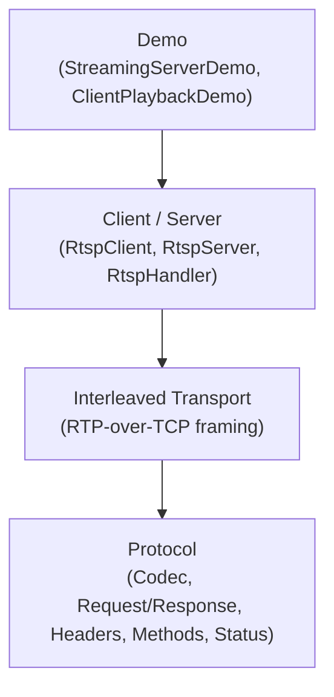
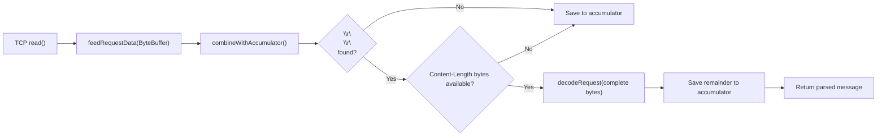

# RTSP Module — Architecture

## Module Purpose

Implements RTSP 2.0 (RFC 7826) from scratch, providing protocol codec, server, client, and interleaved binary transport for real-time media streaming control.

## Layer Structure

## Key Abstractions

### RtspCodec
Dual-mode RTSP message codec:
- **Static methods** (`encodeRequest`, `encodeResponse`, `decodeRequest`, `decodeResponse`) — stateless, one-shot encode/decode for complete messages. Thread-safe.
- **Instance methods** (`feedRequestData`, `feedResponseData`, `hasBufferedData`) — stateful stream-oriented decoding with internal ByteBuffer accumulation. An instance is *not* thread-safe and is intended to be owned by a single pipeline/connection.

### Stream-Oriented Codec Design

The stream-oriented API addresses the fundamental mismatch between TCP byte streams and RTSP message boundaries. TCP delivers arbitrary chunks; a single `read()` may contain a partial message, exactly one message, or multiple messages concatenated.

Key properties:
- **Internal accumulation**: the codec owns a `ByteBuffer accumulator` that holds partial data between reads
- **Message framing**: headers end at `\r\n\r\n`; body length determined by `Content-Length` header
- **Pipelining**: remainder bytes after a complete message are saved for the next call, supporting pipelined RTSP messages
- **Contract with transport**: `ProcessingThread` passes a single read's worth of data; the codec handles reassembly. Transport never accumulates or coalesces reads.

### RtspRequest / RtspResponse
Record types representing parsed RTSP messages with method/status, URI, headers, and optional body.

### RtspHeaders
Case-insensitive, multi-value header collection with format/parse support.

### InterleavedFrame / InterleavedFrameCodec
Binary frame codec for RTP-over-TCP interleaving ($ prefix, channel ID, length, payload).

### RtspServer / RtspHandler
Server accepts connections and dispatches requests to an `RtspHandler` callback. Sessions tracked via `RtspSession` with unique IDs.

### StreamController / StreamState
Media stream lifecycle management with state transitions (INIT, READY, PLAYING, PAUSED).

### RtspClient / RtspClientSession
Client issues DESCRIBE/SETUP/PLAY/PAUSE/TEARDOWN sequences. Sessions tracked via `RtspClientSession`.

## Package Map

| Package | Contents |
|---|---|
| `protocol` | RtspCodec, RtspRequest, RtspResponse, RtspHeaders, RtspMethod, RtspStatus, TransportHeader, RangeHeader |
| `server` | RtspServer, RtspHandler, RtspSession, StreamController, StreamState, MediaSource |
| `client` | RtspClient, RtspClientSession, SetupResult |
| `interleaved` | InterleavedFrame, InterleavedFrameCodec, InterleavedTransport |
| `demo` | StreamingServerDemo, ClientPlaybackDemo |

## Thread Safety Model

- **RtspCodec static methods**: stateless, thread-safe
- **RtspCodec instance**: single-owner, not thread-safe (owned by one pipeline/connection)
- **RtspServer**: virtual threads for connection handling
- **RtspSession**: per-connection state

## Dependencies

- `media-common` — shared SDP parser (RFC 4566)
- `slf4j-api` — logging

## Related Documentation

- [Requirements](REQUIREMENTS.md)
- [Root Architecture](../../doc/ARCHITECTURE.md) | [Root README](../../README.md)
