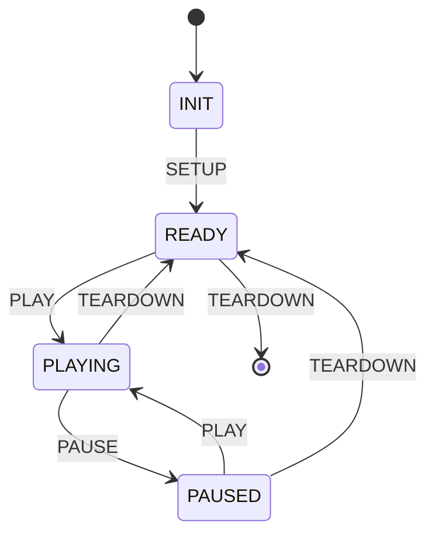

# RTSP Compliance Report

## Specifications Covered
- RTSP 2.0 — RFC 7826 (Real-Time Streaming Protocol Version 2.0, December 2016)

## Compliance Matrix

### RFC 7826 — RTSP Methods

| Section | Requirement | Status | Verification |
|---------|------------|--------|-------------|
| §13.1 | OPTIONS method | ✅ Implemented | `RtspMethod.OPTIONS`; `RtspClient.options()`; protocol tests |
| §13.2 | DESCRIBE method (SDP body) | ✅ Implemented | `RtspMethod.DESCRIBE`; `RtspClient.describe()`; protocol tests |
| §13.3 | SETUP method (transport negotiation) | ✅ Implemented | `RtspMethod.SETUP`; `RtspClient.setup()`; `SetupResult`; protocol tests |
| §13.4 | PLAY method | ✅ Implemented | `RtspMethod.PLAY`; `RtspClient.play()`; protocol tests |
| §13.5 | PAUSE method | ✅ Implemented | `RtspMethod.PAUSE`; `RtspClient.pause()`; protocol tests |
| §13.6 | TEARDOWN method | ✅ Implemented | `RtspMethod.TEARDOWN`; `RtspClient.teardown()`; protocol tests |
| §13.7 | GET_PARAMETER method | ✅ Implemented | `RtspMethod.GET_PARAMETER`; protocol tests |
| §13.8 | SET_PARAMETER method | ❌ Not implemented | — |
| §13.9 | REDIRECT method | ❌ Not implemented | — |

### RFC 7826 — Message Format

| Section | Requirement | Status | Verification |
|---------|------------|--------|-------------|
| §7.1 | Request line (Method SP Request-URI SP RTSP-Version CRLF) | ✅ Implemented | `RtspRequest` record; `RtspCodecTest` |
| §7.2 | Response status line (RTSP-Version SP Status-Code SP Reason-Phrase CRLF) | ✅ Implemented | `RtspResponse` record; `RtspCodecTest` |
| §7.3 | Message headers (CRLF-terminated, case-insensitive) | ✅ Implemented | `RtspHeaders`; `RtspHeadersTest` |
| §7.3 | Multi-value headers | ✅ Implemented | `RtspHeaders.getAll()`; header tests |
| §7.4 | Message body (Content-Length delimited) | ✅ Implemented | `RtspCodec` body parsing; codec tests |
| §7 | CRLF message termination | ✅ Implemented | `RtspCodec` encode/decode; `RtspCodecTest` |

### RFC 7826 — Headers

| Section | Requirement | Status | Verification |
|---------|------------|--------|-------------|
| §18.17 | CSeq header (sequence numbering) | ✅ Implemented | `RtspClient` auto-increment; protocol tests |
| §18.49 | Session header (session ID) | ✅ Implemented | `RtspSession`; server tests |
| §18.52 | Transport header | ✅ Implemented | `TransportHeader` (protocol, profile, lower-transport, unicast/multicast, ports); `TransportHeaderTest` |
| §18.36 | Range header (NPT) | ✅ Implemented | `RangeHeader` (NPT time ranges); `RangeHeaderTest` |
| §18.16 | Content-Length header | ✅ Implemented | `RtspCodec` body framing; codec tests |
| §18.15 | Content-Type header | ✅ Implemented | Used for SDP body (application/sdp); protocol tests |
| §18.42 | Server header | ✅ Implemented | `RtspServer.serverName`; server tests |
| §18.43 | Session header timeout | ⚠️ Partial | Session tracked but timeout enforcement not implemented |

### RFC 7826 — Status Codes

| Section | Requirement | Status | Verification |
|---------|------------|--------|-------------|
| §17.1 | 1xx Informational | ⚠️ Partial | `RtspStatus` enum defined; not generated by server |
| §17.2 | 200 OK | ✅ Implemented | `RtspStatus.OK`; used throughout server responses |
| §17.3 | 3xx Redirection | ❌ Not implemented | No redirect handling |
| §17.4.1 | 400 Bad Request | ✅ Implemented | `RtspStatus.BAD_REQUEST`; server error handling |
| §17.4.3 | 404 Not Found | ✅ Implemented | `RtspStatus.NOT_FOUND`; media source lookup |
| §17.4.6 | 405 Method Not Allowed | ✅ Implemented | `RtspStatus.METHOD_NOT_ALLOWED`; handler dispatch |
| §17.4.12 | 454 Session Not Found | ✅ Implemented | `RtspStatus.SESSION_NOT_FOUND`; session validation |
| §17.4.14 | 461 Unsupported Transport | ✅ Implemented | `RtspStatus.UNSUPPORTED_TRANSPORT`; setup negotiation |
| §17.5 | 500 Internal Server Error | ✅ Implemented | `RtspStatus.INTERNAL_SERVER_ERROR`; server error handling |

### RFC 7826 — Transport

| Section | Requirement | Status | Verification |
|---------|------------|--------|-------------|
| §18.52 | RTP/AVP profile | ✅ Implemented | `TransportHeader` profile parsing; transport tests |
| §18.52 | Unicast delivery | ✅ Implemented | `TransportHeader.isUnicast()`; transport tests |
| §18.52 | Multicast delivery | ✅ Implemented | `TransportHeader.isMulticast()`; transport tests |
| §18.52 | Client port range | ✅ Implemented | `TransportHeader.clientPortRange()`; transport tests |
| §18.52 | Server port range | ✅ Implemented | `TransportHeader.serverPortRange()`; transport tests |
| §14 | Interleaved binary framing ($ prefix) | ✅ Implemented | `InterleavedFrame`, `InterleavedFrameCodec`; interleaved tests |
| §14 | Channel ID multiplexing | ✅ Implemented | `InterleavedFrame.channel()`; interleaved tests |
| §14 | RTP-over-TCP transport | ✅ Implemented | `InterleavedTransport`; interleaved tests |

### RFC 7826 — Session Management

| Section | Requirement | Status | Verification |
|---------|------------|--------|-------------|
| §18.49 | Session ID generation | ✅ Implemented | `RtspSession` unique IDs; server tests |
| §18.49 | Session binding to transport | ✅ Implemented | `RtspSession` per-connection; server tests |
| §13.3 | Media stream setup | ✅ Implemented | `StreamController`, `SetupResult`; stream tests |
| §13.4 | Media stream play | ✅ Implemented | `StreamController` state transition; stream tests |
| §13.5 | Media stream pause | ✅ Implemented | `StreamController` state transition; stream tests |
| §13.6 | Session teardown | ✅ Implemented | `StreamController.stop()`; stream tests |

### RFC 7826 — Stream State Machine

### RFC 7826 — Codec (Stream-Oriented)

| Section | Requirement | Status | Verification |
|---------|------------|--------|-------------|
| §7 | Static encode/decode (one-shot, thread-safe) | ✅ Implemented | `RtspCodec.encodeRequest/decodeRequest/encodeResponse/decodeResponse`; codec tests |
| §7 | Stream-oriented decoding (ByteBuffer accumulation) | ✅ Implemented | `RtspCodec.feedRequestData/feedResponseData`; CLAUDE.md |
| §7 | Header/body framing (CRLFCRLF + Content-Length) | ✅ Implemented | `RtspCodec` header end detection; codec tests |
| §7 | Interleaved frame detection ($ prefix byte) | ✅ Implemented | `RtspCodec.isInterleavedFrame()`; codec tests |
| §7 | Pipelining support (remainder bytes saved) | ✅ Implemented | Accumulator saves remainder; CLAUDE.md |

## Known Limitations

- **No SET_PARAMETER** — `SET_PARAMETER` method is not implemented
- **No REDIRECT** — `REDIRECT` method and 3xx status code handling are not implemented
- **No RTSP over TLS** — no RTSPS (TLS-encrypted RTSP) support
- **No authentication** — no HTTP Digest or other authentication mechanism
- **No pipelining in client** — client sends requests sequentially, does not pipeline
- **No session timeout enforcement** — session timeout value is tracked but expiry is not enforced
- **No RTCP feedback** — interleaved transport handles RTP frames but does not process RTCP
- **No aggregate control** — single-stream sessions only; no aggregate URI for multi-stream control
- **No connection reuse** — each client session uses a dedicated connection
- **SDP parsing delegated** — session descriptions are parsed by the `media-common` module, not by this module

## Test Coverage Summary
- Total compliance tests: 203
- Key unit test classes: `RtspCodecTest`, `RtspHeadersTest`, `TransportHeaderTest`, `RangeHeaderTest`, `RtspMethodTest`, `RtspStatusTest`, `RtspServerTest`, `RtspSessionTest`, `StreamControllerTest`, `RtspClientTest`, `RtspClientSessionTest`, `InterleavedFrameCodecTest`, `InterleavedTransportTest`
- Key demo test classes: `StreamingServerDemoTest`
- Sections fully covered: All core RTSP methods (OPTIONS through TEARDOWN), message codec, transport header, range header, interleaved binary framing, session management, stream state machine
- Key areas needing improvement: SET_PARAMETER, REDIRECT, RTSPS/TLS, authentication, session timeout enforcement
