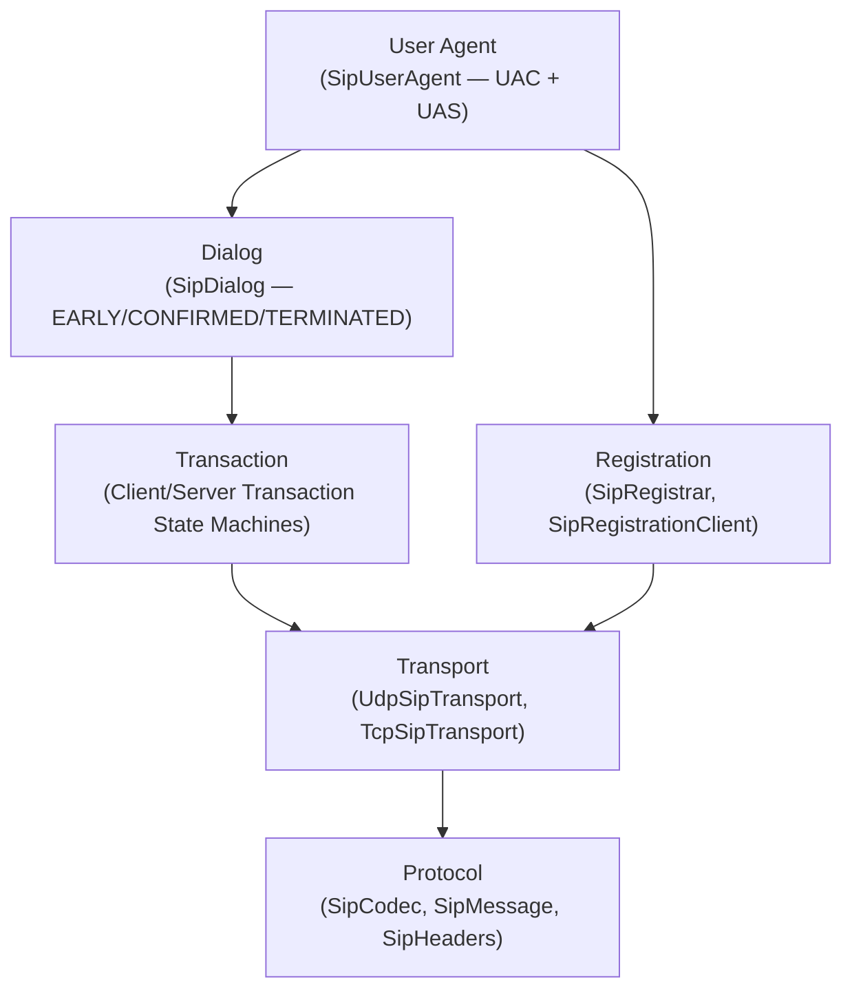

# Lego Flow SIP Module

[](https://www.oracle.com/java/)
[](https://maven.apache.org/)
[](../LICENSE)
[]()
[]()

SIP protocol module for the Lego Flow framework, providing VoIP signaling with transaction layer, registration, dialog management, and dual transport (UDP + TCP).

## Overview

This module implements SIP (RFC 3261) from scratch, enabling Java applications to build VoIP signaling endpoints, registrars, and user agents. The architecture layers transactions and dialogs on top of a pluggable transport:



## Features

- **SIP (RFC 3261)** — full protocol implementation for VoIP signaling
- **Protocol codec** — dual-mode: static one-shot encode/decode (thread-safe, auto-detects request vs. response) and stream-oriented ByteBuffer accumulation for TCP
- **Transaction layer** — RFC 3261 client/server state machines (CALLING, TRYING, PROCEEDING, COMPLETED, CONFIRMED, TERMINATED)
- **Dialog management** — dialog lifecycle (EARLY, CONFIRMED, TERMINATED) with route set tracking
- **Registration** — server-side `SipRegistrar` (binding table with expiry) and `SipRegistrationClient`
- **Dual transport** — pluggable `SipTransport` interface with UDP (message-per-datagram) and TCP (stream codec reassembly) implementations
- **User agent** — `SipUserAgent` combining UAC and UAS roles with INVITE/ACK/BYE call setup and SDP offer/answer
- **Typed headers** — `ViaHeader`, `CSeqHeader`, `AddressHeader` with parameter parsing
- **Header folding** — multi-line header continuation per RFC 3261 section 7.3.1
- **Compact headers** — supports compact form `l` for Content-Length (RFC 3261 section 7.3.3)
- **SIP URI parsing** — `SipUri` with user, host, port, parameters, and headers
- **Sealed message types** — `SipMessage` sealed interface with `SipRequest` and `SipResponse`

## Quick Start

### Make a call (UAC)

```java
var ua = new SipUserAgent("sip:alice@example.com", "sip:alice@192.168.1.1:5060");
ua.setLocalSdp(myCapabilities);
SipResponse response = ua.invite("sip:bob@example.com");
// ... call in progress ...
ua.bye(dialog);
```

### Receive a call (UAS)

```java
var ua = new SipUserAgent("sip:bob@example.com", "sip:bob@192.168.1.2:5060");
ua.setLocalSdp(myCapabilities);
ua.setInviteHandler(request -> {
    return ua.accept(request); // 200 OK with SDP answer
});
```

### Register with a registrar

```java
var registrar = new SipRegistrar();
registrar.register("sip:alice@example.com", "sip:alice@192.168.1.1:5060", 3600);
var bindings = registrar.lookup("sip:alice@example.com");
```

### Encode and decode messages

```java
// Encode a request
byte[] encoded = SipCodec.encode(request);

// Decode with auto-detection (request vs. response)
SipMessage message = SipCodec.decode(rawBytes);
switch (message) {
    case SipRequest req -> handleRequest(req);
    case SipResponse res -> handleResponse(res);
}
```

## Package Structure

```
ssg.legoflow.media.sip/
├── protocol/          — Codec, request/response, method/status enums, SIP URI parser
├── header/            — Typed header records: Via, CSeq, Address, generic SipHeaders
├── transaction/       — Client/server transaction state machines per RFC 3261
├── registration/      — Registrar (server-side bindings), registration client
├── dialog/            — Dialog state management, route set
├── transport/         — UDP and TCP transport implementations
└── agent/             — SipUserAgent coordinating transport + transactions + dialogs
```

## Dependencies

This module depends on:
- `media-common` — shared SDP parser (RFC 4566) for offer/answer media negotiation
- `slf4j-api` — logging

---

**Part of the [Lego Flow](../../README.md) framework.**

## Documentation

- [Architecture](doc/ARCHITECTURE.md) | [Requirements](doc/REQUIREMENTS.md) | [Compliance](doc/COMPLIANCE.md)
- [Root README](../../README.md) | [Root Architecture](../../doc/ARCHITECTURE.md)
