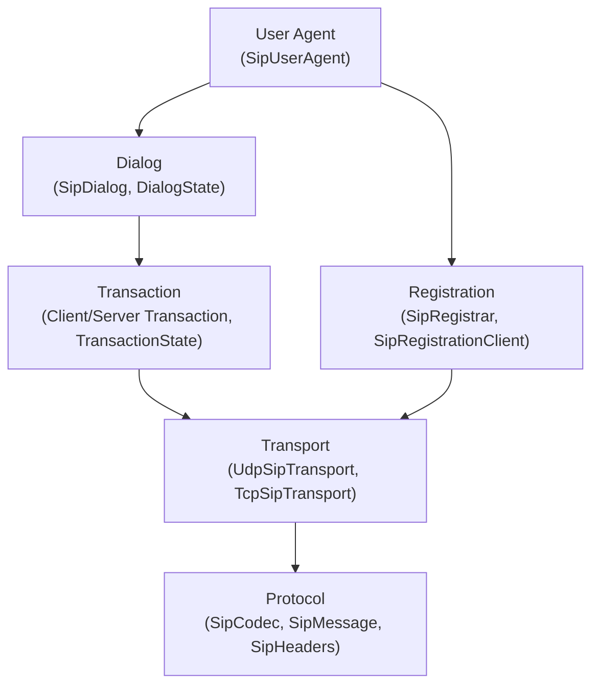
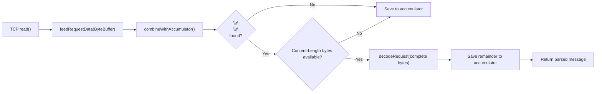

# SIP Module — Architecture

## Module Purpose

Implements SIP (RFC 3261) from scratch, providing protocol codec, transaction layer, registration, dialog management, dual transport (UDP + TCP), and user agent for VoIP signaling.

## Layer Structure

## Key Abstractions

### SipCodec
Dual-mode SIP message codec:
- **Static methods** (`encode`, `decode`, `decodeRequest`, `decodeResponse`) — stateless, one-shot encode/decode for complete messages. Thread-safe. Auto-detects request vs. response.
- **Instance methods** (`feedRequestData`, `feedResponseData`, `hasBufferedData`) — stateful stream-oriented decoding with internal ByteBuffer accumulation. An instance is *not* thread-safe and is intended to be owned by a single pipeline/connection.

### Stream-Oriented Codec Design

The stream-oriented API addresses TCP byte stream reassembly for SIP messages. SIP can run over both UDP (message-per-datagram) and TCP (byte stream requiring framing).

Key properties:
- **Internal accumulation**: the codec owns a `ByteBuffer accumulator` that holds partial data between reads
- **Message framing**: headers end at `\r\n\r\n`; body length determined by `Content-Length` header (supports compact `l` form per RFC 3261)
- **Compact headers**: `parseContentLengthFromRaw` accepts both `Content-Length` and `l` (RFC 3261 section 7.3.3)
- **Contract with transport**: `ProcessingThread` passes a single read's worth of data; the codec handles reassembly

### SipMessage (sealed)
Sealed interface with two permitted implementations:
- `SipRequest` — method, request-URI, version, headers, body
- `SipResponse` — version, status code, reason phrase, headers, body

### SipHeaders
Case-insensitive, multi-value header collection. Supports header folding per RFC 3261 section 7.3.1 (continuation lines starting with SP or HT).

### Typed Header Records
- `ViaHeader` — Via header with protocol, transport, sent-by, branch parameter
- `CSeqHeader` — CSeq with sequence number and method
- `AddressHeader` — From/To/Contact with display name, URI, parameters

### Transaction Layer
RFC 3261 transaction state machines:
- `ClientTransaction` — CALLING/TRYING/PROCEEDING/COMPLETED/TERMINATED
- `ServerTransaction` — TRYING/PROCEEDING/COMPLETED/CONFIRMED/TERMINATED
- `TransactionState` enum with valid transition enforcement

### SipDialog
Dialog lifecycle: EARLY (provisional response) -> CONFIRMED (2xx) -> TERMINATED (BYE). Manages route set and remote target.

### Registration
- `SipRegistrar` — server-side: maintains binding table (address-of-record to contact-URI mappings) with expiry
- `SipRegistrationClient` — client-side: REGISTER request construction and refresh

### Transport
- `SipTransport` — interface for send/receive
- `UdpSipTransport` — message-per-datagram (no stream reassembly needed)
- `TcpSipTransport` — byte stream (uses stream-oriented SipCodec for reassembly)

### SipUserAgent
High-level coordination of transport, transactions, registration, and dialogs.

## Package Map

| Package | Contents |
|---|---|
| `protocol` | SipCodec, SipMessage, SipRequest, SipResponse, SipMethod, SipStatus, SipUri |
| `header` | SipHeaders, ViaHeader, CSeqHeader, AddressHeader |
| `transaction` | SipTransaction, ClientTransaction, ServerTransaction, TransactionState |
| `registration` | SipRegistrar, SipRegistrationClient, RegistrationBinding |
| `dialog` | SipDialog, DialogState |
| `transport` | SipTransport, UdpSipTransport, TcpSipTransport |
| `agent` | SipUserAgent |

## Thread Safety Model

- **SipCodec static methods**: stateless, thread-safe
- **SipCodec instance**: single-owner, not thread-safe (owned by one pipeline/connection)
- **Registration bindings**: ConcurrentHashMap for thread-safe storage
- **Transaction state**: atomic state transitions

## Dependencies

- `media-common` — shared SDP parser (RFC 4566)
- `slf4j-api` — logging

## Related Documentation

- [Requirements](REQUIREMENTS.md)
- [Root Architecture](../../doc/ARCHITECTURE.md) | [Root README](../../README.md)
