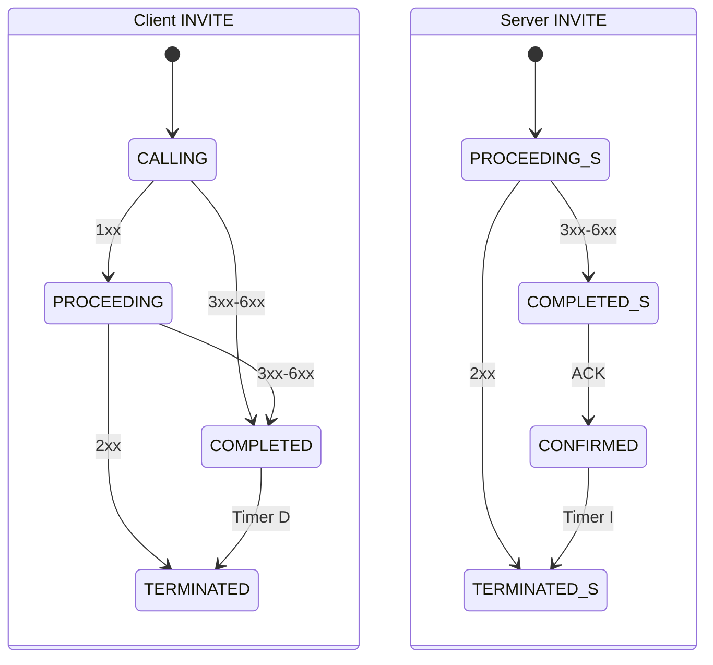

# SIP Compliance Report

## Specifications Covered
- SIP — RFC 3261 (Session Initiation Protocol, June 2002)

## Compliance Matrix

### RFC 3261 — SIP Methods

| Section | Requirement | Status | Verification |
|---------|------------|--------|-------------|
| §13 | INVITE (session initiation) | ✅ Implemented | `SipMethod.INVITE`; `SipUserAgent.invite()`; transaction tests |
| §13.2.2.4 | ACK (INVITE confirmation) | ✅ Implemented | `SipMethod.ACK`; `SipUserAgent` auto-ACK; dialog tests |
| §15 | BYE (session termination) | ✅ Implemented | `SipMethod.BYE`; `SipUserAgent.bye()`; dialog tests |
| §15.1 | CANCEL (pending request cancellation) | ✅ Implemented | `SipMethod.CANCEL`; protocol tests |
| §10 | REGISTER (location binding) | ✅ Implemented | `SipMethod.REGISTER`; `SipRegistrar`, `SipRegistrationClient`; registration tests |
| §11 | OPTIONS (capability query) | ✅ Implemented | `SipMethod.OPTIONS`; protocol tests |
| — | INFO, NOTIFY, SUBSCRIBE, UPDATE, REFER, MESSAGE, PRACK | ❌ Not implemented | Extension methods not supported |

### RFC 3261 — Message Format

| Section | Requirement | Status | Verification |
|---------|------------|--------|-------------|
| §7.1 | Request line (Method SP Request-URI SP SIP-Version CRLF) | ✅ Implemented | `SipRequest`; `SipCodecTest` |
| §7.2 | Status line (SIP-Version SP Status-Code SP Reason-Phrase CRLF) | ✅ Implemented | `SipResponse`; `SipCodecTest` |
| §7.3 | Header fields (case-insensitive, multi-value) | ✅ Implemented | `SipHeaders`; header tests |
| §7.3.1 | Multi-line header folding (SP/HT continuation) | ✅ Implemented | `SipCodec` folding support; codec tests |
| §7.3.3 | Compact header forms (single-letter abbreviations) | ✅ Implemented | `SipCodec` recognizes `l` for Content-Length; codec tests |
| §7.4 | Message body (Content-Length delimited) | ✅ Implemented | `SipCodec` body parsing; codec tests |
| §7 | Auto-detection (request vs. response) | ✅ Implemented | `SipCodec.decode()` checks first line; codec tests |

### RFC 3261 — Headers

| Section | Requirement | Status | Verification |
|---------|------------|--------|-------------|
| §8.1.1.7 | Via header (protocol, transport, sent-by, branch) | ✅ Implemented | `ViaHeader` record; `ViaHeaderTest` |
| §8.1.1.5 | CSeq header (sequence number + method) | ✅ Implemented | `CSeqHeader` record; `CSeqHeaderTest` |
| §8.1.1.2 | To header (address-of-record) | ✅ Implemented | `AddressHeader`; header tests |
| §8.1.1.1 | From header (address-of-record + tag) | ✅ Implemented | `AddressHeader`; header tests |
| §8.1.1.8 | Call-ID header | ✅ Implemented | `SipHeaders`; protocol tests |
| §8.1.1.4 | Max-Forwards header | ✅ Implemented | `SipHeaders`; protocol tests |
| §8.1.1.3 | Contact header | ✅ Implemented | `AddressHeader`; registration tests |
| §20.14 | Content-Length header (full + compact `l` form) | ✅ Implemented | `SipCodec.parseContentLengthFromRaw()`; codec tests |
| §20.15 | Content-Type header | ✅ Implemented | Used for SDP body; protocol tests |

### RFC 3261 — Transaction Layer

| Section | Requirement | Status | Verification |
|---------|------------|--------|-------------|
| §17.1.1 | Client INVITE transaction (Fig. 5) | ✅ Implemented | `ClientTransaction`; transaction tests |
| §17.1.2 | Client non-INVITE transaction (Fig. 6) | ✅ Implemented | `ClientTransaction`; transaction tests |
| §17.2.1 | Server INVITE transaction (Fig. 7) | ✅ Implemented | `ServerTransaction`; transaction tests |
| §17.2.2 | Server non-INVITE transaction (Fig. 8) | ✅ Implemented | `ServerTransaction`; transaction tests |
| §17.1 | Transaction state: CALLING | ✅ Implemented | `TransactionState.CALLING`; transaction tests |
| §17.1 | Transaction state: TRYING | ✅ Implemented | `TransactionState.TRYING`; transaction tests |
| §17.1 | Transaction state: PROCEEDING | ✅ Implemented | `TransactionState.PROCEEDING`; transaction tests |
| §17.1 | Transaction state: COMPLETED | ✅ Implemented | `TransactionState.COMPLETED`; transaction tests |
| §17.2.1 | Transaction state: CONFIRMED | ✅ Implemented | `TransactionState.CONFIRMED`; transaction tests |
| §17.1 | Transaction state: TERMINATED | ✅ Implemented | `TransactionState.TERMINATED`; transaction tests |
| §17.1 | Valid state transition enforcement | ✅ Implemented | `TransactionState` with transition validation; transaction tests |

### RFC 3261 — Transaction State Machines

### RFC 3261 — Dialog Layer

| Section | Requirement | Status | Verification |
|---------|------------|--------|-------------|
| §12 | Dialog creation (from 1xx/2xx to INVITE) | ✅ Implemented | `SipDialog`; dialog tests |
| §12.1 | Dialog state: EARLY (provisional response) | ✅ Implemented | `DialogState.EARLY`; dialog tests |
| §12.1 | Dialog state: CONFIRMED (2xx response) | ✅ Implemented | `DialogState.CONFIRMED`; dialog tests |
| §12.1 | Dialog state: TERMINATED (BYE) | ✅ Implemented | `DialogState.TERMINATED`; dialog tests |
| §12.2 | Route set management | ✅ Implemented | `SipDialog` route set; dialog tests |
| §12.2 | Remote target tracking | ✅ Implemented | `SipDialog`; dialog tests |

### RFC 3261 — Registration

| Section | Requirement | Status | Verification |
|---------|------------|--------|-------------|
| §10.2 | Registrar (binding table management) | ✅ Implemented | `SipRegistrar`; registration tests |
| §10.2.1 | Binding creation (address-of-record to contact-URI) | ✅ Implemented | `RegistrationBinding`; registration tests |
| §10.2.2 | Binding refresh (update expiry) | ✅ Implemented | `SipRegistrar.register()`; registration tests |
| §10.2.3 | Binding removal (Expires: 0) | ✅ Implemented | `SipRegistrar`; registration tests |
| §10.2 | Binding expiry enforcement | ✅ Implemented | `RegistrationBinding` expiry; registration tests |
| §10.2 | Concurrent binding storage | ✅ Implemented | ConcurrentHashMap; thread safety tests |
| §10.2.8 | Registration client (REGISTER request construction) | ✅ Implemented | `SipRegistrationClient`; registration tests |

### RFC 3261 — Transport

| Section | Requirement | Status | Verification |
|---------|------------|--------|-------------|
| §18.1 | UDP transport (message-per-datagram) | ✅ Implemented | `UdpSipTransport`; transport tests |
| §18.2 | TCP transport (byte stream) | ✅ Implemented | `TcpSipTransport` with `SipCodec` stream reassembly; transport tests |
| §18 | Pluggable transport interface | ✅ Implemented | `SipTransport` interface; transport tests |
| §18 | SIP URI resolution (host, port) | ✅ Implemented | `SipUri` parser; protocol tests |

### RFC 3261 — Codec (Stream-Oriented)

| Section | Requirement | Status | Verification |
|---------|------------|--------|-------------|
| §7 | Static encode/decode (one-shot, thread-safe) | ✅ Implemented | `SipCodec.encode/decode/decodeRequest/decodeResponse`; codec tests |
| §7 | Stream-oriented decoding (ByteBuffer accumulation) | ✅ Implemented | `SipCodec.feedRequestData/feedResponseData`; CLAUDE.md |
| §7 | Header/body framing (CRLFCRLF + Content-Length) | ✅ Implemented | `SipCodec` header end detection; codec tests |
| §7.3.3 | Compact Content-Length (`l`) for stream framing | ✅ Implemented | `SipCodec.parseContentLengthFromRaw()`; codec tests |

### RFC 3261 — User Agent

| Section | Requirement | Status | Verification |
|---------|------------|--------|-------------|
| §8 | UAC (User Agent Client) role | ✅ Implemented | `SipUserAgent.invite()`, `bye()`; agent tests |
| §8 | UAS (User Agent Server) role | ✅ Implemented | `SipUserAgent.setInviteHandler()`; agent tests |
| §8 | Combined UAC + UAS | ✅ Implemented | `SipUserAgent`; agent tests |
| §8 | SDP offer/answer integration | ✅ Implemented | `SipUserAgent` with `media-common` SDP; agent tests |
| §8 | Call setup (INVITE/200 OK/ACK) | ✅ Implemented | `SipUserAgent`; agent tests |
| §8 | Call teardown (BYE) | ✅ Implemented | `SipUserAgent.bye()`; agent tests |

## Known Limitations

- **No extension methods** — INFO, NOTIFY, SUBSCRIBE, UPDATE, REFER, MESSAGE, PRACK are not implemented
- **No authentication** — no HTTP Digest authentication (RFC 3261 section 22) or other challenge/response mechanism
- **No TLS transport** — no SIPS URI scheme or TLS-encrypted SIP connections
- **No DNS SRV/NAPTR** — no DNS-based service discovery for SIP servers (RFC 3263)
- **No forking** — proxy forking and multiple 2xx responses are not handled
- **No proxy support** — no SIP proxy/redirect server implementation
- **No SRTP** — media encryption is not part of this signaling module
- **No reliable provisional responses** — PRACK (RFC 3262) is not supported
- **No timer-based retransmission** — transaction timers (Timer A, B, D, etc.) are modeled but not enforced with real timers
- **No multipart MIME** — message bodies are single-part only (typically SDP)
- **No SRTP/ZRTP key exchange** — no secure media key negotiation
- **SDP negotiation delegated** — offer/answer handled by `media-common` module SDP parser/negotiator

## Test Coverage Summary
- Total compliance tests: 163
- Key unit test classes: `SipCodecTest`, `SipHeadersTest`, `ViaHeaderTest`, `CSeqHeaderTest`, `AddressHeaderTest`, `ClientTransactionTest`, `ServerTransactionTest`, `TransactionStateTest`, `SipRegistrarTest`, `SipRegistrationClientTest`, `SipDialogTest`, `DialogStateTest`, `UdpSipTransportTest`, `TcpSipTransportTest`, `SipUserAgentTest`
- Sections fully covered: All core SIP methods (INVITE through OPTIONS), message codec with auto-detection, transaction state machines, dialog lifecycle, registration bindings, dual transport, user agent
- Key areas needing improvement: Extension methods, authentication, TLS, DNS SRV, proxy/forking, reliable provisional responses
