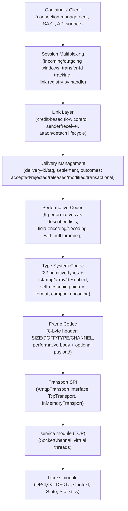
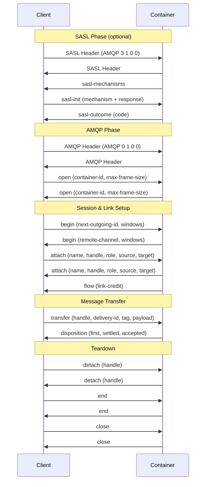
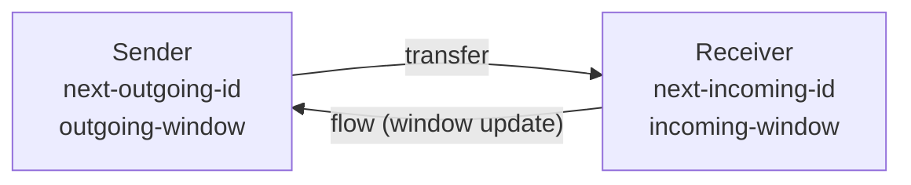
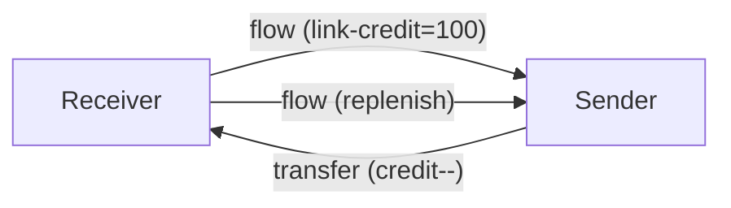
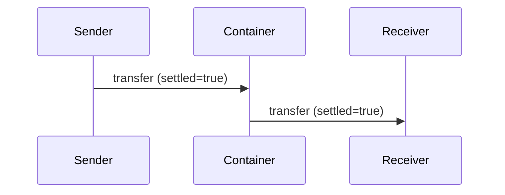
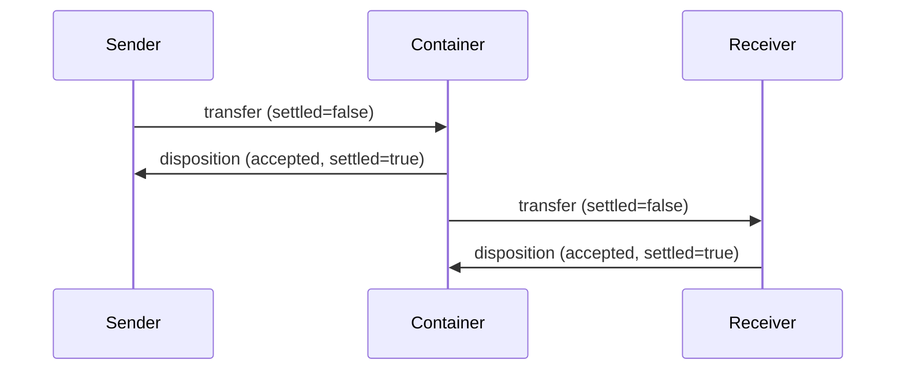
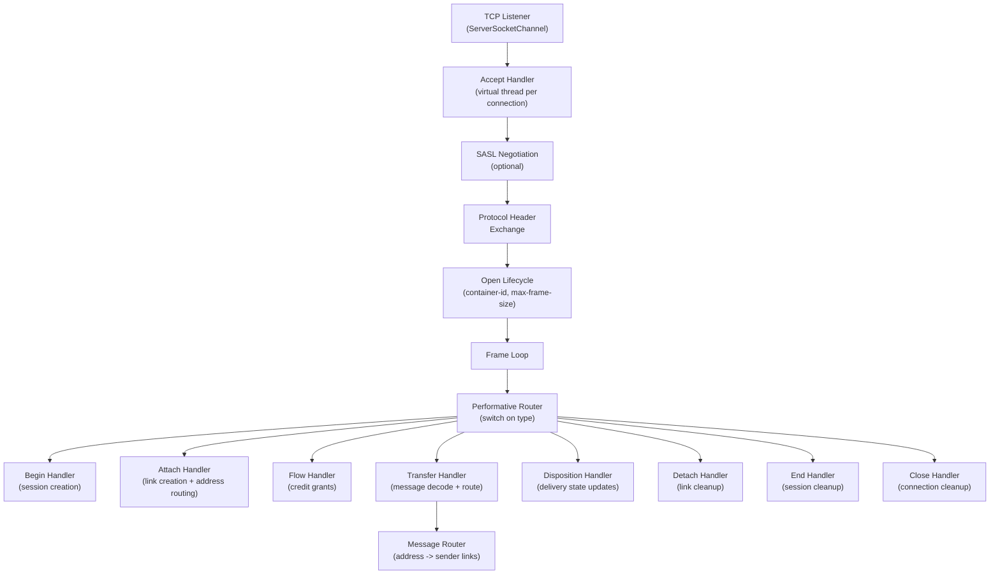
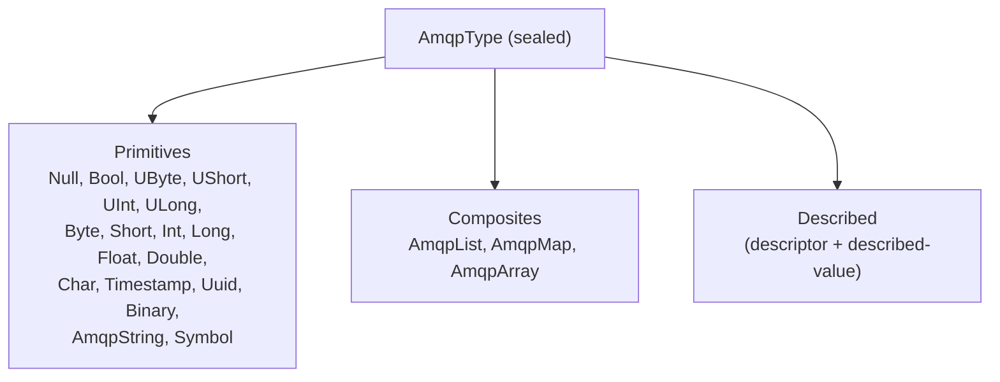
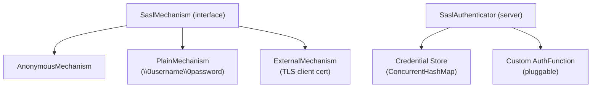
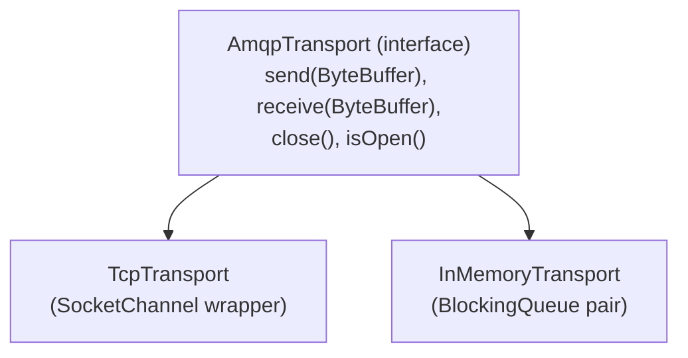

# AMQP Module -- Architecture

This document describes the architectural decisions for the AMQP module.

---

## Protocol Overview

AMQP 1.0 (ISO 19464 / OASIS) is an open standard for business messaging. Unlike earlier AMQP versions (0-9-1), AMQP 1.0 is a peer-to-peer protocol with credit-based flow control, session multiplexing, and a rich type system. The Lego Flow implementation provides a full protocol stack from the self-describing type system up through connection management.

## Layered Architecture

## Performatives

All 9 AMQP 1.0 transport performatives modeled as a sealed interface:

| Performative | Descriptor | Direction | Purpose |
|-------------|-----------|-----------|---------|
| Open | 0x10 | Both | Connection negotiation (container-id, max-frame-size, channel-max, idle-timeout) |
| Begin | 0x11 | Both | Session begin (remote-channel, next-outgoing-id, incoming/outgoing window) |
| Attach | 0x12 | Both | Link attachment (name, handle, role, source, target, settle modes) |
| Flow | 0x13 | Both | Flow control (session windows + link credit) |
| Transfer | 0x14 | Both | Message transfer (handle, delivery-id, delivery-tag, settled, payload) |
| Disposition | 0x15 | Both | Delivery state update (first, last, settled, state) |
| Detach | 0x16 | Both | Link detachment (handle, closed, error) |
| End | 0x17 | Both | Session end (error) |
| Close | 0x18 | Both | Connection close (error) |

## Connection Lifecycle

## Credit-Based Flow Control

AMQP uses credit-based flow control at two levels:

### Session-Level Windows

- **incoming-window**: max transfers we can accept (default 2048)
- **outgoing-window**: max transfers we can send (default 2048)
- Windows replenish when consumed below 25% of default

### Link-Level Credit

- Receiver grants credit via flow performative
- Sender decrements credit on each transfer
- Receiver auto-replenishes when credit drops below 25 (25% of default 100)
- Sender blocks (returns null) when credit is 0

## Delivery Semantics

### At-Most-Once (Pre-Settled)

No acknowledgement. Fire-and-forget.

### At-Least-Once (Settled on Accept)

Receiver explicitly accepts; message may be redelivered if not acknowledged.

### Delivery State Hierarchy

Six delivery states modeled as a sealed interface:
- **Received** -- partial reception (non-terminal)
- **Accepted** -- successfully processed (terminal)
- **Rejected** -- rejected with error condition (terminal)
- **Released** -- not processed, can be redelivered (terminal)
- **Modified** -- not processed, annotations modified (terminal)
- **TransactionalState** -- wraps an outcome within a transaction

## Container Architecture

- **Connection handling**: one virtual thread per connection via `Executors.newVirtualThreadPerTaskExecutor()`
- **Address-based routing**: `Map<String, List<SenderLink>>` routes messages from receivers to senders on the same address
- **Session management**: `Map<Integer, AmqpSession>` per connection, with remote-to-local channel mapping
- **Link management**: sender and receiver links registered in session by handle, and in container by address

## Client Architecture

- Connection lifecycle: SASL negotiation (optional) -> header exchange -> open -> ready -> close
- Background frame reader: virtual thread reads frames in a loop, dispatches to handleIncomingPerformative
- Session creation: send begin, wait for begin response
- Link attachment: send attach, wait for attach response, issue initial credit (receiver)
- Synchronous wait: spin-wait with deadline for session begin and link attach responses

## Type System Architecture

The AMQP type system is modeled as a sealed interface `AmqpType` with 22 record implementations:

- **Self-describing encoding**: each value preceded by a constructor byte (type code)
- **Compact encoding**: zero values (uint0, ulong0), small values (smalluint, smallint, smallulong, smalllong)
- **Described types**: constructor 0x00 + descriptor (usually ULong) + described value (usually AmqpList)
- **Null trimming**: trailing null fields removed from performative field lists

## SASL Authentication Architecture

- Client-side: `SaslMechanism` interface with `name()`, `initialResponse()`, `respond(challenge)`
- Server-side: `SaslAuthenticator` with in-memory credential store, anonymous toggle, external support, custom auth function
- Outcome codes: 0=ok, 1=auth, 2=sys, 3=sys-perm, 4=sys-temp

## Transport Abstraction

- **TcpTransport**: thin wrapper over `SocketChannel`, blocking I/O
- **InMemoryTransport**: `createPair()` returns two connected transports using `LinkedBlockingQueue`
- Container's `handleConnection(AmqpTransport)` is public, allowing direct injection of in-memory transports for testing

## Integration with Lego Flow

| Lego Flow Module | Usage in AMQP |
|------------------|---------------|
| `blocks` | DP<I,O> for message processing pipeline, DF<T> for message filtering, Statistics for metrics |
| `service` | TCP channels for container/client connections, virtual thread pools, lifecycle management |

The AMQP module follows the framework's conventions: AutoCloseable resources, fluent builder APIs for configuration, virtual threads for concurrency.

---

## Related Documentation

- [Module README](../README.md) | [Requirements](REQUIREMENTS.md) | [Compliance](COMPLIANCE.md)
- [Root Architecture](../../doc/ARCHITECTURE.md) | [Root README](../../README.md)

---

**Last Updated**: 2026-07-06
