# Kafka Module — Architecture

This document describes the architectural decisions for the Kafka module.

---

## Protocol Overview

Apache Kafka uses a custom binary protocol over TCP. Every message is length-prefixed (4-byte int32), followed by a request/response header and a type-specific body. The protocol uses correlation IDs to match requests with responses. This module implements 37 Kafka API types, covering produce/fetch, consumer groups (range/sticky/cooperative), topic management, idempotent production, transactions, SASL authentication, multi-broker simulation, dynamic configuration, and log compaction.

## Layered Architecture

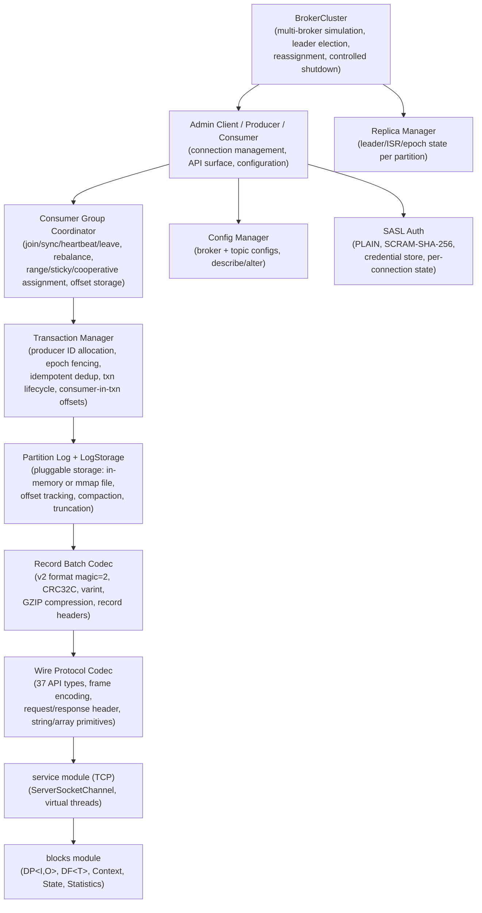

## Supported API Types (37)

| API Key | Name | Category | Purpose |
|---------|------|----------|---------|
| 0 | Produce | Core | Publish records to topic partitions |
| 1 | Fetch | Core | Fetch records from topic partitions |
| 2 | ListOffsets | Core | Get offsets for timestamps or earliest/latest |
| 3 | Metadata | Core | Get topic/partition/broker metadata |
| 4 | LeaderAndIsr | Multi-broker | Assign partition leadership and ISR |
| 5 | StopReplica | Multi-broker | Stop replicating partitions |
| 6 | UpdateMetadata | Multi-broker | Update cluster metadata cache |
| 7 | ControlledShutdown | Multi-broker | Graceful shutdown with leadership migration |
| 8 | OffsetCommit | Consumer group | Commit consumer group offsets |
| 9 | OffsetFetch | Consumer group | Fetch committed consumer group offsets |
| 10 | FindCoordinator | Consumer group | Find coordinator for group or transaction |
| 11 | JoinGroup | Consumer group | Join a consumer group |
| 12 | Heartbeat | Consumer group | Keep consumer group membership alive |
| 13 | LeaveGroup | Consumer group | Leave a consumer group |
| 14 | SyncGroup | Consumer group | Synchronize partition assignments |
| 15 | DescribeGroups | Consumer group | Describe consumer group state/members |
| 16 | ListGroups | Admin | List all consumer groups |
| 17 | SaslHandshake | Auth | Negotiate SASL mechanism |
| 18 | ApiVersions | Core | Negotiate supported API versions |
| 19 | CreateTopics | Admin | Create new topics |
| 20 | DeleteTopics | Admin | Delete existing topics |
| 21 | DeleteRecords | Admin | Truncate partition log before offset |
| 22 | InitProducerId | Transaction | Allocate producer ID for idempotent/txn |
| 23 | OffsetForLeaderEpoch | Multi-broker | Find offset for leader epoch boundary |
| 24 | AddPartitionsToTxn | Transaction | Register partitions in transaction |
| 25 | AddOffsetsToTxn | Transaction | Register consumer group in transaction |
| 26 | EndTxn | Transaction | Commit or abort transaction |
| 27 | WriteTxnMarkers | Transaction | Write commit/abort markers to logs |
| 28 | TxnOffsetCommit | Transaction | Commit offsets within transaction |
| 32 | DescribeConfigs | Config | Describe broker/topic configurations |
| 33 | AlterConfigs | Config | Alter topic configurations |
| 36 | SaslAuthenticate | Auth | SASL authentication exchange |
| 37 | CreatePartitions | Admin | Expand topic partition count |
| 42 | DeleteGroups | Admin | Delete consumer groups |
| 45 | AlterPartitionReassignments | Multi-broker | Reassign partition replicas |
| 46 | ListPartitionReassignments | Multi-broker | List ongoing reassignments |
| 47 | OffsetDelete | Admin | Delete committed offsets |

## Consumer Group Protocol

### Group State Machine

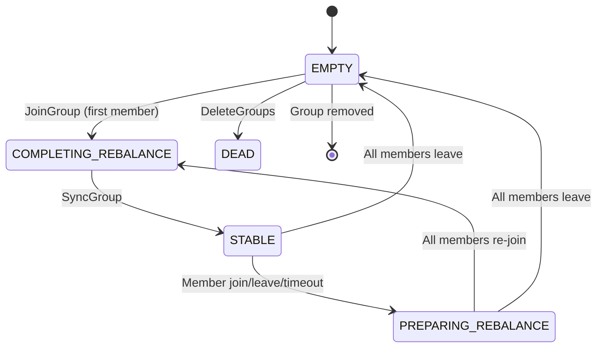

### Partition Assignment Strategies

Three pluggable strategies via `PartitionAssigner` interface:

| Strategy | Name | Behavior |
|----------|------|----------|
| **RangeAssigner** | `range` | Sort partitions by topic+partition, distribute evenly round-robin (default) |
| **StickyAssigner** | `sticky` / `cooperative-sticky` | Retain valid existing assignments, assign unassigned to least-loaded member |

### Cooperative Rebalance (KIP-429)

When protocol name is `cooperative-sticky`:
- Consumer includes current assignment in JoinGroup metadata
- After SyncGroup, computes diff between old and new assignments
- Only revokes actually-moved partitions (not all partitions)
- Calls `onPartitionsAssigned` only for newly-added partitions
- `RebalanceListener.onPartitionsLost()` for cooperative partition loss semantics

### Rebalance Sequence

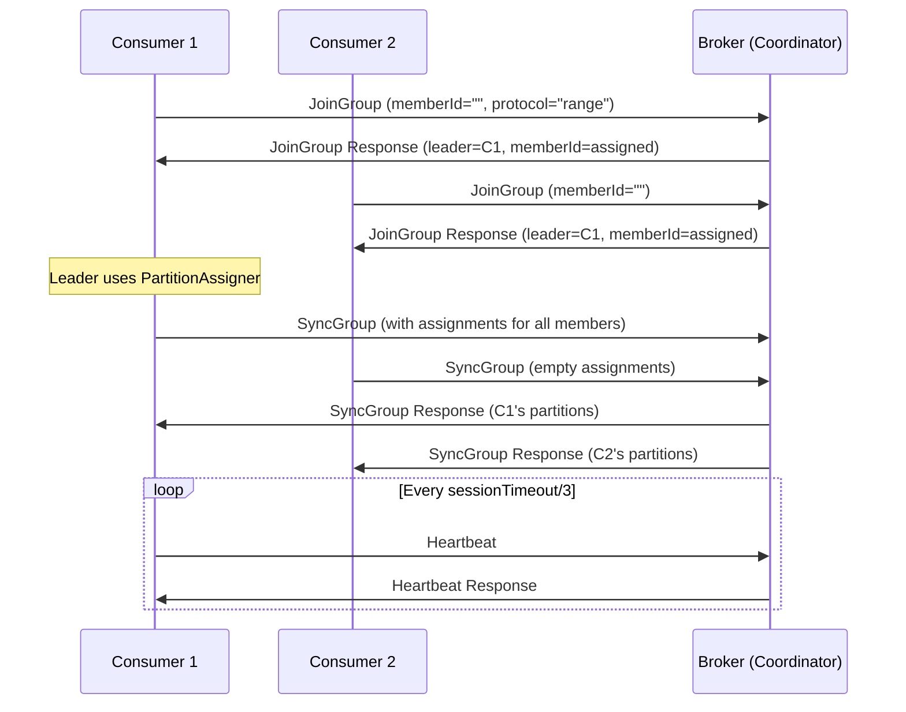

## SASL Authentication

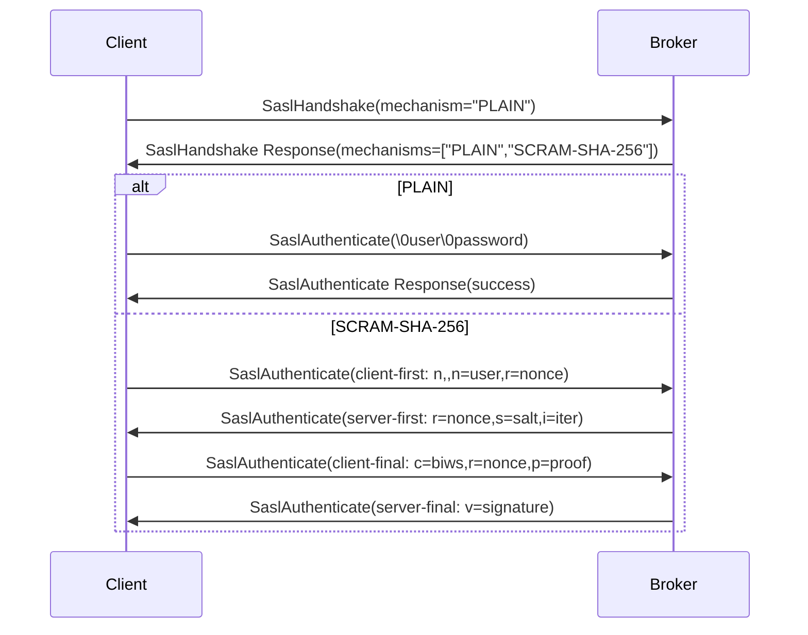

- `CredentialStore` holds PLAIN passwords and SCRAM credentials (salt, storedKey, serverKey, iterations)
- SCRAM uses `javax.crypto.SecretKeyFactory` with `PBKDF2WithHmacSHA256` and `javax.crypto.Mac` for HMAC-SHA-256
- Per-connection `ConnectionState` tracks auth progress in `KafkaBroker.handleConnection()`

## Multi-Broker Simulation

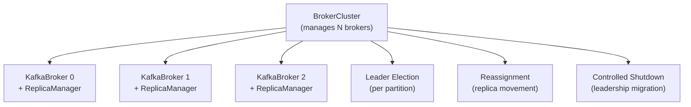

- `BrokerCluster` — creates and manages N `KafkaBroker` instances in-process
- `ReplicaManager` — per-broker: tracks leader/ISR/epoch/offset per partition
- Leader election via `BrokerCluster.electLeader()`; partition reassignment via `AlterPartitionReassignments`
- `ControlledShutdown` migrates leadership away from a shutting-down broker
- In-process simulation — no actual inter-broker network replication

## Record Batch v2 Format

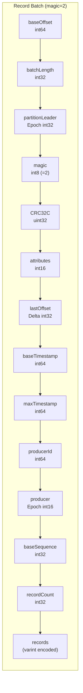

### Record Format (within batch)
Each record uses varint encoding:
- `length` (varint) — total record size
- `attributes` (int8) — unused in v2
- `timestampDelta` (varlong) — delta from batch baseTimestamp
- `offsetDelta` (varint) — delta from batch baseOffset
- `key` (varint length + bytes)
- `value` (varint length + bytes)
- `headers` (varint count, then key-value pairs with varint lengths)

## Broker Architecture

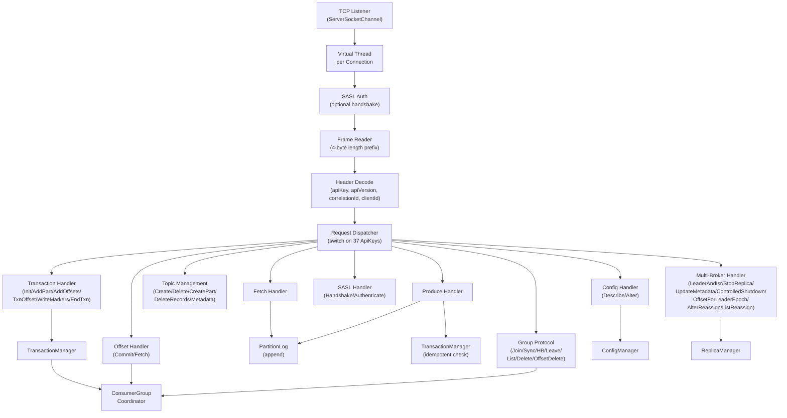

### Partition Log and Pluggable Storage

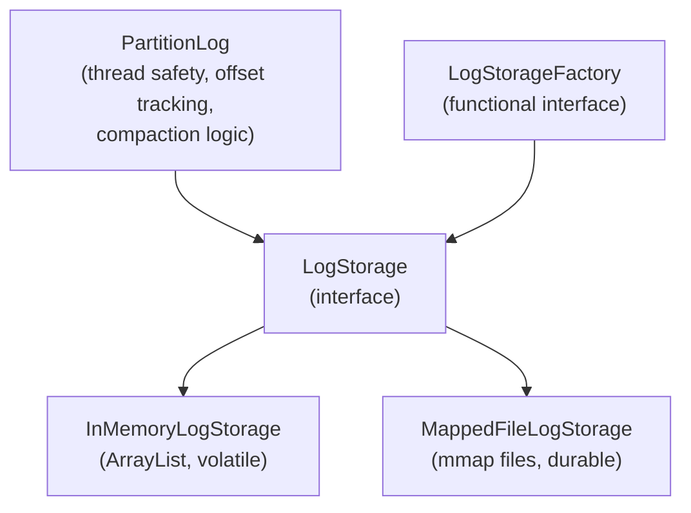

- `PartitionLog` delegates all batch storage to `LogStorage` interface
- `ReentrantReadWriteLock` for concurrent read (fetch) / exclusive write (append) — thread safety is in `PartitionLog`, not storage
- Offset assignment: sequential, batch-aware (baseOffset + recordCount)
- `truncateBefore(offset)` — removes batches before given offset (DeleteRecords)
- `compact()` — key-based deduplication: keeps latest record per key, tombstones remove key, null-key records always retained
- Broker-level `compactAll()` triggers compaction on topics with `cleanup.policy=compact`

**InMemoryLogStorage** (default):
- `ArrayList<StoredBatch>` per partition — volatile, zero configuration
- Best for testing, development, and ephemeral workloads

**MappedFileLogStorage** (durable):
- Segment files: `segment-<baseOffset>.log` in `<logDir>/<topic>-<partition>/`
- Memory-mapped via `FileChannel.map()` — zero-copy reads through OS page cache
- Initial segment mapping: 16 MB, auto-grows up to configurable max (default 1 GB)
- Sparse offset index (one entry per 4 KB) for binary-search seek on fetch
- Recovery on construction: scans existing segment files, rebuilds index
- Usage: `new KafkaBroker(host, port, id, partitions, LogStorageFactory.mappedFile(logDir))`

### Dynamic Configuration
- `ConfigManager` stores per-topic and broker-level configs
- Topic configs (mutable): `retention.ms`, `cleanup.policy`, `max.message.bytes`, `segment.bytes`, `min.insync.replicas`
- Broker configs (read-only): `num.partitions`, `log.retention.ms`, `message.max.bytes`, `default.replication.factor`
- Default topic config applied automatically on `createTopic()`

## Transaction Architecture

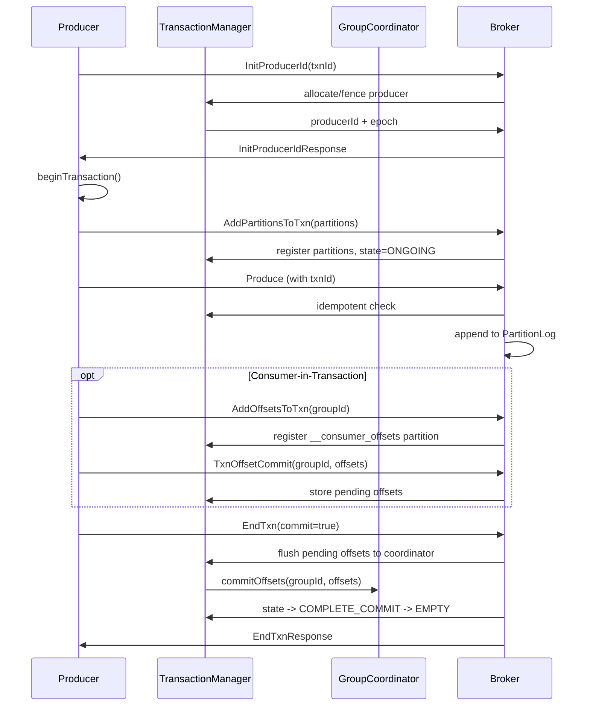

### Idempotency Tracking
- Per producer ID: map of TopicPartition → last sequence number
- On produce: check baseSequence == lastSequence + 1 (accept), == duplicate range (return success), else reject
- Epoch fencing: reject produce with stale epoch

## Wire Protocol Frame Format

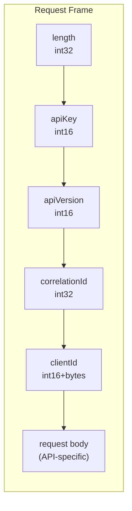

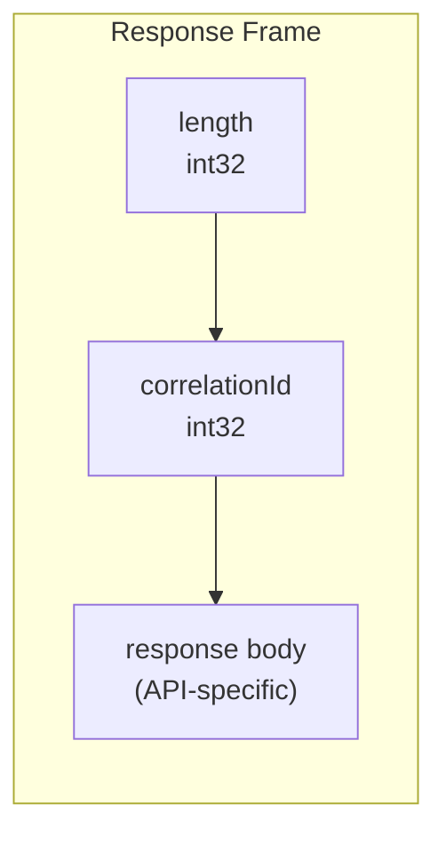

## Integration with Lego Flow

| Lego Flow Module | Usage in Kafka |
|------------------|----------------|
| `blocks` | DP<I,O> for data processing pipeline building blocks, DF<T> for filtering, Statistics for metrics |
| `service` | TCP server/client channels, virtual thread pools, lifecycle management |

The Kafka module follows the framework's conventions: virtual threads for concurrency, ConcurrentHashMap for thread-safe state, AutoCloseable for resource management, and record types for immutable data carriers.

---

## Related Documentation

- [Module README](../README.md) | [Requirements](REQUIREMENTS.md) | [Compliance](COMPLIANCE.md)
- [Root Architecture](../../doc/ARCHITECTURE.md) | [Root README](../../README.md)

---

**Last Updated**: 2026-07-06
