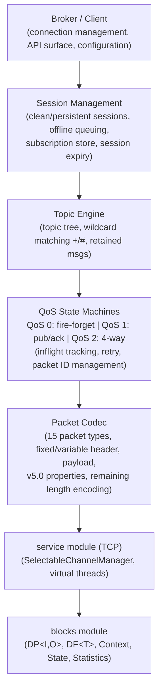
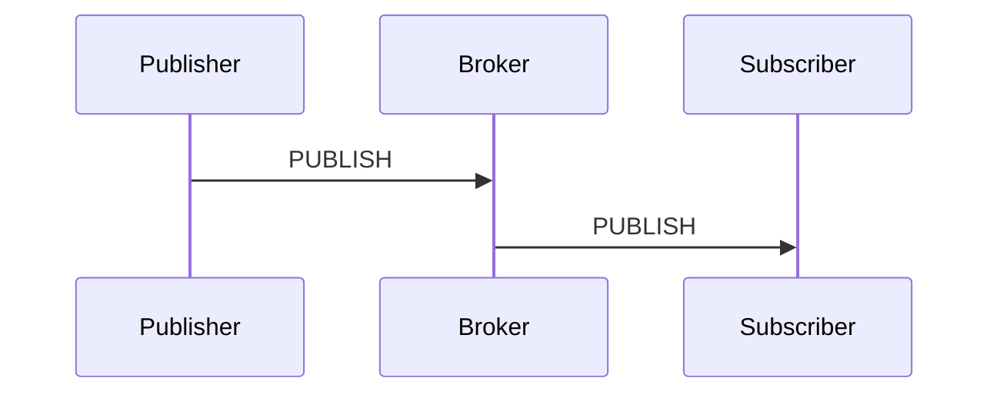
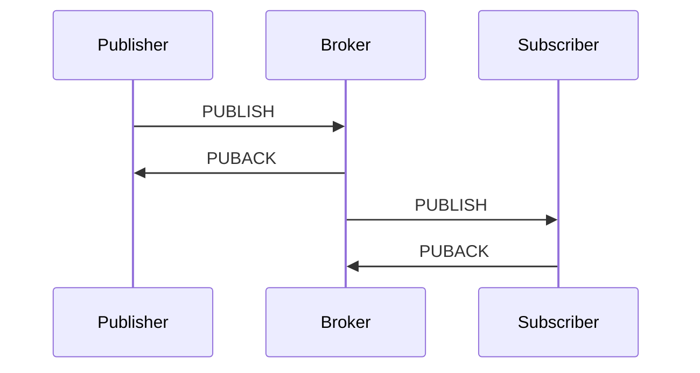
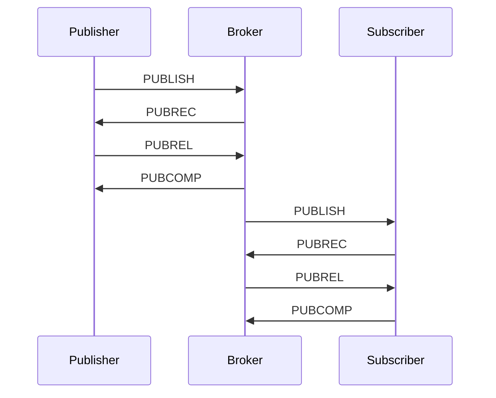
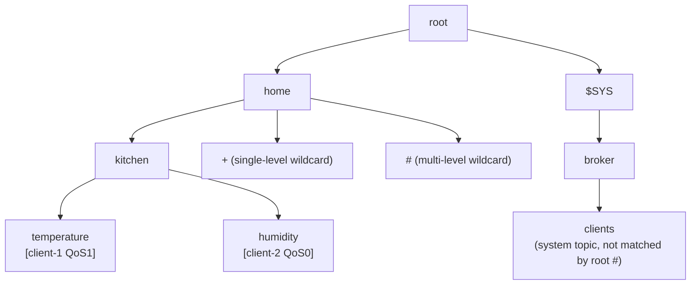
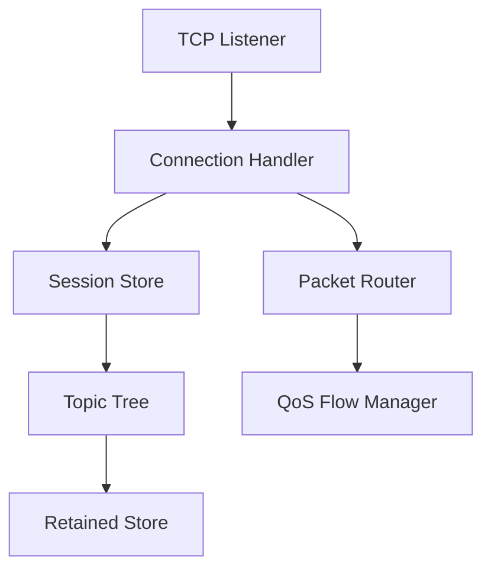
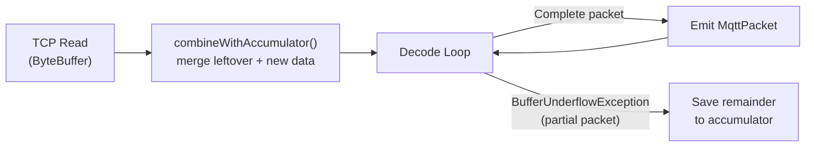

# MQTT Module — Architecture

This document describes the architectural decisions for the MQTT module.

---

## Protocol Overview

MQTT is a lightweight publish/subscribe messaging protocol designed for constrained devices and low-bandwidth, high-latency networks. The Lego Flow implementation supports both MQTT v3.1.1 and v5.0 over TCP transport.

## Layered Architecture

## Packet Types

All 15 MQTT control packet types:

| Type | Value | Direction | Purpose |
|------|-------|-----------|---------|
| CONNECT | 1 | C->S | Client requests connection |
| CONNACK | 2 | S->C | Connection acknowledgement |
| PUBLISH | 3 | Both | Publish message |
| PUBACK | 4 | Both | QoS 1 acknowledgement |
| PUBREC | 5 | Both | QoS 2 received (step 1) |
| PUBREL | 6 | Both | QoS 2 release (step 2) |
| PUBCOMP | 7 | Both | QoS 2 complete (step 3) |
| SUBSCRIBE | 8 | C->S | Subscribe to topics |
| SUBACK | 9 | S->C | Subscribe acknowledgement |
| UNSUBSCRIBE | 10 | C->S | Unsubscribe from topics |
| UNSUBACK | 11 | S->C | Unsubscribe acknowledgement |
| PINGREQ | 12 | C->S | Keep-alive ping |
| PINGRESP | 13 | S->C | Keep-alive response |
| DISCONNECT | 14 | Both | Graceful disconnect |
| AUTH | 15 | Both | Extended authentication (v5.0) |

## QoS Delivery Flows

### QoS 0 — At Most Once

No acknowledgement. Message may be lost.

### QoS 1 — At Least Once

Retry PUBLISH until PUBACK received. Message may be delivered multiple times.

### QoS 2 — Exactly Once

Four-step handshake ensures exactly-once delivery. Each step is retried until acknowledged.

## Topic Tree Architecture

The topic tree is a trie-like data structure where each level separator (`/`) creates a new node:

- Exact topic matching uses direct tree traversal
- Wildcard matching uses parallel traversal with `+` matching any single node and `#` matching all remaining
- Retained messages are stored at leaf nodes

## Broker Architecture

- **Connection Handler**: processes CONNECT, validates credentials, creates/resumes session
- **Packet Router**: dispatches decoded packets to appropriate handler (publish, subscribe, ping, etc.)
- **Session Store**: maps client IDs to sessions with subscription lists and offline message queues
- **Topic Tree**: routes published messages to matching subscribers
- **QoS Flow Manager**: tracks inflight messages per client, manages retries
- **Retained Store**: stores last retained message per topic

## Client Architecture

- Connection lifecycle: CONNECT -> CONNACK -> ready -> DISCONNECT
- Keep-alive: periodic PINGREQ at half the configured keep-alive interval
- Auto-reconnect: exponential backoff with configurable initial delay and max delay
- Inflight window: limits concurrent unacknowledged QoS 1/2 messages
- Message ordering: maintains publish order within same QoS level

## Stream-Oriented Codec Design

MQTT operates over TCP, which is a byte-stream transport with no inherent message boundaries. A single TCP read may deliver a partial packet, exactly one packet, or multiple packets concatenated together. The MqttCodec handles this transparently with an internal accumulation buffer.

### Accumulation Strategy

- **Per-connection codec**: MqttBroker creates one MqttCodec instance per client connection, so accumulator state is isolated per connection
- **combineWithAccumulator()**: prepends any leftover bytes from the previous read to the current ByteBuffer
- **decodeAll() loop**: attempts to decode packets in a loop; on `BufferUnderflowException` (partial packet), saves the remaining bytes to the accumulator for the next read
- **hasBufferedData()**: returns whether the accumulator holds incomplete data, useful for connection cleanup and diagnostics

### Why Not Length-Prefix Pre-Check

MQTT's remaining-length field uses a variable-length encoding (1-4 bytes). Rather than pre-parsing this field separately, the codec attempts a full decode and catches `BufferUnderflowException`, which keeps the parsing logic unified and avoids duplicating the variable-length decoding logic.

## Integration with Lego Flow

| Lego Flow Module | Usage in MQTT |
|------------------|---------------|
| `blocks` | DP<I,O> for packet processing pipeline, DF<T> for message filtering, Statistics for metrics |
| `service` | TCP channels for broker/client connections, virtual thread pools, lifecycle management |

The MQTT module follows the framework's dual API convention: broker and client expose both sync and async (CompletableFuture) variants, with functional-style builders for configuration.

---

## Related Documentation

- [Module README](../README.md) | [Requirements](REQUIREMENTS.md) | [Compliance](COMPLIANCE.md)
- [Root Architecture](../../doc/ARCHITECTURE.md) | [Root README](../../README.md)

---

**Last Updated**: 2026-07-06
