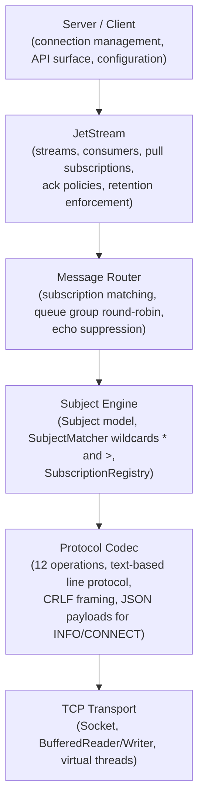
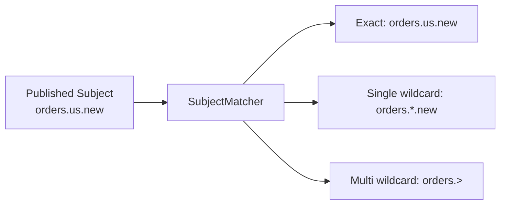
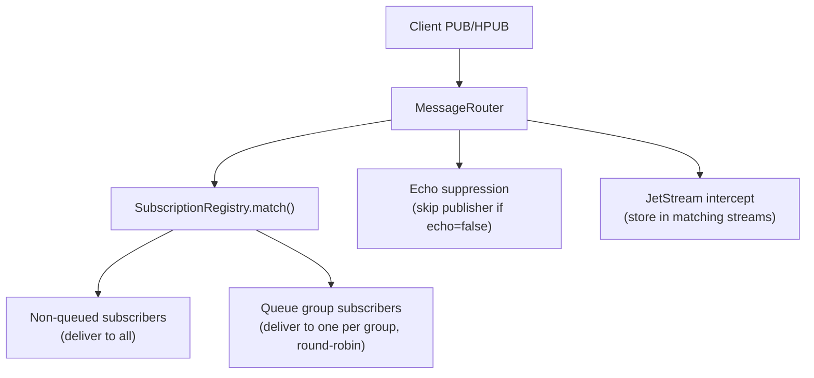
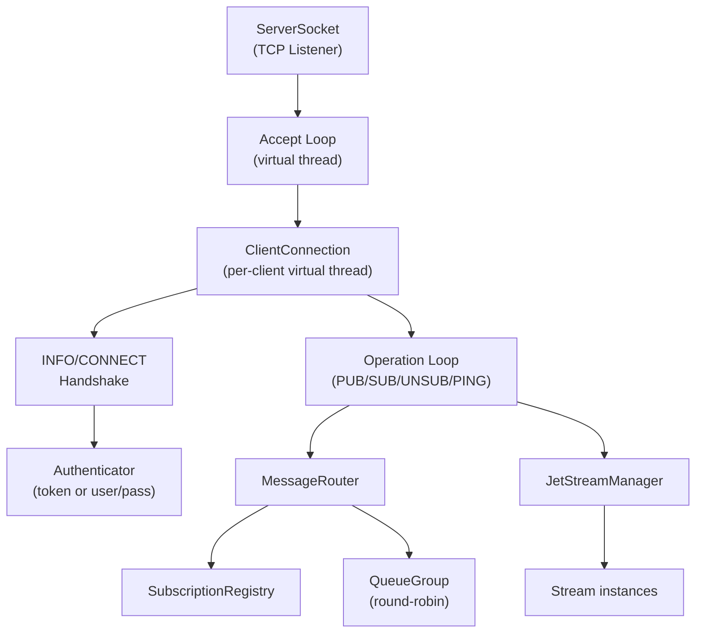
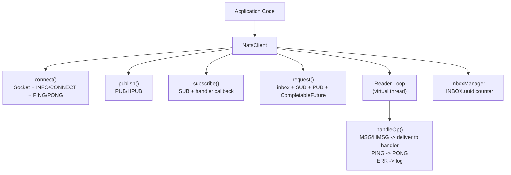
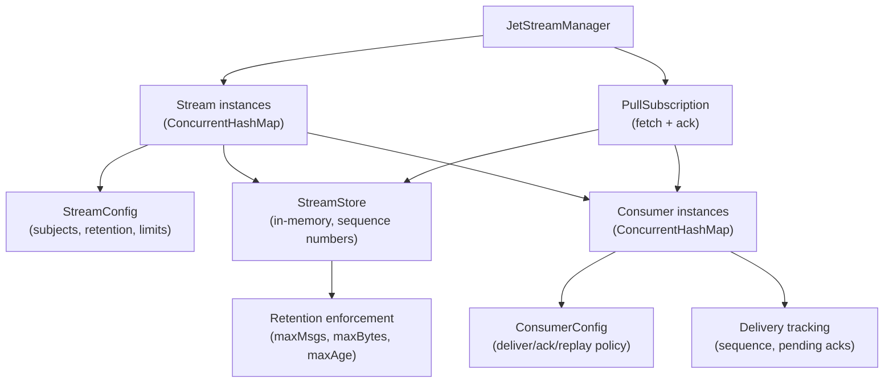
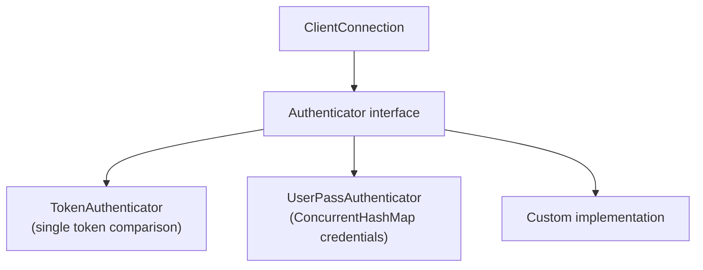

# NATS Module — Architecture

This document describes the architectural decisions for the NATS module.

---

## Protocol Overview

NATS is a cloud-native, high-performance messaging system using a simple text-based protocol over TCP. The Lego Flow implementation supports core NATS (pub/sub, request/reply, queue groups) and JetStream (persistent streaming with streams, consumers, and pull subscriptions).

## Layered Architecture

## Protocol Operations

All 12 NATS protocol operations:

| Operation | Direction | Format | Purpose |
|-----------|-----------|--------|---------|
| INFO | S->C | `INFO {json}\r\n` | Server sends capabilities on connect |
| CONNECT | C->S | `CONNECT {json}\r\n` | Client sends auth and options |
| PUB | C->S | `PUB subject [reply-to] size\r\npayload\r\n` | Publish a message |
| HPUB | C->S | `HPUB subject [reply-to] hdr_size total_size\r\nheaders+payload\r\n` | Publish with headers |
| SUB | C->S | `SUB subject [queue-group] sid\r\n` | Subscribe to a subject |
| UNSUB | C->S | `UNSUB sid [max_msgs]\r\n` | Unsubscribe |
| MSG | S->C | `MSG subject sid [reply-to] size\r\npayload\r\n` | Deliver a message |
| HMSG | S->C | `HMSG subject sid [reply-to] hdr_size total_size\r\nheaders+payload\r\n` | Deliver with headers |
| PING | Both | `PING\r\n` | Keep-alive request |
| PONG | Both | `PONG\r\n` | Keep-alive response |
| +OK | S->C | `+OK\r\n` | Verbose mode acknowledgement |
| -ERR | S->C | `-ERR 'message'\r\n` | Error notification |

## Sealed Protocol Model

The codec uses a sealed interface hierarchy for type-safe protocol dispatch:

```mermaid
graph TD
    PO["sealed interface ParsedOp"]
    PO --> Info["record Info(ServerInfo)"]
    PO --> Connect["record Connect(ConnectOptions)"]
    PO --> Pub["record Pub(subject, replyTo, payload)"]
    PO --> Hpub["record Hpub(subject, replyTo, headers, payload)"]
    PO --> Sub["record Sub(subject, queueGroup, sid)"]
    PO --> Unsub["record Unsub(sid, maxMsgs)"]
    PO --> Msg["record Msg(subject, sid, replyTo, payload)"]
    PO --> Hmsg["record Hmsg(subject, sid, replyTo, headers, payload)"]
    PO --> Ping["record Ping()"]
    PO --> Pong["record Pong()"]
    PO --> Ok["record Ok()"]
    PO --> Err["record Err(message)"]
```

Pattern matching switch statements dispatch on `ParsedOp` variants in both client (`handleOp`) and server (`processOp`) reader loops.

## Subject Matching

- `.` is the level separator (tokens between dots)
- `*` matches exactly one token at its position
- `>` matches one or more trailing tokens (must be last token in pattern)
- SubscriptionRegistry separates exact and wildcard subscriptions into two ConcurrentHashMaps for efficient lookup

## Message Routing Architecture

- **MessageRouter** handles all message delivery on the server side
- Non-queued subscribers each receive a copy of every matching message
- Queue group members share load via round-robin (QueueGroup with AtomicInteger index)
- Echo suppression: if client sets `echo=false` in CONNECT, their own publishes are not delivered back

## Server Architecture

- **NatsServer**: manages ServerSocket, client registry (ConcurrentHashMap), JetStreamManager
- **ClientConnection**: per-client handler on a virtual thread; manages INFO/CONNECT handshake, authentication, protocol operation dispatch, cleanup on disconnect
- **Authenticator**: pluggable interface with TokenAuthenticator and UserPassAuthenticator implementations
- Each client connection maintains its own subscription map; cleanup removes all subscriptions on disconnect

## Client Architecture

- Connection lifecycle: socket connect -> read INFO -> send CONNECT -> send PING -> read PONG -> ready
- Reader loop runs on a virtual thread, dispatching incoming operations via pattern matching switch
- Subscriptions stored in ConcurrentHashMap keyed by string SID
- Auto-unsubscribe: subscription deactivates after receiving maxMessages
- Request/reply: creates temp inbox subscription (auto-unsub after 1), publishes with reply-to, waits on CompletableFuture with timeout
- Thread-safe writes via synchronized block on BufferedWriter

## JetStream Architecture

### Stream
- Captures messages from configured subjects (wildcard-matched via SubjectMatcher)
- StreamStore: in-memory CopyOnWriteArrayList with AtomicLong sequence counter
- Retention policies: LIMITS (maxMsgs/maxBytes/maxAge), INTEREST (active consumers), WORKQUEUE (remove after ack)
- Discard policies: OLD (evict oldest), NEW (reject incoming)

### Consumer
- Tracks delivery position (deliveredSequence) and acknowledgement state (ackedSequence, pendingAcks)
- Ack policies: NONE (fire-and-forget), ALL (cumulative ack), EXPLICIT (per-message ack)
- Deliver policies: ALL, LAST, NEW, BY_START_SEQ, BY_START_TIME
- canDeliver() checks maxAckPending limit before allowing more fetches

### PullSubscription
- Fetches batches from StreamStore starting at consumer's nextFetchSequence
- Adds JetStream metadata headers (Nats-Stream, Nats-Sequence, Nats-Timestamp)
- ack() acknowledges by sequence; for WORKQUEUE retention, also removes the message from the store

## JetStream Client (via NATS protocol)

JetStreamClient wraps NatsClient to provide JetStream operations over the standard NATS request/reply pattern using `$JS.API.*` subjects:

| Operation | Subject |
|-----------|---------|
| Create stream | `$JS.API.STREAM.CREATE.<name>` |
| Delete stream | `$JS.API.STREAM.DELETE.<name>` |
| Stream info | `$JS.API.STREAM.INFO.<name>` |
| Create consumer | `$JS.API.CONSUMER.CREATE.<stream>` |
| Delete consumer | `$JS.API.CONSUMER.DELETE.<stream>.<consumer>` |

## Authentication

- Server sets an Authenticator before start; if set, ServerInfo advertises `auth_required=true`
- ClientConnection calls `authenticator.authenticate(connectOptions)` during CONNECT handling
- Failed authentication sends `-ERR 'Authorization Violation'` and closes the connection

## Integration with Lego Flow

| Lego Flow Module | Usage in NATS |
|------------------|---------------|
| `blocks` | DP<I,O> for message processing pipeline, DF<T> for filtering |
| `service` | TCP channels for server/client connections, virtual thread pools |

---

## Related Documentation

- [Module README](../README.md) | [Requirements](REQUIREMENTS.md) | [Compliance](COMPLIANCE.md)
- [Root Architecture](../../doc/ARCHITECTURE.md) | [Root README](../../README.md)

---

**Last Updated**: 2026-07-06
