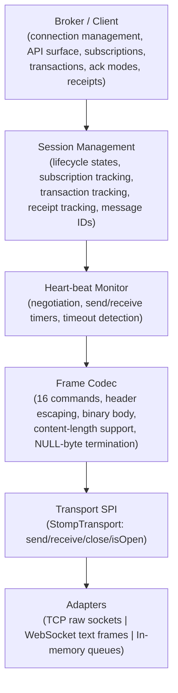
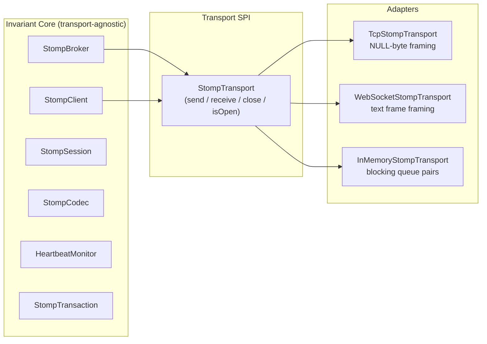
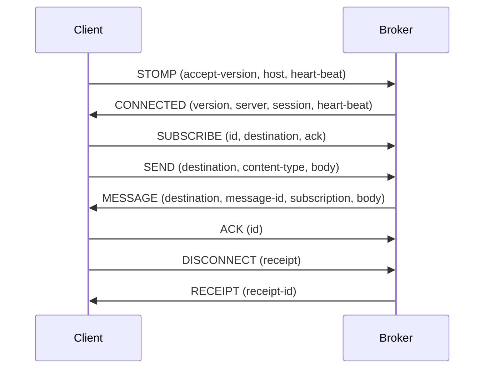
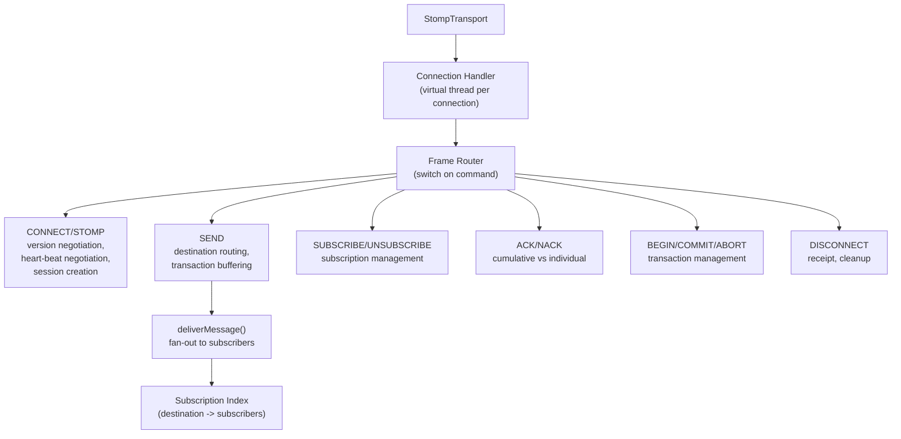
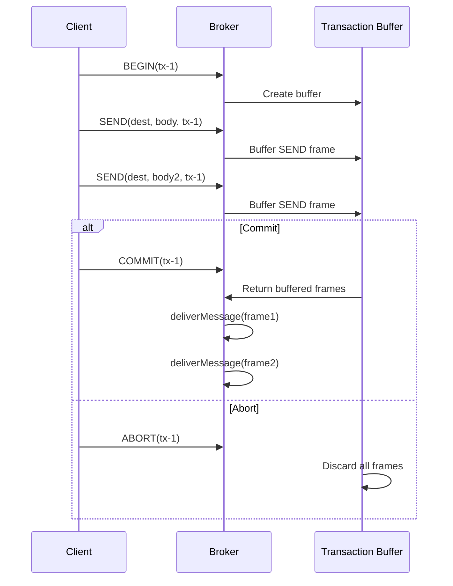
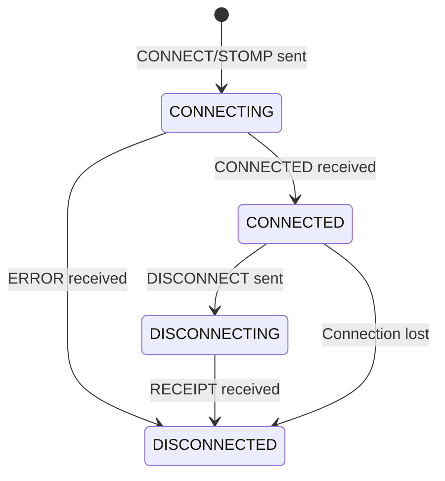

# STOMP Module -- Architecture

This document describes the architectural decisions for the STOMP module.

---

## Protocol Overview

STOMP (Simple Text Oriented Messaging Protocol) is a text-based messaging protocol that provides an interoperable wire format for publish/subscribe messaging. Unlike binary protocols (MQTT, AMQP), STOMP frames are human-readable text delimited by NULL bytes. The Lego Flow implementation supports STOMP 1.2 with backward compatibility for 1.0 and 1.1.

## Layered Architecture

## Invariant Core + Adapter Pattern

The module separates protocol logic from transport concerns:

## STOMP Commands

All 16 STOMP commands (11 client + 4 server + 1 heartbeat):

| Command | Direction | Required Headers | Purpose |
|---------|-----------|-----------------|---------|
| STOMP | C->S | accept-version, host | Connect (STOMP 1.2 alternative to CONNECT) |
| CONNECT | C->S | accept-version, host | Connect to broker |
| SEND | C->S | destination | Send message to destination |
| SUBSCRIBE | C->S | id, destination | Subscribe to destination |
| UNSUBSCRIBE | C->S | id | Unsubscribe by subscription ID |
| ACK | C->S | id | Acknowledge message |
| NACK | C->S | id | Negative-acknowledge message |
| BEGIN | C->S | transaction | Begin transaction |
| COMMIT | C->S | transaction | Commit transaction |
| ABORT | C->S | transaction | Abort transaction |
| DISCONNECT | C->S | -- | Graceful disconnect |
| CONNECTED | S->C | version | Connection established |
| MESSAGE | S->C | destination, message-id, subscription | Deliver message |
| RECEIPT | S->C | receipt-id | Confirm receipt of a frame |
| ERROR | S->C | message | Error notification |
| HEARTBEAT | -- | -- | Keep-alive (empty EOL frame) |

## Connection Flow

## Broker Architecture

Key broker data structures (all `ConcurrentHashMap`):
- **sessions**: sessionId -> StompSession
- **transports**: sessionId -> StompTransport
- **heartbeats**: sessionId -> HeartbeatMonitor
- **destinationSubscriptions**: destination -> List of Subscription records
- **subscriptionIndex**: sessionId:subId -> Subscription
- **transactions**: sessionId:txId -> StompTransaction
- **pendingAcks**: ackId -> PendingAck (for client/client-individual modes)
- **ackOrder**: sessionId:subId -> ordered list of ack IDs (for cumulative ACK)

## Acknowledgment Modes

```mermaid
graph TD
    subgraph "auto (default)"
        A1["MESSAGE sent"] --> A2["Immediately acknowledged<br/>(no ACK needed)"]
    end

    subgraph "client (cumulative)"
        B1["MESSAGE 1 sent"] --> B2["MESSAGE 2 sent"] --> B3["MESSAGE 3 sent"]
        B3 --> B4["ACK(3)"]
        B4 --> B5["Messages 1,2,3 all acknowledged"]
    end

    subgraph "client-individual"
        C1["MESSAGE 1 sent"] --> C2["MESSAGE 2 sent"] --> C3["MESSAGE 3 sent"]
        C3 --> C4["ACK(2)"]
        C4 --> C5["Only message 2 acknowledged"]
    end
```

## Transaction Flow

## Session Lifecycle

Session tracks: subscriptions (ConcurrentHashMap), active transactions (ConcurrentHashSet), pending receipts (ConcurrentHashSet), message ID counter (AtomicLong), heart-beat intervals.

## TCP Adapter

The TCP adapter handles raw socket I/O with STOMP frame boundary detection:

- **Send**: encode frame via `StompCodec.encode()`, write bytes to socket, flush
- **Receive**: read byte-by-byte, detect header end (double newline), extract content-length if present, read body, detect NULL terminator
- **Binary body**: when `content-length` header is present, read exactly that many bytes (allows NULL bytes in body)
- **Heart-beat**: detect all-newline data as heartbeat frames

## WebSocket Adapter

The WebSocket adapter leverages WebSocket message boundaries:

- Each WebSocket text frame carries exactly one STOMP frame
- Uses `StompCodec.encodeToString()` / `decodeFromString()` for text serialization
- Incoming frames queued in `LinkedBlockingQueue` for blocking receive
- Subprotocol identifier: `v12.stomp`
- Depends on `lego-flow-http` module for WebSocket support

## Thread Safety Model

- **Broker**: one virtual thread per connection (`Thread.startVirtualThread`)
- **Client**: background virtual thread for receiving frames (MESSAGE, RECEIPT, ERROR dispatch)
- **Concurrency**: `ConcurrentHashMap` for all shared state, `CopyOnWriteArrayList` for subscription lists, `AtomicLong` for counters
- **Transport send synchronization**: TCP transport synchronizes on output stream
- **Receipt futures**: `CompletableFuture<StompFrame>` for async receipt confirmation

## Integration with Lego Flow

| Lego Flow Module | Usage in STOMP |
|------------------|----------------|
| `blocks` | Core DP/DF framework dependency |
| `service` | Service lifecycle |
| `http` | WebSocket adapter (optional runtime dependency) |

---

## Related Documentation

- [Module README](../README.md) | [Requirements](REQUIREMENTS.md) | [Compliance](COMPLIANCE.md)
- [Root Architecture](../../doc/ARCHITECTURE.md) | [Root README](../../README.md)

---

**Last Updated**: 2026-07-06
