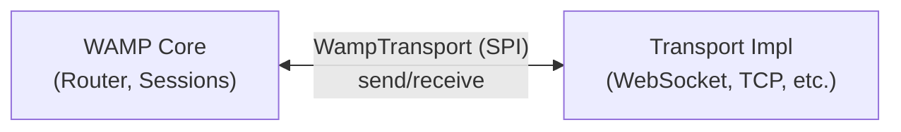
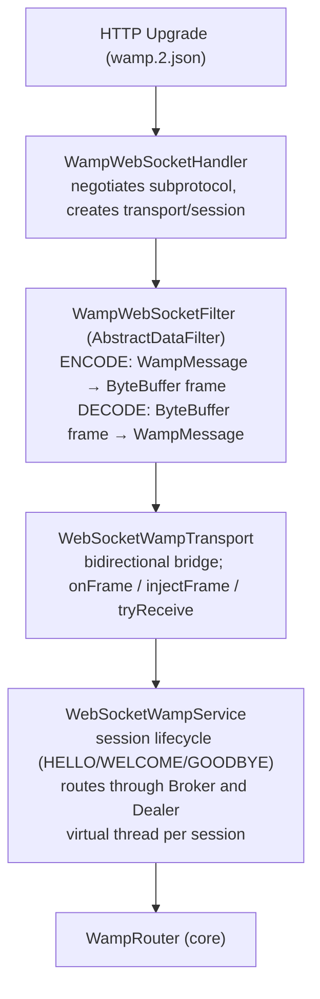
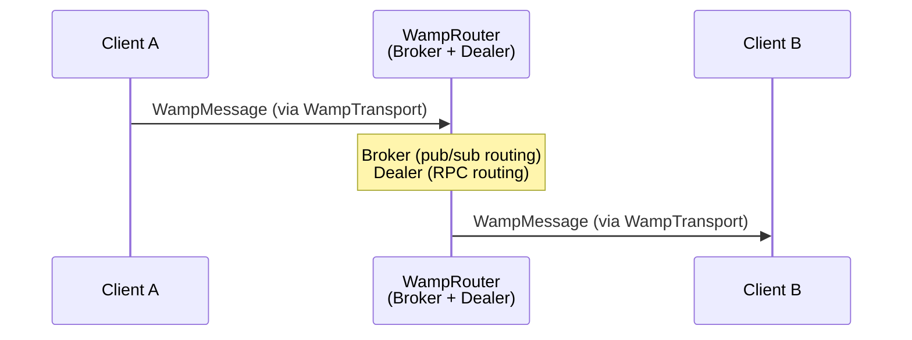
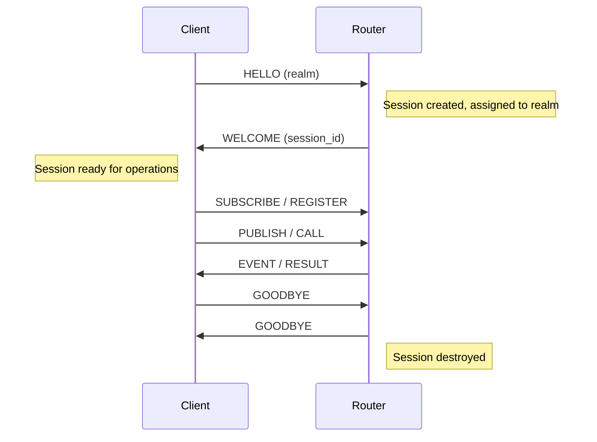

# WAMP Module — Architecture

## Module Purpose

The wamp module implements the Web Application Messaging Protocol (WAMP) for the Lego Flow framework. It provides RPC and pub/sub messaging patterns with a two-layer design that separates protocol logic from transport concerns.

## Two-Layer Design Rationale

The module is split into an **invariant core** and a **transport adapter**:

- **Core** — pure WAMP protocol logic. No dependency on any transport mechanism. Can be tested in-process with InMemoryTransport.
- **Adapter** — bridge between the core and a specific transport (WebSocket). Handles subprotocol negotiation, frame-level I/O, WAMP JSON serialization, and session orchestration.

This separation ensures that:
1. WAMP protocol logic is tested independently of network I/O
2. New transports can be added without modifying core code
3. The core remains stable as transport requirements evolve

## Package Structure

```
ssg.legoflow.wamp/
├── core/                          ← transport-agnostic WAMP logic
│   ├── WampMessage                ← sealed interface + message type records
│   ├── WampSession                ← session state and lifecycle
│   ├── router/
│   │   ├── WampRouter             ← combined Broker + Dealer
│   │   ├── Broker                 ← pub/sub message routing
│   │   └── Dealer                 ← RPC call routing
│   ├── role/
│   │   ├── Caller                 ← RPC caller role
│   │   ├── Callee                 ← RPC callee role
│   │   ├── Publisher              ← pub/sub publisher role
│   │   └── Subscriber             ← pub/sub subscriber role
│   ├── realm/
│   │   ├── Realm                  ← isolated routing domain
│   │   └── RealmManager           ← realm creation and lookup
│   └── transport/
│       └── WampTransport          ← SPI interface (send/receive)
├── adapter/
│   └── websocket/                 ← WebSocket transport adapter
│       ├── WebSocketWampTransport ← WampTransport over WebSocket frames
│       │                             (bidirectional wiring, onFrame, injectFrame, tryReceive)
│       ├── WampWebSocketHandler   ← HTTP Upgrade handler; advertises wamp.2.json subprotocol
│       ├── WebSocketWampService   ← orchestrates WAMP sessions over WebSocket
│       │                             (HELLO/WELCOME/GOODBYE lifecycle, Broker/Dealer routing,
│       │                              virtual threads per session)
│       └── WampWebSocketFilter    ← AbstractDataFilter<ByteBuffer>; ENCODE/DECODE modes
│                                     for WAMP JSON in WebSocket frames
└── demo/
    ├── base/                      ← in-process demos using InMemoryTransport
    │   ├── InMemoryTransport      ← in-process transport for testing (no HTTP needed)
    │   ├── MultiRealmDemo         ← realm isolation (overlapping names in separate realms)
    │   ├── CalculatorServiceDemo  ← RPC with arithmetic procedures and error handling
    │   └── ChatRoomDemo           ← Pub/Sub fan-out with multiple subscribers
    └── websocket/                 ← end-to-end WebSocket demos
        ├── WsRpcDemo              ← RPC over WebSocket transport
        ├── WsPubSubDemo           ← Pub/Sub with two subscribers over WebSocket
        └── FullWampServerDemo     ← multi-realm concurrent RPC + Pub/Sub
```

## WampTransport SPI

The `WampTransport` interface is the single abstraction between the core and any transport:



Implementations must handle:
- Sending WampMessage instances to the remote peer
- Receiving raw data and deserializing into WampMessage
- Connection lifecycle events (open, close, error)

### WebSocketWampTransport — extended contract

Beyond the base SPI, the WebSocket adapter exposes additional hooks used by the service and test layers:

| Method | Purpose |
|---|---|
| `onFrame(consumer)` | Register a callback invoked for each incoming WebSocket frame |
| `injectFrame(frame)` | Push a synthetic frame into the transport (test injection) |
| `tryReceive()` | Non-blocking poll; returns `WampMessage` or `null` if none available |

## WebSocket Adapter Layer



Each inbound WebSocket connection proceeds through this pipeline. `WebSocketWampService` owns the per-session virtual thread that drives the receive loop; it delegates routing entirely to the core `WampRouter`, keeping transport concerns out of the protocol layer.

## Message Flow



1. Client sends a WampMessage through its WampTransport
2. WampRouter receives the message and determines the routing:
   - **PUBLISH/SUBSCRIBE** messages go to the Broker
   - **CALL/REGISTER** messages go to the Dealer
3. Router dispatches the message to target session(s) via their WampTransport

## Session Lifecycle



## Realm Isolation

Each realm is an independent routing domain:
- Sessions belong to exactly one realm
- Subscriptions and registrations are scoped to the session's realm
- A publisher in realm A cannot reach subscribers in realm B
- RealmManager creates and manages realm instances

## Design Patterns

- **Sealed Interface** — WampMessage: exhaustive pattern matching, compile-time completeness
- **Strategy** — WampTransport SPI: interchangeable transport implementations
- **Mediator** — WampRouter: centralizes message routing between sessions
- **Facade** — WampRouter combines Broker and Dealer behind a single interface
- **Filter / Pipe** — WampWebSocketFilter (AbstractDataFilter): separates encode/decode concerns from transport wiring
- **Template Method** — AbstractDataFilter defines the ENCODE/DECODE skeleton; WampWebSocketFilter fills in WAMP JSON specifics

## Extension: Adding a New Transport Adapter

1. Create a new package: `ssg.legoflow.wamp.adapter.<transport>/`
2. Implement `WampTransport` interface
3. Implement a filter extending `AbstractDataFilter<ByteBuffer>` (or equivalent) for ENCODE/DECODE
4. Add a handler that negotiates the appropriate subprotocol during connection upgrade
5. Add a service class that drives the session lifecycle (HELLO/WELCOME/GOODBYE) and routes through `WampRouter`
6. Add tests (can reuse core test patterns with the new transport; use `injectFrame` pattern for deterministic adapter tests)

---

## Related Documentation

- [Module README](../README.md) | [Requirements](REQUIREMENTS.md) | [Compliance](COMPLIANCE.md)
- [Root Architecture](../../doc/ARCHITECTURE.md) | [Root README](../../README.md)

---

**Last Updated**: 2026-06-16
