# XMPP Module — Architecture

This document describes the architectural decisions for the XMPP module.

---

## Protocol Overview

XMPP (Extensible Messaging and Presence Protocol) is an XML-based protocol for real-time communication. The Lego Flow implementation covers XMPP core (RFC 6120), XMPP IM (RFC 6121), and IoT extensions (XEP-0323/0325/0347) over TCP transport.

## Layered Architecture

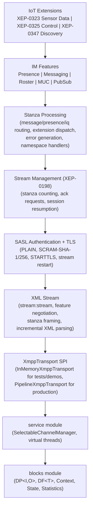

## Headless Core / Transport SPI

The protocol core is **socket-free**: `XmppClient` and `XmppServer` contain no `SocketChannel`/`Selector` usage. All I/O flows through the `XmppTransport` byte-level SPI, which the core owns and the service layer implements.

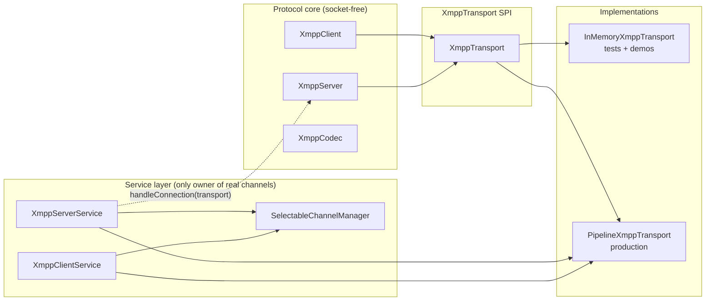

- **Client**: `new XmppClient(transport)` wires the protocol to an injected transport; a virtual-thread read loop feeds `transport.onRead` bytes into the codec and the stream, and outbound stream/stanza bytes are flushed through the transport after every send. The legacy no-arg `XmppClient` keeps the in-memory buffer for backward compatibility.
- **Server**: `XmppServer.handleConnection(XmppTransport)` accepts a per-connection transport and drives a non-blocking read loop (virtual thread) that decodes stanzas and broadcasts them to registered handlers; it never opens a socket itself.
- **InMemoryXmppTransport**: paired in-memory queues with `onRead`/`onWrite` callbacks — used by unit tests and the demo suite (no TCP, fully deterministic).
- **PipelineXmppTransport**: backed by a `DataChannel`; the `SelectableChannelManager` selector thread calls `onRead`/`onWrite` with `ByteBuffer`s — used by the service layer for production TCP.
- **Why**: the same pattern applied in the NATS and MQTT modules — protocol logic is testable without a socket, and only the service layer touches non-blocking channels.

## XML Stream Lifecycle

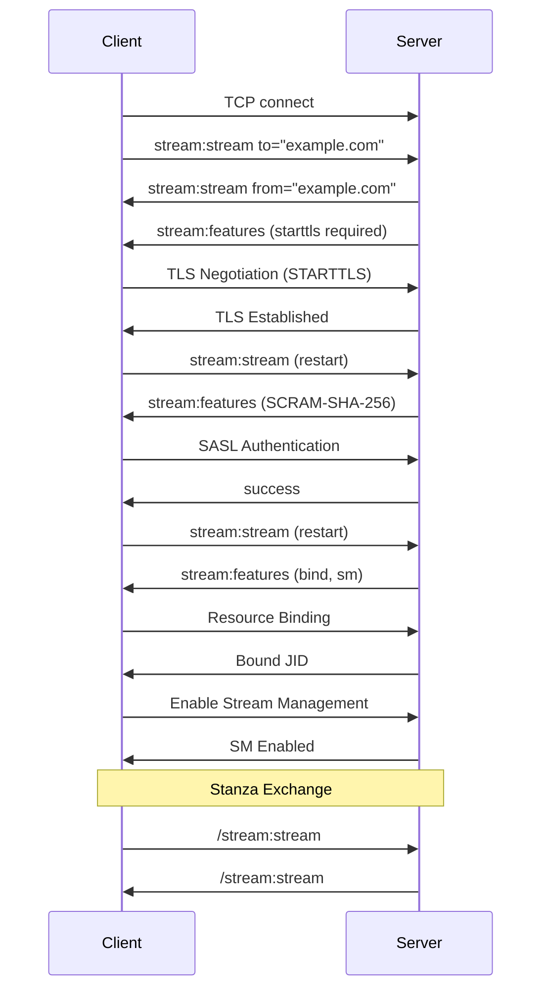

## Stanza Architecture

### Three Stanza Types

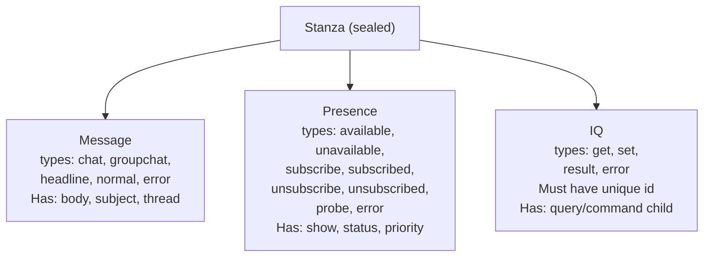

- Stanza is a sealed interface; pattern matching for exhaustive dispatch
- Each stanza has: from, to, id, type, optional error, extension elements
- Extension elements keyed by XML namespace, dispatched to registered handlers

### Stanza Routing

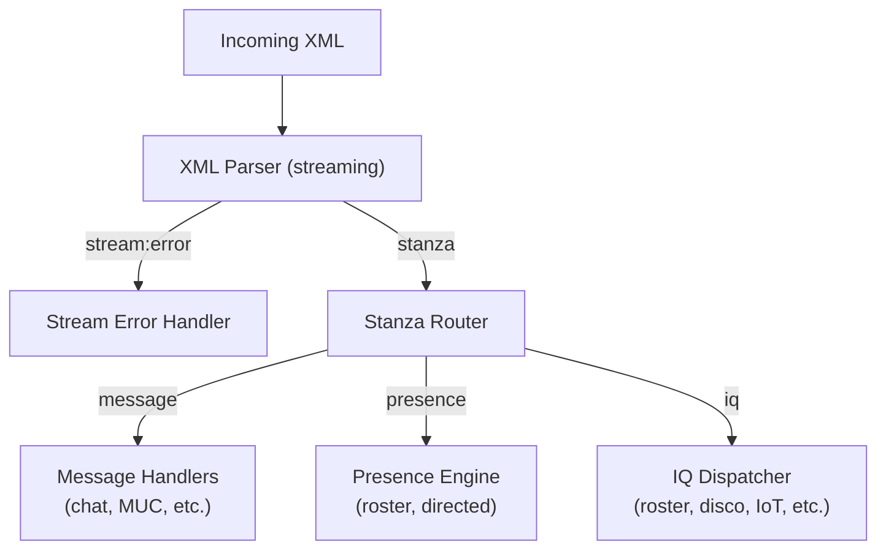

## SASL Authentication

### SCRAM-SHA-256 Flow
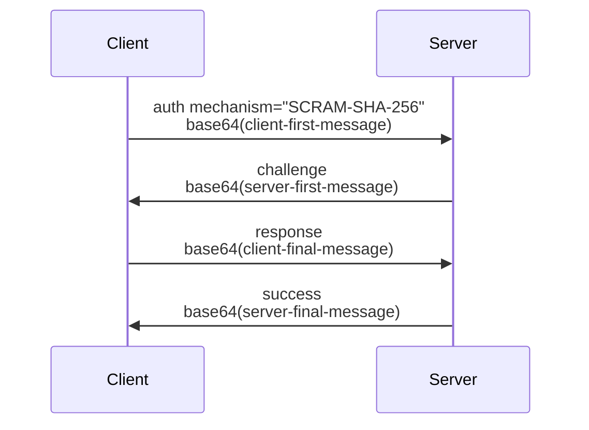

- Client-first: `n,,n=user,r=clientNonce`
- Server-first: `r=clientNonce+serverNonce,s=salt,i=iterations`
- Client-final: `c=biws,r=combinedNonce,p=clientProof`
- Server-final: `v=serverSignature` (client verifies server)

## IoT Extensions Architecture

### Sensor Data (XEP-0323)

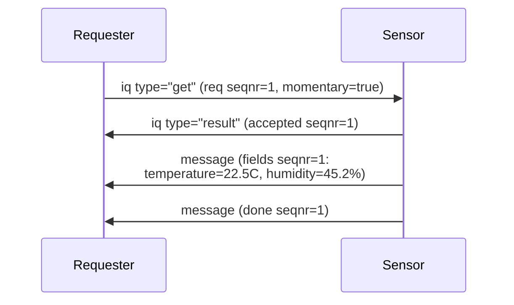

### Control (XEP-0325)

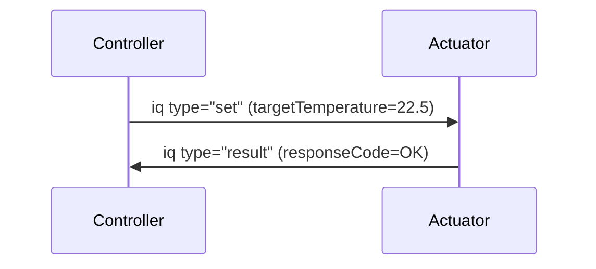

### Discovery (XEP-0347)

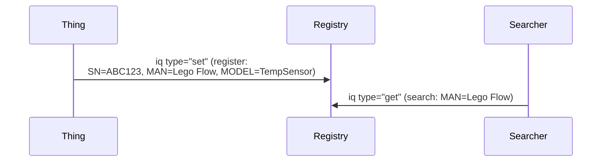

## Stream Management (XEP-0198)

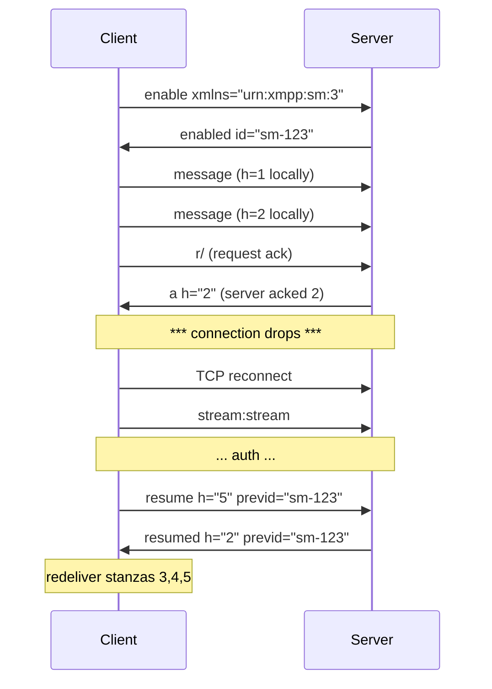

- `h` counter tracks number of stanzas handled (received and processed)
- `<r/>` requests the peer to report its `h` value
- `<a h="N"/>` acknowledges N stanzas have been handled
- Unacknowledged stanzas are queued and redelivered on session resumption

## Stream-Oriented Codec Design

XMPP operates over TCP, which is a byte-stream transport. XML stanzas may be split across multiple TCP reads or arrive concatenated. The XmppCodec handles this with internal string accumulation and regex-based stanza boundary detection.

### Buffer Cleanup Strategy

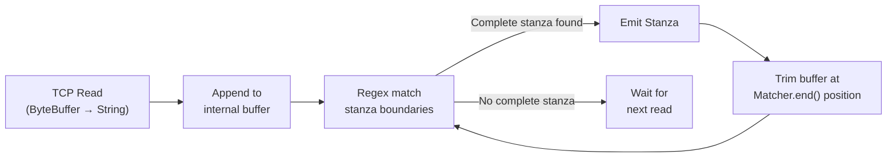

- **Matcher.end() position tracking**: after extracting a complete stanza, the buffer is trimmed at the exact position reported by `Matcher.end()`, rather than using fragile `lastIndexOf("</message>")` string search
- **Why position tracking is better**: the previous `lastIndexOf` approach only worked for `</message>` stanzas, could break with nested elements or content containing `</message>` substrings, and did not generalize to `<presence>` or `<iq>` stanzas
- **hasBufferedData()**: returns whether the codec holds incomplete stanza data, useful for connection cleanup and diagnostics

## Integration with Lego Flow

| Lego Flow Module | Usage in XMPP |
|------------------|---------------|
| `blocks` | DP<I,O> for stanza processing pipeline, DF<T> for stanza filtering, Statistics for metrics |
| `service` | `SelectableChannelManager` channels for the service layer (XmppClientService/XmppServerService); virtual threads for read loops |

The XMPP module follows the framework's dual API convention: XmppClient and all feature managers (roster, presence, MUC, pubsub, IoT) expose both sync and async (CompletableFuture) variants, with functional-style builders for configuration and stanza handling. The service layer (`XmppClientService`, `XmppServerService`) is the only code in the module that owns real channels; the protocol core (`XmppClient`, `XmppServer`, `XmppCodec`, `XmppStream`) is socket-free and reads/writes exclusively through the `XmppTransport` SPI.

---

## Related Documentation

- [Module README](../README.md) | [Requirements](REQUIREMENTS.md) | [Compliance](COMPLIANCE.md)
- [Root Architecture](../../doc/ARCHITECTURE.md) | [Root README](../../README.md)

---

**Last Updated**: 2026-07-06
