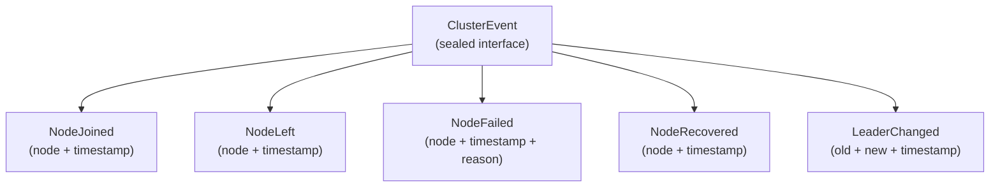
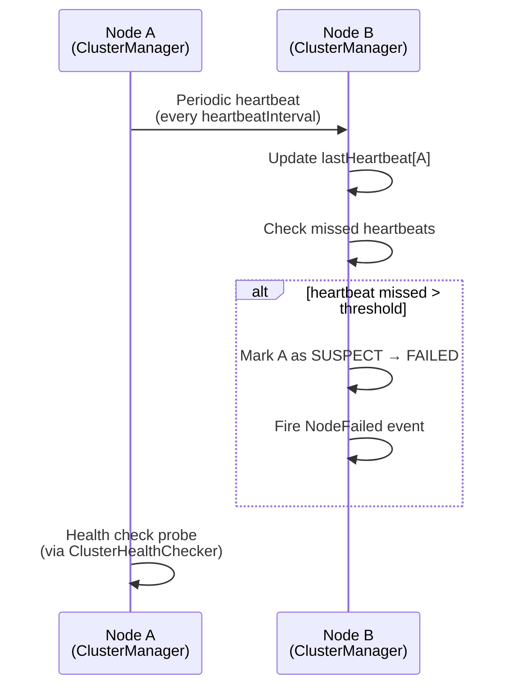

# Cluster Core — Architecture

## Module Purpose

The cluster core module provides foundational abstractions for multi-node clustering. It defines the cluster membership SPI, event model, health checking, and consistent hashing used by all higher-level cluster protocols in the Lego Flow framework.

## Key Abstractions

### ClusterMembership SPI

The `ClusterMembership` interface is the primary extension point. Implementations provide node discovery, membership tracking, and event broadcasting. Concrete implementations include:

- `ClusterManager` — Generic manager with configurable transport and health checker
- `DnsSdDiscovery` — DNS-SD/mDNS-based peer discovery (in `cluster-discovery` module)

### ClusterNode

An immutable record describing a single cluster member: unique ID, host, port, role, status, and metadata. Status transitions follow a defined lifecycle: `ACTIVE → SUSPECT → FAILED` (failure detection) and `FAILED → ACTIVE` (recovery).

### ClusterEvent Model

A sealed interface hierarchy capturing all membership changes:



### Consistent Hashing

The `ConsistentHashRing` implements the Ketama algorithm: each physical node maps to a configurable number of virtual nodes (replicas) on a 32-bit hash ring. Key lookups find the next virtual node clockwise. With 160 replicas per node, adding or removing a single node redistributes at most ~1/N of keys.

## Package Structure

```
ssg.legoflow.network.cluster.core/
  ClusterNode              — Immutable node descriptor (record)
  ClusterNodeStatus        — Lifecycle status enum (ACTIVE, SUSPECT, FAILED, LEAVING)
  ClusterRole              — Node role enum (PRIMARY, REPLICA, BOTH)
  ClusterConfig            — Runtime configuration (heartbeat interval, failure threshold, timeouts)
  ClusterStatus            — Snapshot of cluster state (members + leader)
  ClusterMembership        — SPI for membership management
  ClusterManager           — Default implementation with heartbeat, health check, failure detection
  ClusterTransport         — SPI for inter-node messaging
  ClusterHealthChecker     — SPI for probing remote node health
  ClusterEvent             — Sealed event hierarchy (NodeJoined, NodeLeft, NodeFailed, NodeRecovered, LeaderChanged)
  ClusterEventListener     — Functional consumer for events
  hashing/
    ConsistentHashRing     — Ketama-style consistent hash ring
    ConsistentHasher       — SPI for consistent hashing
    HashFunction           — SPI for hash computation
    MurmurHash3            — MurmurHash3 128-bit implementation
    KetamaNodeAddress      — Virtual node address with hash precomputation
```

## Data Flow — Heartbeat-Based Failure Detection



## Design Decisions

- **Transport abstraction** — `ClusterTransport` decouples clustering logic from networking. Any transport (TCP, UDP, NATS, etc.) can be plugged in.
- **Health checking** — `ClusterHealthChecker` is pluggable; default implementation uses simple TCP probes.
- **Thread safety** — All state uses concurrent collections. Heartbeats and health checks run on a `ScheduledExecutorService`.
- **Leader tracking** — The manager tracks a leader node but does not implement election itself; leader is set via `setLeader()` by coordination protocols (e.g., etcd, Raft).
