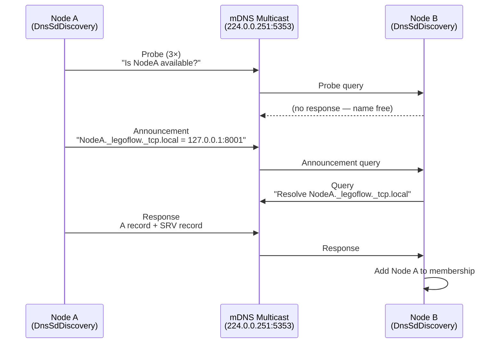

# Cluster Discovery (DNS-SD/mDNS) — Architecture

## Module Purpose

The cluster discovery module implements zero-configuration service discovery using DNS Service Discovery (DNS-SD) and Multicast DNS (mDNS). Nodes announce themselves on the local network and discover peers without any external infrastructure, enabling automatic cluster formation.

## Protocol Overview

DNS-SD (RFC 6762, RFC 8305) uses multicast DNS on link-local address `224.0.0.251:5353` to resolve service names to IP addresses. Each node publishes a service record containing its identity, port, and metadata. Other nodes browse for services and build a membership table from the responses.

### Discovery Flow



## Key Abstractions

### DnsSdDiscovery

The main entry point implementing `ClusterMembership`. Combines an `MdnsResponder` (for announcing) and a `DnsSdBrowser` (for discovering peers). Maps discovered `DnsSdServiceRecord` instances to `ClusterNode` objects.

### MdnsResponder

Handles mDNS announcement, probe, and goodbye messages. Implements the three-phase announcement sequence (probe → announce → periodic refresh) per RFC 6762. Uses `MdnsPacketCodec` for binary DNS packet encoding/decoding.

### MdnsQuerier / DnsSdBrowser

Sends multicast DNS queries and collects responses. The browser maintains a cache of discovered services, refreshing entries before TTL expiry and removing stale entries.

### DnsSdConfig / DnsSdServiceRecord

Configuration for service registration (type, instance name, port, TXT attributes, TTL) and the data model for discovered services.

## Package Structure

```
ssg.legoflow.network.cluster.dns/
  DnsSdConfig            — Configuration for DNS-SD registration
  DnsSdDiscovery         — ClusterMembership implementation via DNS-SD/mDNS
  DnsSdBrowser           — Multicast DNS service browser
  DnsSdServiceRecord     — Discovered service record (instance, type, port, TXT)
  DnsSdRecordBuilder     — Builds DNS records for registration
  MdnsResponder          — mDNS responder (announce, probe, goodbye)
  MdnsQuerier            — Multicast DNS querier
  MdnsPacketCodec        — Binary DNS packet encoder/decoder (RFC 1035 wire format)
  MdnsConflictResolver   — Handles name conflicts (ASCII art step-down per RFC 6762 §5)
  MdnsInterfaceManager   — Manages multicast socket binding per network interface
```

## Design Decisions

- **Per-interface binding** — `MdnsInterfaceManager` supports multiple network interfaces, enabling cross-subnet discovery.
- **Cached records** — The browser caches discovered services with TTL tracking, avoiding unnecessary network traffic.
- **Conflict resolution** — Follows RFC 6762 §5 step-down procedure for ASCII names when conflicts are detected.
- **Transport independence** — Uses raw `MulticastSocket` for mDNS, independent of the `ClusterTransport` SPI in core.
- **Event mapping** — DNS-SD events (service appeared, vanished) are mapped to `ClusterEvent` hierarchy for integration with core membership.
