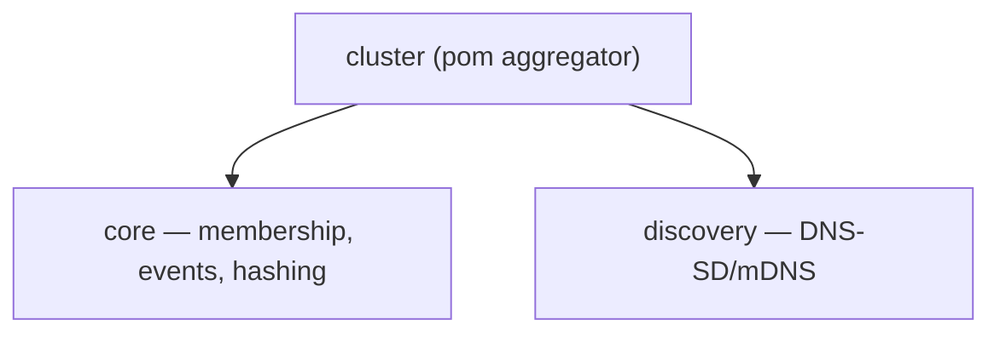

# Cluster Aggregator — Architecture

## Module Purpose

This is a Maven POM aggregator module grouping the cluster protocol sub-modules under a common parent. It has no source code or tests — all implementation is in sub-modules.

## Module Hierarchy

## Sub-modules

| Module | Artifact | Scope |
|--------|----------|-------|
| `core` | `lego-flow-cluster-core` | `ClusterNode`, `ClusterEvent`, `ClusterMembership`, `ClusterManager`, `ConsistentHashRing` |
| `discovery` | `lego-flow-cluster-discovery` | DNS-SD/mDNS (RFC 6762/8305) |

## See Also

- [core/doc/ARCHITECTURE.md](core/doc/ARCHITECTURE.md)
- [discovery/doc/ARCHITECTURE.md](discovery/doc/ARCHITECTURE.md)
- [service/cluster-coordination/doc/ARCHITECTURE.md](../../service/cluster-coordination/doc/ARCHITECTURE.md) — etcd/Raft coordination (separate module)
