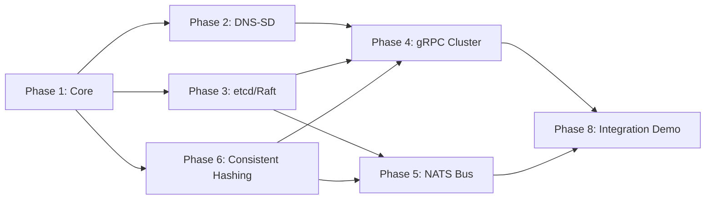

# Cluster Protocols — Master Plan

## Overview

This plan covers implementation of 6 cluster protocols that enable multi-node deployment of Lego Flow services. Each phase delivers a self-contained capability with tests, documentation, and demos.

### Protocols

| # | Protocol | Category | Module |
|---|----------|----------|--------|
| 1 | Cluster Core Abstractions | Foundation | `network/cluster/core` |
| 2 | DNS-SD / mDNS (RFC 6762/8305) | Node Discovery | `network/cluster/discovery` |
| 3 | etcd / Raft Consensus | Shared State + Discovery | `service/cluster-coordination` |
| 4 | gRPC Cluster Resolver + Load Balancer | Inter-Node RPC | `rpc/grpc` (extension) |
| 5 | NATS Cluster Bus | Cluster Messaging | `messaging/nats` (extension) |
| 6 | Consistent Hashing + HTTP Sticky Sessions | Workload Balancing | `network/cluster/core` + `web/http` |

### Phase Dependencies



---

## Phase 1 — Cluster Core Abstractions

**Module:** `network/cluster/core`  
**Duration target:** 1 sprint

### Scope
Define the fundamental SPIs that all cluster protocols implement: node identity, membership events, cluster configuration, and cluster lifecycle.

### Deliverables
- `ClusterNode` — immutable node descriptor (id, host, port, metadata, status)
- `ClusterMembership` — SPI for membership changes (join, leave, fail, recover)
- `ClusterEvent` — sealed interface: `NodeJoined`, `NodeLeft`, `NodeFailed`, `NodeRecovered`, `LeaderChanged`
- `ClusterConfig` — configuration record (name, transport, discovery, heartbeat, failure timeout)
- `ClusterLifecycle` — start/stop SPI with structured concurrency
- `ClusterStatus` — read-only view (member count, health, leader)
- `ClusterManager` — default impl coordinating discovery + state + messaging

### Testing Strategy
- Unit tests for all data types (immutability, equality, serialization)
- Contract tests verifying `ClusterMembership` SPI compliance
- Lifecycle tests verifying structured concurrency semantics
- Failure simulation tests (node crash, network partition detection)

### Demo
- Multi-node cluster simulation using in-memory transports
- Event-driven membership monitoring with log output

### Files (~20)
```
network/cluster/pom.xml (aggregator)
network/cluster/core/pom.xml
network/cluster/core/src/main/java/.../cluster/
  ClusterNode.java
  ClusterStatus.java
  ClusterConfig.java
  ClusterLifecycle.java
  ClusterMembership.java
  ClusterEvent.java (sealed)
  ClusterEventImpl/NodeJoined.java
  ClusterEventImpl/NodeLeft.java
  ClusterEventImpl/NodeFailed.java
  ClusterEventImpl/NodeRecovered.java
  ClusterEventImpl/LeaderChanged.java
  ClusterManager.java
  ClusterTransport.java
  ClusterHealthChecker.java
network/cluster/core/src/test/java/.../cluster/
  ClusterNodeTest.java
  ClusterStatusTest.java
  ClusterConfigTest.java
  ClusterMembershipContractTest.java
  ClusterLifecycleTest.java
  ClusterEventTest.java
  ClusterManagerTest.java
```

---

## Phase 2 — DNS-SD / mDNS Discovery

**Module:** `network/cluster/discovery`  
**Duration target:** 1 sprint

### Scope
Implement zero-config local network discovery per RFC 6762 (mDNS) and RFC 8305 (DNS-SD). Nodes announce services and discover peers via multicast DNS without external infrastructure.

### Deliverables
- `DnsSdDiscovery` — implements `ClusterMembership` via DNS-SD
- `MdnsResponder` — responds to multicast DNS queries (link-local 224.0.0.251:5353)
- `MdnsQuerier` — sends DNS queries, processes responses
- `DnsSdServiceRecord` — PTR, SRV, TXT record set per RFC 8305
- `DnsSdConfig` — service name, instance name, port, TXT attributes, interface binding
- DNS packet codec integration with `network/dns` module (reuse existing DNS codec)

### Testing Strategy
- RFC 6762 compliance: query-response lifecycle, probing, announcement, bye
- RFC 8305 compliance: PTR→SRV→A record resolution chain
- Multicast packet encoding/decoding against RFC 1035 wire format
- Conflict resolution: duplicate name detection (RFC 6762 §8)
- Multiple interface handling
- Race condition tests for simultaneous join/leave

### Demo
- 3-node cluster auto-discovery on localhost multicast
- Dynamic service registration/de-registration
- Service browsing with metadata display

### Files (~25)
```
network/cluster/discovery/pom.xml
network/cluster/discovery/src/main/java/.../cluster/dns/
  DnsSdDiscovery.java
  DnsSdConfig.java
  DnsSdServiceRecord.java
  DnsSdRecordBuilder.java
  MdnsResponder.java
  MdnsQuerier.java
  MdnsPacketCodec.java
  MdnsConflictResolver.java
  MdnsInterfaceManager.java
  DnsSdBrowser.java
network/cluster/discovery/src/test/java/.../cluster/dns/
  DnsSdRecordBuilderTest.java
  DnsSdServiceRecordTest.java
  MdnsPacketCodecTest.java
  MdnsResponderTest.java
  MdnsQuerierTest.java
  DnsSdDiscoveryIntegrationTest.java
  DnsSdConflictResolutionTest.java
  DnsSdMultiInterfaceTest.java
  DnsSdBrowserTest.java
```

---

## Phase 3 — etcd / Raft Shared State

**Module:** `service/cluster-coordination`  
**Duration target:** 1–2 sprints

### Scope
Implement a client for etcd's v3 API (gRPC-based) providing distributed shared state, leader election, leases, and distributed locks. Pure client-side — no embedded Raft.

### Deliverables
- `EtcdClient` — connects to etcd cluster, manages connection pool
- `EtcdKVStore` — key-value operations (put, get, delete, watch, txn)
- `EtcdLease` — TTL-based lease management
- `EtcdSession` — lease + keep-alive for distributed locks
- `EtcdLock` — distributed mutex via etcd leases
- `EtcdElection` — leader election using compare-and-swap on leased keys
- `EtcdDiscovery` — implements `ClusterMembership` via etcd registrations
- `EtcdConfig` — endpoints, auth, TLS, timeouts, retry policy

### Testing Strategy
- All etcd v3 API calls verified against protocol spec (gRPC service definitions)
- Lease expiration and keep-alive behavior
- Leader election: single-leader guarantee, re-election on leader failure
- Watch notifications: ordering, gap detection
- Transactional compare-and-swap correctness
- Connection failure recovery with retry backoff

### Demo
- Distributed leader election across 3 simulated etcd endpoints
- Leader steps down on heartbeat miss; new election occurs
- Distributed lock contention scenario with 5 nodes

### Files (~30)
```
service/cluster-coordination/pom.xml
service/cluster-coordination/src/main/java/.../cluster/coordination/
  EtcdClient.java
  EtcdConfig.java
  EtcdKVStore.java
  EtcdLease.java
  EtcdSession.java
  EtcdLock.java
  EtcdElection.java
  EtcdWatcher.java
  EtcdDiscovery.java
  EtcdTransaction.java
service/cluster-coordination/src/main/java/.../cluster/coordination/raft/
  RaftLeaderElection.java
  RaftLogEntry.java
service/cluster-coordination/src/test/java/.../cluster/coordination/
  EtcdKVStoreTest.java
  EtcdLeaseTest.java
  EtcdLockTest.java
  EtcdElectionTest.java
  EtcdWatcherTest.java
  EtcdTransactionTest.java
  EtcdDiscoveryTest.java
  EtcdClientIntegrationTest.java
  RaftLeaderElectionTest.java
```

---

## Phase 4 — gRPC Cluster Resolver + Load Balancer

**Module:** `rpc/grpc` (extension)  
**Duration target:** 1 sprint

### Scope
Extend the gRPC module with cluster-aware client-side load balancing: resolver plugins that plug into discovery backends, and pick-first/round-robin/least-request balancers.

### Deliverables
- `ClusterResolver` — resolves "cluster:///service" to backend addresses via pluggable `AddressSource`
- `AddressSource` — SPI implemented by DNS-SD, etcdDiscovery, static list
- `GrpcLoadBalancer` — sealed: `RoundRobinBalancer`, `LeastRequestBalancer`, `ConsistentHashBalancer`
- `GrpcHealthChecker` — periodic gRPC health checking on subchannels
- `GrpcClusterClient` — factory that wires resolver + balancer + health checker

### Testing Strategy
- Resolver: address change propagation (add, remove, update)
- Round-robin: even distribution across N backends
- Least-request: sends to backend with fewest in-flight requests
- Health checker: unhealthy backend exclusion and re-inclusion on recovery
- Failover: seamless failover when primary backend dies
- Mock etcd/DNS-SD backends to test full resolver→balancer→subchannel pipeline

### Demo
- 3 backend gRPC servers; client uses DNS-SD to discover
- Kill one server; requests redirect to remaining 2
- Bring server back; it rejoins the pool

### Files (~20)
```
rpc/grpc/src/main/java/.../grpc/cluster/
  ClusterResolver.java
  GrpcLoadBalancer.java (sealed)
  RoundRobinBalancer.java
  LeastRequestBalancer.java
  ConsistentHashBalancer.java
  AddressSource.java
  GrpcHealthChecker.java
  GrpcClusterClient.java
  ClusterSubchannel.java
rpc/grpc/src/test/java/.../grpc/cluster/
  ClusterResolverTest.java
  RoundRobinBalancerTest.java
  LeastRequestBalancerTest.java
  ConsistentHashBalancerTest.java
  GrpcHealthCheckerTest.java
  GrpcClusterClientFailoverTest.java
  AddressSourceIntegrationTest.java
```

---

## Phase 5 — NATS Cluster Bus

**Module:** `messaging/nats` (extension)  
**Duration target:** 1 sprint

### Scope
Extend NATS module with cluster messaging patterns: node-addressed subjects, fan-out broadcast, ordered invalidation, and membership-aware routing.

### Deliverables
- `NatsClusterBus` — publish to "cluster.<service>.<event>" subject pattern
- `ClusterSubjectRegistry` — maps event types to NATS subjects
- `NatsClusterMembership` — uses NATS `_ Presence` subjects for discovery (NATS JetStream)
- `ClusterBroadcast` — fan-out message to all nodes except sender
- `NodeTargetedMessage` — direct message to specific node ID
- `OrderedInvalidation` — ordered cache invalidation via JetStream ordering guarantee

### Testing Strategy
- Subject pattern correctness: publish to cluster.mySvc.invalidate resolves to correct subject
- Fan-out: N-1 delivery (sender excluded) verified with N mock nodes
- Node targeting: message delivered only to target node
- Ordered invalidation: delivery order preserved under concurrent publish
- JetStream persistence: messages survive broker restart
- Membership: node join/leave events broadcast correctly

### Demo
- 4-node cluster using NATS; cache invalidation broadcast
- Node failure triggers rebalance notification
- Ordered sequence of configuration updates delivered to all nodes

### Files (~15)
```
messaging/nats/src/main/java/.../nats/cluster/
  NatsClusterBus.java
  ClusterSubjectRegistry.java
  NatsClusterMembership.java
  ClusterBroadcast.java
  NodeTargetedMessage.java
  OrderedInvalidation.java
messaging/nats/src/test/java/.../nats/cluster/
  NatsClusterBusTest.java
  ClusterSubjectRegistryTest.java
  NatsClusterMembershipTest.java
  ClusterBroadcastTest.java
  OrderedInvalidationTest.java
  NatsClusterIntegrationTest.java
```

---

## Phase 6 — Consistent Hashing + HTTP Sticky Sessions

**Module:** `network/cluster/core` + `web/http` (extension)  
**Duration target:** 1 sprint

### Scope
Two complementary workload balancing mechanisms: consistent hashing for data partitioning across nodes, and HTTP sticky sessions for stateful web clusters.

### Deliverables (Consistent Hashing)
- `ConsistentHashRing` — virtual-node ring with configurable replicas (Ketama algorithm)
- `HashFunction` — SPI (default: MurmurHash3 per Ketama)
- `ConsistentHasher` — lookup node by key, rehash on membership change
- `ConsistentHashDiscovery` — implements `ClusterMembership` + provides partition-aware routing

### Deliverables (Sticky Sessions)
- `StickySessionFeature` — `HttpFeature` for server-side session affinity
- `SessionCookieBuilder` — generates session-sticky cookies with node hints
- `StickySessionRouter` — routes by session cookie to original node
- `SessionAffinityConfig` — cookie name, TTL, hashing algorithm

### Testing Strategy
- Consistent Hashing:
  - Ketama algorithm: verify against reference implementation (max ~10% redistribution on node addition)
  - Virtual node count: distribution evenness with 150 virtual replicas
  - Node removal: data reassignment correctness
  - Single node edge case: all keys map to remaining node
- Sticky Sessions:
  - Cookie generation and parsing
  - Session-to-node mapping consistency
  - TTL expiration: new cookie issued
  - Node failure: session migration (graceful vs hard failure)

### Demo
- 5-node consistent hash ring; add/remove nodes, visualize redistribution
- HTTP cluster with sticky sessions; browser re-connects to same node
- Session migration on node failure

### Files (~20)
```
network/cluster/core/src/main/java/.../cluster/hashing/
  ConsistentHashRing.java
  HashFunction.java
  MurmurHash3.java
  ConsistentHasher.java
  KetamaNodeAddress.java
web/http/src/main/java/.../http/cluster/
  StickySessionFeature.java
  SessionCookieBuilder.java
  StickySessionRouter.java
  SessionAffinityConfig.java
web/http/src/test/java/.../http/cluster/
  StickySessionFeatureTest.java
  SessionCookieBuilderTest.java
  StickySessionRouterTest.java
network/cluster/core/src/test/java/.../cluster/hashing/
  ConsistentHashRingTest.java
  MurmurHash3Test.java
  KetamaRedistributionTest.java
  ConsistentHasherTest.java
```

---

## Phase 7 — HTTP Cache Coherence

**Module:** `web/http` (extension) + `web/http-proxy` (extension)  
**Duration target:** 1 sprint

### Scope
Cross-node cache invalidation for web server clusters. When one node updates content, other nodes invalidate cached responses.

### Deliverables
- `CacheCoherenceFeature` — server-side cache coherence over NATS or gRPC bus
- `HttpCacheInvalidator` — publishes invalidation events on content change
- `ClusterHealthMonitor` — periodic health endpoint exchange between web server nodes
- `ProxyClusterConfig` — http-proxy extension: cluster backend group with health checks

### Testing Strategy
- Cache invalidation: publish event → N-1 nodes invalidate matching cache entries
- Timing: invalidation propagated within configurable latency
- Content update → cache miss → fresh fetch on other nodes
- Health monitor: node removal from proxy pool on health check failure

### Demo
- 3-node web cluster serving static content; update on node A invalidates cache on B and C
- Proxy with health checks redirects traffic on node failure

### Files (~15)
```
web/http/src/main/java/.../http/cluster/
  CacheCoherenceFeature.java
  HttpCacheInvalidator.java
  CacheCoherenceConfig.java
web/http-proxy/src/main/java/.../http/proxy/cluster/
  ClusterHealthMonitor.java
  ProxyClusterConfig.java
web/http/src/test/java/.../http/cluster/
  CacheCoherenceFeatureTest.java
  HttpCacheInvalidatorTest.java
web/http-proxy/src/test/java/.../http/proxy/cluster/
  ClusterHealthMonitorTest.java
```

---

## Phase 8 — Integration Demos

**Module:** `demos`  
**Duration target:** 1 sprint

### Scope
End-to-end demos combining all cluster protocols into realistic scenarios.

### Scenarios
1. **Auto-Discovering Web Cluster** — 3 HTTP servers discover via DNS-MDNS, sticky sessions, consistent hashing for data partitioning, cache coherence via NATS
2. **gRPC Microservice Cluster** — 5 gRPC backends, DNS-SD discovery, client-side load balancing, health checks
3. **Distributed Leader Election** — 3 nodes compete for leadership via etcd; leader coordinates work distribution
4. **Partition Tolerance** — simulate network partition; verify split-brain handling and recovery

### Testing Strategy
- Each demo is an executable scenario with assertions
- Verify end-to-end data flow across cluster
- Timeout and recovery scenarios

### Demo Files (~10)
```
demos/src/main/java/.../demos/cluster/
  AutoDiscoveringWebClusterDemo.java
  GrpcMicroserviceClusterDemo.java
  DistributedLeaderElectionDemo.java
  PartitionToleranceDemo.java
  ClusterDemoRunner.java
demos/src/test/java/.../demos/cluster/
  AutoDiscoveringWebClusterDemoTest.java
  GrpcMicroserviceClusterDemoTest.java
  DistributedLeaderElectionDemoTest.java
  PartitionToleranceDemoTest.java
```

---

## Summary

| Phase | Protocol | New Module? | Est. Java Files | Est. Test Files |
|-------|----------|-------------|-----------------|-----------------|
| 1 | Core Abstractions | `network/cluster/core` | ~12 | ~7 |
| 2 | DNS-SD/mDNS | `network/cluster/discovery` | ~10 | ~9 |
| 3 | etcd/Raft | `service/cluster-coordination` | ~11 | ~9 |
| 4 | gRPC Cluster | `rpc/grpc` extension | ~9 | ~7 |
| 5 | NATS Bus | `messaging/nats` extension | ~6 | ~6 |
| 6 | Consistent Hash + Sticky | core + `web/http` | ~10 | ~7 |
| 7 | Cache Coherence | `web/http` + proxy | ~5 | ~4 |
| 8 | Integration Demos | `demos` | ~5 | ~4 |
| **Total** | | **3 new modules** | **~68** | **~53** |

### Module Dependency Additions
- `network/cluster/core` → `blocks`, `service`, `network-common`
- `network/cluster/discovery` → `core`, `dns`, `network-common`
- `service/cluster-coordination` → `blocks`, `service`, `grpc`, `network/cluster/core`
- `rpc/grpc` cluster pkg → `network/cluster/core`
- `messaging/nats` cluster pkg → `network/cluster/core`
- `web/http` cluster pkg → `network/cluster/core`, `nats`
