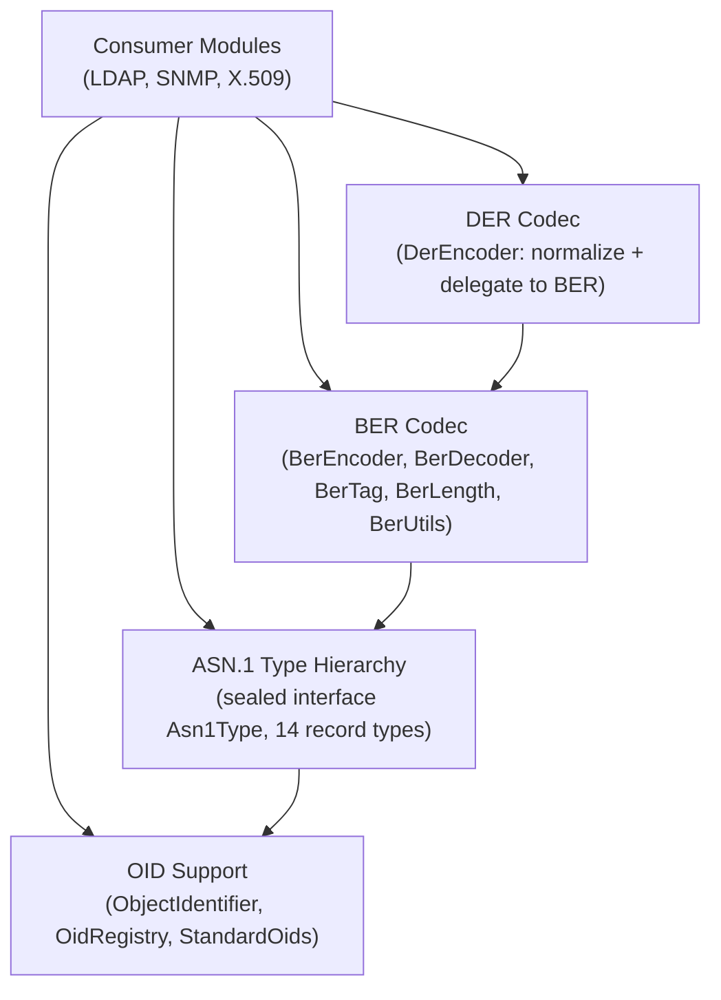
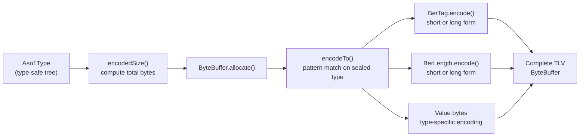
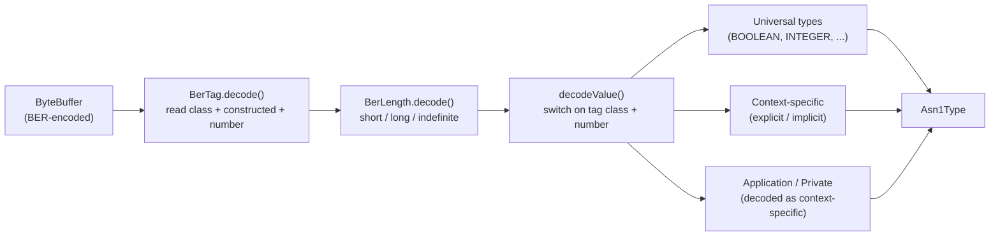
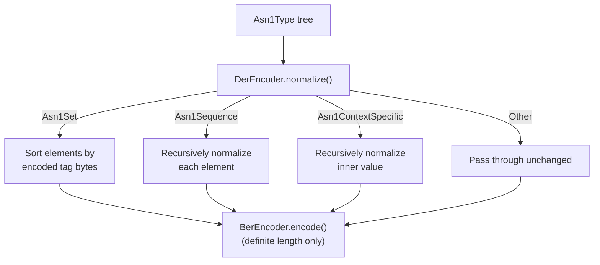
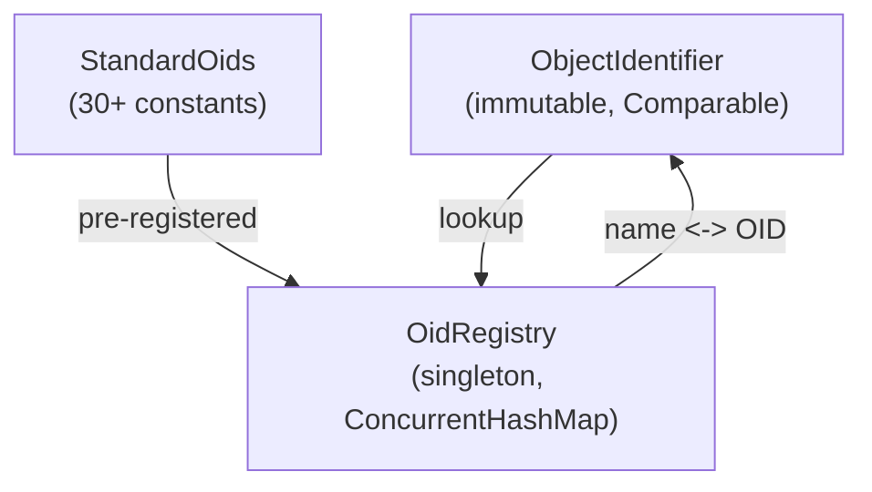

# Network Common Module -- Architecture

This document describes the architectural decisions for the network/common module.

---

## Module Overview

The network/common module provides a shared BER/DER codec for ASN.1 types. It is a pure codec library with no I/O, no protocol logic, and no external dependencies beyond SLF4J. It serves as the binary encoding foundation for LDAP (RFC 4511), SNMP (RFC 3411-3418), and X.509 certificate processing.

## Layered Architecture

## TLV Encoding Pipeline

## Decoding Pipeline

## Sealed Type Hierarchy

```mermaid
graph TD
    Asn1Type["<<sealed>><br/>Asn1Type"]
    Asn1Type --> Asn1Boolean["Asn1Boolean<br/>(0x01)"]
    Asn1Type --> Asn1Integer["Asn1Integer<br/>(0x02, BigInteger)"]
    Asn1Type --> Asn1BitString["Asn1BitString<br/>(0x03)"]
    Asn1Type --> Asn1OctetString["Asn1OctetString<br/>(0x04)"]
    Asn1Type --> Asn1Null["Asn1Null<br/>(0x05, singleton)"]
    Asn1Type --> Asn1ObjectIdentifier["Asn1ObjectIdentifier<br/>(0x06)"]
    Asn1Type --> Asn1Enumerated["Asn1Enumerated<br/>(0x0A)"]
    Asn1Type --> Asn1Utf8String["Asn1Utf8String<br/>(0x0C)"]
    Asn1Type --> Asn1PrintableString["Asn1PrintableString<br/>(0x13)"]
    Asn1Type --> Asn1IA5String["Asn1IA5String<br/>(0x16)"]
    Asn1Type --> Asn1GeneralizedTime["Asn1GeneralizedTime<br/>(0x18)"]
    Asn1Type --> Asn1Sequence["Asn1Sequence<br/>(0x30, ordered)"]
    Asn1Type --> Asn1Set["Asn1Set<br/>(0x31, unordered)"]
    Asn1Type --> Asn1ContextSpecific["Asn1ContextSpecific<br/>([N] explicit/implicit)"]
```

All implementations are Java `record` types, making them immutable, structurally equal, and suitable for exhaustive `switch` expressions.

## DER Normalization Strategy

DER is a strict subset of BER. Rather than implementing a separate encoder, `DerEncoder` normalizes the ASN.1 tree (sorting SET elements by their encoded tag bytes for canonical ordering) and then delegates to `BerEncoder`, which already produces definite-length encodings.

## OID Architecture

- `ObjectIdentifier` validates arc constraints (first arc 0/1/2, second arc < 40 for arc 0/1)
- `OidRegistry` is a thread-safe singleton pre-populated with X.500, SNMP MIB-2, LDAP, and X.509 OIDs
- Custom OIDs can be registered at runtime via `register(oid, name)`

## Key Design Decisions

1. **Sealed interface for exhaustive matching** -- `Asn1Type` is sealed with 14 permitted record types, enabling compile-time exhaustiveness checks in `switch` expressions (used in `BerEncoder.encodeTo()`, `BerEncoder.encodedSize()`, `DerEncoder.normalize()`)

2. **Stateless codecs** -- `BerEncoder`, `BerDecoder`, and `DerEncoder` are utility classes with only static methods. No instance state means they are inherently thread-safe.

3. **Two-phase encoding** -- `encodedSize()` computes the total byte count first, then `encodeTo()` writes into a pre-allocated `ByteBuffer`. This avoids dynamic buffer resizing.

4. **Indefinite length decoding** -- The decoder supports indefinite length (0x80 marker + EOC terminator) for SEQUENCE, SET, and constructed context-specific types, required for interoperability with real-world BER producers.

5. **DER as normalization + delegation** -- Instead of duplicating the entire encoder, `DerEncoder` normalizes the type tree and delegates to `BerEncoder`. This keeps the codebase DRY and ensures BER and DER share identical low-level encoding logic.

6. **Immutable value types** -- All ASN.1 types are records with defensive copying of mutable fields (`byte[]`, `List`). This ensures encoded data cannot be corrupted after construction.

## Thread Safety Model

- All codecs are stateless static utilities -- inherently thread-safe
- `ObjectIdentifier` is immutable -- safe to share across threads
- `OidRegistry` uses `ConcurrentHashMap` -- safe for concurrent reads and writes
- `Asn1Type` records are immutable -- safe to share across threads

---

## Related Documentation

- [Module README](../README.md) | [Requirements](REQUIREMENTS.md) | [Compliance](COMPLIANCE.md)
- [Root Architecture](../../../doc/ARCHITECTURE.md) | [Root README](../../../README.md)

---

**Last Updated**: 2026-07-06
