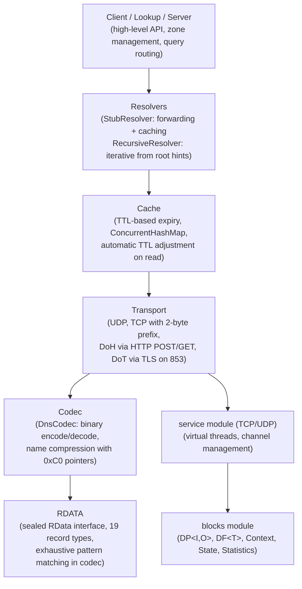
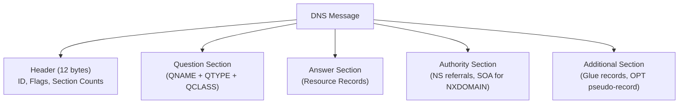
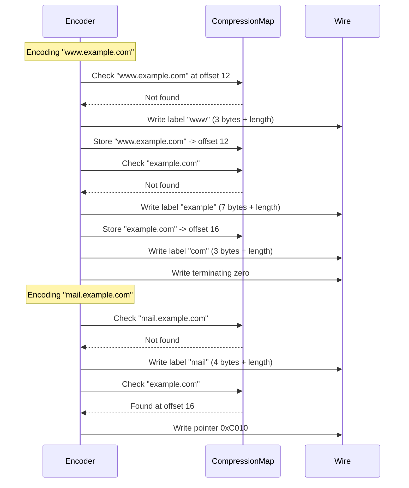
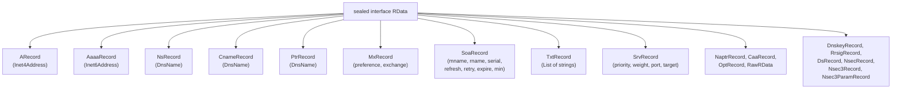
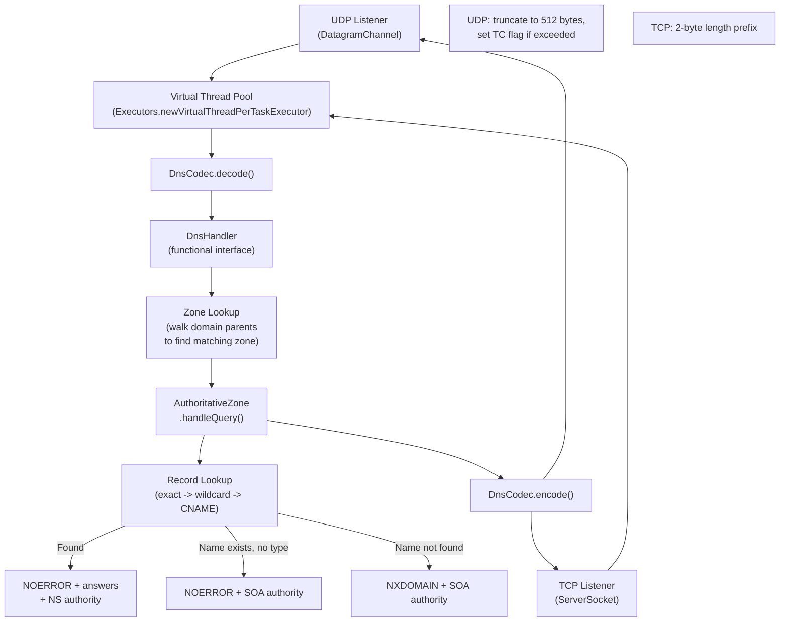
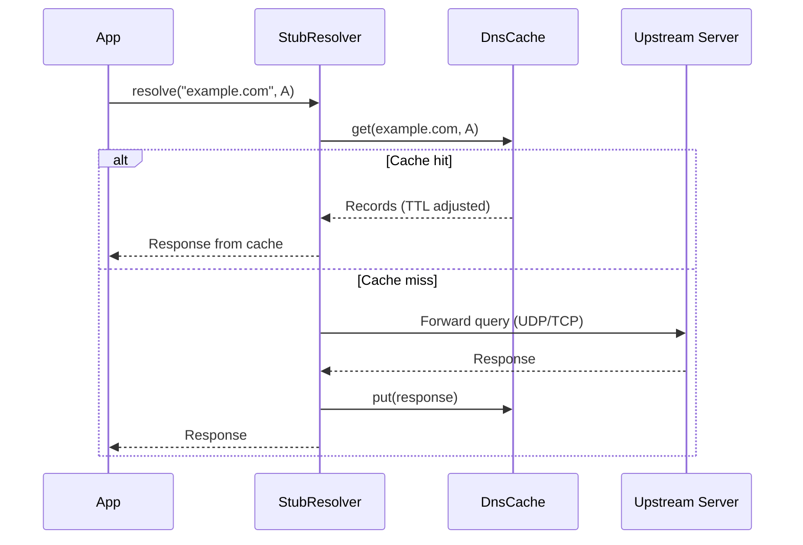
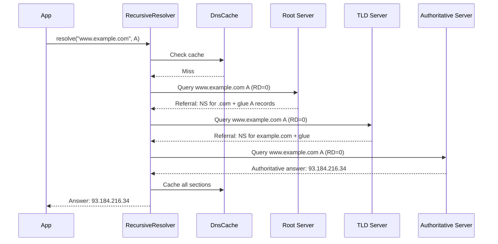
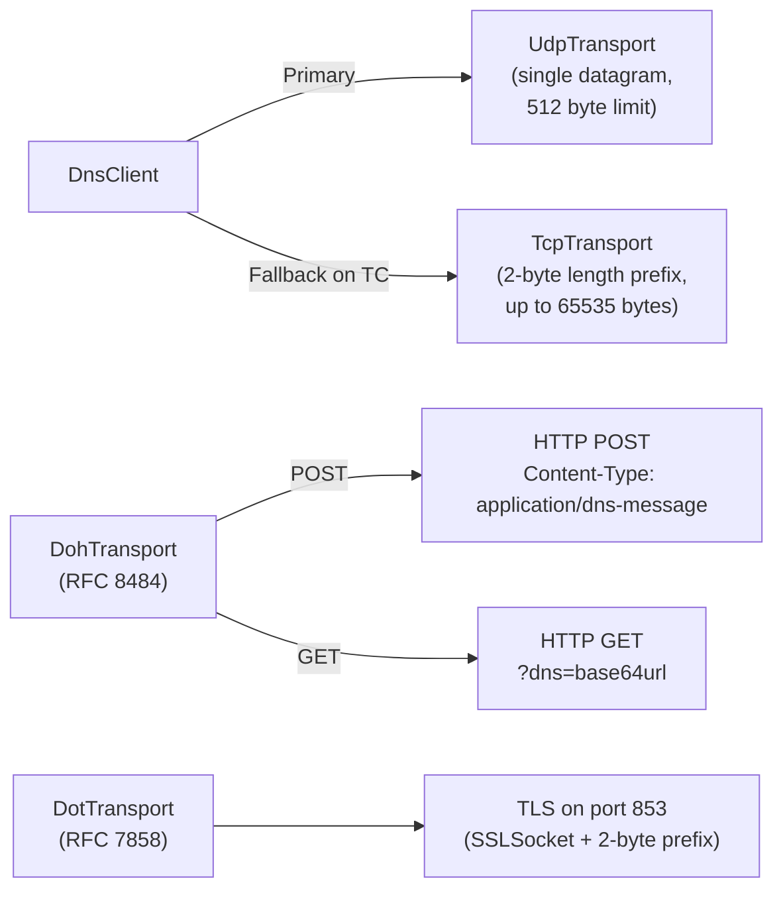
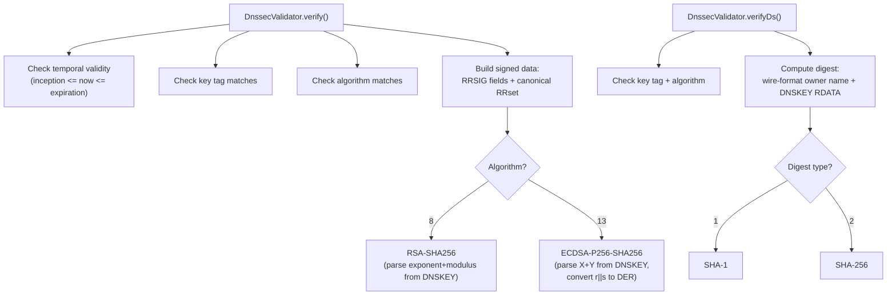

# DNS Module — Architecture

This document describes the architectural decisions for the DNS module.

---

## Protocol Overview

DNS (Domain Name System) is the hierarchical naming system that maps domain names to IP addresses and other resource records. The Lego Flow implementation covers RFC 1034/1035 (core protocol), RFC 4033-4035 (DNSSEC), RFC 8484 (DNS-over-HTTPS), and RFC 7858 (DNS-over-TLS).

## Layered Architecture

## DNS Message Structure

Every DNS message follows the same binary format (RFC 1035, Section 4):

### Header Flags Layout

The `DnsHeader` record models the 12-byte header with individual flag fields:

| Bit(s) | Field | Description |
|--------|-------|-------------|
| 0 | QR | Query (0) or Response (1) |
| 1-4 | OPCODE | QUERY, IQUERY, STATUS, NOTIFY, UPDATE |
| 5 | AA | Authoritative Answer |
| 6 | TC | Truncation (response exceeded 512 bytes UDP) |
| 7 | RD | Recursion Desired |
| 8 | RA | Recursion Available |
| 9 | Z | Reserved |
| 10 | AD | Authenticated Data (DNSSEC) |
| 11 | CD | Checking Disabled (DNSSEC) |
| 12-15 | RCODE | NOERROR, FORMERR, SERVFAIL, NXDOMAIN, NOTIMP, REFUSED |

## Name Compression

DNS names use label-length encoding with optional compression pointers. The `DnsCodec` handles both:

Decoding handles pointer cycles with a 128-jump safety limit to prevent infinite loops.

## RDATA Sealed Hierarchy

The `RData` sealed interface enables exhaustive pattern matching in the codec:

Adding a new record type requires updating: (1) `RData` permits clause, (2) `RecordType` enum, (3) `DnsCodec` encode/decode switch expressions.

## Server Architecture

- The server binds to both UDP and TCP on the same address
- Each incoming query is dispatched to a virtual thread
- UDP responses exceeding 512 bytes are truncated with the TC flag set
- TCP uses the standard 2-byte big-endian length prefix

## Resolver Architecture

### Stub Resolver

### Recursive Resolver

- Maximum recursion depth: 20 hops (prevents infinite referral loops)
- Tries glue records in additional section first; falls back to cache for NS resolution
- Includes all 13 root server addresses (a.root-servers.net through m.root-servers.net)

## Transport Architecture

## Cache Design

- **Key**: `(DnsName, RecordType)` pair
- **Entry**: `DnsRecord` + `Instant` expiry (computed from TTL at insert time)
- **Thread safety**: `ConcurrentHashMap` for the top-level map; `synchronized` on per-key entry lists for expiry cleanup
- **TTL adjustment**: on read, remaining TTL is recalculated from expiry time
- **Eviction**: `evictExpired()` scans all entries; also lazy eviction on `get()` removes expired entries
- **Capacity**: default 10,000 entries

## DNSSEC Validation

## Integration with Lego Flow

| Lego Flow Module | Usage in DNS |
|------------------|-------------|
| `blocks` | DP<I,O> for packet processing pipeline, Statistics for metrics |
| `service` | Virtual thread pools for concurrent query handling, channel management |
| `http` | HttpClient used by DoH transport for HTTPS requests |

---

## Related Documentation

- [Module README](../README.md) | [Requirements](REQUIREMENTS.md) | [Compliance](COMPLIANCE.md)
- [Root Architecture](../../doc/ARCHITECTURE.md) | [Root README](../../README.md)

---

**Last Updated**: 2026-07-06
