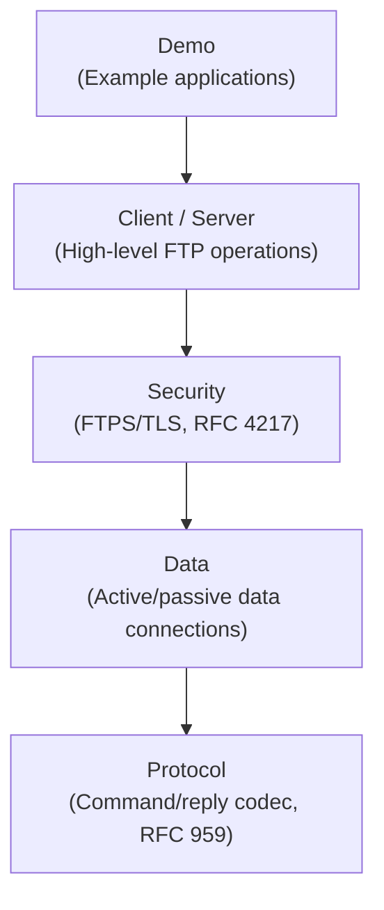

# FTP Module Architecture

## Overview

The FTP module implements a layered architecture with clean separation between protocol handling, data transport, security, and application logic.

## Layer Structure

## Key Design Decisions

### 1. Text-Based Protocol Codec
FTP control channel is text-based (unlike MQTT's binary protocol). The codec uses `BufferedReader` for reading replies (handles multi-line) and `OutputStream` for writing commands. CRLF termination is mandatory per RFC 959.

### 2. Dual Data Connection Modes
FTP uniquely uses two TCP connections (control + data). Both active (server connects to client) and passive (client connects to server) modes are supported. Passive mode is the default as it works better with firewalls/NAT.

### 3. Pluggable Filesystem
The `FtpFileSystem` interface allows different storage backends:
- `LocalFileSystem`: real filesystem with chroot enforcement (prevents path traversal)
- `InMemoryFileSystem`: ConcurrentHashMap-based, ideal for testing

### 4. Functional Authentication
`FtpAuthenticator` is a `@FunctionalInterface` allowing lambda-based auth:
- `acceptAll()` — no authentication
- `singleUser(user, pass)` — single credential pair
- `anonymous()` — anonymous FTP access

### 5. Virtual Threads for Server
Each client connection is handled on a virtual thread via `Executors.newVirtualThreadPerTaskExecutor()`, enabling efficient handling of many concurrent connections.

### 6. Session State Machine
`FtpSession` tracks per-client state: authentication state (NOT_AUTHENTICATED -> USER_PROVIDED -> AUTHENTICATED), current directory, transfer type, data mode, rename state.

### 7. Directory Listing Parsers
Three parsers handle the non-standardized LIST output:
- `FtpListParser.parseUnix()` — Unix `ls -l` format with regex
- `FtpListParser.parseWindows()` — Windows DIR format
- `MlsdParser` — RFC 3659 machine-readable format (key=value pairs)

Auto-detection tries Unix first, then Windows.

## Threading Model

- **Server**: one virtual thread per client connection
- **Client**: single-threaded (one control connection)
- **Data transfers**: blocking I/O on the data connection socket
- **Concurrency**: `ConcurrentHashMap` for session registry, `AtomicBoolean` for server state

## Security Model

- FTPS explicit mode: plain connection upgraded via AUTH TLS
- FTPS implicit mode: TLS from the start (port 990)
- PBSZ 0 (mandatory for TLS)
- PROT P (private) protects data connections
- PROT C (clear) leaves data connections unencrypted
- Trust-all mode available for testing only

## Related Documentation

- [Module README](../README.md) | [Requirements](REQUIREMENTS.md) | [Compliance](COMPLIANCE.md)
- [Root Architecture](../../doc/ARCHITECTURE.md) | [Root README](../../README.md)
