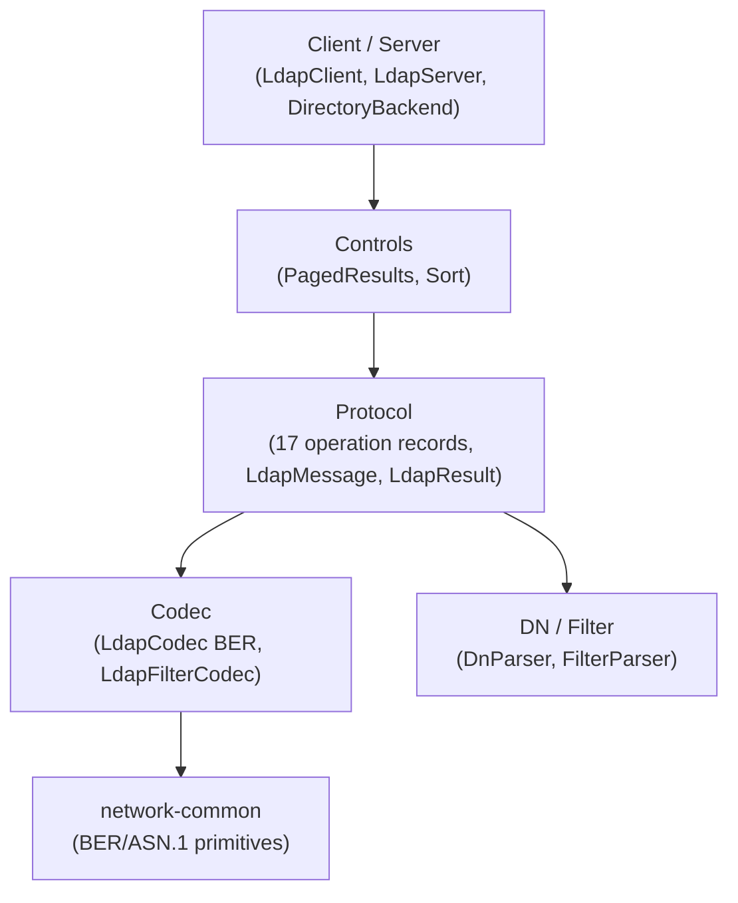
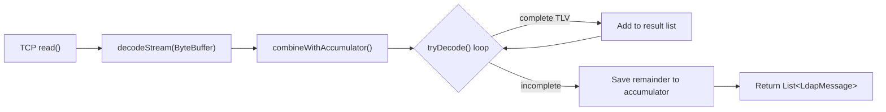

# LDAP Module — Architecture

## Module Purpose

Implements LDAP v3 (RFC 4511) from scratch, providing BER codec for all protocol operations, DN parsing, search filter parsing, client, and server with pluggable directory backend.

## Layer Structure

## Key Abstractions

### LdapCodec
Dual-mode BER encoder/decoder for LDAP v3 messages:
- **Static methods** (`encode`, `decode`, `tryDecode`, `encodeToBytes`) — stateless, one-shot encode/decode. Thread-safe.
- **Instance methods** (`decodeStream`, `hasBufferedData`) — stateful stream-oriented decoding with internal ByteBuffer accumulation. An instance is *not* thread-safe and is intended to be owned by a single pipeline/connection.

### Stream-Oriented Codec Design

The stream-oriented API addresses the mismatch between TCP byte streams and BER-encoded LDAP message boundaries. Unlike text-based protocols (RTSP, SIP) that use `\r\n\r\n` for header framing, LDAP uses BER TLV (Tag-Length-Value) encoding where the Length field determines message boundaries.

Key properties:
- **Internal accumulation**: the codec owns a `ByteBuffer accumulator` that holds partial BER data between reads
- **Batch extraction**: `decodeStream` returns a `List<LdapMessage>` because multiple complete messages may arrive in a single read
- **Reuses tryDecode**: the loop delegates to existing `tryDecode()` which checks BER tag + length before attempting full decode
- **Empty list is normal**: indicates accumulated data does not yet contain a complete TLV
- **Contract with transport**: `ProcessingThread` passes a single read's worth of data; the codec handles BER boundary detection and reassembly

### LdapProtocolOp (sealed)
Sealed interface with 17 permitted record implementations covering all LDAP operations:
- Bind (request/response), Unbind
- Search (request, result entry, result done, result reference)
- Modify, Add, Delete, ModifyDN, Compare (request/response each)
- Abandon, Extended (request/response), Intermediate response

### LdapMessage
Top-level message record: `messageId` + `protocolOp` + `controls`.

### DN Parsing
- `DistinguishedName` — ordered list of `Rdn` components
- `DnParser` — RFC 4514 string representation with proper escaping

### Search Filter Parsing
- `SearchFilter` — sealed hierarchy of filter types (and, or, not, equality, substring, comparison, present, approx, extensible)
- `FilterParser` — RFC 4515 string representation parser

### Directory Backend
- `DirectoryBackend` — interface for pluggable storage
- `InMemoryDirectoryBackend` — ConcurrentHashMap-based implementation for testing

## Package Map

| Package | Contents |
|---|---|
| `codec` | LdapCodec, LdapFilterCodec, LdapCodecException |
| `protocol` | LdapMessage, LdapProtocolOp (sealed), all 17 operation records, LdapResult, LdapResultCode, LdapAttribute, SearchScope, DerefAliases |
| `dn` | DistinguishedName, Rdn, DnParser, DnParseException |
| `filter` | SearchFilter (sealed hierarchy), FilterParser, FilterParseException |
| `control` | LdapControl, PagedResultsControl, SortControl |
| `client` | LdapClient, LdapClientException |
| `server` | LdapServer, DirectoryBackend, InMemoryDirectoryBackend |

## Thread Safety Model

- **LdapCodec static methods**: stateless, thread-safe
- **LdapCodec instance**: single-owner, not thread-safe (owned by one pipeline/connection)
- **InMemoryDirectoryBackend**: ConcurrentHashMap for thread-safe entry storage
- **LdapServer**: virtual threads for connection handling

## Dependencies

- `network-common` — shared BER/ASN.1 codec (BerEncoder, BerDecoder, BerTag, BerLength, Asn1* types)
- `slf4j-api` — logging

## Related Documentation

- [Requirements](REQUIREMENTS.md)
- [Root Architecture](../../doc/ARCHITECTURE.md) | [Root README](../../README.md)
