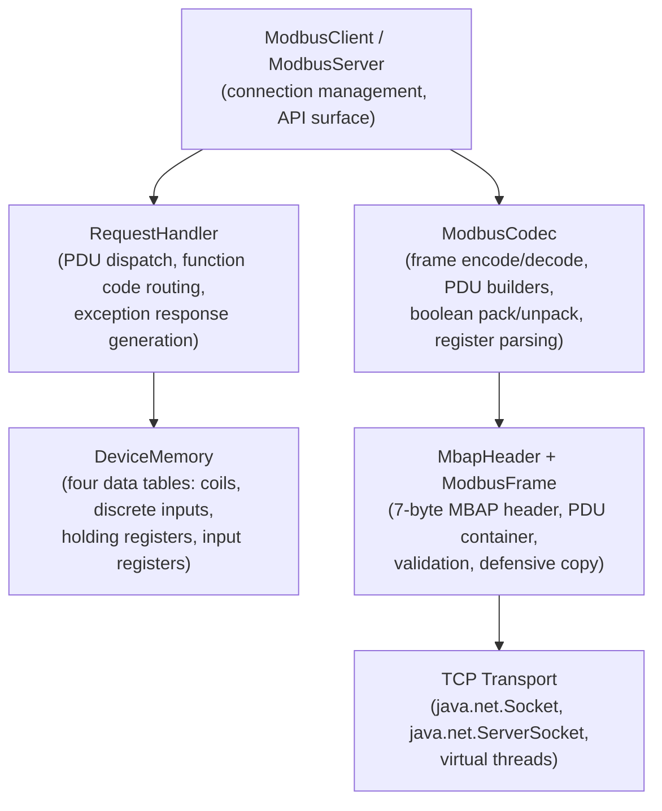
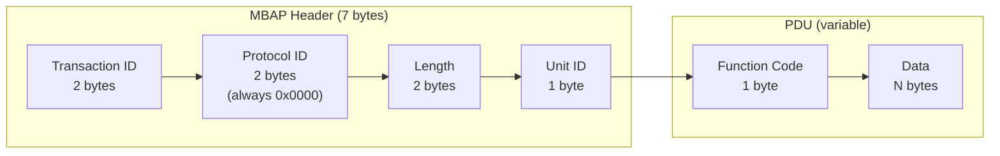
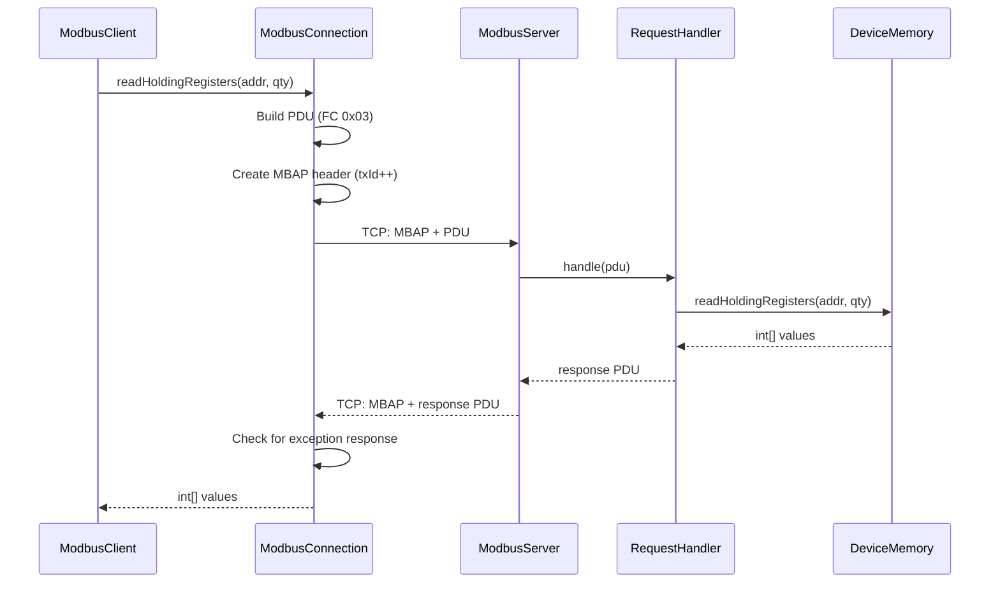
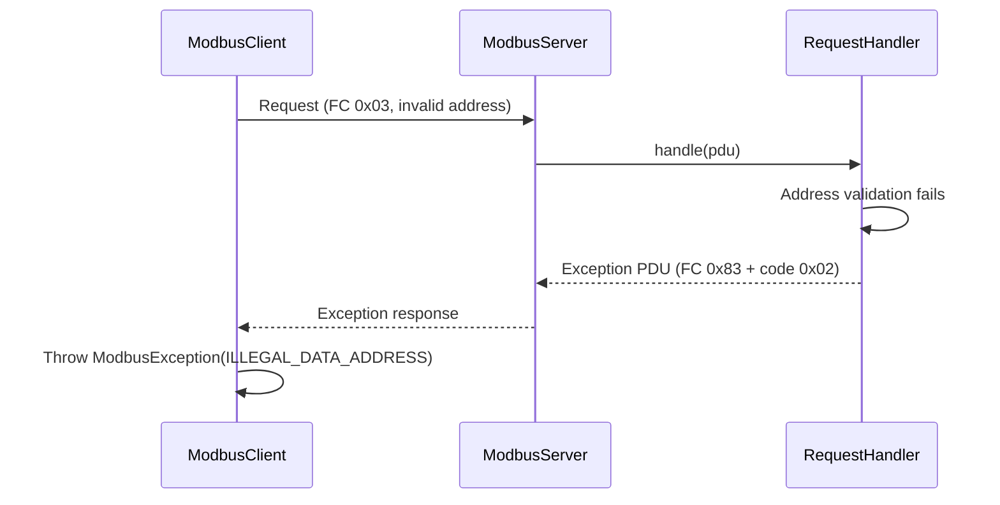
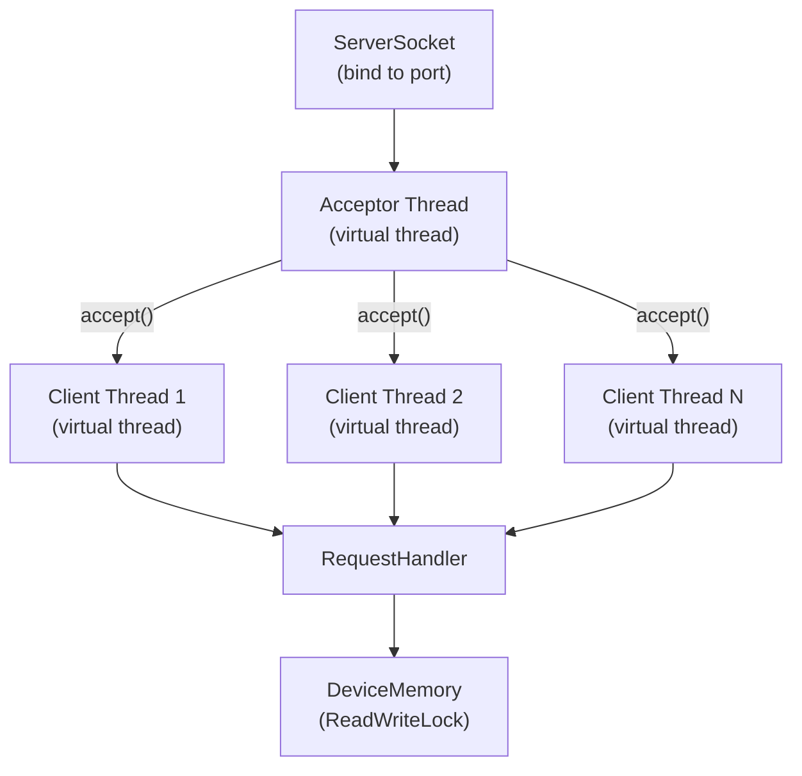
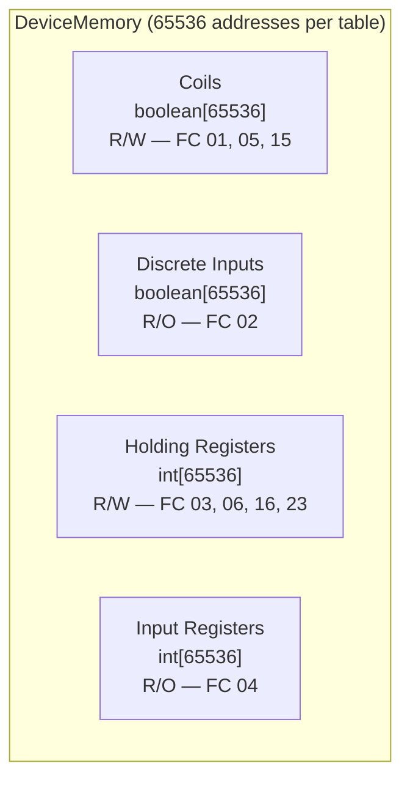

# Modbus Module — Architecture

This document describes the architectural decisions for the Modbus module.

---

## Protocol Overview

Modbus is a serial communication protocol originally designed by Modicon (now Schneider Electric) in 1979 for use with programmable logic controllers (PLCs). Modbus TCP encapsulates the Modbus application protocol inside TCP/IP, replacing the serial link layer with MBAP (Modbus Application Protocol) headers. The Lego Flow implementation provides both client and server over TCP transport.

## Layered Architecture

## MBAP Header Format

The MBAP (Modbus Application Protocol) header replaces the serial Modbus framing for TCP transport:

- **Transaction ID**: correlates request/response pairs (0-65535, auto-incremented by client)
- **Protocol ID**: always 0x0000 for Modbus TCP
- **Length**: byte count of Unit ID + PDU
- **Unit ID**: target device identifier (0-255), used for gateway routing

## Request/Response Flow

## Exception Response Flow

When the function code in the response has bit 7 set (code | 0x80), it indicates an exception. The next byte carries the exception code (1-6).

## Server Architecture

- **Virtual threads**: each client connection runs in its own virtual thread (`Thread.ofVirtual()`)
- **Acceptor loop**: dedicated virtual thread accepts incoming connections
- **Shared state**: all connections share a single `DeviceMemory` instance protected by `ReentrantReadWriteLock`
- **Connection lifecycle**: read request frame, dispatch to handler, write response frame, repeat until disconnect

## Client Architecture

- **ModbusClient**: high-level API with typed methods (`readCoils`, `writeMultipleRegisters`, etc.)
- **ModbusConnection**: low-level TCP socket management, frame serialization, transaction ID tracking
- Transaction IDs auto-increment per connection using `AtomicInteger` (wraps at 0xFFFF)
- Exception responses are detected by checking bit 7 of the function code and thrown as `ModbusException`

## Data Model

- **Coils**: single-bit outputs, read/write
- **Discrete Inputs**: single-bit inputs, read-only (writable via `setDiscreteInput` for simulation)
- **Holding Registers**: 16-bit values, read/write
- **Input Registers**: 16-bit values, read-only (writable via `setInputRegister` for simulation)

## Thread Safety Model

| Component | Mechanism | Details |
|-----------|-----------|---------|
| `DeviceMemory` | `ReentrantReadWriteLock` | Read operations acquire read lock; write operations acquire write lock. Multiple concurrent readers allowed. |
| `ModbusServer` | Virtual threads | One virtual thread per connection. Acceptor on its own virtual thread. `volatile boolean running` for shutdown. |
| `ModbusConnection` | `AtomicInteger` | Thread-safe transaction ID generation. Socket I/O is single-threaded per connection. |

## Integration with Lego Flow

| Lego Flow Module | Usage in Modbus |
|------------------|-----------------|
| `blocks` | DP/DF data processing primitives available for building pipelines around Modbus data |
| `service` | TCP transport abstractions, lifecycle management, virtual thread integration |

## Design Decisions

1. **Stream-based codec**: `ModbusCodec` reads/writes directly from `InputStream`/`OutputStream` rather than using `ByteBuffer` accumulation, since Modbus TCP has a fixed-size header (7 bytes) that declares the exact PDU length, making length-prefixed reads straightforward.

2. **Records for protocol types**: `MbapHeader`, `ModbusFrame`, `Coil`, `Register`, `DiscreteInput`, `InputRegister` are all Java records for immutability and compact representation.

3. **Defensive copy in ModbusFrame**: PDU byte arrays are cloned on construction and on access to prevent mutation of internal state.

4. **Utility-class codec**: `ModbusCodec` is a static utility class (private constructor) since it carries no state — all encode/decode operations are stateless.

5. **Virtual threads over NIO**: the server uses blocking I/O with virtual threads rather than NIO selectors, matching the Lego Flow convention for protocol servers.

---

## Related Documentation

- [Module README](../README.md) | [Requirements](REQUIREMENTS.md) | [Compliance](COMPLIANCE.md)
- [Root Architecture](../../../doc/ARCHITECTURE.md) | [Root README](../../../README.md)

---

**Last Updated**: 2026-07-06
