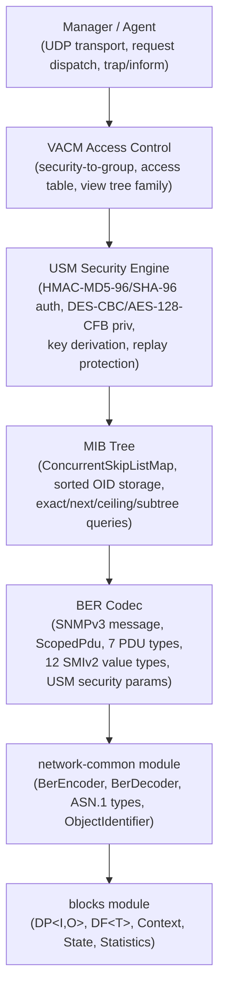
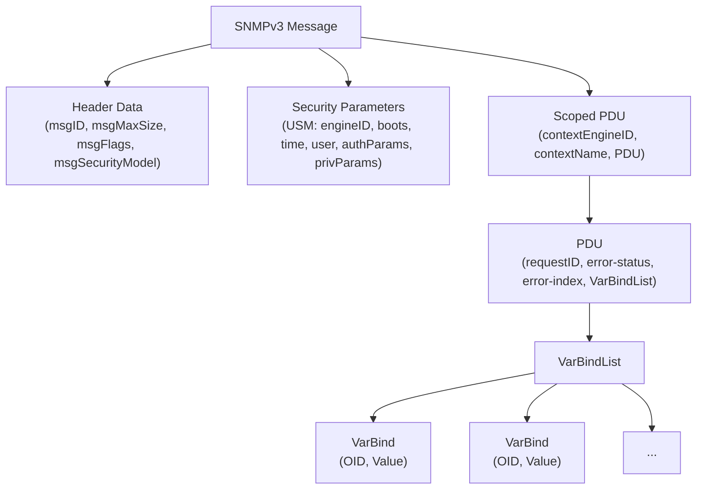
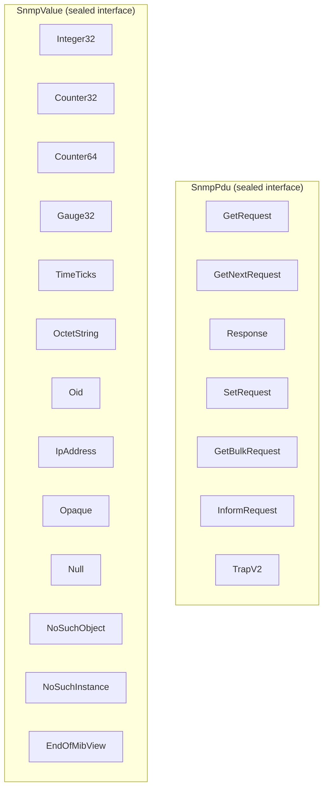
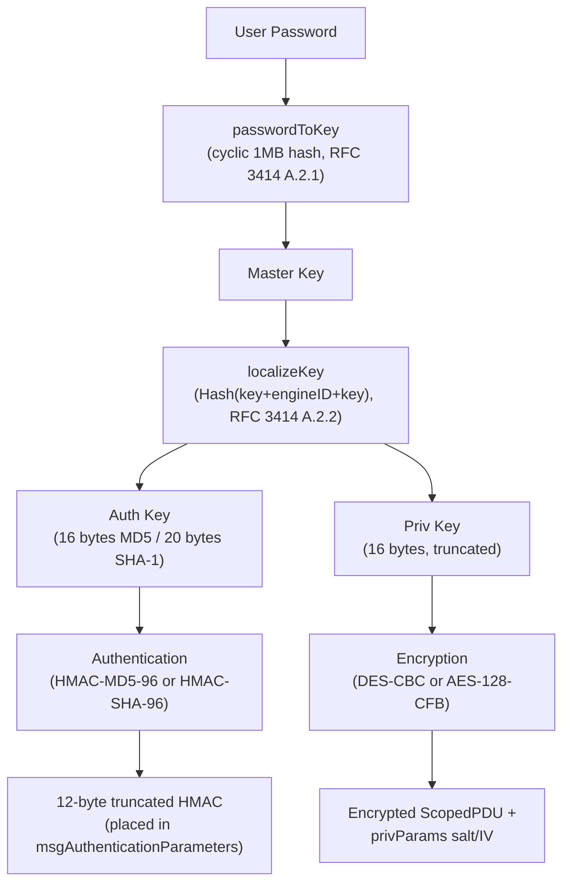
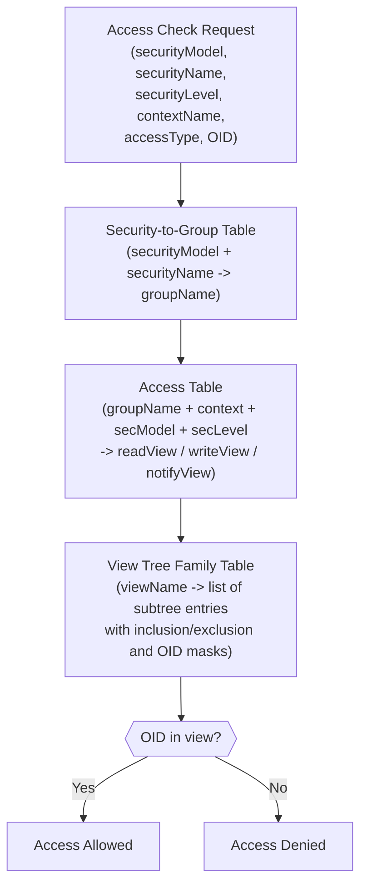
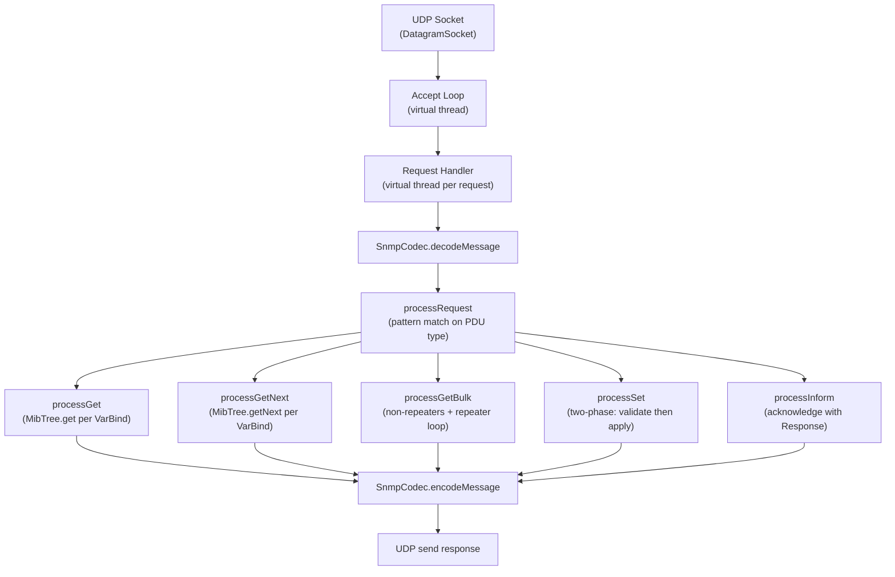
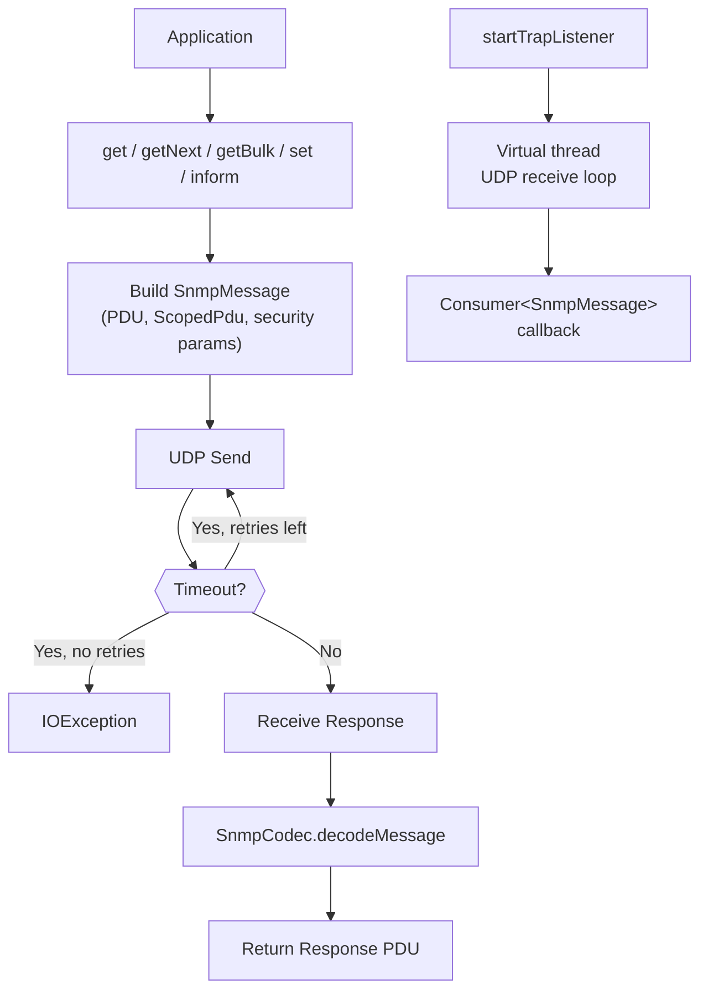

# SNMP Module -- Architecture

This document describes the architectural decisions for the SNMP module.

---

## Protocol Overview

SNMP (Simple Network Management Protocol) is a UDP-based protocol for monitoring and managing network devices. The Lego Flow implementation targets SNMPv3 (RFC 3411-3418), which adds the User-based Security Model (USM) and View-based Access Control Model (VACM) over the earlier SNMPv1/v2c protocol operations.

## Layered Architecture

## PDU Types

All 7 SNMPv3 PDU types, encoded as context-specific implicit constructed BER tags:

| PDU Type | Tag | Direction | Purpose |
|----------|-----|-----------|---------|
| GetRequest | [0] | Manager->Agent | Retrieve values for specific OIDs |
| GetNextRequest | [1] | Manager->Agent | Retrieve next OIDs in lexicographic order |
| Response | [2] | Agent->Manager | Response to any request PDU |
| SetRequest | [3] | Manager->Agent | Set values for specific OIDs |
| GetBulkRequest | [5] | Manager->Agent | Efficient bulk retrieval (non-repeaters + repetitions) |
| InformRequest | [6] | Manager->Manager | Acknowledged notification |
| TrapV2 | [7] | Agent->Manager | Unacknowledged notification |

## SNMPv3 Message Structure

## Sealed Type Hierarchies

The module uses two key sealed type hierarchies for exhaustive pattern matching:

## USM Security Architecture

### Authentication Flow

1. Sender zeroes the 12-byte authParams field in the encoded message
2. Computes HMAC over entire message using localized auth key
3. Truncates HMAC to 12 bytes and places it in authParams
4. Receiver repeats the process and compares digests

### Encryption Flow

- **DES-CBC (RFC 3414)**: DES key = first 8 bytes of privKey, pre-IV = last 8 bytes, IV = pre-IV XOR salt, data padded to 8-byte boundary
- **AES-128-CFB (RFC 3826)**: AES key = first 16 bytes of privKey, IV = boots(4) + time(4) + salt(8), no padding needed (CFB mode)

## VACM Access Control Architecture

Three tables from RFC 3415:
- **vacmSecurityToGroupTable**: maps (securityModel, securityName) to a group name
- **vacmAccessTable**: maps (groupName, contextPrefix, securityModel, securityLevel) to view names for read/write/notify
- **vacmViewTreeFamilyTable**: defines OID subtrees with inclusion/exclusion and bit masks for each view

## Agent Architecture

- Virtual threads for concurrent request handling (one per incoming datagram)
- SetRequest uses two-phase commit: validate all VarBinds, then apply
- GetBulkRequest processes non-repeaters (like GETNEXT) then repeaters in a loop up to maxRepetitions

## Manager Architecture

- Configurable timeout and retry count (default 5000 ms, 2 retries)
- Trap/inform listener runs on a separate virtual thread
- Request IDs and message IDs use atomic counters

## MIB Tree Design

The MibTree uses `ConcurrentSkipListMap<ObjectIdentifier, SnmpValue>` which provides:
- O(log n) exact lookup, insertion, removal
- O(log n) lexicographic next/ceiling via `higherEntry`/`ceilingEntry`
- Subtree queries via `tailMap` with prefix check
- Lock-free concurrent access (no explicit synchronization needed)

ObjectIdentifier implements `Comparable` using arc-by-arc comparison, so the skip list maintains natural OID ordering required by GETNEXT and GETBULK operations.

## BER Codec Design

SnmpCodec is stateless and thread-safe (all static methods). It delegates to the shared `network-common` BER library:
- Message structure: SEQUENCE(version, headerData, securityParams, scopedPdu)
- PDU types: context-specific implicit constructed tags [0]-[7]
- Application-tagged values (Counter32, Gauge32, etc.) are encoded as context-specific primitive tags since the shared library does not have an APPLICATION-class variant
- Exception values (NoSuchObject, NoSuchInstance, EndOfMibView) are distinguished from application values by empty payload

## Integration with Lego Flow

| Lego Flow Module | Usage in SNMP |
|------------------|---------------|
| `blocks` | DP<I,O> for data processing primitives, Statistics for metrics |
| `service` | Lifecycle management, virtual thread pools |
| `network-common` | BER encoder/decoder, ASN.1 types (Asn1Sequence, Asn1Integer, etc.), ObjectIdentifier with Comparable ordering |

## Thread Safety Model

- `SnmpCodec`: stateless, all static methods -- inherently thread-safe
- `UsmEngine`: ConcurrentHashMap for users, AtomicInteger for counters -- thread-safe
- `VacmAccessControl`: ConcurrentHashMap + CopyOnWriteArrayList -- thread-safe
- `MibTree`: ConcurrentSkipListMap -- lock-free concurrent access
- `SnmpAgent`: volatile running flag, virtual threads for request handling
- `SnmpManager`: volatile fields for user/security state, AtomicInteger counters

---

## Related Documentation

- [Module README](../README.md) | [Requirements](REQUIREMENTS.md) | [Compliance](COMPLIANCE.md)
- [Root Architecture](../../doc/ARCHITECTURE.md) | [Root README](../../README.md)

---

**Last Updated**: 2026-07-06
