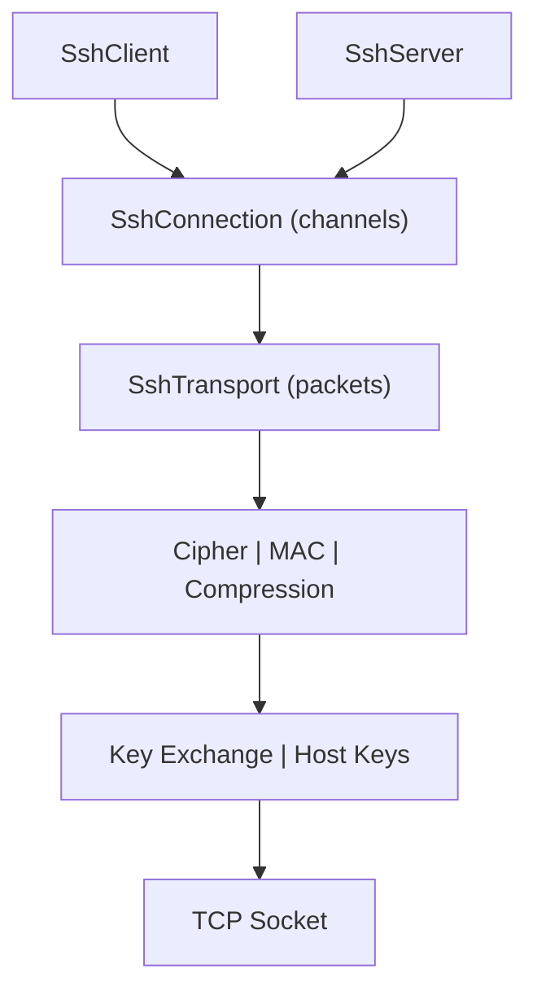

# SSH Module -- Architecture

## Module Purpose

Implements the SSH-2 protocol suite (RFC 4251-4256) providing secure remote shell access, file transfer (SFTP/SCP), and port forwarding. Built entirely on standard Java cryptography (JCA/JCE) with no third-party dependencies for crypto operations.

## Layered Architecture

### Transport Layer (`transport`)
- `SshVersion`: Version string exchange (SSH-2.0-legoflow_1.0)
- `SshMessageType`: Enum with all message type codes (1-100)
- `SshPacket`: Sealed interface with 30 inner record types for exhaustive pattern matching
- `SshTransportCodec`: Binary packet encoding/decoding with string, binary, name-list, boolean, uint32 helpers
- `SshTransport`: Full transport over Socket with cipher/MAC/compression layers, ReentrantLock thread safety

### Key Exchange (`kex`)
- `KexAlgorithm`: Interface with init(), localPublicValue(), computeSharedSecret(), computeExchangeHash()
- `KexInit`: KEXINIT message record with encode/decode and default algorithm preferences
- Implementations: DiffieHellmanGroup14 (2048-bit), DiffieHellmanGroup16 (4096-bit), EcdhSha2Nistp256/384/521, Curve25519Sha256

### Encryption (`cipher`)
- `SshCipher`: Interface with encrypt/decrypt, AEAD support (isAead(), authTagLength())
- `CipherFactory`: Registry mapping algorithm names to cipher instances
- AES-CTR uses Cipher.update() for streaming; AES-GCM uses IV increment per packet; ChaCha20-Poly1305 uses dual-key scheme

### MAC (`mac`)
- `SshMac`: Interface with constant-time verify() default method
- Encrypt-then-MAC variants compute MAC over encrypted data
- Sequence number prepended to data for MAC computation

### Host Keys (`hostkey`)
- `HostKeyAlgorithm`: Interface for sign/verify/encode
- `SshKeyPair`: Key pair holder with generate(), sign(), publicKeyBlob()
- `SshPublicKey`: Authorized keys format parsing, SHA-256 fingerprint
- `KnownHosts`: Known hosts file with verify (OK/NOT_FOUND/CHANGED)

### Authentication (`auth`)
- `AuthMethod`: Interface with encodeRequest() for client-side auth
- `AuthResult`: Sealed interface (Success | Failure | Continuation)
- `AuthContext`: Server-side with PasswordValidator/PublicKeyValidator functional interfaces

### Connection Layer (`connection`)
- `SshChannel`: Abstract base with data queues, EOF/close, flow control
- `WindowManager`: Thread-safe window tracking with AtomicLong
- `SessionChannel`: PTY, shell, exec, subsystem requests
- `DirectTcpIpChannel` / `ForwardedTcpIpChannel`: Port forwarding

### SFTP (`sftp`)
- `SftpPacket`: Sealed interface with 25 record types
- `SftpCodec`: Full encode/decode with switch expression pattern matching
- `SftpClient`: High-level operations (open, read, write, stat, mkdir, etc.)
- `SftpServer`: Filesystem-backed handler using RandomAccessFile and NIO

### SCP (`scp`)
- `ScpClient`: Upload/download files and directories via session channels
- `ScpServer`: Sink (receive) and source (send) handlers

## Design Patterns

- **Sealed interfaces**: SshPacket (30 permits), SftpPacket (25 permits), AuthResult (3 permits)
- **Records**: All packet types, KexInit, KexResult, AuthBanner, ChannelRequest, NameEntry
- **Factory pattern**: CipherFactory, MacFactory, HostKeyFactory
- **Builder pattern**: SshClientConfig.Builder, SshServerConfig.Builder
- **Functional interfaces**: ShellFactory, CommandFactory, ForwardingFilter, PasswordValidator, PublicKeyValidator

## Thread Safety Model

- `SshTransport`: ReentrantLock for send/receive synchronization
- `WindowManager`: AtomicLong for lock-free window tracking
- `SshConnection`: ConcurrentHashMap for channel registry
- `SshServer`: AtomicBoolean for running state, AtomicInteger for connection count, virtual thread per connection
- `AuthContext`: ReentrantLock for failure counting

## Extension Points

- Custom `HostKeyAlgorithm` implementations for additional key types
- Custom `AuthMethod` implementations for additional auth mechanisms
- `ShellFactory` / `CommandFactory` for server-side command handling
- `ForwardingFilter` for port forwarding policy
- `PasswordValidator` / `PublicKeyValidator` for server-side auth decisions

---

## Related Documentation

- [Module README](../README.md) | [Requirements](REQUIREMENTS.md) | [Compliance](COMPLIANCE.md)
- [Root Architecture](../../doc/ARCHITECTURE.md) | [Root README](../../README.md)

---

**Last Updated**: 2026-06-26
