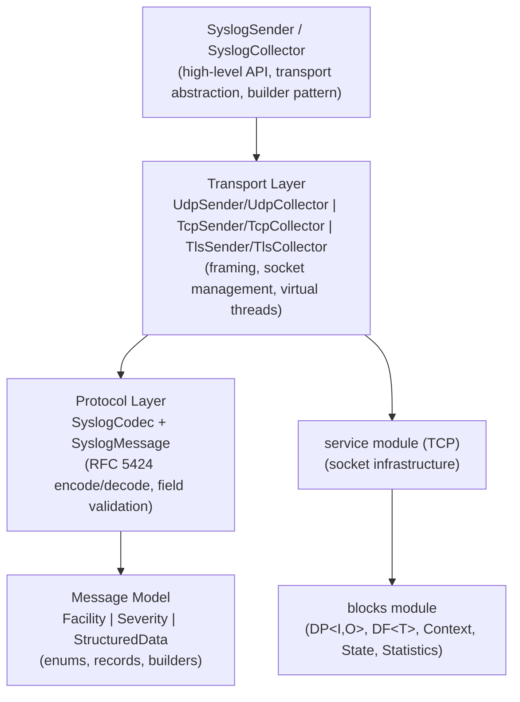
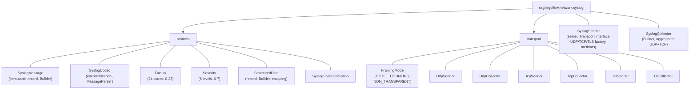
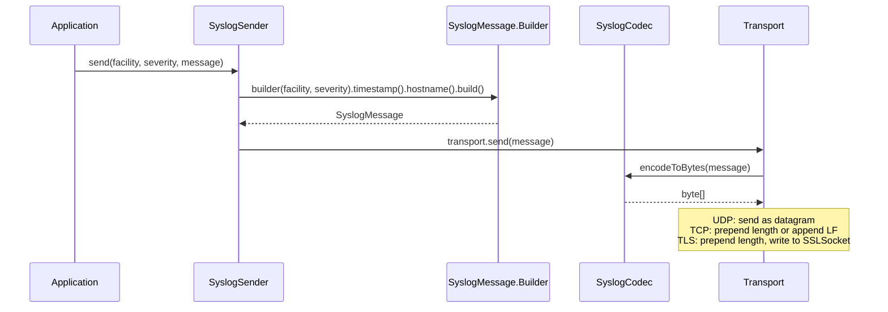
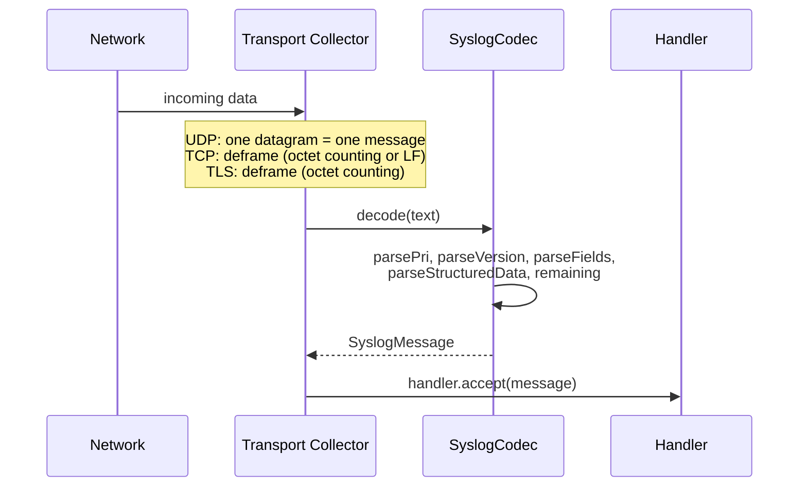
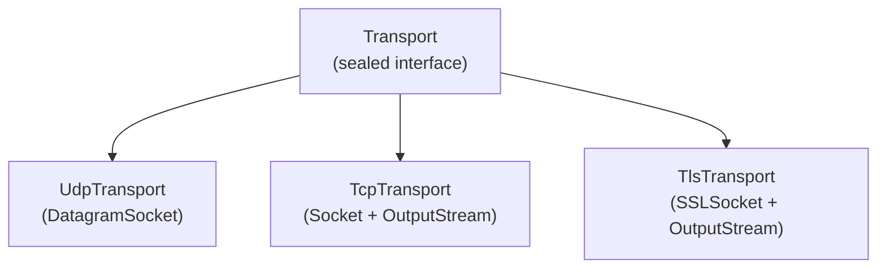
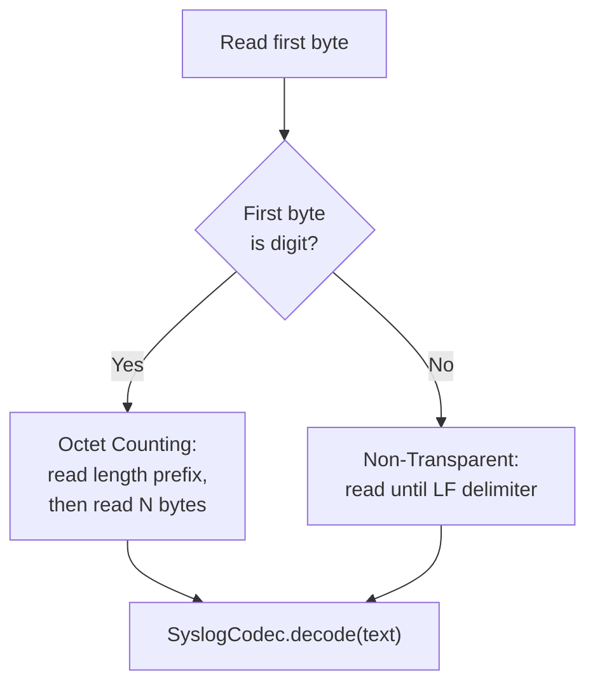
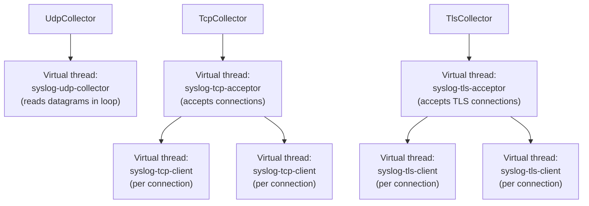
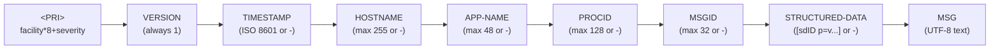

# Syslog Module — Architecture

This document describes the architectural decisions for the syslog module.

---

## Protocol Overview

Syslog (RFC 5424) is a standardized protocol for conveying event notification messages. It defines a structured message format with facility, severity, timestamp, hostname, application name, process ID, message ID, structured data, and free-form message text. The Lego Flow implementation provides full RFC 5424 message encoding/decoding plus three transport options: UDP (RFC 5426), TCP (RFC 6587), and TLS (RFC 5425).

## Layered Architecture

## Package Structure

## Message Encoding/Decoding Flow

### Encoding (Send Path)

### Decoding (Receive Path)

## Transport Architecture

### Transport Selection (Sealed Interface)

`SyslogSender` uses a sealed `Transport` interface with three permitted record implementations. This ensures exhaustive matching and type safety at compile time.

### TCP Framing Auto-Detection (Collector)

The `TcpCollector` auto-detects framing mode per message by inspecting the first byte. This allows a single collector to handle connections from senders using either framing method.

### Collector Thread Model

## RFC 5424 Message Structure

## Integration with Lego Flow

| Lego Flow Module | Usage in Syslog |
|------------------|-----------------|
| `blocks` | DP<I,O> for message processing pipelines, DF<T> for filtering, Statistics for metrics |
| `service` | TCP/UDP socket infrastructure, virtual thread pools, lifecycle management |

## Design Decisions

- **Records for immutable data**: `SyslogMessage` and `StructuredData` are Java records, providing immutability and compact constructors with validation
- **Sealed interface for transports**: compile-time exhaustive transport handling in `SyslogSender`
- **Builder pattern**: both `SyslogMessage` and `SyslogCollector` use builders for flexible construction
- **Virtual threads**: all collectors use `Thread.ofVirtual()` for lightweight concurrent connection handling
- **Auto-detection over configuration**: `TcpCollector` auto-detects framing mode rather than requiring it as a parameter
- **Consumer-based handler**: collectors deliver messages via `Consumer<SyslogMessage>` for simple integration

---

## Related Documentation

- [Module README](../README.md) | [Requirements](REQUIREMENTS.md) | [Compliance](COMPLIANCE.md)
- [Root Architecture](../../../doc/ARCHITECTURE.md) | [Root README](../../../README.md)

---

**Last Updated**: 2026-07-06
