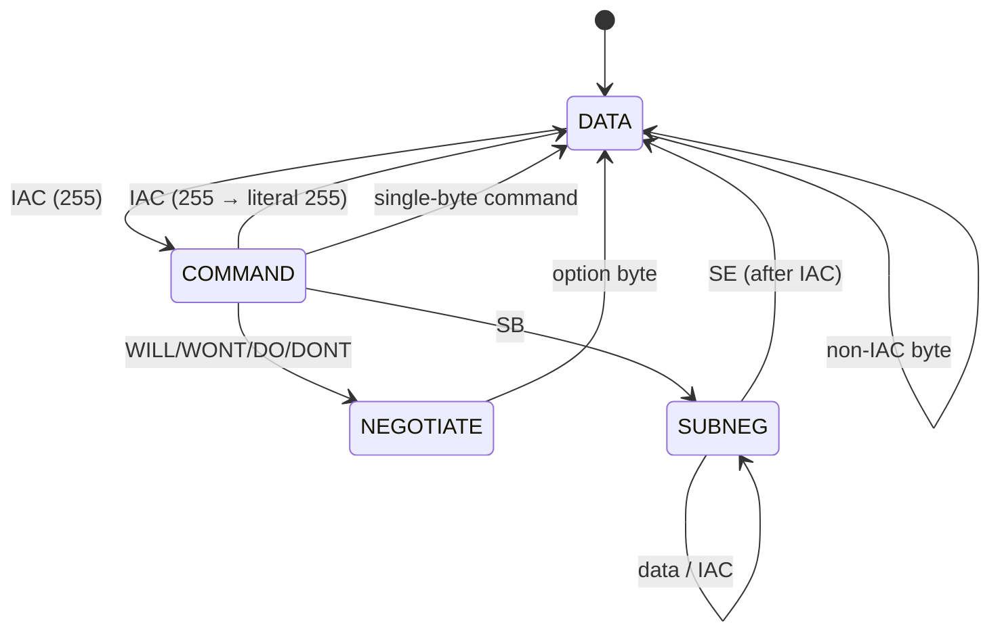
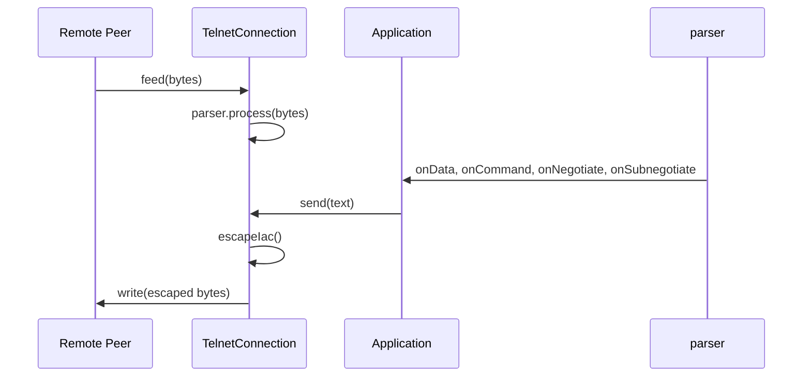

# Telnet Base — Architecture

## Overview

The telnet-base module provides a transport-agnostic Telnet protocol implementation per RFC 854. It handles the parser state machine, IAC escaping on output, and exposes a callback-based API.

## Parser State Machine

## IAC Escaping

RFC 854 Section 1 defines the escaping mechanism:
- IAC byte (255) in data stream → interpreted as command prefix
- To send literal 255 as data → transmit IAC IAC (255 255)
- Parser handles this in COMMAND state: if next byte is also IAC, emit literal 255

## Connection Model

## Design Decisions

- **Records for events** — `SubnegotiationEvent(option, data)` for type-safe callbacks
- **Builder pattern** — `TelnetConnection.builder()` for flexible configuration
- **Functional interfaces** — `Consumer<byte[]>` for simple callbacks
- **Parser is not thread-safe** — single-threaded usage assumed
- **No buffering on send** — `send()` writes immediately via the writer callback

---

**Last Updated**: 2026-08-17
