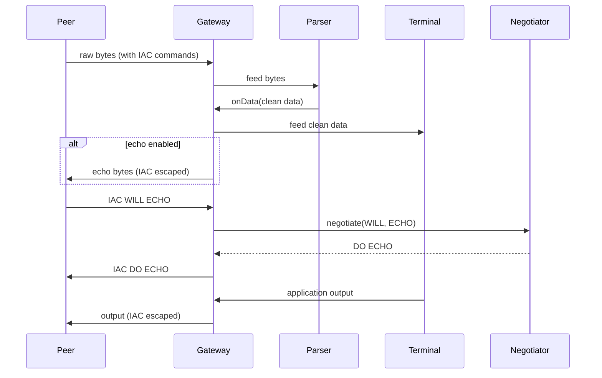
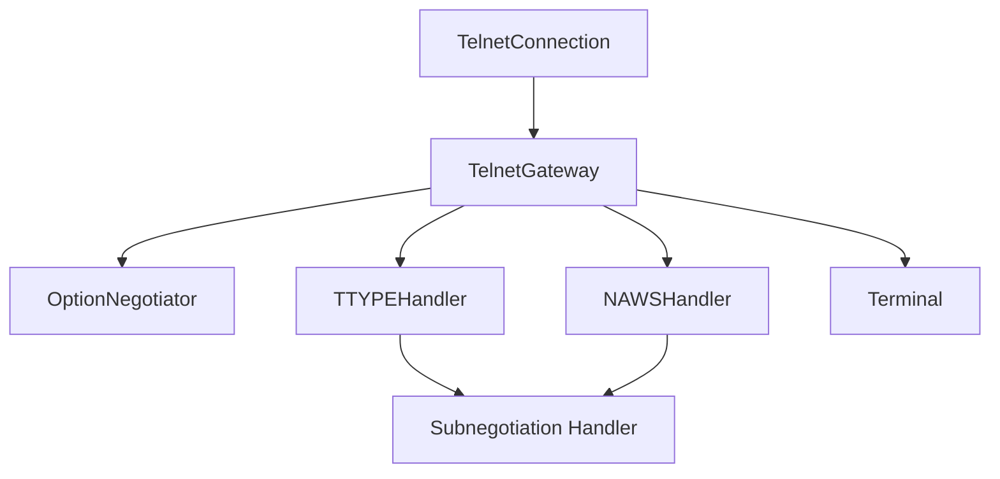

# Telnet Gateway — Architecture

## Overview

The TelnetGateway bridges the Telnet protocol parser with a terminal emulator, handling protocol-specific concerns (IAC escaping, option negotiation) transparently.

## Data Flow

## Protocol Bridge

## Design Decisions

- **Auto-negotiation** — ECHO and SUPPRESS_GO_AHEAD enabled by default
- **TTYPE auto-response** — responds with terminal type when peer requests
- **NAWS auto-resize** — updates terminal config on peer resize
- **Feed + Flush** — `gateway.feed()` calls `connection.feed()` then `connection.flush()` to ensure data delivery
- **Test dependency on VT100** — tests use VT100Terminal as a concrete Terminal implementation

---

**Last Updated**: 2026-08-17
